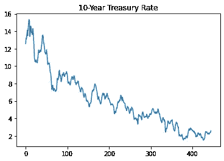
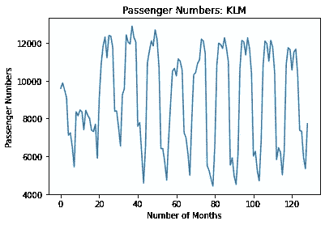
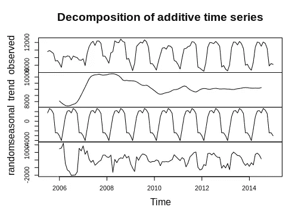
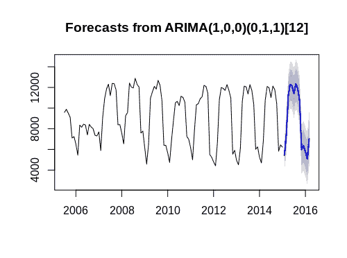
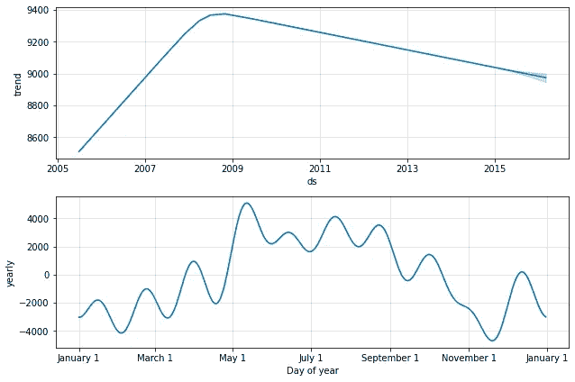
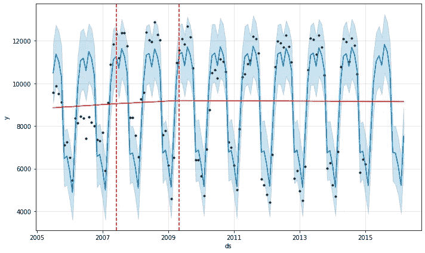
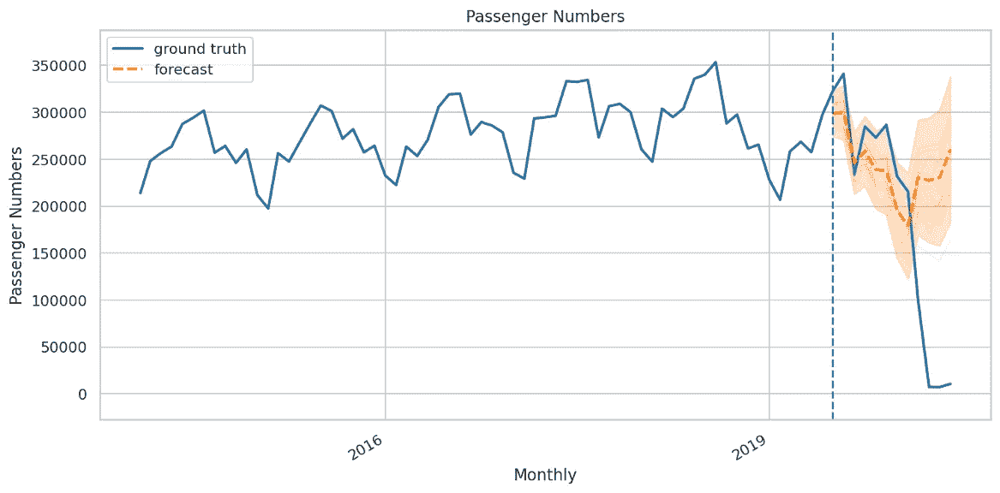
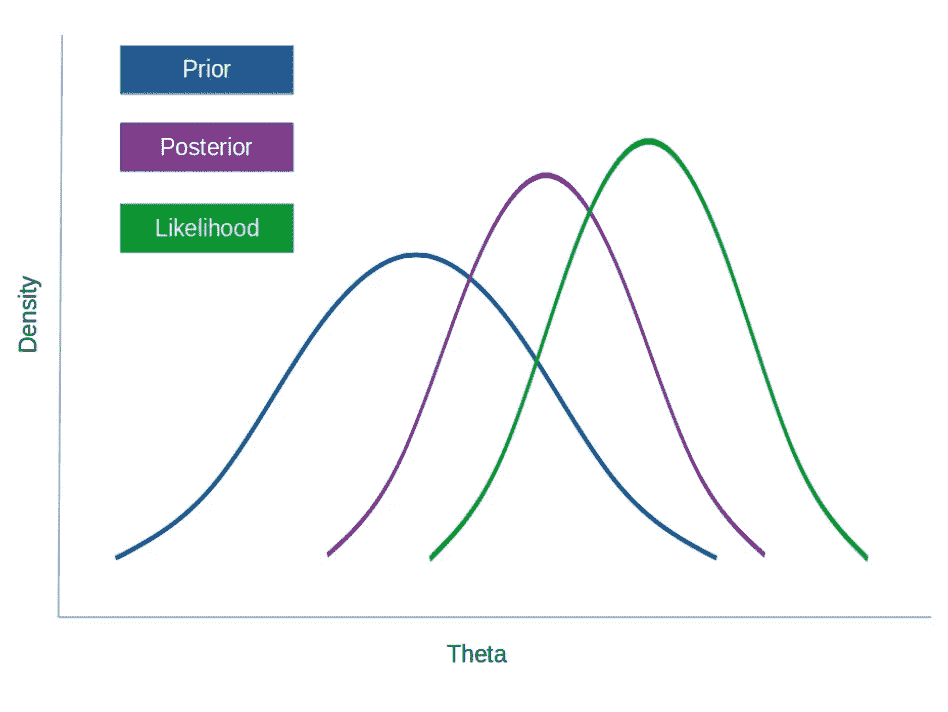

# 我的时间序列工具包

> 原文：<https://towardsdatascience.com/my-time-series-toolkit-4aa841d08325?source=collection_archive---------13----------------------->

## 我选择的时间序列分析模型

说到时间序列预测，我坚信模型越简单越好。

然而，并非所有的时间序列都是一样的。一些时间序列具有明确的趋势，例如，我们经常在经济数据中看到这种趋势:



资料来源:美联储经济数据

其他的则显示出更稳定的模式，例如每月的航空乘客人数:



资料来源:旧金山公开数据

时间序列模型的选择在很大程度上取决于所处理的时间序列的类型。以下是我遇到的一些最有用的时间序列模型。

# 1.ARIMA

以我的经验来看，ARIMA 在建模有强烈趋势的时间序列时最有用。该模型还擅长模拟季节性模式。

我们举个例子。

假设我们希望对一段时间内[每月的航空乘客数量](/arima-vs-prophet-forecasting-air-passenger-numbers-4e01b2d93608)进行建模。原始数据来源于[三藩市公开数据](https://data.sfgov.org/Transportation/Air-Traffic-Passenger-Statistics/rkru-6vcg)。

这样的时间序列将有一个季节性的组成部分(例如，假日季节往往有较高的乘客人数)以及一个趋势的证据，当序列分解如下所示。



资料来源:RStudio

使用 ARIMA 模型的目的是捕捉趋势以及说明时间序列中固有的季节性。

为此，可以使用 R 中的 **auto.arima** 函数，该函数可以为模型选择最合适的 *p，d，q* 坐标以及适当的季节分量。

对于上述示例，就最低 BIC 而言，表现最佳的模型如下:

```
Series: passengernumbers 
ARIMA(1,0,0)(0,1,1)[12]Coefficients:
         ar1     sma1
      0.7794  -0.5001
s.e.  0.0609   0.0840sigma^2 estimated as 585834:  log likelihood=-831.27
AIC=1668.54   AICc=1668.78   BIC=1676.44
```

这是预测的图像。



资料来源:RStudio

我们可以看到，ARIMA 是充分预测的季节模式系列。就模型性能而言，RMSE(均方根误差)和 MFE(平均预测误差)如下:

*   **RMSE:** 698
*   **MFE:** -115

给定验证集内每月平均 **8，799** 名乘客，记录的误差与平均值相比非常小，表明该模型在预测航空乘客数量方面表现良好。

# 2.先知

让我们再来看一下空中乘客的例子，但是这次使用的是[脸书的先知](https://facebook.github.io/prophet/)。Prophet 是一个时间序列工具，允许根据附加模型进行预测，尤其适用于具有强烈季节性趋势的数据。

航空乘客数据集似乎符合这个要求，所以让我们来看看这个模型与 ARIMA 相比表现如何。

在本例中，Prophet 可用于确定航空乘客数量的长期趋势，以及全年的季节性波动:



来源:Jupyter 笔记本输出

```
prophet_basic = Prophet()
prophet_basic.fit(train_dataset)
```

标准的 Prophet 模型可以自动选择趋势和季节成分，尽管这些也可以由用户手动配置。

Prophet 的一个特别有用的组件是包含了**变点**，或者时间序列中的重大结构突变。



来源:Jupyter 笔记本输出

通过反复试验，显示了 4 个变点来最小化 MFE 和 RMSE:

```
pro_change= Prophet(n_changepoints=4)
forecast = pro_change.fit(train_dataset).predict(future)
fig= pro_change.plot(forecast);
a = add_changepoints_to_plot(fig.gca(), pro_change, forecast)
```

RMSE 和 MAE 现在可以计算如下:

```
>>> from sklearn.metrics import mean_squared_error
>>> from math import sqrt
>>> mse = mean_squared_error(passenger_test, yhat14)
>>> rmse = sqrt(mse)
>>> print('RMSE: %f' % rmse)RMSE: 524.263928>>> forecast_error = (passenger_test-yhat14)
>>> forecast_error
>>> mean_forecast_error = np.mean(forecast_error)
>>> mean_forecast_error71.58326743881493
```

Prophet 的 RMSE 和 MFE 均低于使用 ARIMA 获得的结果，表明该模型在预测每月航空乘客人数方面表现更好。

# 3.张量流概率

在新冠肺炎事件之后，许多时间序列预测被证明是错误的，因为它们是在错误的假设下做出的。

越来越多的人开始认识到，能够产生一系列预测的时间序列模型可以得到更实际的应用，因为它们允许对未来可能发生的事情进行“情景分析”。

例如，使用上述航空乘客数据建立的 ARIMA 模型不可能预测到新冠肺炎导致的乘客数量的急剧下降。

然而，使用更多最近的航空乘客数据，让我们看看使用[张量流概率](/forecasting-air-passenger-numbers-with-tensorflow-probability-1b53e5e5fea2)建立的模型会如何表现:



来源:张量流概率

虽然该模型没有预测到最终发生的急剧下降，但我们确实看到该模型预测乘客数量将下降到低于 **150，000** 。使用这种模型可以进行更多的“假设”系列预测，例如，航空公司可以预测特定机场的每月乘客人数，并注意到乘客人数可能比平时低得多，这可以为公司管理资源(例如机队利用率)提供信息。

具体来说，张量流概率使用后验分布的假设进行预测，后验分布由先验分布(先验数据)和似然函数组成。



来源:图片由作者创建

作为参考，此处举例说明的示例使用了 TensorFlow Probability tutorial 中的[结构化时间序列建模](https://blog.tensorflow.org/2019/03/structural-time-series-modeling-in.html)的模板，其原作者(版权 2019 tensor flow 作者)已经在 Apache 2.0 许可下提供了该模板。

# 结论

时间序列分析是关于使用适合数据的模型进行可靠的预测。对于具有确定趋势和季节性成分的数据，根据我的经验，这些模型工作得相当好。

希望你发现了上面这篇有用的文章，欢迎在评论区留下任何问题或反馈。

*免责声明:本文是在“原样”的基础上编写的，没有任何担保。本文旨在提供数据科学概念的概述，不应以任何方式解释为专业建议。*