# 我设计熊猫数据框架的 4 大功能

> 原文：<https://towardsdatascience.com/my-top-4-functions-to-style-the-pandas-dataframe-932cdc79be39?source=collection_archive---------19----------------------->

## 为什么你需要设计你的熊猫数据框架，以及如何去做


paweczerwi ski 在 [Unsplash](https://unsplash.com?utm_source=medium&utm_medium=referral) 上的照片

熊猫数据框架是数据科学家分析数据时最常用的对象。虽然主要功能只是放置数据并进行分析，但我们仍然可以为多种目的设计数据框的样式；即对于**呈现数据**或**更好的美观**。

让我们以一个数据集为例。我会使用 seaborn 提供的“行星”数据进行学习。

```
#Importing the modules
import pandas as pd
import seaborn as sns#Loading the dataset
planets = sns.load_dataset('planets')#Showing 10 first row in the planets data
planets.head()
```

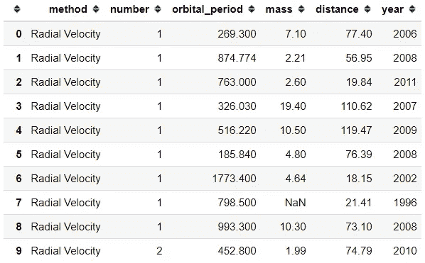

我们可以像下面这样设计我们以前的熊猫数据框。

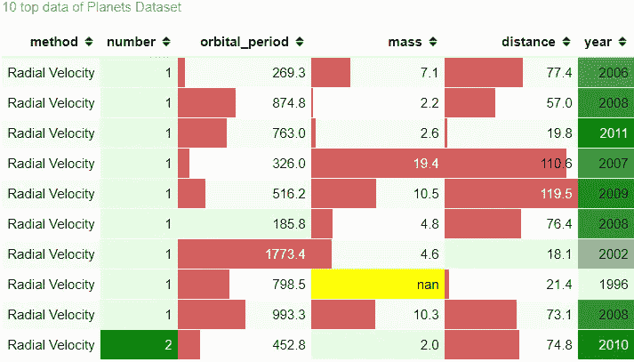

它现在看起来很丰富多彩，因为我把所有的东西都放在里面，但我会把我最喜欢的一些东西分解开来。这里有 4 个函数来设计我在日常工作中经常使用的熊猫数据框对象。

> “虽然主要功能只是放置数据并进行分析，但我们仍然可以为多种目的设计数据框的样式；即为了呈现数据或**更好的美感**

## **1。隐藏功能**

有时当你做分析并向他人展示结果时，你只想展示最重要的方面。我知道当我向非技术人员展示我的数据框时，问题通常是关于他们默认数字中的索引，例如“这是什么数字？”。出于这个原因，我们可以尝试用下面的代码隐藏索引。

```
#Using hide_index() from the style function

planets.head(10).style.hide_index()
```

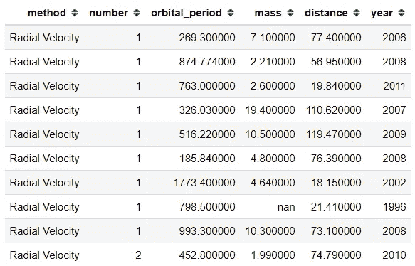

就这样，我们隐藏了我们的索引。这是一件简单的事情，但在工作环境中，我知道有时会成为一个问题。只是多了一个成为问题的栏目。

此外，我们可以尝试用链接方法**隐藏不必要的列**。假设我不想显示“方法”和“年份”列，那么我们可以用下面的代码编写它。

```
#Using hide_columns to hide the unnecesary columnsplanets.head(10).style.hide_index().hide_columns(['method','year'])
```

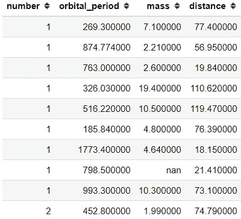

## **2。高亮功能**

有时，我们希望展示我们的数据框架，只突出显示重要的数字，例如最高数字**。在这种情况下，我们可以使用内置方法，用下面的代码突出显示它。**

```
#Highlight the maximum number for each columnplanets.head(10).style.highlight_max(color = 'yellow')
```

**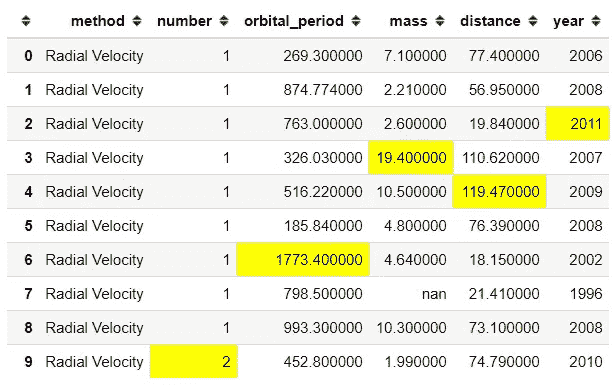**

**在上面的数据框中，我们用黄色突出显示了每列中的最大数量。如果您想突出显示最小数字**而不是**，我们可以使用下面的代码。**

```
planets.head(10).style.highlight_min(color = 'lightblue')
```

**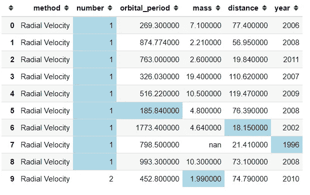**

**如果你想连锁，我们也可以这样做。**

```
#Highlight the minimum number with lightblue color and the maximum number with yellow colorplanets.head(10).style.highlight_max(color='yellow').highlight_min(color = 'lightblue')
```

**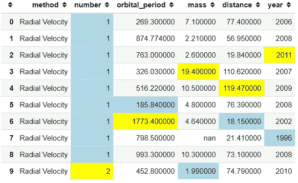**

**实际上，您可以突出显示每一行中**的最小或最大数量，而不是每一列。我在下面的代码中展示了它。****

```
#Adding Axis = 1 to change the direction from column to rowplanets.head(10).style.highlight_max(color = 'yellow', axis =1)
```

**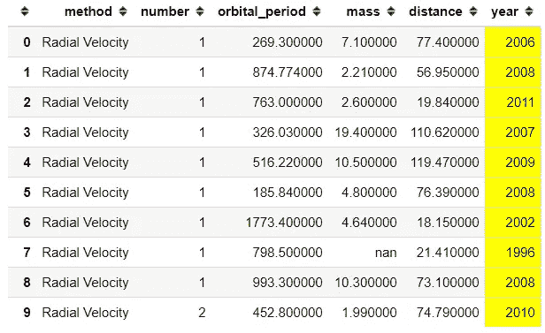**

**正如我们所看到的，现在改变轴是没有用的，因为它没有突出任何重要的信息。在每一列彼此差别不大的情况下，它会更有用。**

**另外，我们可以用下面的代码突出显示空值**。****

```
**#Higlight the null valueplanets.head(10).style.highlight_null(null_color = 'red')**
```

****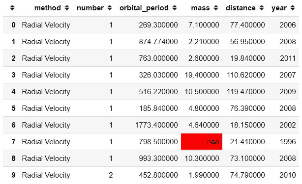****

## ******3。渐变功能******

****在展示您的数据时，我们也可以使用所有信息作为展示数据的主要方式。我经常用一种背景颜色来显示数据，以突出哪个数字在较低的区域，哪个数字在较高的区域。让我们通过下面的代码来使用这个例子。****

```
**#Gradient background color for the numerical columnsplanets.head(10).style.background_gradient(cmap = 'Blues')**
```

****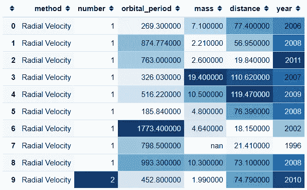****

****使用 background_gradient 函数，我们可以将数据框着色为渐变。颜色取决于 cmap 参数，该参数从 [matplotlib](https://matplotlib.org/3.1.0/tutorials/colors/colormaps.html) 库中接受颜色图。****

****我们也可以使用**条形图**作为我们的渐变背景色。让我在下面的例子中展示一下。****

```
**#Sort the values by the year column then creating a bar chart as the backgroundplanets.head(10).sort_values(by = 'year').style.bar(color= 'lightblue')**
```

****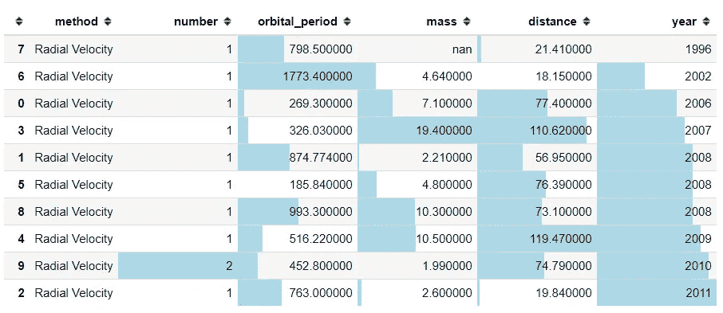****

****正如我们在上面看到的，我们现在用一种不同于 background_gradient 函数的方式从最低到最高高亮显示数字。我们还可以看到，由于排序函数的原因，索引是无序的；正如我在上面的文章中告诉你的那样，最好隐藏索引。****

## ******4。自定义功能******

****如果您希望对数据框的样式有更具体的要求，您实际上可以这样做。我们可以将样式函数传递给以下方法之一:****

*   ****`Styler.applymap`:元素方面****
*   ****`Styler.apply`:列/行/表格方式****

****这两种方法都采用一个函数(和一些其他的关键字参数),并以某种方式将我们的函数应用于数据帧。假设我有一个阈值，任何低于 20 的数字都应该被涂成红色。我们可以通过使用下面的代码来实现。****

```
**#Create the function to color the numerical value into red colordef color_below_20_red(value):
    if type(value) == type(''):
        return 'color:black'
    else:
        color = 'red' if value <= 20 else 'black'
        return 'color: {}'.format(color)#We apply the function to all the element in the data frame by using the applymap functionplanets.head(10).style.applymap(color_below_20_red)**
```

****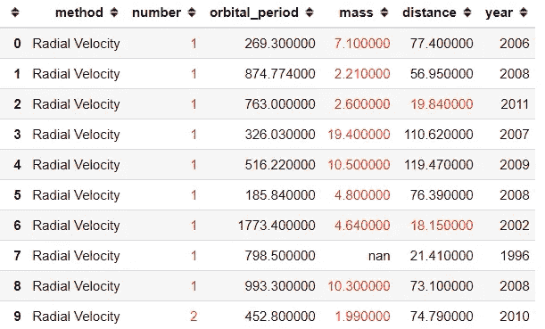****

****就像这样，每一个小于或等于 20 的数字都会被涂成红色，其余的都是黑色。****

# ******结论******

****我已经展示了在设计我们的数据框时要使用的前 4 个函数；隐藏功能。我们可以设计数据框的样式来展示我们的数据，或者只是为了更好的美观。如果您想了解更多关于我们如何设计数据框样式的信息，您可以在此处阅读。****

****访问我的[**LinkedIn**](https://www.linkedin.com/in/cornellius-yudha-wijaya/)**或 [**Twitter**](https://twitter.com/CornelliusYW) **。********

# ****如果您喜欢我的内容，并希望获得更多关于数据或数据科学家日常生活的深入知识，请考虑在此订阅我的[简讯。](https://cornellius.substack.com/welcome)****

> ****如果您没有订阅为中型会员，请考虑通过[我的介绍](https://cornelliusyudhawijaya.medium.com/membership)订阅。****