# 我的 5 大熊猫数据操作功能

> 原文：<https://towardsdatascience.com/my-top-5-pandas-data-manipulation-function-680e346809c7?source=collection_archive---------13----------------------->

## 作为数据科学家，了解您的熊猫图书馆功能库


沙哈达特·拉赫曼在 [Unsplash](https://unsplash.com?utm_source=medium&utm_medium=referral) 上拍摄的照片

作为一名使用 Python 作为主要语言的数据科学家，我们知道熊猫图书馆在我们的日常生活中是不可分割的。从你开始使用 Python 学习数据科学直到你的职业生涯，了解熊猫提供的每一件小事都不会伤害你。虽然，有一些函数我比其他的更经常使用来操作我的数据。

请注意，DataFrame 和 Series 函数甚至会在应用数据操作函数之前使用，所以我不会解释这些函数。

以下是我在日常工作中经常使用的 5 个熊猫功能。

# 熊猫功能

根据你工作的需要，有许多熊猫的功能是有用的，尽管有些可能比其他的用得更多。在这里，为了向您展示我经常使用的函数，我将使用 seaborn 模块(可视化库，但我只使用它来获取数据)中的 mpg 数据集。

```
import pandas as pd
import seaborn as snsmpg = sns.load_dataset('mpg')
```

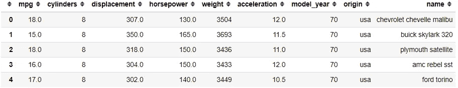

来自 seaborn 模块的 mpg 数据集

现在，让我们进入要点。

## 1.交叉表

crosstab 是一个熊猫函数，用于计算两个(或更多)因素的交叉列表。如果你不知道什么是交叉列表，让我用一个例子给你看。

```
pd.crosstab(index = mpg['origin'], columns = mpg['model_year'])
```

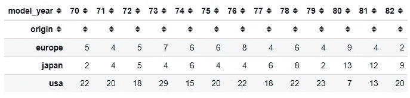

双因素交叉列表示例

以上是交叉列表的一个例子。数据本身仍然是 DataFrame 对象。我们从数据集的类别变量中指定表的索引和列；在我的例子中，我使用“origin”和“model_year”类别变量。默认情况下，crosstab 函数会计算因子的频率，并显示在交叉表中。虽然，我们可以通过引入另一个因素来改变它，这个因素通常是一个连续变量。

```
pd.crosstab(index = mpg['origin'], columns = mpg['model_year'], values = mpg['mpg'], aggfunc = 'mean')
```

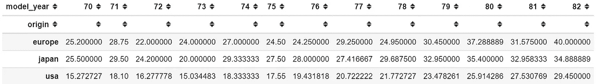

以连续变量为另一因素的交叉制表

上面，如果我们将“mpg”变量添加到值中，并将 aggfunc 参数设置为“mean ”,我们将获得交叉列表，其中“mpg”的平均值由类别分隔。它类似于我们称之为数据透视表的熊猫函数 pivot_table 可以实现类似的结果。

## 2.切口

Pandas cut 函数用于将连续值宁滨成离散区间。当我们需要对连续值进行分段和分类时，我们使用 cut。你不知道宁滨是什么；是把连续值放入某个范围区间的过程。最好用直方图来描述。

```
mpg['mpg'].hist()
```

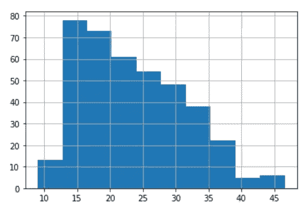

直方图示例

这里，我们将连续值输入到某个范围间隔中，并创建箱。每个条形显示落入这些区间的值，条形越高，频率越大。

范围间隔取决于箱的数量。例如，如果我们有一个最小值为 10、最大值为 45 的连续变量，并且我们想要创建 10 个区间，那么范围间隔将是**(最大-最小)/区间**。这意味着(45–10)/10 = 3.5。因此，第一个容器将由 10 到 13.5 之间的连续值填充，依此类推。

这个函数对于从连续变量到分类变量也很有用。例如，cut 函数可以将年龄转换为年龄范围组。让我们用一个数据集例子来展示这个函数。

```
pd.cut(x = mpg['mpg'], bins = 4, labels = [1,2,3,4])
```

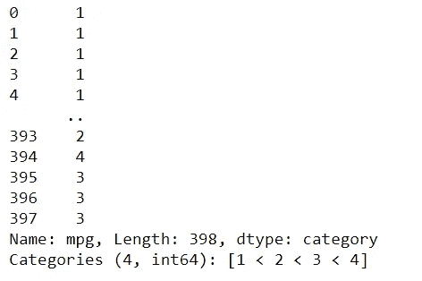

在上面的函数中，我将 bins 参数设置为 4，因为我希望获得 4 个类别，标签设置为 1、2、3 和 4。cut 函数的输出将是一个包含所有连续值的序列，这些连续值已被入库并转换为可接受的类别。这是我将它放入数据框后的样子。

```
mpg['mpg_bin'] = pd.cut(x = mpg['mpg'], bins = 4, labels = [1,2,3,4])
mpg[['mpg', 'mpg_bin']]
```

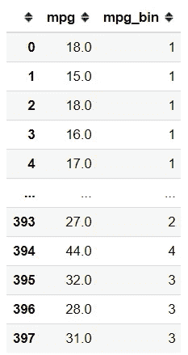

## 3.qcut

在熊猫身上，我们有 cut 功能，我们也有 qcut 功能。与 cut 函数类似，我们将宁滨作为连续变量，但在 qcut 函数中，基于等级或基于样本分位数，仓位大小将相等。分位数基本上是一种以相等方式划分连续值的除法技术。例如，如果我们将连续值分为 4 部分；它将被称为四分位数，如下所示。

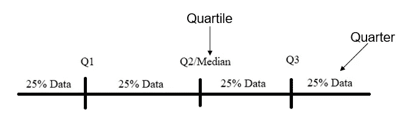

让我用一个代码示例向您展示。

```
pd.qcut(x = mpg['mpg'], q = 4, labels = [1,2,3,4])
```

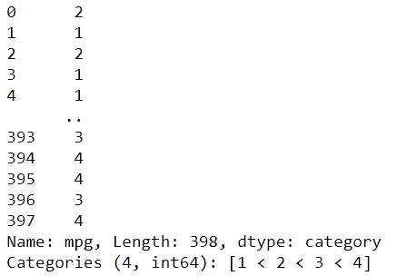

以上是 qcut 函数的输出。这里我将 q 参数输入为 4，将连续值分成四分位数，并用 1、2、3 和 4 标记它们。与 cut 函数相比，结果是不同的，因为它们的计算已经不同。让我也把它放到数据框中，这样我们就可以看到结果的不同。

```
mpg['mpg_qcut'] = pd.qcut(x = mpg['mpg'], q = 4, labels = [1,2,3,4])
mpg[['mpg', 'mpg_bin','mpg_qcut']]
```

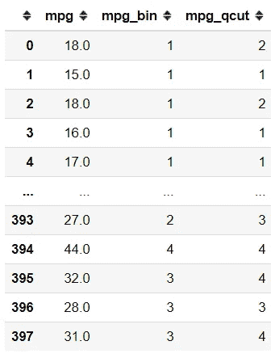

**4。get_dummies**

该函数用于通过对分类变量进行一次热编码，将分类变量转换为数字变量。对于不知道 One-Hot-Encode 是什么的人来说，这是一个从我们的分类变量创建新列的过程，其中每个类别都成为一个新列，值为 0 或 1 (0 表示不存在，1 表示存在)。

为什么我们要把分类变量转换成数值变量？这是因为许多统计技术或机器学习方程只接受数值而不是类别值。

让我用一个代码示例向您展示我所说的内容。

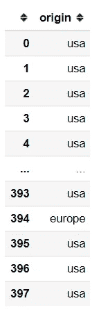

上面是 mpg 数据集中的“原点”变量。它是具有 3 个基数的分类变量(“美国”、“欧洲”和“日本”)。这里我将使用 get_dummies 函数对这个变量进行一次热编码。

```
origin_dummies = pd.get_dummies(mpg['origin'])
origin_dummies
```

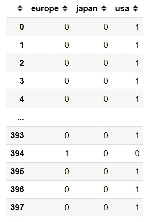

就像这样，我们已经得到了 3 个新列，每个类别成为一个新列，值为 0 或 1。

## 5.串联

我最常用的数据操作函数是 concat 函数。这个函数就像它所调用的那样；它串联起来。但是，这个函数连接了什么呢？它连接 pandas 对象(系列或数据帧)。让我给你看一个例子。比方说，我只想让“mpg”列显示我刚才创建的 origin_dummies 变量。

```
pd.concat(objs = [mpg['mpg'], origin_dummies], axis = 1)
```

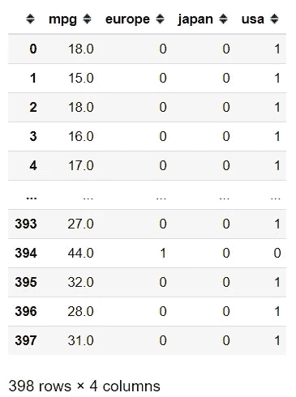

使用 concat 函数，我只是将两个 pandas 对象(系列和数据帧)组合成一个数据帧。在函数中，我将轴参数指定为 1，因为我想组合熊猫对象，使列看起来像并排粘在一起。这个轴参数只接受 2 个东西；0 或 1。根据您想要连接 pandas 对象的方式，如果您想要像堆叠对象一样连接 Pandas 对象(像添加新行一样连接对象),请将它设置为 0；如果您想要对象相对于索引并排，请将它设置为 1。

如果我们将轴设为 0，会发生以下情况。

```
pd.concat([mpg['mpg'], origin_dummies], axis = 0)
```

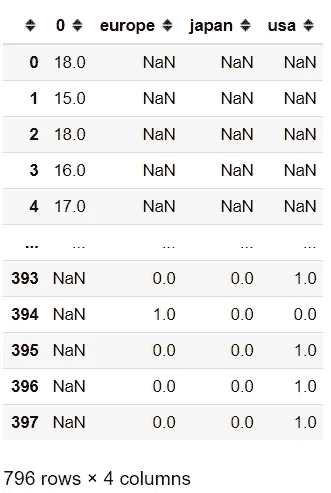

我们现在可以看到，我们的数据框中有 796 行和许多 NaN 对象。发生这种情况是因为我们连接了 Pandas 对象，但是当我们设置它时，我们堆叠了该对象，不是所有的列名都存在于任一对象中，所以它用 NaN 值填充了先前不存在的列。

# 结论

这篇文章向你展示了我经常使用的前 5 个熊猫的数据操作功能。这些功能是:

1.  交叉表
2.  切口
3.  qcut
4.  获取 _ 假人
5.  串联

希望有帮助！

# 如果您喜欢我的内容，并希望获得更多关于数据或数据科学家日常生活的深入知识，请考虑在此订阅我的[简讯。](https://cornellius.substack.com/welcome)

> 如果您没有订阅为中等会员，请考虑通过[我的介绍](https://cornelliusyudhawijaya.medium.com/membership)订阅。