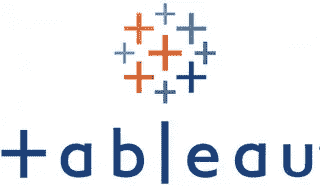
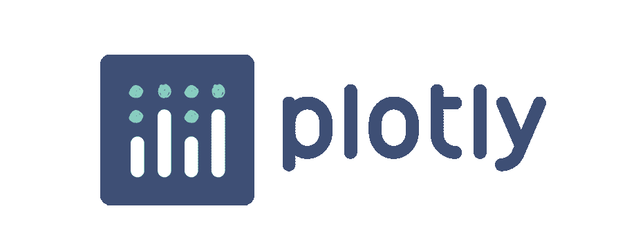

# 我的五大数据科学可视化工具

> 原文：<https://towardsdatascience.com/my-top-5-visualization-tools-for-data-science-45a4968ae695?source=collection_archive---------7----------------------->

## 以及如何为您的受众选择合适的工具

罗伯特·卡茨基在 [Unsplash](https://unsplash.com/s/photos/colors?utm_source=unsplash&utm_medium=referral&utm_content=creditCopyText) 上的照片

还记得很多年前我刚开始职业生涯的时候，团队里的标准可视化工具是 Excel 图表。我们花了很多时间进行手工处理，没有多少时间来寻找见解或提出建议。在过去的十年中，我们已经看到了无数现代工具在数据可视化方面的兴起。科技已经取得了长足的进步。

在本文中，我将首先列出我的 5 大数据科学可视化工具，然后根据您的受众解释何时使用它们。

# 1.擅长

Excel 在任何地方都被每个人使用。我从未遇到过没有使用过 Excel 的分析专家。信不信由你，即使在今天，一些数据科学家仍在日常工作中主要使用 Excel。

Excel 的好处是显而易见的:它无处不在。如果你想和某人分享一份工作，你永远不需要担心他们是否能打开文件。

此外，像在这里或那里调整数字这样的特别任务非常容易。一切都很透明。你可以清楚地看到每个细胞在做什么。

因为这两个优势，相信 Excel 在可预见的未来还是有它的一席之地的。

# 2.（舞台上由人扮的）静态画面

我大约在 7 年前开始使用 Tableau。我们必须为它建立一个商业案例，因为它不是免费的。它值这个价钱吗？肯定！

以下是我在 Tableau 中可以轻松完成但在 Excel 中无法完成的一些事情:

1.  想到一个想法，并立即在几个拖放动作和几个点击中将其可视化。
2.  将变量级别分组(例如，将年龄变量分为 0-18、19-25…组)，并将结果立即反映在**所有**图表中。如果您在 Excel 中有很多图表，您会喜欢这个特性。
3.  动画。如果使用得当，这些图表可以传递静态图表所不能传递的强有力的信息。

Tableau 还有很多其他特色。例如，您可以构建交互式仪表板，并让许多其他用户可以使用它们。这就是你如何减少 BI 团队的工作量，让人们自给自足，而不是每次有小事情需要改变时就来找你帮忙。

对我来说，主要的用例是探索性的数据分析。在我看来，在这方面没有什么比 Tableau 更好的了。

*为了了解 Tableau 能够提供什么，这里是我最近为冠状病毒爆发制作的数据可视化:*

 [## 10 张图中冠状病毒爆发的状态(和主要发现)

### 确诊病例——Mainland China 境外

medium.com](https://medium.com/@zemingyu/state-of-the-coronavirus-outbreak-in-10-charts-and-key-findings-721f62c08a9e) 

# 3.功率 BI

在很多方面，Power BI 与 Tableau 相似。我可能有偏见，但是用了一段时间后，我发现在某些领域用户体验不如 Tableau。

例如，如果你想对图表中的一个变量重新排序，你需要创建一个自定义的顺序，这将在下面的教程中通过 11 个截图来解释。在 Tableau 中，这可以通过拖放在 1 到 2 个步骤中完成，为您节省大量时间。

 [## 如何重新排列 Power BI 中的图例

### 在你开始研究 Power BI 中任何太酷的东西之前，有必要先了解一个理想的传说。当使用 Power BI 来…

www.seerinteractive.com](https://www.seerinteractive.com/blog/reorder-powerbi-legend/) 

话虽如此，我认为 Power BI 在仪表板方面做得更好，最重要的是，有一个免费的桌面版本(它不允许与您的团队协作，但对于一个用户来说往往足够好)。

如果您没有预算，但仍想提高效率，Power BI 就是答案。

# 4.Plotly

如果你懂 R 或 Python，你可以从 Plotly 提供的丰富的交互式图表中获益。你可以在 Tableau 中制作的大多数图表都可以在 Plotly 中复制。

你可能想知道:

> “如果我有 Tableau 或 Power BI，为什么我需要 Plotly”？

答案是**可扩展性**。

假设您正在按季度监控保险投资组合的业务组合。有 20 个不同的分类变量，包括地区、产品、性别等。

假设你很熟练，每张图表需要你 2 分钟来完成。也就是 2*20=40 分钟。

使用 Python 和 Plotly 做这件事是不同的。你可能需要花 10 分钟为你的第一个图表写代码。(是的，编程比拖放更难！)

接下来，花 5 分钟编写一个循环，为 20 个变量中的每一个创建一个图表。总共是 10 + 5 = 15 分钟。

有了循环的**的好处，工作量的增长远小于 20 倍。此外，您现在可以保存代码并在将来的项目中重用它。**

我通常在 Jupyter 笔记本上使用 Plotly，这样我就可以和同事们分享了。

# 5.破折号

假设你已经建立了一个机器学习模型来预测每份保单的盈利能力。您希望公司的每个保险商在日常工作中使用该模型，而不是将它放在硬盘上积灰。为此，您可以构建一个基于 Dash 的 web 应用程序。

这里有另一个你可以用 Dash 构建的例子:利用历史终极格斗冠军赛(UFC)的比赛结果，陈柏宇构建了一个机器学习模型来预测未来的比赛结果。Jason 没有止步于此，而是将模型部署给所有人使用。

 [## UFC MMA 预测器

### 编辑描述

ufcmmapredictor.herokuapp.com](https://ufcmmapredictor.herokuapp.com/) 

注:如果你喜欢 R 胜于 Python，你应该试试 [R Shiny](https://shiny.rstudio.com/) 。

# 如何为您的受众选择合适的工具

看过 5 大可视化工具后，你可能会想在每个用例中使用最先进的解决方案( **Dash** )。

这就像看到了**深度学习**的预测能力，你可能会忍不住把其他所有技术都扔进垃圾箱，把深度学习用于你做的每个项目。

**这是一个非常糟糕的方法。**

我们需要考虑我们的受众，定制我们的可视化方法来满足他们的需求。把他们分成几个不同的组可能会有帮助。

由[活动创作者](https://unsplash.com/@campaign_creators?utm_source=unsplash&utm_medium=referral&utm_content=creditCopyText)在 [Unsplash](https://unsplash.com/s/photos/presentation?utm_source=unsplash&utm_medium=referral&utm_content=creditCopyText) 上拍摄的照片

## 第一组高级管理人员

这些人是组织的关键决策者。他们没有很多时间。他们更关心见解和建议，而不是技术细节。他们的大脑总是在寻找这些问题的答案:

> 发生什么事了？
> 
> 为什么会这样？
> 
> 我们应该做什么，我在冒什么风险？

对他们来说，我认为最好的可视化方法是把几张幻灯片放在一起，直接回答这些问题。

您可以使用 Tableau 或 Plotly 甚至 Excel 来创建图表。没关系。重要的是你需要直接简洁地回答关键问题。否则，你的观众将会脱离，这意味着你的努力没有转化为行动，被浪费了。

## 第二组操作人员

这些人使用你的工具。让我们看看保险行业的一些例子:

*   对于承保人来说，你可以建立一个交互式仪表板，这样他们就可以评估他们承保的每一项商业地产风险。
*   对于索赔调查人员，您可以构建一个交互式欺诈评分 web 应用程序，为高风险索赔提供警告。

在保险行业之外，你可能会有自行车共享平台的维修人员，他们在交互式仪表盘上回复，找到附近的坏自行车，进行收集和检查。

关于工具，如果您的组织已经投资了 Power BI 或 Tableau，那么遵循现有的方法是有意义的。

如果你想从头开始构建一些东西，并充分利用其灵活性，你可以使用 Dash。

## 第 3 组分析专家

对于这一群人，我更喜欢用 Jupyter 笔记本来交付 Plotly 图形。

我喜欢它们，因为我可以轻松地提供可重复的分析。包括代码、输出和图表在内的一切都在一个地方，这使得人们很容易进行同行评审。

对于简单的特别分析，我也广泛使用 Tableau 和 Excel。

## 第四组其他利益相关者

虽然上述 3 个群体通常代表最重要的利益相关者，但偶尔您可能会遇到不属于这些群体的利益相关者。

如果他们是技术人员，你可以遵循与第三组相同的方法。如果是非技术类的，Excel、Tableau 或者 Power BI 可能是不错的选择。只要确保你的观众能接触到软件并知道如何使用它。

照片由[海莉·凯瑟琳](https://unsplash.com/@hayleyycatherine?utm_source=unsplash&utm_medium=referral&utm_content=creditCopyText)在 [Unsplash](https://unsplash.com/s/photos/audience?utm_source=unsplash&utm_medium=referral&utm_content=creditCopyText) 上拍摄

# 结论

我们已经看到了数据科学五大可视化工具的优缺点。

> 没有哪一种工具能主宰所有其他工具。但是，对于给定的受众，有些工具比其他工具更合适。

作为数据科学家，我们花了很多时间研究数据和构建模型，但我们花了足够的时间考虑我们的利益相关者吗？他们是谁？他们的技术能力如何？我们如何以最吸引他们的方式交付结果？

为了释放数据科学的全部力量，我们需要尽最大努力将数据驱动的建议转化为现实世界的行动——无论是让产品线更有利可图，还是捕捉更多欺诈案件或实现收入最大化。

要做到这一点，我们必须从仔细研究我们的受众开始，选择最适合他们的传播方式。