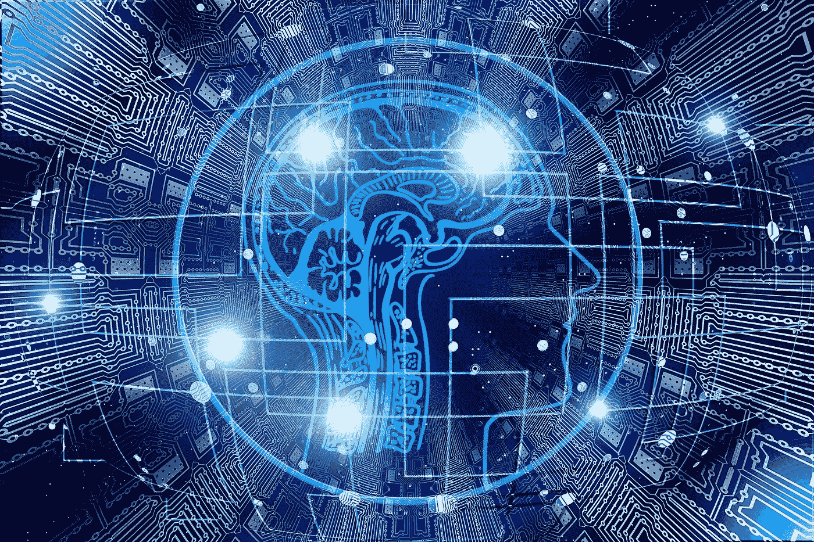

# 我非常规的数据科学和分析之旅

> 原文：<https://towardsdatascience.com/my-unconventional-journey-to-data-science-and-analytics-d6750090498c?source=collection_archive---------33----------------------->

## 利用你现有的技能。

图片来自[皮克斯拜](https://pixabay.com/?utm_source=link-attribution&utm_medium=referral&utm_campaign=image&utm_content=3112448)

你好。我叫安吉拉。我从 2013 年开始从事数据科学和分析领域的工作。我在这个领域的道路相当不寻常，但是，我仍然在这里取得了成功，并且每天都在继续大步前进。我想与你分享我是如何选择这个领域的，并展示我的技能是如何与我现在的位置相辅相成的。

***如果你有兴趣在数据科学和分析领域工作，你的多学科技能可以作为你的优势。我坚信，数据科学和分析领域将随着技能、人员和背景的多样化而蓬勃发展。随着我们日益成为一个数据驱动的社会，我们需要不同的技能来共同解决不同的问题。学习技能，练习手艺，加入我们吧。***

# 让我们从头开始…

图片来自 [Pixabay](https://pixabay.com/?utm_source=link-attribution&utm_medium=referral&utm_campaign=image&utm_content=719174) 的 [Fathromi Ramdlon](https://pixabay.com/users/Ramdlon-710044/?utm_source=link-attribution&utm_medium=referral&utm_campaign=image&utm_content=719174)

# 本科

## 犯罪学

很久以前(2005-2008 年)，我是新墨西哥大学犯罪学的本科生。在学习期间，我学习了社会学和犯罪、越轨行为之间的联系，并用手进行统计计算。在我的顶点课上，我们用 SPSS 分析了犯罪数据——这是我第一次真正接触数据分析，远在数据分析流行之前。我选择犯罪学是因为我被这段时间流行的过多的犯罪调查节目所吸引。我确信我想成为一名联邦调查局特工或调查员。我一点也不知道，我最终会成为一名数据调查员！

***💡获得/发展的技能:***

*   *批判性思维*
*   *求知欲*
*   *数据分析*
*   *统计分析*
*   *耐心(对过程、自己和他人)*
*   *考虑他人(我学会了考虑他人观点的基本原则，在研究中，有时观点不同。)*

# 研究生教育

## *公共管理*

犯罪学毕业后，我决定立即在新墨西哥大学攻读公共管理硕士学位。我觉得这个学位会很有意思，是进入公共部门工作的一个开端。这个项目是我第一次真正接触到评估同行评议的期刊文章、分析数据、与他人合作以及发表演讲。强调团队合作和大量的小组项目。在攻读学位期间，我选修了与法律、社会学、人力资源和预算相关的各种课程。我不是一个有天赋的演说家，这是我至今仍需要努力的地方。但很高兴我有这样的经历。

***💡获得/发展的技能:***

*   *团队合作*
*   *评估同行评审期刊和信息*
*   *数据分析*
*   *公开演讲*
*   *主动倾听*
*   *恭敬的辩论*
*   *撰写有效的文档*

## 信息技术

完成公共管理教育后，我搬到了南加州。我觉得我想探索技术领域的职业生涯。在此期间，我开始从事技术性更强的工作，因为对这些技能的需求越来越强烈。我听到越来越多关于数据分析和 python 编程能力的说法。经过一番思考和反思，我开始在 Azusa 太平洋大学攻读信息技术学位。那时我住在南加州，我真的很喜欢梓太平洋的小校园。在这个学位项目中，我学到了与计算和工程相关的各种技能，但没有具体到数据科学或分析。这个学位是我对技术感兴趣的催化剂。这是我第一次真正开始钻研技术，在与我职业生涯中工作过的技术团队类似的团队中工作，并学习坚持的艺术。我的代码已经失败过很多次，或者我根本不知道某个问题的答案。我参加了一个软件工程课程，在课程中我们团队设计了一个[智能冰箱](https://www.samsung.com/us/explore/family-hub-refrigerator/overview/)……就像现在可以买到的类型。你在课堂上能想到的东西真是太神奇了。看起来我们已经错过了与三星或 LG 的职业生涯，哈哈。

**💡获得/发展的技能:**

*   *编程技巧(Java、Visual Basic、SQL)*
*   *技术意识*
*   *技术团队*
*   *数据库设计*
*   *创意*

## 生物医学信息学

当我获得信息技术硕士学位后，我开始收到数据分析师的工作邀请。老实说，我不知道这是一个职业领域，但它似乎很吸引人，所以我尝试了一下😊。我的第一个角色是一家耐用医疗设备供应商。然后，我从加州搬了出来，开始在一家专注于肿瘤数据的初创公司担任健康数据分析师。我从未如此热爱一份工作，起床后精力充沛地去工作。我喜欢数据和你可以用它做的一切。我还发现我是一个冷酷的书呆子，对此我没有意见👍。正是在这段时间里，我知道这是我想从事的职业，我将继续深造。我申请了[罗格斯大学](https://www.rutgers.edu/)生物医学信息学博士项目，并被录取。我快毕业了。*请注意，罗格斯大学不再提供博士项目。以下是我在博士项目的旅程中所学到和获得的技能。

**💡获得/发展的技能:**

*   *临床数据分析*
*   *临床研究*
*   *流行病学*
*   *机器学习*
*   *临床操作*

# 数据科学和分析的自学

图片来自 [Pixabay](https://pixabay.com/?utm_source=link-attribution&utm_medium=referral&utm_campaign=image&utm_content=849825) 的 [StartupStockPhotos](https://pixabay.com/users/StartupStockPhotos-690514/?utm_source=link-attribution&utm_medium=referral&utm_campaign=image&utm_content=849825)

自创业以来，我一直在几家医疗保健集团从事数据分析工作，并了解到“分析”并不一定有一个标准，因为每个公司对它的定义都不一样。我在临床和技术环境中都工作过，发现通常有一些知识是我所缺乏的。我没有感到不安全和“情绪激动”，而是决定为此做点什么。鉴于我的背景是非传统的，我想更多地了解这个领域，成为一名更有效的专业人士。以下是我所做的，并且一直持续到今天:

1.  我开始自学 python 编程。在创业初期，python 是我们的首选语言。开始编写功能代码很容易。
2.  我开始在 Udemy 和 Coursera 上学习课程，只是为了让自己熟悉别人眼中的数据科学。我在 Coursera 上参加了吴恩达的机器学习课程。我开始看奥莱利的书系列，封面是动物，lol。我特别喜欢韦斯·麦金尼写的这本书。
3.  开始在数据集上练习我新获得的技能，并建立作品组合。
4.  我一直在通过演讲会练习我的公开演讲能力。
5.  我刚刚完成了 Data Science Dojo 的训练营，我强烈推荐他们。该计划对我理解如何实施解决方案以及将我的知识应用到现实世界的场景中至关重要。我还学会了如何调整模型。

我对数据的热爱和对学习的热情仍在继续。只要有机会，我就会抓住学习的机会。我似乎总能学到新东西。我已经接受了我不可能知道所有的事情，因此，我是一个终生学习者。

# 我的技能+数据科学

图片由 [Gerd Altmann](https://pixabay.com/users/geralt-9301/?utm_source=link-attribution&utm_medium=referral&utm_campaign=image&utm_content=3382507) 从 [Pixabay](https://pixabay.com/?utm_source=link-attribution&utm_medium=referral&utm_campaign=image&utm_content=3382507) 拍摄

我学到的是，这个领域远不止数据分析、算法和编程。人们普遍不言而喻地期望与人有效合作，交流你的结果，并在工作场所保持愉快。如果一个优秀的数据科学家/分析师不善于沟通，他们将会受到阻碍。以下是我在整个学术生涯中学到的技巧，这些技巧对我在这个领域的个人旅程非常有用。

*——在开始分析之前，对我们收到的信息和数据进行辨别和判断是非常重要的。我们的目标是全面评估我们现有的数据，以及这些数据对于我们试图回答的问题是否可以接受。*

****领域知识***——我主要在医疗保健行业工作，所以这在那些环境中很有帮助。*

****求知欲***——对数据保持好奇并提出问题是构建最具商业影响力的有效解决方案的关键。*

**——数据科学和分析中有一种创造性和艺术性的元素。在向利益相关方展示结果时，有效的数据故事讲述(包括数据可视化工具和吸引受众的沟通)将改变游戏规则。**

*****数据分析***——分析数据以理解如何衍生商业价值的能力是一项关键的、绝对必要的技能。**

*****团队合作***——这是一项绝对需要掌握和发展的技能。独自工作而没有任何其他人类互动的可能性相当低。你绝对需要能够与他人合作。**

*****统计分析***——这是一项关键技能，取决于分析的角色和类型。融入数据科学的角色需要牢固掌握概念。**

*****公开演讲***——向决策者展示结果和建议的能力是任何数据角色的一个心照不宣的期望。花些时间了解你的听众，并根据他们的需求定制你的演讲。**

*****编程技能***——这是这个领域内必不可少的技能。有几种语言是通用的:Python，R，SQL。也有一些工作场所需要精通 SAS、C++、Java 等，但除了我提到的常用语言之外，我个人没有什么经验。**

*****写作***——我的写作量因角色而异，但无论是电子邮件、文档还是白皮书，我都需要在每个角色中写作。我很感激我的本科和研究生教育给了我这个机会。**

# **最后**

**我进入这个领域的道路是非传统的，但我在这个过程中学到的一切对我作为一名专业人士的发展都很有用。技术技能是必要的，但不是唯一必要的技能！**

**非常需要各种背景的数据专业人员。有一个普遍的信念，只有拥有一定学位的个人才能在这个领域茁壮成长；现实情况是，随着数据问题变得越来越多样化，解决上述问题的工作人员也需要多样化。不是每个人都以同样的方式处理同样的问题，因此在多元化的团队中工作是有好处的。请忽略任何关于“如何识别假数据科学家”、“谁应该成为数据科学家”以及其他恶作剧的文章。**

**你对数据有热情吗？你想在这个领域工作吗？学习入门所必需的技能:编程、统计、沟通、领域知识(取决于你对哪个特定领域感兴趣)，并开始用数据集练习。请注意，这个领域也需要与他人合作。建立一个作品集。学会利用你的技能来产生商业影响。这个领域需要时间、耐心和练习。没有一定的人能做这项工作。你决定你能带来什么价值。球在你的球场上。干杯！**

# **联系我**

**随时联系 [**Linkedin**](https://www.linkedin.com/in/angelabaltes/) **。****