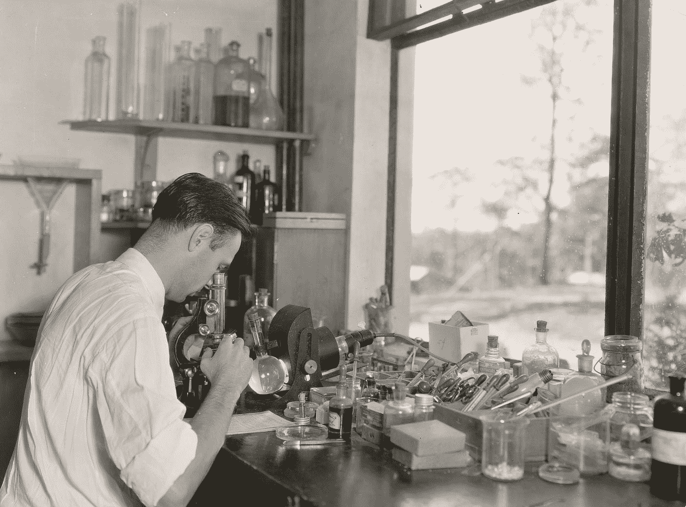
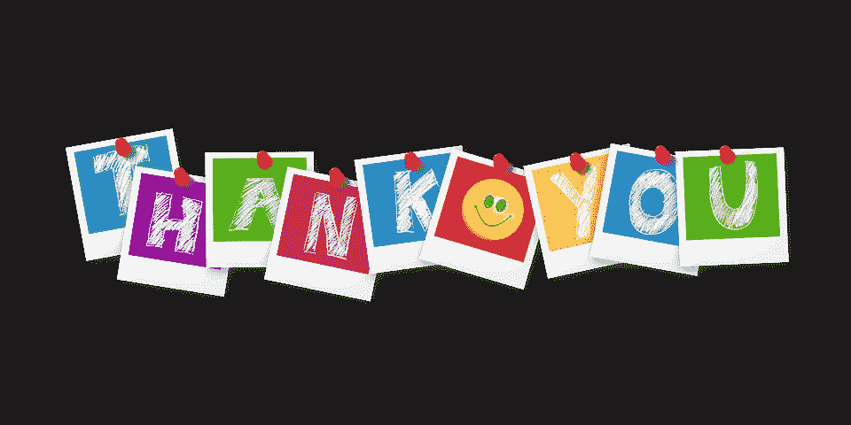

# 人工智能研究科学家的四种特质之我见

> 原文：<https://towardsdatascience.com/my-views-on-ai-researcher-traits-93326a5d9905?source=collection_archive---------37----------------------->

## 职业，人工智能研究，经验

## 根据我和几个博士毕业生在一家初创企业工作的经验

纽约公共图书馆拍摄于 [Unsplash](https://unsplash.com?utm_source=medium&utm_medium=referral)

大家好！终于又可以写文章了。我想写几个想法。之前，我想写另一个关于深度学习的有趣项目。不幸的是，这个计划被搁置了，因为我有其他事情要做。在我自由之后，我忘记了这个项目，并决定放弃它。然后，突然想写一下自己的科研生涯经历。因此，我给你这篇文章。

在这篇文章中，我想分享我在工作中所学到的东西。告诉你，我是 [Kata.ai](http://kata.ai) 的人工智能研究科学家。我的工作是用机器学习来解决一些自然语言处理的问题。我已经做了一年的人工智能(AI)研究员，之前我的工作不是研究员。我会说，我在这个职业生涯中相对较新。

基于我的经验，强调人工智能的研究环境，我想分享基于我在我的研究团队工作的经验的研究员特质。这个团队由几名博士毕业生组成。我想给你们概述一下研究人员的一些特质。概述是基于我的观点，刚刚踏上研究员生涯。我希望它能为对此感兴趣的人提供一些见解。

# 批判性思维

照片由[布鲁斯·马尔斯](https://unsplash.com/@brucemars?utm_source=medium&utm_medium=referral)在 [Unsplash](https://unsplash.com?utm_source=medium&utm_medium=referral) 上拍摄

我认为这种特质对于一个想成为研究者的人来说是必要的。正如你所看到的，这个职业的工作是研究一些东西，发现一些东西，如基于研究结果的洞察力。原因是我们需要确保发现是有效的。换句话说，我们想让人们相信我们的结果是实质性的。

我对我们如何进行批判性思考的一种态度是怀疑主义。这很违反直觉，对吧？在解决问题时，我们通常需要乐观，但在这里，我们使用怀疑态度。是关于什么的？

怀疑论在这里意味着我们怀疑一个研究结果。例如，当我们发现某篇论文说这篇论文的发现很有希望时，我们会在心里问自己:“这是真的吗？我不认为这种方法对 B 有效。

这种思维模式可以提供一种新的研究思路。你可以验证你怀疑的说法，如果这是真的，这可能是一个新的研究项目想要解决。

在我去研究团队之前，我是一个认为当那篇论文有很酷的直觉和方法，并且受欢迎是很棒的人。感谢我的团队，我可以阐明这种心态。这并不是说我对任何论文都完全持怀疑态度，但至少我的大脑中有“好得不真实”的陈述，尤其是当我读到一些声称一切都很棒的东西时。

弗朗西斯科·冈萨雷斯在 [Unsplash](https://unsplash.com?utm_source=medium&utm_medium=referral) 上拍摄的照片

我有一个读学士学位的朋友在 NLP 做了一个研究项目。由于不熟悉，他决定请一位博士生做他的导师。他的导师给了他一篇论文，里面有一个很有前途的方法。导师建议我的朋友在他的项目中使用论文的方法。他决定相信他的导师给的研究论文。不幸的是，在项目结束时，他没能用论文的方法创造出一个好的模型，因此他在这门学科上得了一个很差的分数。一年后，他意识到论文是垃圾。

从上面的故事来看，如果我的朋友具有批判性思维特质，他就可以避免糟糕的成绩。对论文好不好持怀疑态度可以拯救你。尽管如此，怀疑主义并不意味着我们总是消极地看待事物，而是客观地评估我们关注的对象。

# 好奇心

照片由[约瑟夫·罗萨莱斯](https://unsplash.com/@josephandjosephandjoseph?utm_source=medium&utm_medium=referral)在 [Unsplash](https://unsplash.com?utm_source=medium&utm_medium=referral) 拍摄

随着研究成为研究人员的日常任务，好奇心，在我看来，必须存在于任何研究人员的心态。有了好奇心，我们可以丰富研究发现。因此，使结果更有见地被消化。

当我们(我的研究团队)被给予一个问题时，我们讨论如何解决这个问题的几个想法。讨论是需要研究者的好奇心的事件之一。我们制定了几个假设，认为几种方法可能值得尝试解决这个问题。

在我的团队中，当我们回答一个研究问题时，通常不会以此结束。这也是需要好奇心的地方。具体来说，在我们完成了一个问题的实现和实验之后，我们需要分析结果。通常，在分析结果时，他们会突然想到几个问题来探索与结果相关的其他事情。例如，对于一个专注于深度学习的人工智能研究人员来说，当他开发出一个新的架构模型来给出显著的结果时，他可能会忍不住质疑它的好性。其中一个方法是做一个消融研究，他可以做实验，看看当新模型的一部分不存在时，质量是否会下降。带着好奇心，它可以丰富对发现的分析，这可能会进一步说服读者。

总而言之，好奇心进一步加强了研究工作。在我看来，研究工作的结果，其中之一是由团队的好奇心塑造的。当给予足够的好奇心时，它会输出一个有见地的发现。

# 艰苦的

道格·图尼森在 [Unsplash](https://unsplash.com?utm_source=medium&utm_medium=referral) 上拍摄的照片

并不是所有的研究实验都能得到想要的结果，因为研究人员会去研究未知的东西。所以，当一个研究结果给出可怕的结果时，要强硬。

以我的经验来说，我经历过很多失败的实验。首先，我很不幸地知道我的实验毫无结果。但是，后来，我意识到失败是一个教训，可以让我成为一个更好的研究者。失败的经历告诉了我今后需要避免的错误。杀不死你的会让你变得更强，对吗？

所以，是的，通过接受你的失败，它会让你成长。然而，当一个研究项目失败时，并不意味着所有的工作都是徒劳的。你可以在研究论文里写你失败的原因。对于任何想研究解决类似问题的人来说，这也是一种洞察力。不幸的是，每个人都如此专注于一个'**成功的**研究成果，而不是一个失败的。在我看来，我认为一个失败的故事比成功的故事更有价值，它可以警告某人不要再犯。尽管如此，书面报告需要彻底强调失败的原因才有价值。

所以，不要让研究实验给出不好的结果。学习并从中前进！

# 系统作家

照片由 [Aaron Burden](https://unsplash.com/@aaronburden?utm_source=medium&utm_medium=referral) 在 [Unsplash](https://unsplash.com?utm_source=medium&utm_medium=referral) 上拍摄

实验之后，我们会有一个发现或者一些我们引以为豪的研究。那么下一步是什么？是的，把结果告诉大家它的酷！

书面报告是告诉大家的渠道之一。在我的团队中，我们经常以报告的形式写一篇研究论文。这是我们的媒体之一，在这里我们向外界传达我们的发现。

当我们与人交谈时，我们知道我们需要确保我们的信息能够被理解。然后，当我们想说服某人我们的观点是可靠的，我们需要给出一些合理的论据。这和我们如何写报告是一样的。我们需要系统地写一份合理且易于理解的报告，以使我们的发现是有成效的。然后，我们的文章越有洞察力，越容易理解，越多的人会认可我们的研究。

我在这里学到，当我们写论文时，我们需要写一个故事来系统地联系我们的发现。我们需要把动机、背景、实验结果和分析联系起来，才能做出报告。我们认为这会让我们的读者满意并喜欢我们的作品。

> 良好的..其实主要是为了通过审稿人对提交论文的判断😆。

# 结论

在这篇文章中，我给出了几个研究人员的特质，这些特质是我基于与一个人工智能研究团队合作的经历而感受到的。他们是批判性思维、好奇心、坚韧和系统化的作家。每个特征都有利于他们更好地完成研究项目。

说实话，看了一个博士毕业的 AI 研究员是怎么工作的，我离一个完全意义上的研究员还很远。但是我喜欢和他们一起工作，尤其是在讨论如何解决问题的时候。我从他们身上学到了很多，尤其是他们处理问题的方式。

## 编后记

感谢您阅读我的文章😃。下一次，我想写一些关于人工智能的技术。请给我一些力量来写我的下一篇文章。

一如既往，

> 我欢迎任何可以提高我自己和这篇文章的反馈。我正在学习写作，学习变得更好。我感谢任何让我变得更好的反馈。

在我的下一篇文章中再见！

来源: [Pixabay](https://cdn.pixabay.com/photo/2017/07/10/16/07/thank-you-2490552_1280.png) 带 [Pixabay 牌照](https://pixabay.com/service/license/)