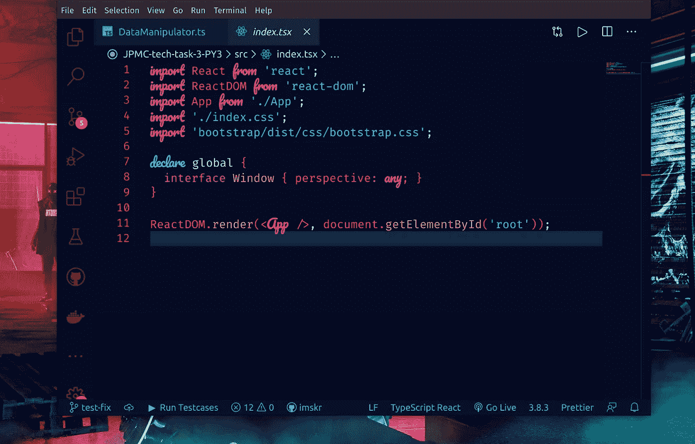
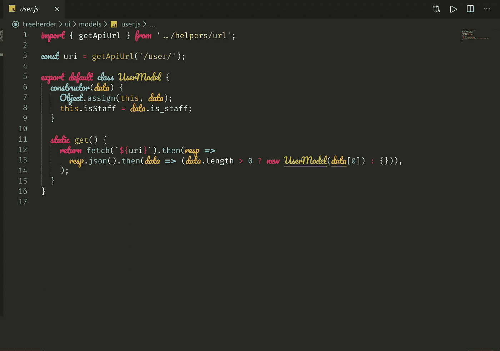
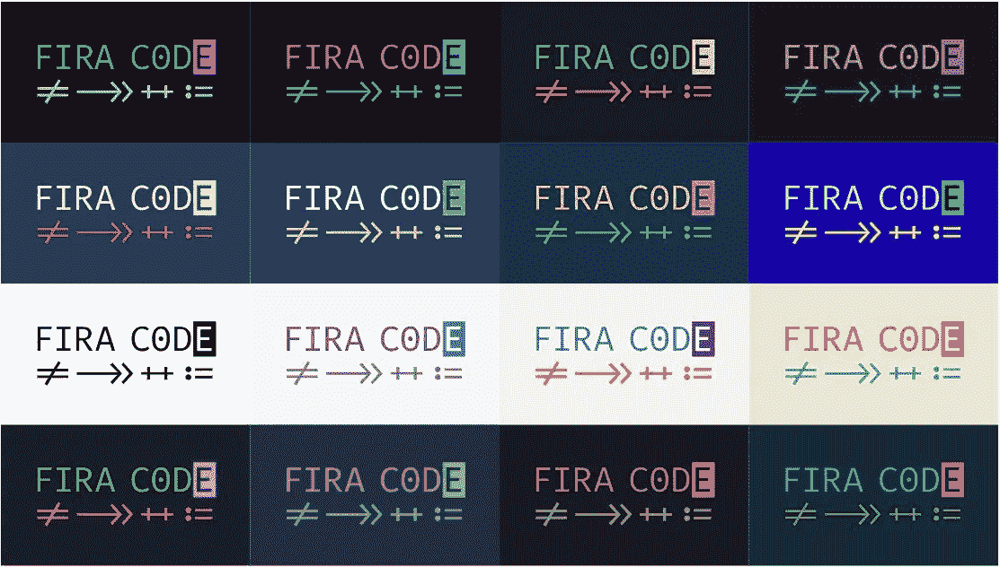
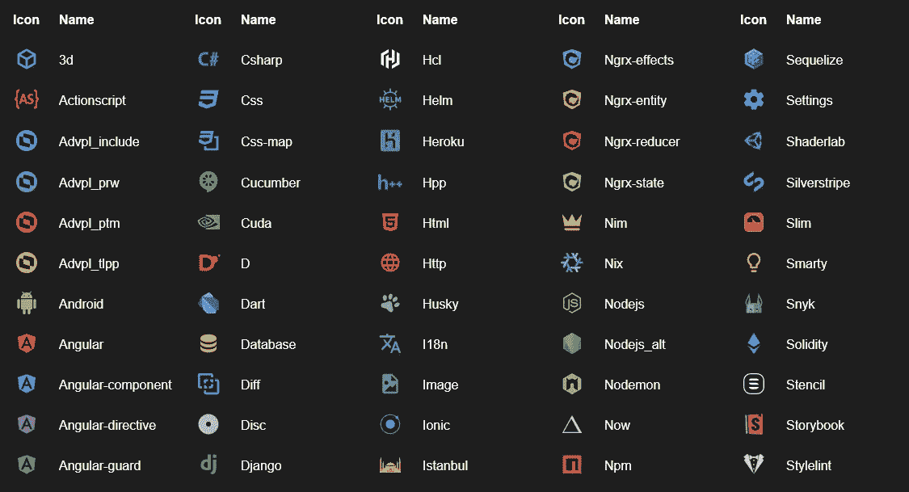
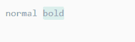
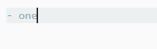
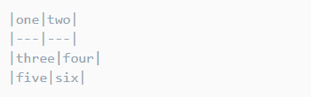
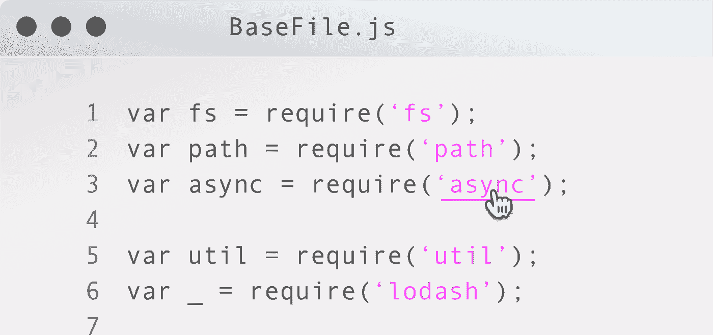
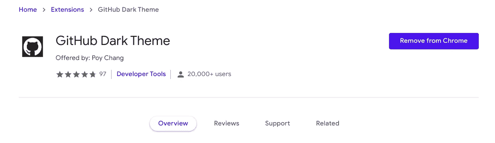
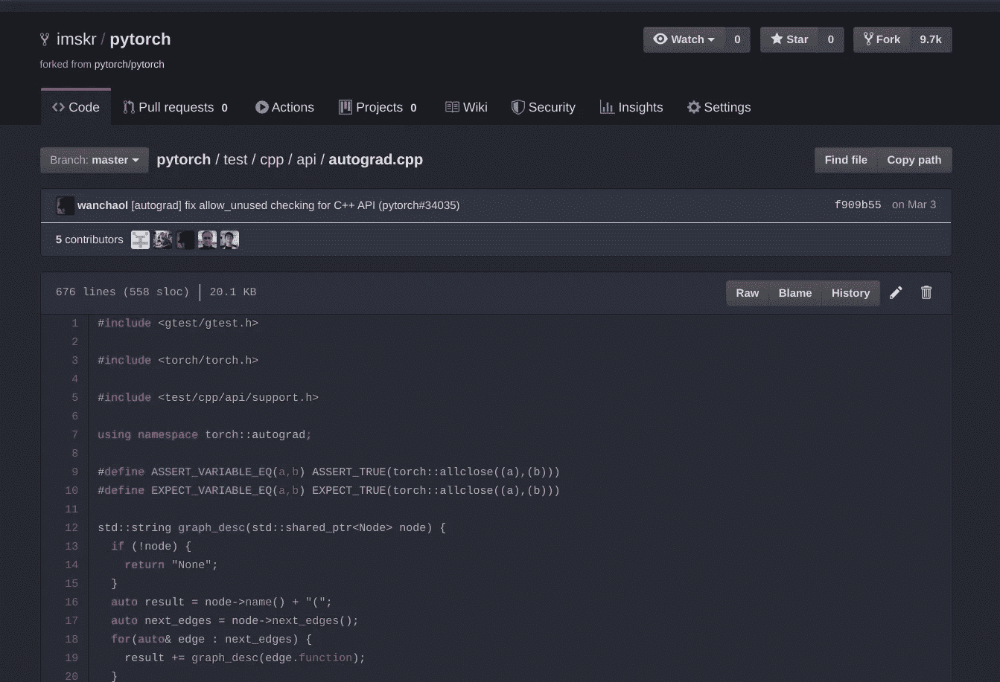

# 我 2077 年的 Visual Studio 代码

> 原文：<https://towardsdatascience.com/my-visual-studio-code-from-2077-1f5b08411dbe?source=collection_archive---------39----------------------->

## 让我们谈谈代码——Visual Studio 代码

来源:[谷歌图片](https://www.google.co.in/search?q=vs+code+wall&tbm=isch&ved=2ahUKEwij18KcmpXpAhUuErcAHZigAhMQ2-cCegQIABAA&oq=vs+code+wall&gs_lcp=CgNpbWcQAzICCAA6BAgjECc6BAgAEEM6BggAEAgQHjoECAAQGFDtPVjHQ2CpRWgAcAB4AIAB7wGIAb8HkgEFMC4zLjKYAQCgAQGqAQtnd3Mtd2l6LWltZw&sclient=img&ei=2GqtXqOLCa6k3LUPmMGKmAE&authuser=0&bih=734&biw=1536&hl=en#imgrc=RPJaEWPz6K-UvM)

# 来自未来的代码编辑器！

*从崇高的文本和原子中迁移出来后，我可以说我不后悔我的决定！这是我迄今为止最喜欢的编辑器，也是开发者的终极体验，包括透明度在内的许多功能都已解锁！* ***我会写在 Linux 上设置它，但你可以在任何平台上设置*** *。*

V *S 代码使用*[*Electron*](https://electronjs.org/)*作为其基础，这使其能够跨平台并在 macOS、Windows 和 Linux 上工作。它是使用*[*node . js*](https://nodejs.org/)*构建的，完全支持任何 JavaScript 开发者。*

# 我的主题

这是我最喜欢自定义字体的两个主题！

## (灵感来自赛博朋克)——我的最爱！

我的个人

## monokai(vs code 附带的内置主题)

我的个人

# 我的字体

## ***firico(组合*** [***Fira 代码***](https://github.com/tonsky/FiraCode) ***和***[***Pacifico***](https://www.fontsquirrel.com/fonts/pacifico)***为斜体)***

这是我用于编程的字体设置。它使用 Fira 代码作为默认字体，Pacifico 代码作为斜体。由于 Fira 代码，它也有字体连字。

**定制**

定制字体(例如调整其中一种字体的大小)最简单的方法是使用 FontForge。只要打开**”。ttf"** 文件，编辑后导出回 **"ttf"** 。你只需要确保你没有编辑任何元数据，否则字体将无法工作。

**什么是斜体？**

许多编辑器/ide(如 VSCode)对某些表达式(通常是关键字或类型)采用所选字体的斜体样式。这种字体用另一种字体:Pacifico 替换了 Fira 代码的默认斜体样式，所以我们基本上是“欺骗”了程序。

在 VSCode 表达式中，斜体样式是由你的主题控制的，但是你可以在**的【editor . token color customizations】**下的 **settings.json** 中进行更改和定制。

**这是我的配置:**

# 图标主题

## [素材图标主题](https://marketplace.visualstudio.com/items?itemName=PKief.material-icon-theme)

材料-用户界面启发的文件图标，一个文件图标的替代品。

[图像来源](https://marketplace.visualstudio.com/items?itemName=PKief.material-icon-theme)

# 降价支持

## [一体降价](https://marketplace.visualstudio.com/items?itemName=yzhang.markdown-all-in-one)

所有你需要写 Markdown(键盘快捷键，目录，自动预览，等等)。

# 奖金！(生产力工具)

## 1.[八叉树](https://github.com/buunguyen/octotree)【浏览器扩展】

浏览器扩展(Chrome、Firefox、Opera 和 Safari)在 GitHub 上显示代码树。对于探索项目源代码来说太棒了，而不必将每个存储库都拉到您的机器上。

## 2. [OctoLinker](http://octolinker.github.io/) 【浏览器扩展】

使用 OctoLinker 浏览器扩展高效浏览 GitHub.com 的项目。非常适合查看 JS/Node/Ruby/Python 源代码。

## 3.[设置同步](https://marketplace.visualstudio.com/items?itemName=Shan.code-settings-sync)

使用 GitHub Gist 在多台机器上同步设置、代码片段、主题、文件图标、启动、按键绑定、工作区和扩展。

## 4. [GitHub 黑暗主题](https://chrome.google.com/webstore/detail/github-dark-theme/odkdlljoangmamjilkamahebpkgpeacp)【浏览器扩展】

# 还有吗？请在评论中告诉我！

[图片来源](https://tenor.com/view/cheering-happy-laugh-excited-minions-gif-3453134)

在 Twitter 上关注我— [@TheTweetofSKR](https://twitter.com/TheTweetofSKR) ，查看我的其他帖子！