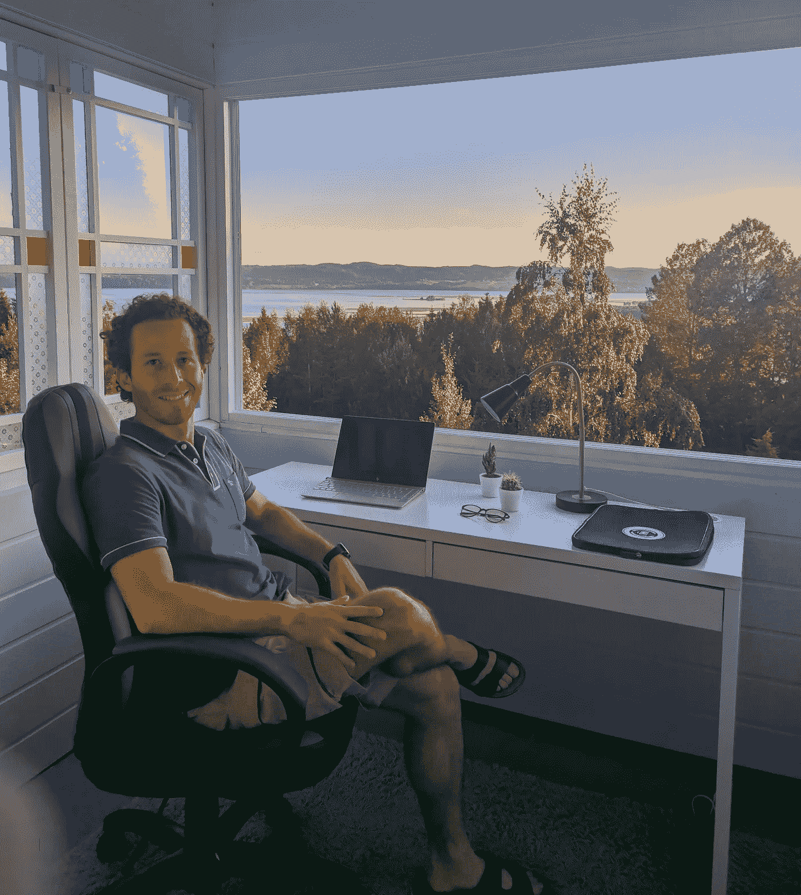
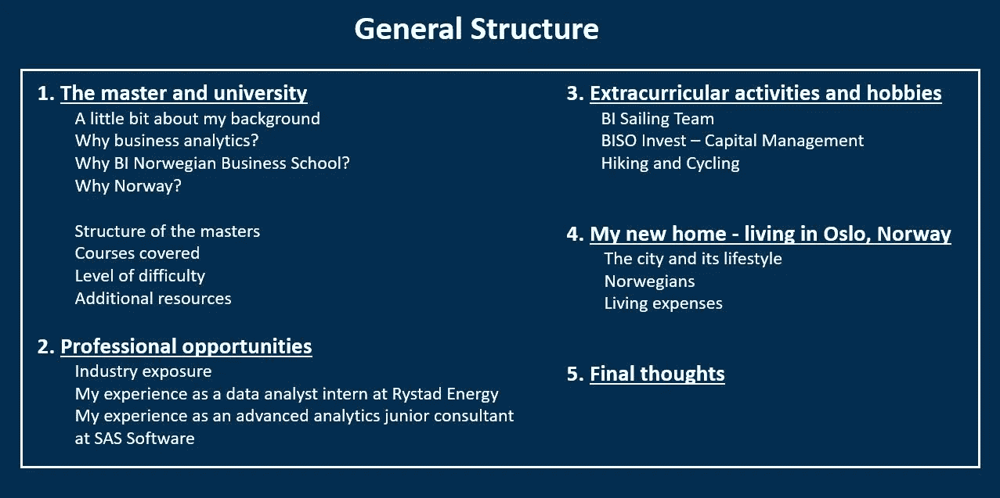
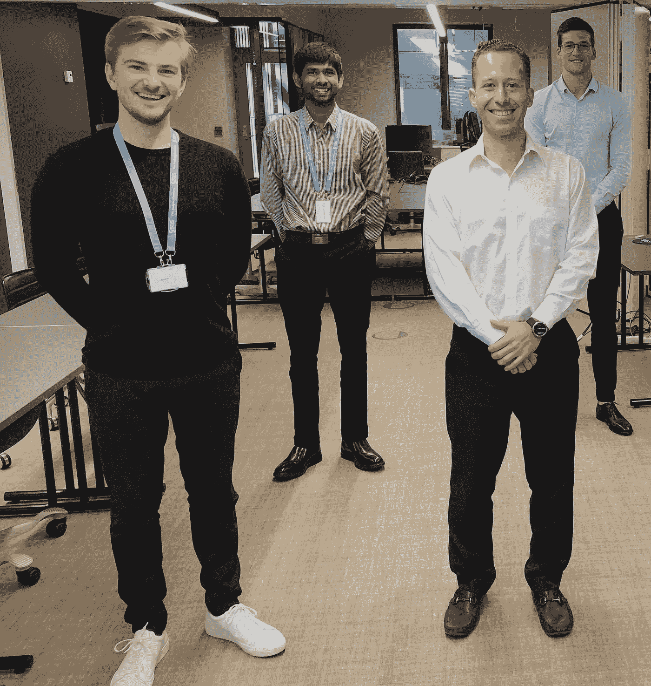
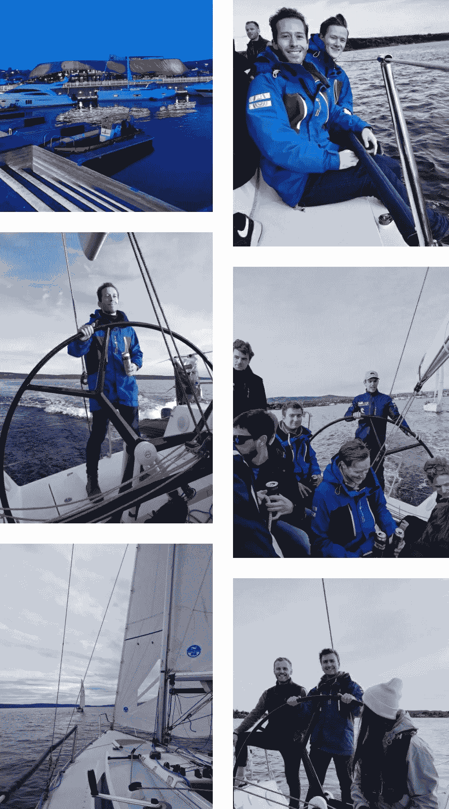
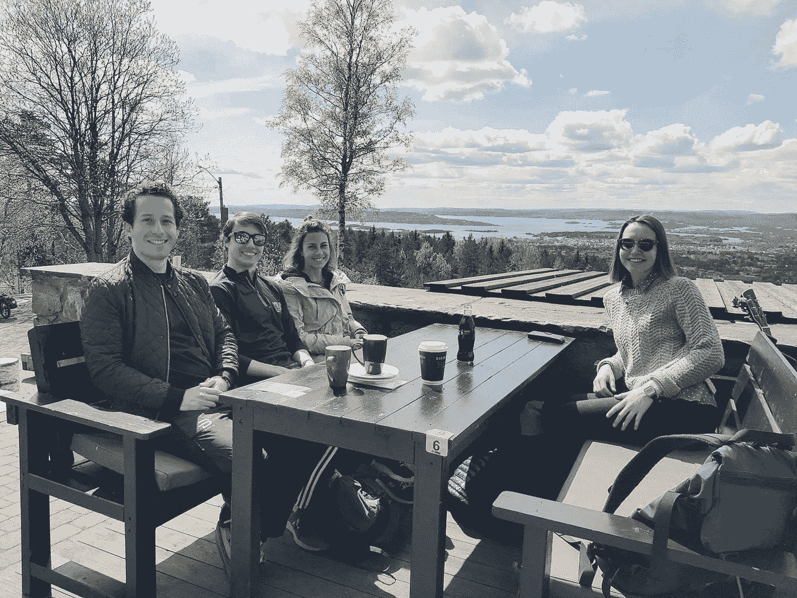
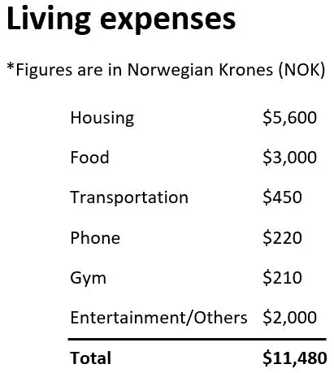

# 我在挪威成为高级分析初级顾问的奇妙旅程

> 原文：<https://towardsdatascience.com/my-wonderful-journey-to-become-an-advanced-analytics-junior-consultant-in-norway-6df652ad9487?source=collection_archive---------38----------------------->

## **商业分析理学硕士学位如何帮助我加快职业生涯并过渡到数据科学领域**

图片作者。

一些朋友问我在挪威学习商业分析理学硕士(MSc)的个人经历，以及我在数据科学领域开始职业生涯的旅程如何。这就是为什么，我决定分享我的真实经历，这样你就可以更好地了解会发生什么，并有希望帮助你决定这是否是你的正确选择。

此外，我决定分享我的整体经验，而不仅仅是谈论硕士及其职业机会，所以我会涵盖其他话题，如我参加的一些课外活动，我在挪威的生活经历，我在一家能源咨询和商业智能数据公司担任数据分析师的实习经历等。

以下是我证词的大致结构🙂。

*总体结构(图片由作者提供)*。

# 1.大师与大学

> ***稍微介绍一下我的背景***

在开始攻读硕士学位之前，我在墨西哥城的 ITAM 获得了工商管理学士学位。此外，我在墨西哥做了一年的量化股票交易员，在我学士学位的最后一年，我有机会在巴黎 HEC 和吴维也纳经济和商业大学留学。这次经历让我置身于一个难以置信的学习环境中，从那一刻起，我知道我想去国外读硕士，尤其是在欧洲。

> ***为什么要进行商业分析？***

有了工商管理的背景，我知道我想选择一个更技术性的硕士学位(不是 MBA ),但始终牢记商业和应用方面。这就是为什么商业分析硕士学位非常吸引我。随着每天产生的大量数据以及计算机和软件功能的新发展，我知道基于数据驱动的分析优化和改进公司决策有着巨大的潜力。就业市场和在任何类型的行业和部门实施分析的可能性也非常有吸引力。

> ***为什么*** [***毕挪威商学院***](https://www.youtube.com/watch?v=tzqrdxO5D8I) ***？***

BI 挪威商学院的硕士项目结合了一系列知识和技能，将数据科学与商业学科相结合。它非常强调知识的[应用](https://www.youtube.com/watch?v=YPeJvdUuJqA)，并通过实习、交换项目和认证为你提供个性化学位的灵活性。

在 2019 年年度欧洲商学院排名中，T4 大学也连续第五年被英国《金融时报》评为挪威最佳商学院。

> ***为什么是挪威？***

正如我之前提到的，我想在欧洲的某个地方学习我的理学硕士学位。我在英国、法国、德国、瑞士和北欧国家寻找不同的项目，但挪威引起了我的注意。在了解了它的高生活水平、性别平等、稳定的经济、有吸引力的就业市场、低水平的腐败和很棒的户外活动后，我被说服了。

当然，一切都不像听起来那么完美，世界上任何地方都有不好的一面。你还会经历寒冷和黑暗的冬天，也许不是最好的夜生活(尤其是来自墨西哥)，高昂的物价，有时很难真正了解挪威人。我将在后面的部分更详细地讨论这一点，在那里我谈到了奥斯陆，它的人民和文化。

> ***课程结构、课程内容和难度***

硕士是一个为期两年的全日制项目，分为两个学期，一个在秋季，一个在春季。第一年，你的大部分课程都是学习基础知识的。它是讲座、小组项目、期末考试、选修课和研讨会的结合。第二年比较应用，可以选择去实习，成为外部公司的顾问，或者通过成为研究助理来追求自己的学术兴趣。此外，你还必须在最后一年完成两门课程并撰写硕士论文。该计划提供了在世界任何地方完成第二年理学硕士课程的灵活性，班级规模约为 40 人，因此您可以体验更多个性化的关注。

程序结构和类概要(*图片作者*)。

> 在理科硕士的第一学期，我修了 5 门课程:数据管理和 Python 编程、业务优化、应用数据分析、现代商业环境中的数据保护和道德，以及决策理论和系统动力学。

**Applied Data Analytics** 专注于使用 r 的统计和数学。从我的经验来看，难度是中等的，但它让我对不同的主题有了很好的更新，如逻辑回归、假设检验和探索性因素分析。在**数据管理和 Python 编程中，**我们学习了如何使用 Jupyter 笔记本编写 Python 代码，在课程的第二部分，我们学习了关系数据库以及如何使用 SQL 从这样的数据库中检索数据。

业务优化是一门非常有趣且富有挑战性的课程。我们学习了如何使用数学建模来支持实际的商业管理决策。在本课程中，我们使用了 AMPL 代数建模系统，并学习了一些最常见的确定性优化建模技术，如线性规划(LP)、整数规划(IP)、混合整数规划(MIP)和非线性规划(NLP)及其在物流/运营和战略中的应用。

**伦理学**是一篇普通的论文，重点是 GDPR 和**决策理论和系统动力学**的课程，我觉得有点无聊，小组项目非常耗时。该课程包括使用 Vensim(一种模拟软件)对奥斯陆的垃圾分类系统进行建模，以分析不同的行动和策略如何影响城市中可回收材料的百分比。

> 在**第二学期**，我也有 5 门课:机器学习预测分析、商业模拟、可视化和网络理论，还有两门选修课:人工智能——技术和应用，以及供应链分析。

我最喜欢的课程是约翰·钱德勒·约翰逊的**机器学习预测分析**，太棒了！他在斯坦福大学获得了统计学硕士和博士学位，他非常擅长沟通和教授这门课程。我喜欢他的方法，即专注于为公司提供价值的商业应用，但也要记住在建立机器学习模型的过程中需要的最重要的概念和技术要求。

我们学习了如何使用 Python 和 DataRobot 构建有监督的机器学习模型，并在一个团队项目中为一家银行检测信用卡欺诈。我原以为这门课的难度会很高，但结果是中等难度。

我选修的**人工智能**与机器学习的课程有关，难度更高，技术性更强。我们从对人工智能的介绍开始，学习了人工智能如何在商业中付诸实践，以及如何评估其潜在的好处。本课程涵盖了 Python 中的面向对象编程(OOP)以及一些最常见的搜索算法、约束满足问题和更多关于机器学习的内容。

我选的另一门选修课，**供应链分析**，是业务优化的延续。我们解决了供应链优化、需求预测、运营调度和安全库存分析等更高级的问题。

对于**商业模拟**课程，我们在 AnyLogic 中建立了一个模拟模型来测试登机的不同政策，对于**可视化和网络理论课程，**我们使用 Gephi 进行社交网络分析。从我的角度来看，我认为可视化课程还有很多需要改进的地方。希望在未来，他们不会太关注社交网络分析，而是开始使用更多的 Tableau 和 Power BI 来学习如何构建仪表板和引人注目的可视化，以使用正确的图表讲述故事。

> ***附加资源***

此外，该大学为您提供免费访问 ***DataCamp*** 网站的机会，这是一个了解更多数据科学知识和补充您的研究的好地方。您还可以参加免费的电子学习课程，获得 SAS 软件*的认证，并访问 ***金融时报*** 时事通讯。*

*如果你想做交换，你可以在第二或第三学期做但选项(大学)有限。第二学期，你可以在沃里克，博科尼，或者葡萄牙学习，第三学期，你可以去荷兰，在蒂尔堡。*

# *2.职业机会*

> ****行业曝光****

*我真正喜欢我的大学，并认为与挪威其他大学相比的优势是它与行业的紧密联系。自从开始学习以来，你在招聘会、研讨会和公司活动中接触了很多不同的公司。作为 Master Merit Society 的成员，我有机会与 Gjensidige、Equinor、Deloitte 等公司一起参加研讨会，更深入地了解他们。此外，您可以访问 BI 职业门户网站，在对大学生档案感兴趣的公司中搜索工作。*

*最后，我鼓励你积极主动地搜索你所在地区附近发生的事件。在我的第一个学期，我去了奥斯陆大学(UiO)的数据科学日，这是一次很棒的经历！你有机会结识对数据科学感兴趣的人，聆听数据科学家的会议(就我而言，是一位在美国工作的脸书数据科学家)，并与出席活动的公司建立联系，例如 BCG Gamma 和 DNV GL 等。*

> ****我在雷斯塔能源公司*做数据分析师实习生的经历***

*正如我之前提到的，在硕士的第三个学期，你有三个选择:实习，在选定的公司做咨询项目，或者作为研究助理与老师合作。我有机会在雷斯塔能源公司做了 10 周的数据分析师实习。他们是领先的能源咨询和商业智能数据公司之一，为石油服务公司、投资者和政府提供全球数据库、战略咨询和研究产品。*

**

*办公室位于 Aker Brygge，拥有奥斯陆峡湾的美丽景色(图片由作者提供)。*

*在这次实习期间，我参与了**的两个主要项目**。*

*在第一个项目中，我使用地理坐标和阿根廷油井的特定标识符在 Python 中进行地理空间分析，以提高数据建模的准确性，并使用 Tableau 创建可视化。*

*在第二个项目中，我收集、整理和综合了来自多个来源的数据，根据每桶二氧化碳的排放量来衡量上游行业最大的石油公司。*

*这次经历对我来说是非常有意义的，也很重要，让我认识到无法像你希望的那样找到完整和干净的数据的挑战。我学会了如何在国际办公环境中合作，与你的团队保持持续沟通有多重要，以及你的工作如何影响其他公司根据你的分析做出的决定。*

> ****我在 SAS Software 担任高级分析初级顾问的经历****

*几周前，我开始了我职业生涯的新旅程，我很高兴成为其中的一员。我加入了挪威的 SAS Institute，与他们的一个电信行业客户合作一个咨询项目，通过实施高级分析来帮助他们利用数据的价值，从而改进他们的营销决策。*

**

*让我向您介绍 SAS 软件公司新一代高级分析初级顾问👨🏻‍💼💼来自挪威、墨西哥、瑞士和南非(图片由作者提供)。*

*我和我的团队目前正在机器学习算法的帮助下优化客户旅程。其理念是使用 SAS Customer Intelligence 360，根据不同的细分、渠道和触发事件，在网站上个性化数字客户体验。*

*到目前为止，我们正在试验 A/B 测试和归因分析。开始时，在与不同的利益相关者举行多次会议并向我的主管汇报进展的同时，保持进度并学习如何熟练地使用解决方案有点困难；但我相信，凭借奉献精神和团队合作，这个项目将为客户创造价值。*

**

*在 SAS 的第一周，我们与不同部门的人举行了多次会议，在会上我们了解了公司、公司的价值观、对人工智能的投资以及解决方案。他们的办公室就在挪威皇家宫殿的后面，每个人都非常有经验并且乐于助人。*

*在不久的将来，我会写一篇博客，介绍在这个项目中遇到的挑战、取得的成果和学到的技能💪🏼。*

# *3.课外活动和爱好*

*对我来说，学习期间的另一个重要方面是参与不同的课外活动，并不断锻炼以保持健康、强壮和专注。*

*大学的学生会提供各种各样的社团和组织，你可以成为其中的一员。通常，在每学期开始时，他们组织招募日，所有的学生组织都出席，分享他们的活动和事件。*

*硕士第一学期，我决定加入**毕启航团队**和 **BISO 投资-资本管理**担任风险分析师。我喜欢这两种经历，它帮助我认识了更多来自其他硕士项目的人，并体验了难以置信的机会，如在挪威峡湾航行😎。*

**

*与 BI 帆船队一起在奥斯陆峡湾航行。毫无疑问，这是我在奥斯陆做过的最好的活动之一。*

# *4.我的新家——住在挪威奥斯陆*

**

*在 hike️后欣赏格雷夫森科伦的美景。*

*奥斯陆是一个非常放松和令人愉快的城市，在那里你可以体验到美丽的人和高价格的大自然😅。总的来说，与其他国家相比，挪威人的生活质量很高，对待事情很冷静，没有压力。*

*在搬到奥斯陆之前，我住在墨西哥城，所以对我来说，奥斯陆在一开始并不重要。我记得在第一周我参观了这个城市的大部分地方，但是随着时间的推移，你会发现很多徒步旅行和美丽的地方。*

*挪威人非常友好，总是愿意帮助你。大多数人英语说得很好，他们喜欢在外面的树林里，与朋友和家人一起在他们的小屋里徒步旅行和放松。我认为他们开始时很害羞，但当你对他们了解多一点后，他们就会敞开心扉，变得非常友好(尤其是如果你给他们一些酒的话)😂).我有许多挪威朋友，但我认为和他们很亲近会更困难，尤其是如果你不会说挪威语的话。*

*公共交通非常高效，城市非常安全，距离森林或海滩只有 10 分钟的路程。根据季节的不同，你可以练习不同的活动，比如冬天去越野滑雪，夏天去远足和露营。*

**

*在奥斯陆 Vettakollen 的顶端(*图片作者*)。*

*在这里，你会看到我大约每月**生活费**的清单。这是一个“近似值”,因为有几个月我旅行了，出去多了一点，或者买了额外的东西，这些都没有包括在这个预算中。我知道有些人每月花费 8000 挪威克朗(一个非常有限的预算)，而其他朋友花费更多，但我认为学生平均每月花费 9 到 12000 挪威克朗。*

**

*我的生活费(*图片作者*)。*

*我很感激我获得了 BI 总统奖学金，它涵盖了我所有的学费，此外，我每个学期还获得了一笔助学金来支付我的生活费用。*

*通常情况下，我花的钱比我从大学里得到的要多，但有了实习的工资和父母一开始的一点额外帮助，我能够支付整个硕士的生活费用。*

*我认为经济因素是一个需要考虑的重要方面，因为挪威是一个生活成本非常高的国家，所以如果你没有奖学金或者没有能力在不影响钱包的情况下支付学费和生活费，我认为这太冒险了。当然，在国外读硕士是一个很棒的经历，你可以从中学到很多东西，但现在网上有很多资源可能是你更好的选择(但那是另一个要讨论的话题)。*

*挪威是一个生活的好地方，但同时，我真的很想念我来自墨西哥的家人和朋友，那里完美的天气，美味的食物，精彩的聚会，以及热情的人们，这些也许在挪威很难找到。我的哲学是，你需要享受和欣赏你现在拥有的美好事物，并利用你此刻生活的机会和经历。*

# *5.最后的想法*

*学习商业分析硕士一直是一个不可思议的经历，不仅从学术和专业方面，而且满足来自世界各地的人，体验新的文化，传统和探索挪威的性质。*

*如果你有出国读硕士的可能，我真的鼓励你去做！它会帮助你在生活的各个方面成长，你会在旅途中获得很多乐趣(长时间呆在图书馆里🤓).*

*感谢这个机会，我能够在数据科学领域开始职业生涯，并在国际环境中的不同公司工作，与非常聪明和有经验的人一起帮助我学习和专业成长。*

*如果您有任何与硕士学位、我在挪威的经历或数据科学相关的问题，请随时联系我并在 Linkedin 上给我写信。我希望我的证词有助于更好地了解这些大师，并激励你考虑从事数据科学。*

*最后，我要感谢你阅读我的证词，并祝你在职业和个人生涯中好运！😃*