# MyAnimeList 用户评分:网络抓取和线性回归的乐趣

> 原文：<https://towardsdatascience.com/myanimelist-user-scores-fun-with-web-scraping-and-linear-regression-9dd97900a82b?source=collection_archive---------44----------------------->

蒂姆·莫斯霍尔德在 [Unsplash](https://unsplash.com/s/photos/download?utm_source=unsplash&utm_medium=referral&utm_content=creditCopyText) 上的照片

Metis 数据科学训练营的第三周已经结束，训练营的第二个项目也已经结束。下面我详细介绍一下我做的项目，就是从 [MyAnimeList](https://www.myanimelist.net) (MAL)中抓取数据，然后使用线性回归模型**根据动漫**的特点预测用户评分。

## TL；博士:

*   **从 11541 个动漫作品中刮净 19 个特征**
*   **通过虚拟变量转换的特征**；剪裁异常值；应用 log10 和 sqrt 和乘法/除法功能
*   **通过 statsmodel 的 OLS 选择了 11 个特征**；scikit-learn 的套索；R 和 MSE 等指标；直觉和领域知识
*   **LASSO** 在性能上挤掉了 plain linear regression 和 Ridge，但是线性回归模型的选择最终没有产生差异
*   最终的模型可以预测一部动画是高分还是中分，但是有**负偏差**和**相对广泛的传播**
*   不同类型的动画也有**非常不同的剧集分布和时长**
*   接下来的步骤是**将线性回归模型分别**应用于不同的动画类型，并**研究更复杂的模型**

# 一.背景

MAL 声称它是“世界上最大的动漫数据库和社区”。网站上的大部分信息(如果不是全部的话)都是用户生成的，从给一部动漫的评分和评论到该动漫的人物简介和列表。

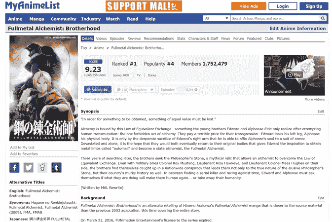

《仲裁示范法》清单示例([来源](https://myanimelist.net/anime/5114/Fullmetal_Alchemist__Brotherhood))

用户生成的分数很好地代表了一部动漫的质量和受欢迎程度。因此，我想知道我是否可以使用 MAL 在这部动画上的数据来预测它将获得的分数。

> 对于决定下一部作品的动画制作公司来说，或者对于决定委托或授权播放哪部动画的电视网络来说，这将是非常有价值的信息。

# 二。收集数据

我使用 BeautifulSoup 收集了 2020 年 4 月 23 日至 24 日之间的 16706 部动漫作品的数据。

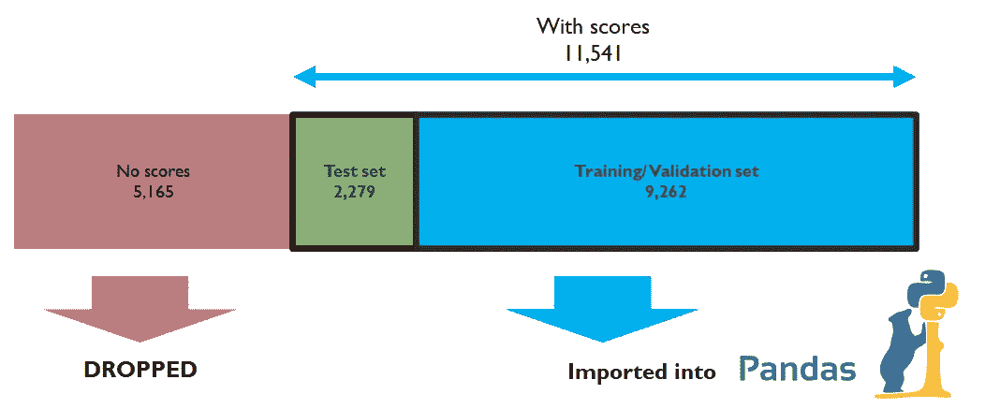

我如何分割恶意数据

在这些条目中，有 5，165 个被排除在最终测试和训练数据集之外，因为它们没有分数(也称为目标值)。这给我留下了 11，541 个条目，或者原始数据集的 2/3。然后，我将剩余条目的 1/5(或 2，279)分成一个测试数据集，并保留剩余的 9，262 个条目用于训练和验证。

以下是最终考虑的 19 个特性列表。

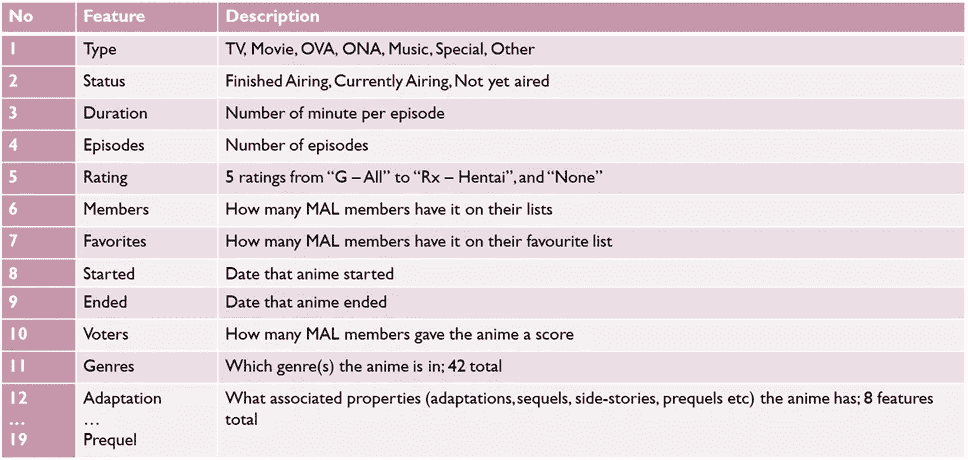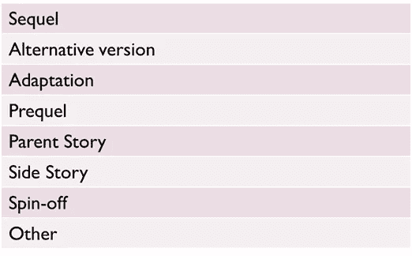

关联属性的类型

被删除但没有使用的功能包括制作方、许可方和工作室，以及日本的播出时间。未被删除的特征包括动画中的角色、配音演员和其他工作人员。所有这些特征都可以包含在对恶意代码数据的任何进一步调查中。

# 三。准备数据

## a)空数据

最终数据集中有几个空数据实例。所以我选择删除下面的内容，剩下 9144 个条目:

*   150 个尚未播出或正在播出的节目。他们没有列出结束日期和/或没有集数
*   7 个已经结束播放但没有开始日期的节目

我还将剩余的空数据处理如下:

*   没有列出集号的电影被认为只有一集，大多数电影都是这样
*   各个相关属性的空条目可以被认为是空列表

## b)整合流派

数据集中有 41 个流派，这可能意味着多达 41 个特征；然而，只有 9 种类型有超过 200 个相关的动画条目:

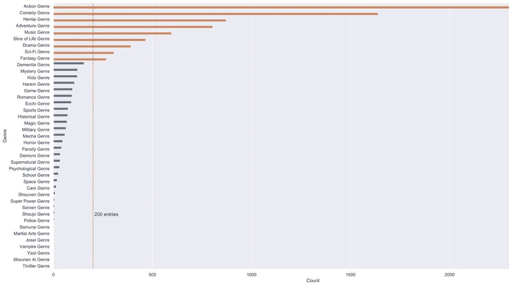

那可是好多流派啊！

因此，我将少于 200 个条目的所有流派合并到“其他”类别中，结果是一个更易于管理的 10 个流派的列表:

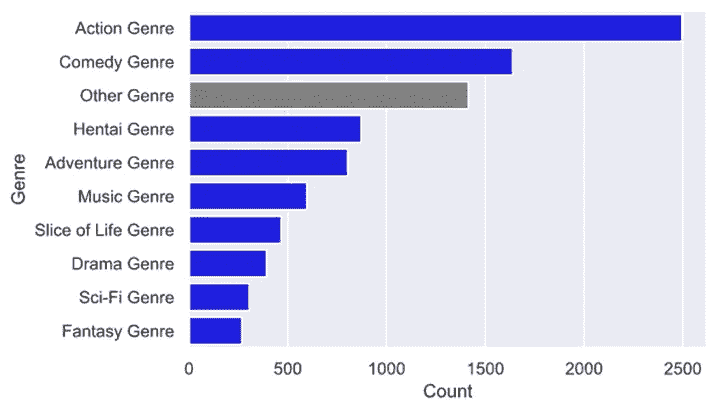

好多了。

## c)流派和类型的虚拟变量

我为 10 个综合类型和 6 个动画类型生成了虚拟变量，其中电视和 OVA 列表占了大多数。

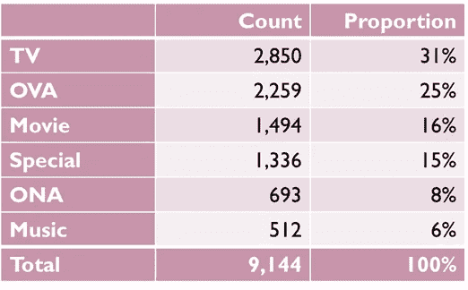

动漫类型及其分类

## d)流派和相关属性的计数

每个动画条目可以被标记为多种类型和相关属性。因此，我生成了以下内容:

*   流派的数量
*   每个关联属性的计数
*   关联属性的总数

## e)额定值的数值

动漫的分级从适合所有年龄的(G)到色情的。因此，我决定给每个等级分配一个等级，用 0 表示最适合家庭，用 5 表示最不适合家庭。

一小部分动漫没有评级；对于这些，我假设它们的评级为 PG13，这是最常见的评级(占训练数据集的 44%)。

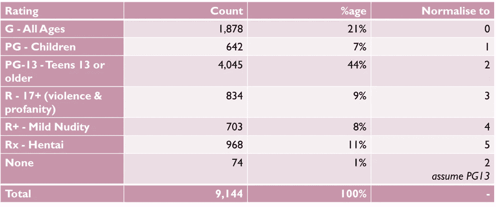

动漫分级及其分类

## f)剪辑情节和持续时间

我发现剧集(一些剧集播放时间很长)和时长(一些电影播放时间接近 3 小时)都存在极端异常值，如下图所示:

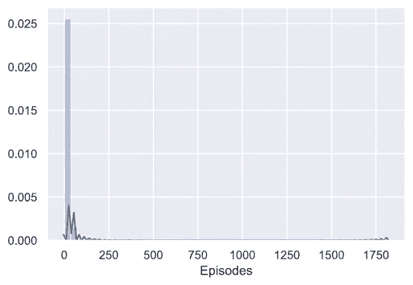

1750 集！？！？

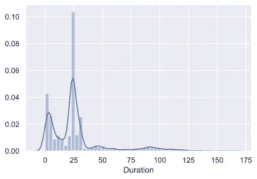

请注意< 5 分钟左右(对应于非常短的动画)和～25 分钟左右(对应于典型电视或 OVA 剧集的长度)的峰值

因此，我选择将剧集剪辑为 60 集(略多于一年的动画)，时长为 150 集(典型电影长度的上限)，如下所示。

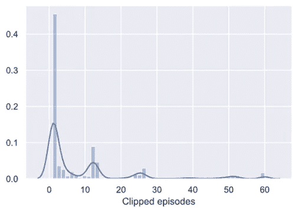

请注意 1 集(对应于电影和其他单镜头)以及 13、26 和 52 集(对应于电视动画的第 1、2 和 4 季)的峰值

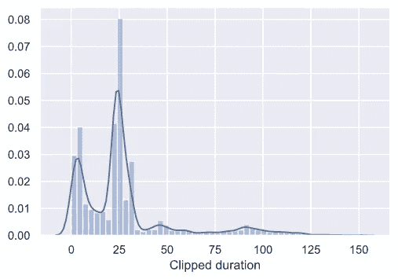

在第 90 分钟左右略有起伏

## g)动画的开始年份和年代

从动画条目的开始字段中，我提取了动画开始的年份，并按年份计算了动画的年龄。

## h)其他转换

我对以下特征应用了 log10 变换，这些特征显示出更符合泊松分布:

*   剪辑的剧集和剪辑的时长
*   成员和收藏夹(对此我也应用了额外的 log10 转换)
*   动漫时代
*   Gerne 和相关计数

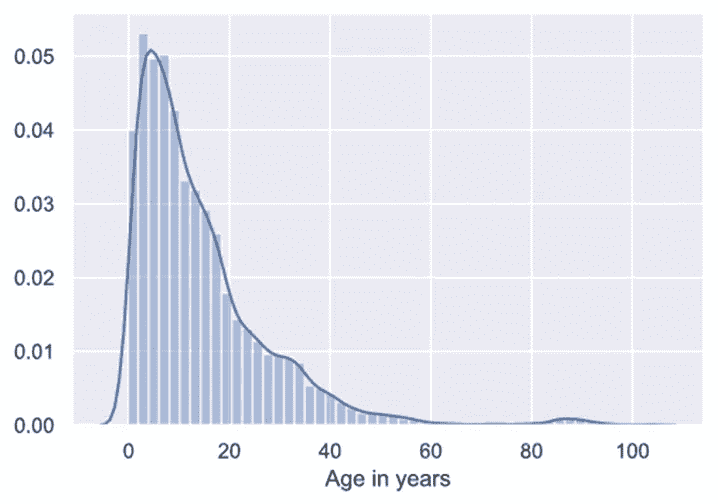

需要 log10 转换的功能示例

我还应用了以下转换:

*   开始年份的平方根
*   按日志成员划分日志收藏夹(以获得收藏夹与成员的比率)
*   将剪辑的剧集与剪辑的时长相乘以获得剪辑的长度；将测井次数乘以测井持续时间，得到测井长度
*   类型和相关属性的倍增虚拟变量与日志长度

# 四。选择最终特征

总共考虑了 86 个特征；其中包括成员和收藏夹以及以下 84 个转换后的功能。

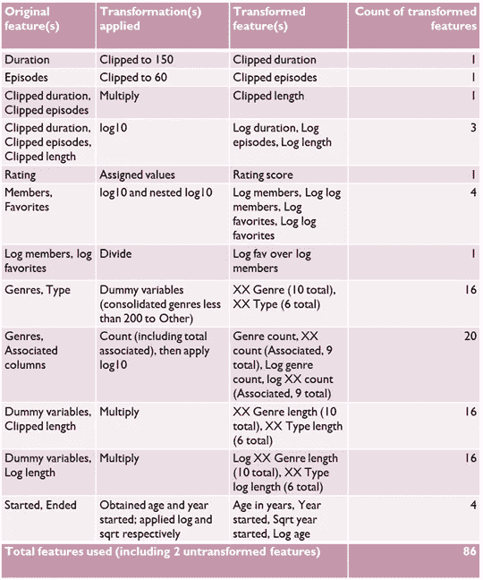

转换后的要素列表

为了减少功能的数量，我使用了以下代码:

*   statsmodel 的 **OLS** ，使用参数的 **t-scores** 确定其显著性(选择的分界点为 5%显著性)
*   scikit-learn 的**套索**，查看哪些参数在**λ= 0.01**处被丢弃(选择的截止点为 0.01)
*   scikit-learn 的 LinearRegression，查看 **R、均方误差、平均绝对误差和最大误差**
*   直觉和领域知识

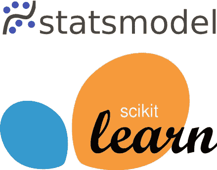

用于选择要素的工具

这给我留下了如下 11 个特征。

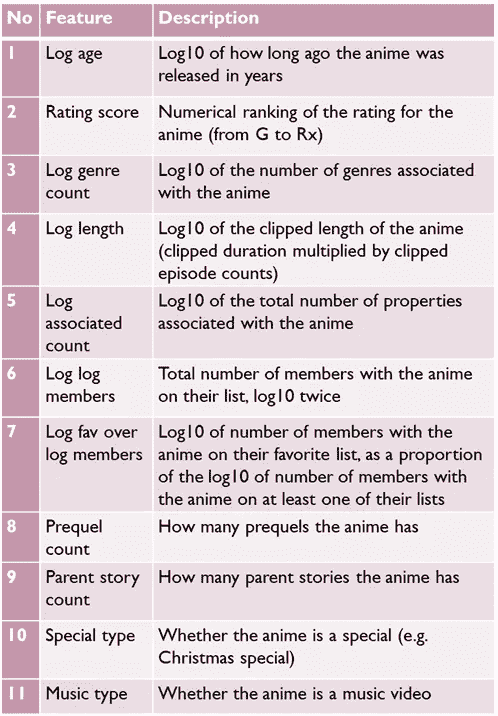

# 动词 （verb 的缩写）拟合和选择模型

出于这个项目的目的，我考虑了 scikit-learn 的以下线性回归模型:

*   线性回归
*   山脉
*   套索

这三个模型在训练数据集上用 5 重交叉验证来训练。结果非常相似，如下表所示:

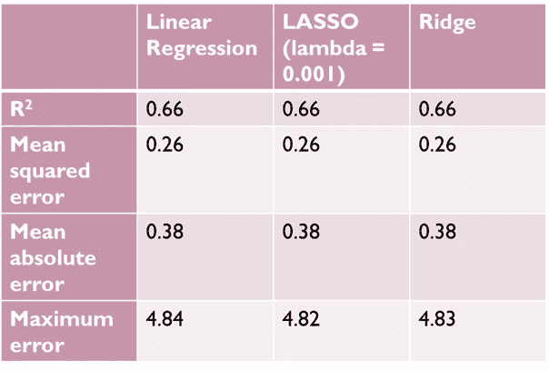

我选择了 LASSO 模型，因为它比其他两个模型稍微好一点(特别是在最大误差方面)，但这两个模型都可以工作得很好。以下是 LASSO 训练结果的图示:

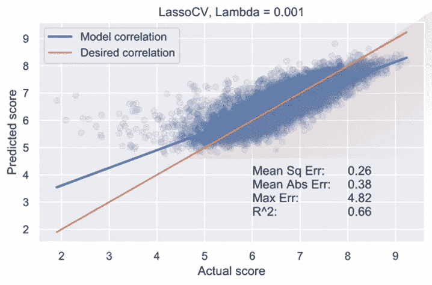

# 不及物动词观察

将最终模型应用于测试集给出了以下结果:

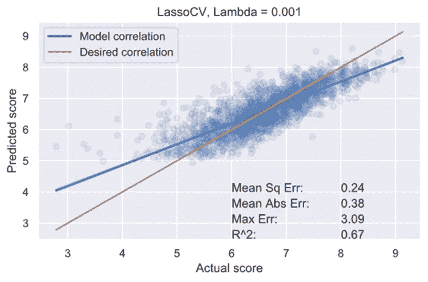

这比在训练/验证集上的性能稍好。最终的模型看起来也足够强大，足以表明一部动画是否会获得高分或中等分。

检查如下表所示的调整后的参数权重，我发现如下:

*   最喜欢的成员的比例是用户生成的动画分数的最重要的预测因素。这是有意义的，因为用户将一部动画放在喜爱的列表中很可能给该动画一个高分。
*   父母故事和前传数量也是重要的预测因素。这可以归功于一部属于已知特许经营的动漫，从而成为其粉丝中的已知数量。

> 这也表明了依赖用户生成分数的风险；我们已经看到，在整个数据集中，较高的分数比较低的分数更普遍，所以粉丝喜爱的人可能倾向于获得较高的分数，而不管观众的规模如何。

*   动漫长度也是用户生成分数的一个重要预测指标，这是有意义的，因为长期播放的电视剧通常是如此，这是因为受欢迎的需求和随后的经济回报。

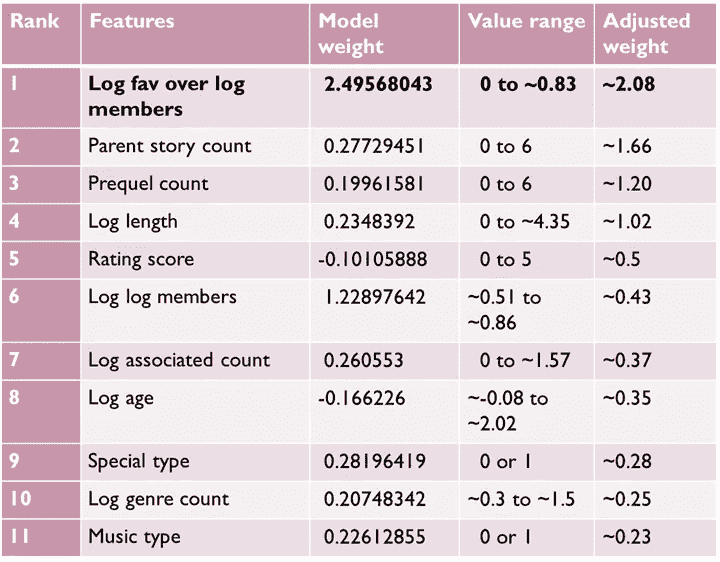

调整后的重量=模型重量的绝对值除以数值范围

但是，我注意到以下限制:

*   模型有一个**负偏斜**；分数> 8 偏向较低分数，分数< 5 偏向较高分数
*   该模型有一个**相对较高的传播**，尤其是分数< 5。所以精确的分数预测有点超出了它的范围
*   不同动漫类型的**剧集和时长分布差异很大**。比如电影多为一集，时长在 1 到 3 小时之间；电视连续剧往往至少有 13 集，每集 24 分钟。

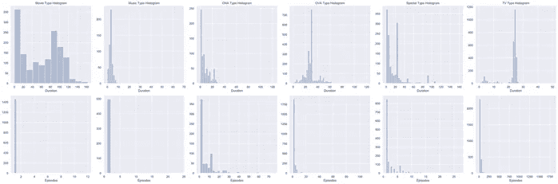

顶行表示持续时间，底行表示发作次数。请注意不同动漫类型之间的分布差异有多大。

# 七。进一步的工作和学习要点

显然，需要一个更复杂的模型来准确预测恶意动漫作品的用户生成分数。可能的方法包括:

*   对每个动画类型(无论是电视还是电影)分别应用线性回归或其他模型。决策树算法在这里可能会创造奇迹。
*   纳入当前分析中遗漏的特征，如制片人、工作室和工作人员。
*   整合其他动漫网站的数据，如 AniDB 和动漫新闻网。
*   应用更复杂的模型，如神经网络。

我学到了很多关于典型数据分析的工作流程，我很高兴看到如何将我学到的知识应用到下一个项目中。