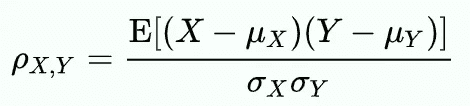
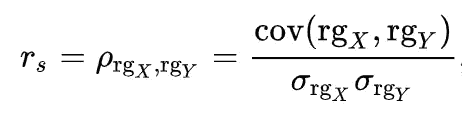
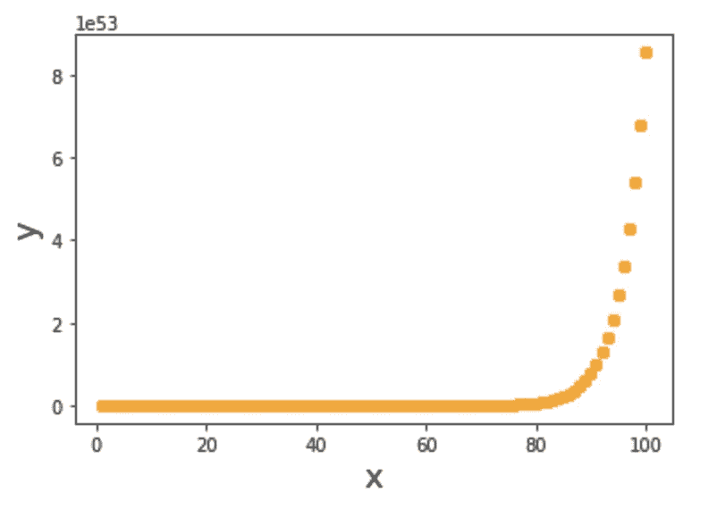
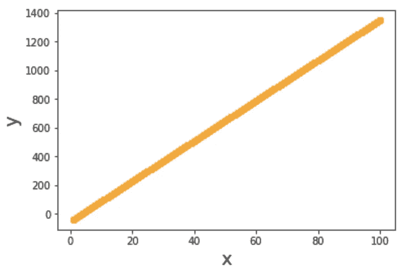

# 围绕相关性的神话与现实

> 原文：<https://towardsdatascience.com/myths-and-reality-around-correlation-9b359456d8e1?source=collection_archive---------45----------------------->

## 正确理解相关性概念的终极指南


图片[霍尔格链接](https://unsplash.com/@photoholgic)通过上 [Unsplash](https://images.unsplash.com/photo-1531956656798-56686eeef3d4?ixlib=rb-1.2.1&ixid=eyJhcHBfaWQiOjEyMDd9&auto=format&fit=crop&w=1378&q=80)

[相关性](https://en.wikipedia.org/wiki/Correlation_and_dependence)是两个[随机变量](https://en.wikipedia.org/wiki/Random_variable)之间的统计关系。这是两个变量相关的程度。

正相关意味着两个变量同向变动，一个变量上升也会导致另一个变量上升，同样，一个变量下降也会导致另一个变量下降。类似地，当负相关时，变量向相反方向移动。相关性的概念广泛应用于数据科学和其他领域。找到变量之间的相关性是任何探索性数据分析的最基本和最重要的部分。

在[金融](https://en.wikipedia.org/wiki/Finance)部门，相关性用于检查股票相对于市场和其他股票的运动(上涨和下跌)。在[零售](https://en.wikipedia.org/wiki/Retail)部门，相关性可用于查看一件商品的销售如何与其他商品的销售相关联，等等。

检查变量之间的相关性并丢弃高度相关的特征使得模型简单、直观和透明。这有助于消除[多重共线性](https://en.wikipedia.org/wiki/Multicollinearity)。

说够了，言归正传，这个博客是关于什么的。这个博客是这个概念的实践指南。这篇博客也是关于相关性可以揭示什么，以及如何在不落入陷阱的情况下得到正确的结果。让我们从概念上开始深入探讨。

# 计算相关性

相关性解释了两个变量之间的依赖程度，即这两个变量是如何相关的。可以计算各种相关系数。一些著名的相关系数是[皮尔逊相关系数](https://en.wikipedia.org/wiki/Pearson_correlation_coefficient)和[斯皮尔曼等级相关系数](https://en.wikipedia.org/wiki/Spearman%27s_rank_correlation_coefficient)。

## 1.皮尔逊相关系数

皮尔逊相关系数计算如下:



图片来源~ [维基百科](https://wikimedia.org/api/rest_v1/media/math/render/svg/43219265dc2c827cb4f5b34f2e3fb797bed2e820)

其中ρ是随机变量“X”和“Y”之间的相关系数。

μ是变量的平均值，σ是变量的标准差。

E[]是期望值。

## 2.斯皮尔曼等级相关系数

斯皮尔曼相关系数计算如下:



图片来源[维基百科](https://wikimedia.org/api/rest_v1/media/math/render/svg/c06f5a0bc5c4b924334eeac566fe1a59f9578ff8)

其中 X 和 Y 被转换成等级(rg)。剩下的公式与皮尔逊相关系数相同。Spearman 系数情况下的等级排序重新映射了 X 和 Y 的值，使其不同于 Pearson 系数。

> 关于 Spearman 等级相关系数最好的事情是，人们可以创建他们自己的等级排序函数，根据问题或用例来调整相关系数。

# 围绕相关性的神话与现实

## 1.相关性解释了依赖的程度

***神话是相关性只能捕捉变量之间的线性关系。事实上，皮尔逊系数捕捉到了线性关系，但其他系数，如斯皮尔逊等级系数，也适用于许多(如果不是全部)非线性关系。***

让我们看一个例子

```
y = (4x — 30)²¹
```

数据生成，

```
y = []
from random import randint
x = [randint(1, 100) for i in range(1000)]
for elem in x:
    y.append(math.pow((elem * 4 -30),21))
```



x 和 y 之间的非线性关系

计算相关系数，

```
Perason Coefficient Value 0.48
Spearman's Coefficient value 1.0
```

皮尔逊系数不能捕捉非线性关系，但斯皮尔曼的等级系数可以。

## 2.一个接近+1 或-1 的相关性，我们能推断出更多什么？

皮尔逊相关系数的值介于+1 和 1 之间，其中+1 表示完全正线性相关，0 表示没有线性相关，1 表示完全负线性相关。[[来源[维基百科](https://en.wikipedia.org/wiki/Pearson_correlation_coefficient) ]]

假设您在数据集中观察到两个或多个变量的皮尔逊相关系数几乎为 1 或-1。这是什么意思？

> 一个人需要非常清醒，不要落入“*”的陷阱，“相关性意味着因果关系*”。事实上，[关联并不意味着因果关系](https://en.wikipedia.org/wiki/Correlation_does_not_imply_causation)。但是，在这种情况下，我说的是相关系数几乎为 1 或-1 的特殊情况。而且显然有原因/关系。

有一篇关于[为什么相关性并不意味着因果关系](/why-correlation-does-not-imply-causation-5b99790df07e)的文章。可以参考了解更多的话题。

[](/why-correlation-does-not-imply-causation-5b99790df07e) [## 为什么相关性并不意味着因果关系？

### 相关性和因果关系是最容易被误解的术语，并且经常互换使用。了解这两者…

towardsdatascience.com](/why-correlation-does-not-imply-causation-5b99790df07e) 

这意味着两个变量很有可能是从另一个变量派生出来的。神话是，即使在+1/-1 皮尔逊相关系数的情况下，找到公式/关系可能是困难的，因为我们不知道它会有多复杂。相反，事实是，无论线性关系有多复杂，它总是可以简化为 y = Wx + b 的形式，并且我们可以使用线性回归或线性方程求解器以高度的正确性来近似它。

让我们看一个例子，

```
y = (x * 7 - 30)/4 * 8 + 7
```

y 是用一些复杂的公式从 x 推导出来的。但是，我们总是可以把它简化成 y = Wx + b 的形式

在这种情况下，

```
y = 14x - 53
```

让我们首先检查相关系数值的值

```
y = []
from random import randint
x = [randint(1, 100) for i in range(1000)]
for elem in x:
    y.append(((elem * 7 - 30)/4) * 8 + 7)
```

将数据可视化，



x 和 y 之间的线性关系

计算相关系数

```
import scipy.stats
pearsonr(x,y),spearmanr(x,y)
```

结果:

```
Perason Coefficient Value 1.0
Spearman's Coefficient value 1.0
```

两者，相关系数导致 1

接下来，让我们运行一个回归，并验证假设，如果皮尔逊相关性接近+1 或-1，我们总是可以反向工程找到公式/关系。

```
reg = LinearRegression().fit(x,y)
print("Intercept: {} Coefficient: {}".format(reg.intercept_,reg.coef_))
y_pred = reg.predict(x)
```

导致，

```
Intercept: -53.00 Coefficient: [14.]
```

这才是真正的关系。

## 3.如何得到正确的相关系数？

***神话是相关系数表示依赖程度。事实上，相关系数只有在计算方法正确的情况下才表示依赖程度。***

两只股票在一段时间内有很高的正相关性并不一定意味着它们以相似的模式向同一个方向移动。当分析这两只股票在多个时期的市场下跌和上涨，然后找到相关系数，将给出正确的图片。

同样，两个显示相似或相反销售模式的项目可能只是由于促销或特定季节。在收集多个时间段的销售数据，然后计算相关系数之后，可以确定正确的关系。

# 结论

有很多关于相关性的文章。我试图提出一个不同的观点，揭示这个主题周围较少探索和隐藏的领域。这篇博客也是关于相关性可以揭示什么，以及如何在不落入陷阱的情况下得到正确的结果。希望你喜欢。

***我的 Youtube 频道获取更多内容:***

[](https://www.youtube.com/channel/UCg0PxC9ThQrbD9nM_FU1vWA) [## 阿布舍克·蒙戈利

### 嗨，伙计们，欢迎来到频道。该频道旨在涵盖各种主题，从机器学习，数据科学…

www.youtube.com](https://www.youtube.com/channel/UCg0PxC9ThQrbD9nM_FU1vWA) 

> ***关于作者-:***
> 
> Abhishek Mungoli 是一位经验丰富的数据科学家，拥有 ML 领域的经验和计算机科学背景，跨越多个领域并具有解决问题的思维方式。擅长各种机器学习和零售业特有的优化问题。热衷于大规模实现机器学习模型，并通过博客、讲座、聚会和论文等方式分享知识。
> 
> 我的动机总是把最困难的事情简化成最简单的版本。我喜欢解决问题、数据科学、产品开发和扩展解决方案。我喜欢在闲暇时间探索新的地方和健身。在 [**中**](https://medium.com/@mungoliabhishek81) 、**[**Linkedin**](https://www.linkedin.com/in/abhishek-mungoli-39048355/)**或**[**insta gram**](https://www.instagram.com/simplyspartanx/)**关注我，查看我[以前的帖子](https://medium.com/@mungoliabhishek81)。我欢迎反馈和建设性的批评。我的一些博客-********

*   ******[每个数据科学家都应该避免的 5 个错误](/5-mistakes-every-data-scientist-should-avoid-bcc8142d7693)******
*   ******[分析 Fitbit 数据，揭开疫情封锁期间身体模式变化的神秘面纱](/analyzing-fitbit-data-to-demystify-bodily-pattern-changes-amid-pandemic-lockdown-5b0188fec0f0)******
*   ******[以简单&直观的方式分解时间序列](/decomposing-a-time-series-in-a-simple-and-intuitive-way-19d3213c420b?source=---------7------------------)******
*   ******[GPU 计算如何在工作中拯救了我？](https://medium.com/walmartlabs/how-gpu-computing-literally-saved-me-at-work-fc1dc70f48b6)******
*   ******信息论& KL 分歧[第一部分](/part-i-a-new-tool-to-your-toolkit-kl-divergence-5b887b5b420e)和[第二部分](/part-2-a-new-tool-to-your-toolkit-kl-divergence-736c134baa3d)******
*   ******[使用 Apache Spark 处理维基百科，创建热点数据集](/process-wikipedia-using-apache-spark-to-create-spicy-hot-datasets-1a59720e6e25)******
*   ******[一种基于半监督嵌入的模糊聚类](/a-semi-supervised-embedding-based-fuzzy-clustering-b2023c0fde7c)******
*   ******[比较哪种机器学习模型表现更好](/compare-which-machine-learning-model-performs-better-4912b2ed597d)******
*   ******[确定您的数据分布](/identify-your-datas-distribution-d76062fc0802)******