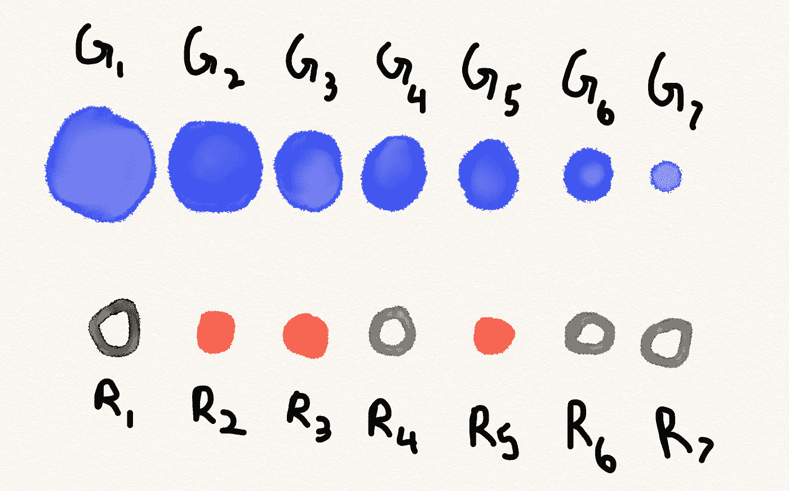
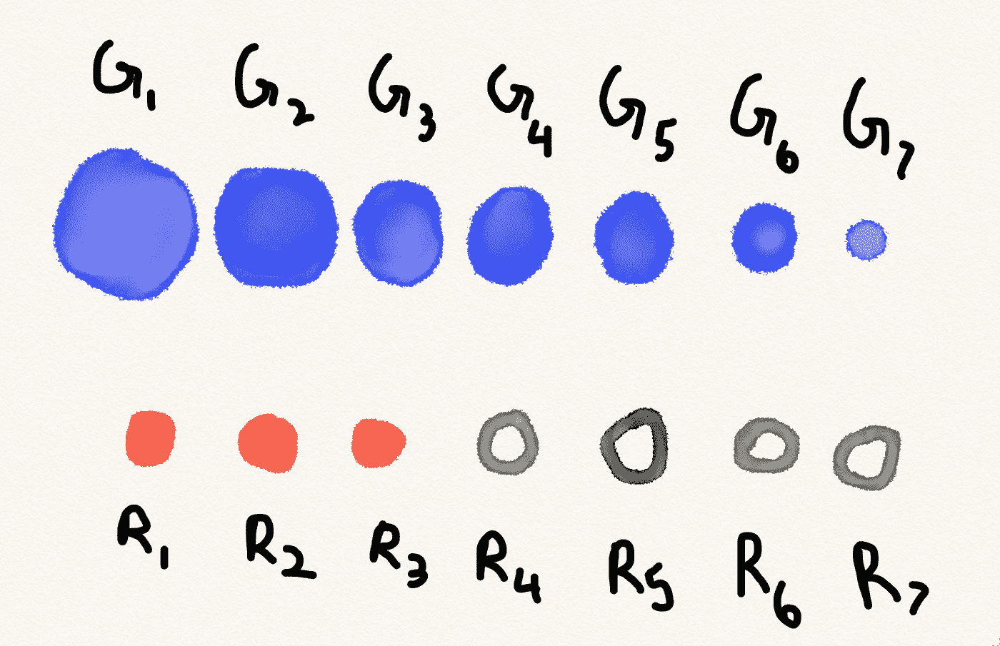
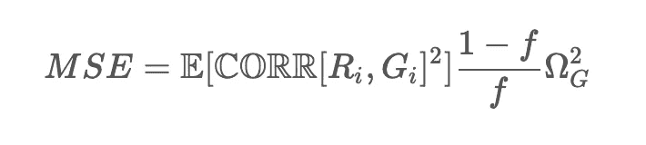
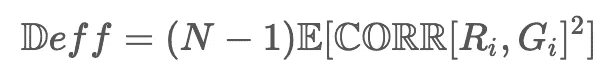

# n 是敌人

> 原文：<https://towardsdatascience.com/n-is-the-enemy-c72cc1ba683b?source=collection_archive---------38----------------------->

## 大量人口+大数据=严重失败

Joshua Coleman 在 [Unsplash](https://unsplash.com/?utm_source=unsplash&utm_medium=referral&utm_content=creditCopyText) 上拍摄的照片

我们被卖给了一个虚假的承诺。

在某种程度上，我们欺骗自己，认为真理是数量的副作用。“如果我们收集了足够的数据，”我们说，“我们压倒性的统计能力将会在未知中炸出一个洞。”

相反，我们搬起石头砸了自己的脚。

在他的文章[统计天堂&大数据中的悖论](https://statistics.fas.harvard.edu/files/statistics-2/files/statistical_paradises_and_paradoxes.pdf)中，哈佛统计学家(在我看来，他是公认的天才)[肖-李梦](https://statistics.fas.harvard.edu/people/xiao-li-meng)提供了一个严格的证据，证明当我们收集数据时，不管数据是如何收集的*我们有多糟糕。*

他利用了优雅而又深奥的数学——所以为了让大家理解他的观点，我将求助于现代技术作家的惯用手段:Javascript 模拟。

Javascript 模拟在大多数方面都过于简化，但是*正好*正确到足以给我们上几课。

首先，一些背景。

# 数据缺陷指数

统计学的一个基本承诺是:**给定一个有限的样本，我们可以对更多的人群进行概括。**

这是一个超级大国。这就是为什么科学可以作为一系列小的受控实验而不是一个完整的宇宙普查出现。这使得了解世界成为一项可行的任务。

但不是所有的样本都是一样的。不同的样本由不同的*抽样机制创建:*例如，随机电话拨号器、在线调查等。不管抽样机制在实践中采取什么形式，我们都可以抽象地把它们看作是总体上的二元掩码。

让我们把这个掩码 ***R*** 和人口数据它的掩码 ***G*** 。掩码值 ***R*** ᵢ —一个 0 或 1 开关—决定值**是否包含在我们的样本中。**

****

****一个抽样机构 R.** 红色的 ***R*** ᵢ元素选择大小为 ***G*** ᵢ的项目作为我们的样本。我们的样本量是 3。**

**在理想情况下，采样机制是完全随机的， ***R*** ᵢ和***g***ᵢ(**corr[*r***ᵢ，***g***ᵢ**)之间的相关性为 0。但是通常情况下，取样机制在某些方面有轻微的缺陷。****

****举一个荒谬而极端的例子，想象一个旨在评估客户群体对调查的热情的调查。如果我们的抽样机制(***【r】***)是一封电子邮件，要求参与者选择加入，并让我们衡量他们选择加入的热情(***【g】***)，我们可以猜测 **CORR[ *R*** ᵢ，***g***ᵢ**将非常接近 1。******

************

********有缺陷的采样机制 R.** 由于 **G** 是按大小排序的，我们只挑选第一个项目的 **R** 会导致高**corr[*r*t55】ᵢ、**t57】gt59】ᵢ**，因为我们只选择最大的项目。************

******那个 **CORR[ *R*** ᵢ、***g***ᵢ**的值——或者更准确地说，𝔼**【corr[*r***ᵢ、***g***ᵢ**]**，虽然不是这个小数字是大数据统计工作中的扳手。正如我们将很快看到的，它对我们是否可以依赖大型数据集的洞察力有着巨大的影响。********

# ********弹跳球********

********让我们用一个玩具例子来研究一下 **d.d.i** 的影响。********

********假设我们把 N 个球丢进一个空间。有些比其他的大，但是它们都有相同的能量。所以大的跳得很慢，而小的像兴奋的刺猬一样到处跑。球的大小来自正态分布。********

********假设你是一个球科学家(球学家？)并且你想估计这个小宇宙中球的平均半径。你的计划是对 n 个球进行抽样，收集样本平均值，并将其用作总体平均值的估计值。********

********但是有一个问题:不管出于什么人为的原因，你只能在球飞到指定的红色突出显示的**取样区**时进行取样。********

********你可以在下面的采样区玩玩。********

********拖移滑块以调整采样区域的大小。取样球被涂成红色。**n**= 10； **N** = 75。********

********你注意到了什么？********

********随着您滑动采样区域使其越来越包含空间，真实平均半径和采样半径之间的误差会减小。如果你向左滑动，使采样区域占空间的一小部分，误差就会上升。********

********原因很简单:球越小，它跑得越快。如果采样区域很小，很可能只有最快的球会从它们的起始位置到达那里。另一方面，如果采样区域很大，我们就更有可能公平地采样。********

********这使得取样区的宽度可以方便地模拟 **d.d.i** 。宽度越低， **d.d.i** 越高！********

> ********高 d.i .提高了估计误差。********

********我们从这个实验中得到了一个相当明显的发现:高的 **d.d.i** 会提高估计误差。********

# ********采样频率********

********让我们扩展一下，考察人口规模和样本规模对我们估计误差的影响。********

**********n = 10；N=750**********

********当我们将我们的人口规模放大 10 倍时，我们的误差对于每一个设定的**d . d . I .**都是一致的 T18 恶化 T19。这应该是意料之中的。球的数量越多，就有越多微小快速的球比其他球更快地被采样，缩小了半径的平均测量值。********

********当我们相应地增加样本量来帮助估计时会发生什么？********

**********n = 100；N=750**********

********就错误率而言，n 增加 10 倍只会让我们回到起点。********

> ********当你有一个有缺陷的采样机制时，重要的是*采样* *频率*，而不是样本大小。********

********这里有一个重要的教训。当你有一个非零的 d . d . I .时，你的样本的绝对大小正好等于 jack。当你有一个有缺陷的采样机制时，重要的是*采样* *频率* ( ***f =* n/N** )，而不是样本大小。********

********如果你想用高得离谱的采样频率来掩盖有缺陷的采样机制，你还不如做一次人口普查。********

**********n**= 500；**N**= 750； **f=** 2/3。********

# ********科学家的杠杆********

********在这一点上，你很有希望确信 **d.d.i** 可以破坏估计，并且它唯一的缓解因素是放大的采样频率， ***f*** 。********

********肖-李梦博士的证明揭示了基于抽样机制的估计的均方误差的精确表达式:********

****************

********其中𝛀是 ***G*** 分布中的方差，𝔼**【corr[*r***ᵢ，***g***ᵢ**]**是 **d.d.i** 的精确公式， ***f*** 是采样频率。********

********我们真的对𝛀无能为力，所以我们真正能利用的**和**杠杆是:********

*   ********通过良好的随机抽样机制减少 d.d.i。********
*   ********提高采样频率。********

********这与我们之前的实验结果非常吻合。********

# ********n 是敌人********

********一个阴险的发现落在上面的表达式。********

********如果我们尝试比较基于简单随机抽样的估计和依赖于抽样机制的估计，我们会得到一个叫做 [**设计效果**](https://en.wikipedia.org/wiki/Design_effect)**(***Deff***)的度量。 ***Deff*** 本质上是告诉我们，相对于黄金标准，我们的特定采样机制会出错多少。**********

********原来，通过一些巧妙的数学运算，这个 ***Deff*** 可以用 **CORR[ *R*** ᵢ、***g***ᵢ**和我们的人口规模 **N:** 来表示**********

****************

********呀。********

> ********为了保持 ***Deff*** 不变， ***R*** ᵢ 和 ***G*** ᵢ之间的相关性需要缩小 **N.** 的平方根的一个因子********

********这是肖的笑点。为了保持 ***Deff*** 不变， ***R*** ᵢ 和 *G* ᵢ之间的相关性需要随着 **N** 的增长而缩小 **N** 的平方根的因子。换句话说， **CORR[ *R*** ᵢ，***g***ᵢ**必须是[**o(√n**⁻**)**](https://en.wikipedia.org/wiki/Big_O_notation)，否则采样机构 **R** 将会产生大范围的 **N** 垃圾火结果。**********

********为了保持 **Deff** 不变，所选取样机构 **R** 的 **CORR[ *R*** ᵢ、***g***ᵢ**】**必须作为 **N** 的因子快速下降。********

********仅有的表现如此的采样机制是随机的。也就是说，对于高 **N，**随机采样不仅仅是一个好主意:这是一个*要求。*********

********未能理解这一点导致我们疯狂地[错误预测了 2016 年总统大选](https://www.pewresearch.org/fact-tank/2016/11/09/why-2016-election-polls-missed-their-mark/)。我们不认为一点点反应偏差会影响我们的结果，尽管仅仅一点点就足以彻底摧毁我们。几乎不可避免地如此。********

********现在更相关的是:这就是为什么我们试图理解新冠肺炎的致命性是如此的漫无目的。********

********N 是我们的敌人，如果我们的抽样机制有缺陷，那么面对它，高样本量也无济于事。********

********它只会增加我们对几乎肯定是错误的结果的信心。********