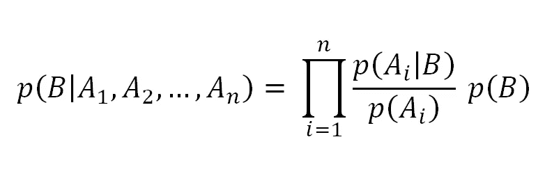
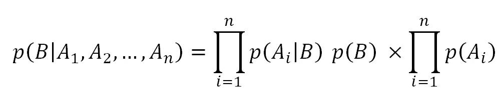
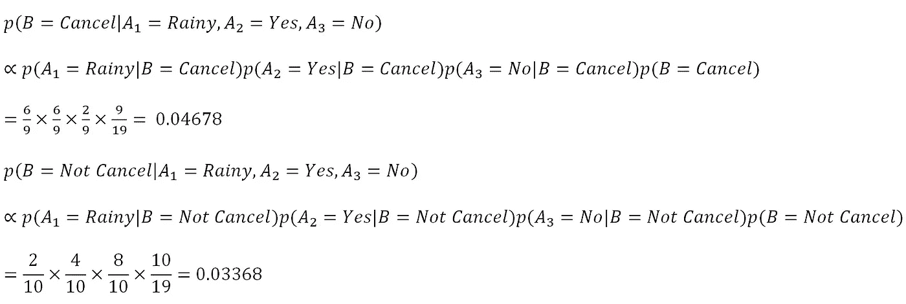

# 朴素贝叶斯:一个简单而方便的离散分类器

> 原文：<https://towardsdatascience.com/naive-bayes-a-simple-but-handy-discrete-classifier-731fe133d8a8?source=collection_archive---------30----------------------->

## 而且终究不是幼稚！

几个月前，我发表了一篇介绍贝叶斯定理的文章。今天我将介绍贝叶斯定理在分类上的一个实际应用，朴素贝叶斯分类器。

(这是我关于贝叶斯定理的文章的链接。在阅读这篇文章之前，最好先理解它，否则你不会明白发生了什么。)

 [## 贝叶斯定理如何应用于测试一种疾病(如冠状病毒)？

### 这是有用的，尤其是在这个冠状病毒疫情

towardsdatascience.com](/how-bayes-theorem-applies-to-test-a-disease-like-coronavirus-e63c38b3dbbe) 

朴素贝叶斯分类器，它的名字已经告诉了你一切:利用贝叶斯定理在朴素假设下进行分类，也就是说特征与他人无关。

为了介绍朴素贝叶斯分类器是如何工作的，这里有一个例子(PS:一个例子总是好的，或者至少没有什么不好)

明天你将和你的朋友见面进行一场足球比赛。今天天气不好，现在你担心比赛会不会因为天气而取消。天气预报显示明天将刮风下雨。幸运的是明天不会有雷雨。问题是这场足球赛会不会取消？

维吉尔·卡亚萨在 [Unsplash](https://unsplash.com/s/photos/football-match?utm_source=unsplash&utm_medium=referral&utm_content=creditCopyText) 上的照片

现在你回想一下天气是如何影响你之前的足球比赛的，于是你拿出了你的日记。？)并查看之前所有足球比赛的天气情况。你拿出下面的记录:

例如，当天气晴朗时，6 场比赛中有 5 场没有取消。当天气刮风时，10 场比赛中有 6 场被取消(有点悲哀)。现在是时候推出朴素贝叶斯分类器了。

朴素贝叶斯分类器的概念是在训练集的帮助下，根据观察到的属性值计算所有可能类的可能性。新实例的类将是可能性最高的类。用一个更通俗的术语来说，我们选择在观察条件下最有可能发生的一个。

那和贝叶定理有什么关系呢？

在独立性假设下，涉及多个事件的 Baye 定理的一般公式如下

b 是我们想知道的事件，Aᵢ是第 I 个观察到的事件。在朴素贝叶斯分类器中，B 是将基于那些观察到的事件分配的类。如果我们安排配方，

第二部分计算所有观察到的事件在没有任何前提条件下发生的概率，这与所选择的类别无关。因此，公式的第一部分是一个似然函数(如果你不知道什么是似然函数，这里是 [wiki 链接](https://en.wikipedia.org/wiki/Likelihood_function))来确定应该分配哪个类。

回到你的足球比赛，现在你可以根据明天的天气预报和历史结果来计算“取消”和“不取消”的可能性。

表示 A₁是展望，A₂有风，A₃是雷雨。因此，

由于“取消”的可能性高于“不取消”，结果将是“取消”(太可悲)。

在这个例子中，观察到的事件都是离散的。在连续事件的情况下，分布通常被假设为正态分布，因此，如果每个类别下的平均值和标准偏差都是已知的，则可以使用通常的正态分布方法来计算概率。

上面的例子已经显示了朴素贝叶斯分类器的一个主要问题。假设所有观察到的事件都是独立的通常是不真实的。雷雨经常伴随着大雨和大风。

另一个问题被称为“零频率问题”，这意味着有一个新的观察结果，以前从未发生过。例如，在过去，没有龙卷风袭击你的邻居。突然明天就会有一个。那么你就不能计算任何类别下的概率。这个问题可以通过加法平滑(又名拉普拉斯估计器)来解决。

由于朴素贝叶斯分类器的简单性，它可以在没有大量计算的情况下提供快速预测。因此，它用于一些实时预测。它还可以用于多类预测，而不需要额外的努力。

朴素贝叶斯分类器的介绍到此结束。我希望您喜欢这篇文章，并了解更多关于离散分类的知识。下次见。

# 我的其他文章

[现在学习如何掌握 Python 中的 groupby 函数](/learn-how-to-master-groupby-function-in-python-now-4620dd463224)

[如果你是 Python 新手(尤其是自学 Python 的话)，请将此加入书签](/bookmark-this-if-you-are-new-to-python-especially-if-you-self-learn-python-54c6e7b5dad8)

[(第 2 部分)如果您是 Python 新手(尤其是自学 Python 的话)，请将此加入书签](/bookmark-this-if-you-are-new-to-python-especially-if-you-self-learn-python-part-2-ab3ba54e2f45)