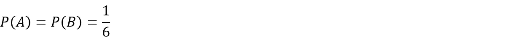
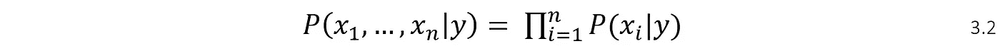

# 朴素贝叶斯分类器:贝叶斯推理，中心极限定理，Python/C++实现

> 原文：<https://towardsdatascience.com/naive-bayes-classifier-bayes-inference-central-limit-theorem-python-c-implementation-bdffb3b35de?source=collection_archive---------18----------------------->

## 理解朴素贝叶斯分类器的数学基础

# 目录

*   **简介**
*   **1。条件概率**
*   定义
*   直觉
*   快速示例
*   链式法则

*   **2。独立性**
*   定义
*   直觉
*   快速示例

*   **3。条件独立性**
*   定义
*   证明
*   快速示例

*   **4。贝叶斯定理和朴素贝叶斯分类器**
*   定义
*   证明

*   **5。中心极限定理和正态分布**
*   **6。理论的实现**
*   **7。结论**
*   **8。资源和参考资料**

# 介绍

在下面的文章中，将讨论贝叶斯理论的细节和相应的数学证明，然后使用编程语言 Python 和 C++在朴素贝叶斯分类器的上下文中实现该理论。这篇文章主要针对那些渴望深入了解贝叶斯推理惊人世界的人。值得注意的是，在介绍贝叶斯定理的概念之前，我们将讨论一些里程碑，对于这些里程碑，最少的概率论知识是先决条件。一旦理解了算法的数学基础，实现就会一路走下坡路。

# 1.条件概率

概率是数学的一个分支，它将*样本空间*的结果的概率度量进行公理化和形式化。*样本空间*是事件的集合，比如掷骰子得到 5。

## 定义

*条件概率*是在另一事件 **B** 已经发生的情况下，对事件 **A** 的概率度量。简单地说，如果两个事件相互关联，拥有其中任何一个事件的信息都会影响另一个事件的概率度量。在下面的*等式 1.1* 中，描述了给定事件 B 的事件 A 的条件概率度量。

## 直觉

**图 1**

*等式 1.1* 可以描述为事件 A 和 B 的交集的面积除以子空间 B 的整个面积。

## 快速示例

成年人中男性和酗酒者的比例为 2.25%。假设是男的，成为酒鬼的概率有多大？

转述一下问题，随机选择的个体，作为男人和酒鬼的概率是 2.25%。如果你已经知道一个人是男的，那么他酗酒的概率是多少？

假设 2 性别平均分布，是男的概率暗示 0.5。通过将所有给定的参数放入*等式 1.1* 中，我们得到 4.5%

基本上，拥有关于个体性别的额外信息会将我们的概率确定性从 2.25%提高到 4.5%。

## 链式法则

链规则是一种概率现象，它帮助我们使用条件概率的乘积来找到集合成员的联合分布。为了推导链式法则，可以使用*等式 1.1* 。首先，让我们计算两个事件 A 和 b 的联合概率。

利用同样的原理，我们也可以找到 3 个事件的联合概率——A，B，c。

通过比较*方程 1.2* 和*方程 1.3* 之间的模式，可以确定计算 N 个事件的联合概率的通用方程。

# 2.独立性ˌ自立性

如果一个事件的发生不影响另一个事件发生的概率，那么这两个事件就是独立的。[2]

## 定义

从*等式 2.1* 可以清楚地看出，拥有关于事件 B 的信息不会影响事件 A 的概率度量- > **P(A|B) = P(A)** 。

## 直觉

如果事件 A 和 B 是独立的，那么拥有关于事件 B 的信息应该会像拥有来自论域 U 的任何信息一样影响事件 A 的概率度量(参见 ***图 1*** )。

## 快速示例

如果掷骰子两次，得到两个 5 的概率是多少？

事件 A —第一次掷骰子获得 5 分
事件 B —第二次掷骰子获得 5 分

因为骰子上有六个不同的数字，所以得到 5 的概率为:

很明显，第一次得到 5(事件 A)并不提供关于事件 B 的任何信息。因此，由于事件 A 和 B 是独立的，因此事件 *A 和 B* 都得到 5 的概率为:

# 3.条件独立性

## 定义

给定 C，事件 A 和 B 是条件独立的当且仅当，给定 C 发生的知识，A 是否发生的知识不提供关于 B 发生的可能性的信息，并且 B 是否发生的知识不提供关于 A 发生的可能性的信息。[3]

基本上，R 和 B 是人 **A** 和 **B** 及时回家吃晚饭的事件，Y 是暴风雪袭击城市的事件。当然，RR 和 BB 的概率将取决于 YY 是否发生。然而，就像假设如果这两个人没有任何关系，他们及时回家的概率是独立的一样，这似乎是合理的

## 证明

等式 3.1 中的模式也可以应用于 N 个条件独立事件:

# 4.贝叶斯定理和朴素贝叶斯分类器

## 定义

贝叶斯定理是一个强大的工具，它使我们能够根据给定的**先验**知识和**证据**来计算**后验**概率。这与对数据进行训练并获得有用的知识以进行进一步预测的原理相同。

*   P(y|x) — **后验** —给定事件 **x** 发生的情况下，事件 **y** 发生的概率。
*   P(x|y) — **可能性** —给定事件 **y** 发生的情况下，事件 **x** 发生的可能性。
*   P(y) — **先验** —在获得某些知识/证据 **x** 之前，关于未知事件发生的概率测度的信念 **y**
*   P(x) — **证据** —作为计算后验概率的证据给出的一条信息

## 证明

对于机器学习分类和预测任务，通常给我们的是特征向量 X = (x1，…，xn)和对应的类别标签 y = (1，…，m)。特征行向量可以被假设为特征的联合概率。因此，等式 4.1 变为:

**现在向量 X 的特征将被假设为独立事件以简化模型复杂性。然后，4.2 将通过挪用方程 3.2 而进一步简化。**

*的确，独立性假设是这种方法被称为“* ***【幼稚*** *”的主要原因。*因为在现实世界的应用中，很有可能特征是相互关联或相互依赖的。尽管有“天真”的假设，模型复杂性的简化有时会产生令人惊讶的有用性能。

*等式 4.3* 将帮助我们通过比较不同类别参数-y 的后验概率的度量来预测给定特征向量 **x** (x1，…xn)的类别。然后，具有对应于该类别的最高值的后验将被选择为未知特征向量 **x** 的类别。

假设方程的分母在不同类别 **y** 的比较过程中保持不变，可以只比较方程的分子部分，这将进一步简化过程。

上面的等式(4.5)足以预测给定特征向量的类别。然而，考虑到概率测度的取值范围在 0 到 1 之间，拥有几个概率测度的乘积会导致算术下溢的问题[5]。幸运的是，这个问题可以很容易地通过取等式 4.5 的对数(基数应该大于 1)来解决。

在等式 4.6 中，需要 2 个参数来预测特征向量的类别标签 **x** 。

1.  P(y) — **先验** —在考虑证据(特征向量)之前，类别标签 **y** 的概率分布是一个先验概率，与其在训练集中的出现频率有关。基本上，对于示例性给定的标签集 **< 0，0，1，1，1 >** ，类**‘0’**的先验是 2/5。

2.P(x₁| y)… P(xₙ| y) —对于分类问题，虽然 y —类标签的值是离散的，但特征向量 **x** 的值通常是连续值，如**表 1** 所示。

**表 1**

因此，我们需要一种特殊的工具，这将有助于我们获得有关某些事件发生的可能性的信息。例如，如果类 1.0 的对应特征值是 1.898，那么如果特征值是 1.897，那么拥有 1.0 的可能性是多少？

# 5.中心极限定理和正态分布

> 中心极限定理指出，如果您有一个均值为μ、标准差为σ的总体，并从替换为的总体**中抽取足够大的随机样本，那么样本均值的分布将近似为正态分布。[7]**

**正态分布:资源与参考文献【6】**

简单地说，在概率论和自然界中，正态分布近似于随机量偏离“真实”(平均)值的模式。举个例子:

下面的直方图描述了泰坦尼克号事故中幸存/死亡乘客的年龄分布。在这里也可以看到上述的正态分布模式。

**图 2**

*通过考虑独立随机变量的一般分布模式，我们将假设对于每个类，特征列的值也是正态分布的。*因此，每个类别的列值的平均值将代表该类别的“真实”特征值。未知的特征向量与某一类别的平均特征值的接近程度将代表它们有多可能相同。为了表示这种相似性的度量，我们将使用高斯概率密度函数(高斯 PDF)。

**图 3**

图 3 显示了两类特征的分布。每个类别都有自己的平均值和标准偏差值，并在图的图例上显示精确值。所以:

*   P( **x** | μ **⁰** ，σ **⁰** ) ≈ 0.125
*   P( **x** | μ ，σ ) ≈ 0.025

因此，x 成为类“0”的可能性大于类“1”。

# 6.理论的实施

考虑到它的广泛使用，将在 Python 编程语言上解释它的实现。然而，相同的代码实现已经在 C++中实现，并添加到参考资料和参考资料部分的项目代码链接中。[9]

由于便于使用，算法将以类结构代码的形式编写。该类将接受两个参数:

*   x-训练特征集
*   y-标签集

下一步是编写“fit”函数，在此过程中，特性列的平均值和标准值被存储到定义的列表中。这个过程也可以称为训练。

一旦计算了类别的相应平均值和标准值，就可以预测未知特征向量的类别。

为了测试算法的性能，我们可以使用“sk learn”python 模块随机生成数据，然后将其拆分为训练和测试数据集。

正如你所看到的，基于“天真”假设的算法非常有效，准确率超过 90%。关于随机生成的数据集特征，准确度的值可以增加/减少。

# 7.结论

我希望这篇文章充分挖掘了朴素贝叶斯分类器的主题。如果你对这篇文章有任何意见/建议，你可以通过我的推特账号联系我。

# 8.资源和参考资料

[1] [维恩图—维基百科](https://www.wikiwand.com/en/Venn_diagram)
【2】[独立性—维基百科](https://www.wikiwand.com/en/Independence_(probability_theory))
【3】[条件独立性—维基百科](https://www.wikiwand.com/en/Conditional_independence)
【4】[数学 StackExchange 问题答案—有人能解释一下条件独立性吗？](https://math.stackexchange.com/a/23100/516078)
【5】[算术下溢—维基百科](https://www.wikiwand.com/en/Arithmetic_underflow)
【6】[正态分布—维基百科](https://www.wikiwand.com/en/Normal_distribution)
【7】[中心极限定理](http://sphweb.bumc.bu.edu/otlt/MPH-Modules/BS/BS704_Probability/BS704_Probability12.html)
【8】[马尔可夫链的起源|信息论之旅|计算机科学|可汗学院](https://youtu.be/Ws63I3F7Moc)
【9】[朴素贝叶斯分类器‘Python/c++’项目代码](https://bitbucket.org/tarlanahad/myneatcodes/src/master/Naive%20Bayes%20Classifier/)