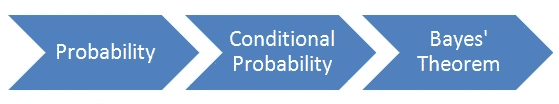
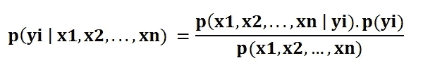
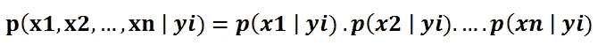
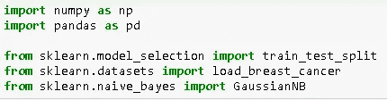
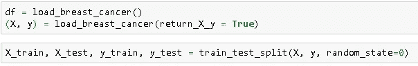
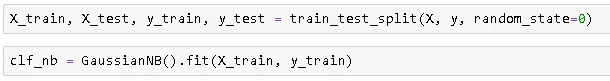
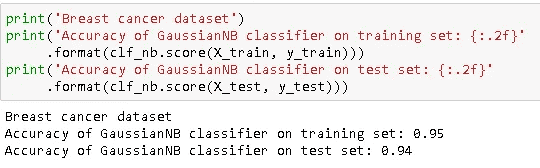

# 朴素贝叶斯分类器-解释

> 原文：<https://towardsdatascience.com/naive-bayes-classifier-explained-50f9723571ed?source=collection_archive---------8----------------------->

## scikit-learn 的理论和实现

朴素贝叶斯是一种用于分类任务的监督学习算法。因此，它也被称为朴素贝叶斯分类器。

与其他监督学习算法一样，朴素贝叶斯使用特征对目标变量进行预测。关键区别在于，朴素贝叶斯假设特征是相互独立的，特征之间没有相关性。然而，现实生活中并非如此。这种特征不相关的天真假设是这种算法被称为“天真”的原因。

在这篇文章中，我将首先介绍一些关于概率的基本概念，并展示朴素贝叶斯分类器的核心——贝叶斯定理是如何推导出来的。然后，我将展示朴素贝叶斯分类器如何建立在贝叶斯定理之上，以及朴素贝叶斯的优点/缺点及其在 scikit-learn 上的实现。

**概要:**

1.  概率和条件概率
2.  贝叶斯定理
3.  朴素贝叶斯分类器
4.  朴素贝叶斯分类器的利与弊
5.  Scikit-learn 实现

# 概率和条件概率

我们已经知道了“天真”的来源。“贝叶斯”怎么样？贝叶斯来自托马斯·贝叶斯著名的[贝叶斯定理](https://en.wikipedia.org/wiki/Bayes%27_theorem)。要全面理解贝叶斯定理，先说概率和条件概率。

概率只是指事件发生的可能性，通常取 0 到 1 之间的值(0 和 1 包括在内)。事件 A 的概率被表示为 **p(A)** ，并且被计算为期望结果的数量除以所有结果的数量。例如，当你掷骰子时，得到小于 3 的数字的概率是 2 / 6。期望结果的数量是 2 (1 和 2)；总结果数为 6。

条件概率是在与事件 A 相关的另一事件已经发生的情况下，事件 A 发生的可能性。假设我们有 6 个蓝色球和 4 个黄色球放在两个盒子里，如下图所示。我让你随机选一个球。得到蓝球的概率是 6 / 10 = 0，6。如果我让你从盒子 A 中选一个球呢？选到蓝球的概率明显降低。这里的条件是从明显改变事件概率的盒子 A 中选择(选择一个蓝球)。假设事件 B 已经发生，事件 A 的概率表示为 **p(A|B)** 。

在介绍贝叶斯定理之前，还有一个概念需要学习。联合**概率**是两个事件一起发生的概率，表示为 **p(A 和 B)** 。对于**独立的**事件，联合概率可以写成:

**p(A 和 B) = p(A)。p(B)…………(1)**

假设我掷骰子，掷硬币。得到 1 和正面的概率是:

(1 / 6).(1/2) = 1/12 = 0.08

为了使计算正确，事件必须独立于。抛硬币的结果对掷骰子的结果没有任何影响，所以这些事件是独立的。让我们也举一个**依赖**事件的例子。我从一副牌中选了一张，又从同一副牌中选了第二张。在第二次选择中某一特定观察值肯定受第一次选择影响的概率。在非独立事件的情况下，等式 1 无效。应该稍微修改一下，使其适用于任何两个事件:

**p(A 和 B) = p(A)。p(B | A)…………(2)**

等式(1)是等式(2)对于独立事件的特例，因为如果事件 B 和事件 A 独立， **p(B|A) = p(B)。**

# **贝叶斯定理**

我们将从任意两个事件的联合概率是可交换的这一事实开始。那就是:

**p(A 和 B) = p(B 和 A)…………(3)**

从等式 2 中，我们知道:

**p(A 和 B) = p(A)。p(B|A)**

**p(B 和 A) = p(B)。p(A|B)**

我们可以将等式 3 改写为:

**p(一)。p(B|A) = p(B)。p(A|B)**

用 p(B)除两边给出了贝叶斯定理:

现在我们对贝叶斯定理有了理解。是时候看看朴素贝叶斯分类器是如何使用这个定理的了。

# **朴素贝叶斯分类器**

朴素贝叶斯是一种用于分类的监督学习算法，因此任务是在给定特征值的情况下找到观察值(数据点)的类别。朴素贝叶斯分类器计算给定一组特征值(即 p(yi | x1，x2，…，xn))的类的概率。把这个输入到贝叶斯定理中:

**p(x1，x2，…，xn | yi)** 表示给定类别标签的特征的特定组合的概率。为了能够计算这一点，我们需要非常大的数据集来估计所有不同特征值组合的概率分布。为了克服这个问题，**朴素贝叶斯算法假设所有特征都是相互独立的。**此外，分母(p(x1，x2，…，xn))可以被移除以简化方程，因为它仅归一化给定观察值的类的条件概率的值(p(yi | x1，x2，…，xn))。

一个类的概率(p(yi))很容易计算:

在特征相互独立的假设下， **p(x1，x2，…，xn | yi)** 可以写成 **:**

给定类标签(即 p(x1 | yi))的单个特征的条件概率可以更容易地从数据中估计出来。该算法需要独立地存储每个类别的特征的概率分布。例如，如果有 5 个类别和 10 个特征，则需要存储 50 个不同的概率分布。分布的类型取决于特征的特性:

*   对于二元特征(Y/N，真/假，0/1):伯努利分布
*   对于离散特征(即字数):多项式分布
*   对于连续特征:高斯(正态)分布

通常用特征分布来命名朴素贝叶斯(即高斯朴素贝叶斯分类器)。对于混合型数据集，不同的要素可能需要不同类型的分布。

将所有这些加起来，对于朴素贝叶斯算法来说，计算观察一类给定值的特征的概率( **p(yi | x1，x2，…，xn) )** 变得很容易

# **朴素贝叶斯算法的利弊**

优点:

*   所有特征都是独立的假设使得朴素贝叶斯算法**比复杂算法**更快。在某些情况下，速度优先于更高的精度。
*   它可以很好地处理文本分类、垃圾邮件检测等高维数据。

缺点:

*   所有特征都是独立的假设在现实生活中并不常见，因此这使得朴素贝叶斯算法不如复杂算法准确。速度是有代价的！

# **Scikit-learn 实现**

首先导入依赖项:

我将使用 scikit-learn 上的一个可用数据集(乳腺癌)。scikit-learn 的 train_test_split 模块用于将数据集分为训练集和测试集，以便我们可以首先训练模型，然后在新的、以前未见过的数据上测量其性能。

然后，我们加载数据集，并将其分为训练集和测试集:

然后，我们创建一个高斯朴素贝叶斯分类器对象，并使训练数据适合分类器:

最后，我们在训练集和测试集上测试了分类器的性能。

准确度相当高，但这是一个简单的任务，用于展示概念并完成实施步骤。需要记住的一件重要事情是，训练集的精度不应该比测试集的精度高很多，这表明我们的模型太具体，没有很好地概括。这导致过拟合，这对于任何机器学习算法都是一个严重的问题。

感谢您的阅读。如果您有任何反馈，请告诉我。

# 我的其他帖子

*   [支持向量机—解释](/support-vector-machine-explained-8d75fe8738fd)
*   [决策树和随机森林—解释](/decision-tree-and-random-forest-explained-8d20ddabc9dd)
*   [用熊猫处理缺失值](/handling-missing-values-with-pandas-b876bf6f008f)
*   [用机器学习预测二手车价格](/predicting-used-car-prices-with-machine-learning-fea53811b1ab)
*   [数据清理和分析，附带奖励故事](/data-cleaning-and-analysis-with-a-bonus-story-36b3ae39564c)