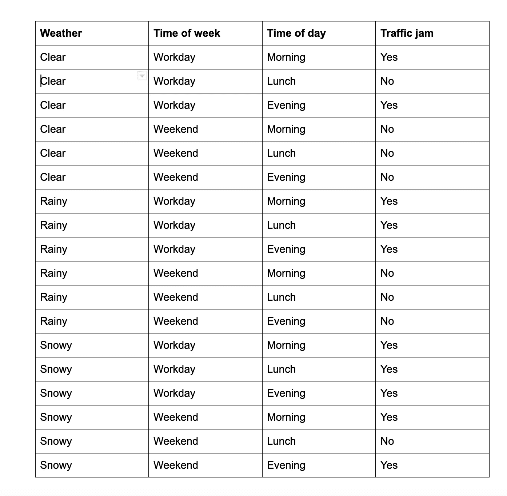
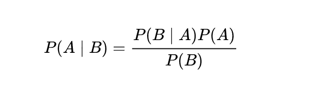
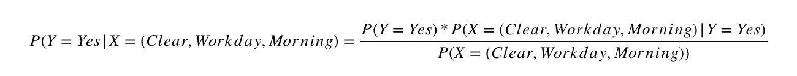
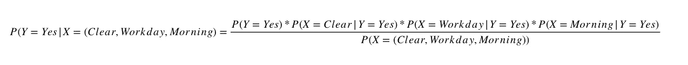
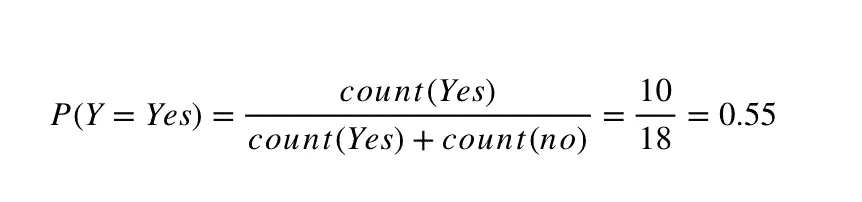

# 朴素贝叶斯分类器解释

> 原文：<https://towardsdatascience.com/naive-bayes-classifier-explained-54593abe6e18?source=collection_archive---------13----------------------->

## 朴素贝叶斯分类器解释。介绍朴素贝叶斯分类器背后的逻辑，并详细解释数学原理。

朴素贝叶斯分类器是一个简单的模型，通常用于分类问题。它背后的数学很容易理解，基本原理也很直观。然而，该模型在许多情况下表现得令人惊讶地好，并且该模型及其变体被用于许多问题。因此，在本文中，我们将解释模型背后的数学和逻辑，并在 Python 和 Scikit-Learn 中实现一个朴素贝叶斯分类器。

凯文·Ku 在 [Unsplash](https://unsplash.com?utm_source=medium&utm_medium=referral) 上的照片

本文是关于朴素贝叶斯分类器的两个小型系列的一部分。这将涵盖分类器背后的理论、数学和原理。如果您对使用 Python 和 Scikit-Learn 实现更感兴趣，请阅读另一篇文章，[Python 和 Scikit-Learn 中的朴素贝叶斯分类器教程](https://programmerbackpack.com/naive-bayes-classifier-tutorial-in-python-and-scikit-learn/)。

# 机器学习中的分类任务

机器学习中的分类任务负责将一系列输入 X = [x1，x2，…，xn]映射到一系列概率 Y = [y1，y2，…，ym]。这意味着给定一组特定的观察值 X = (x1，x2，…，xn)，我们需要找出 Y 是 yi 的奇数，并且为了获得分类，我们只需要选择最高的 yi。

## 等等，什么？

是的，我知道，我也不喜欢这样解释这些事情。我知道一个正式的解释是必要的，但是让我们也用另一种方法来试一试。让我们用这个虚构的表格来预测一个城市是否会发生交通堵塞。

朴素贝叶斯分类器—数据表

因此，在分类任务中，我们的目标是训练一个分类器模型，它可以从左侧获取信息(外面的天气、今天是哪一天以及一天中的什么时间)，并可以预测该城市是否会遇到交通堵塞。

> *注意:这个表格看起来很简单，因为我们只有几个数据点。但是在现实世界中，我们会有更多的信息，每个数据点会有更多的值。我用这个简单的表格来解释只是为了简单。*

回到之前的解释，我们会进食

*X =[晴朗，工作日，早晨]*

给我们的模型，然后我们的模型会返回给我们

*Y = [y1，y2]*

其中 *y1* 是不堵车的概率， *y2* 是堵车的概率。我们只需要选择最高的概率，我们就完成了，我们得到了我们的预测。

更正式的表达方式是，我们需要计算一个条件概率，即给定 X=(x1，x2，…，xm)的情况下，Y 是 Y 的概率。

*P(Y=y|X=(x1，x2，…，xm))*

# 朴素贝叶斯分类器

贝叶斯定理告诉我们如何计算这个条件概率。让我们看看这个等式。

朴素贝叶斯分类器——贝叶斯定理。来源:[维基百科](https://en.wikipedia.org/wiki/Bayes%27_theorem)

*   P (A | B)是一个条件概率，它给出了事件 B 发生的概率
*   P (B | A)是另一个条件概率，现在很清楚，它给出了事件 B 发生的概率，因为事件 A 已经发生了。
*   P(A)和 P(B)是事件 A 和 B 发生的概率。

# 但是为什么是朴素贝叶斯呢？

我们从概率论中知道，如果 X1 和 X2 是独立的值(这意味着，例如，天气下雨和今天是周末是完全独立的，它们之间没有条件关系)，那么我们可以使用这个等式。

独立概率

在我们的例子中，这个假设是正确的。今天下雨的事实绝对不会受到今天是星期六的事实的影响。但一般来说，这种假设在大多数情况下并不成立。如果我们观察一个分类任务的大量变量，很可能这些变量中至少有一些是相关的(例如，教育水平和月收入)。

但是朴素贝叶斯分类器之所以被称为朴素，只是因为它是基于这种假设工作的。我们认为所有观察到的变量都是独立的，因为使用上面的等式有助于我们简化接下来的步骤。

所以让我们回头看看我们的表，看看发生了什么。假设天气晴朗，今天是工作日，现在是早上(我们表格中的第一行)，让我们试着看看发生交通堵塞的概率是多少。

交通堵塞的可能性

不，我们只需要扩展它，这样我们就可以把这个方程变成一个只包含基本概率的方程。

扩展方程

从这里开始，我们已经可以计算每一个概率，例如:

朴素贝叶斯分类器-交通堵塞的概率

你可以看到这已经成为一个痛苦的过程。你可能会有疑问，因为这个模型背后的直觉看起来非常简单(尽管计算如此多的概率可能会让你头疼)，但它确实工作得非常好，并且在如此多的用例中使用。让我们看看其中的一些。

# 朴素贝叶斯分类器—应用和用例

*   实时分类-由于朴素贝叶斯分类器的工作速度非常非常快(与其他分类模型相比快得惊人),因此它被用于需要对中小型数据集进行快速分类响应的应用程序中。
*   垃圾邮件过滤——这是您最常听到的分类器用例。它广泛用于识别邮件是否是垃圾邮件。
*   文本分类—朴素贝叶斯分类器在文本分类方法中非常有效。
*   朴素贝叶斯分类器通常非常适合多类分类，即使它使用了非常朴素的假设，它仍然优于其他方法。

# 朴素贝叶斯分类器的作用

如果你和我一样，所有这些理论几乎都没有意义，除非我们看到分类器在运行。让我们看看它在现实世界中的应用。我们将使用 Python 中的 Scikit-Learn 实现并使用数据集。这是一篇相当长的文章，所以为了使它更容易，我把这个主题分成了一个由两篇文章组成的迷你系列。关于 Python 和 Scikit-Learn 中的实现，请阅读 Python 和 Scikit-Learn 中的[朴素贝叶斯分类器教程。](https://programmerbackpack.com/naive-bayes-classifier-tutorial-in-python-and-scikit-learn/)

*本文原载于* [*程序员背包博客*](https://programmerbackpack.com/naive-bayes-classifier-explained/) *。如果你想阅读更多这类的故事，一定要访问这个博客。*

*非常感谢您阅读本文！对更多这样的故事感兴趣？在 Twitter 上关注我，地址是*[*@ b _ dmarius*](https://twitter.com/b_dmarius)*，我会在那里发布每一篇新文章。*