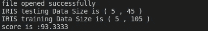

# 使用 C++从头开始的朴素贝叶斯

> 原文：<https://towardsdatascience.com/naive-bayes-implementation-from-scratch-using-c-51c958094041?source=collection_archive---------20----------------------->

## 关于如何使用 C++实现机器学习基础的工作代码教程

aive Bayes 是一个概率算法家族，它利用概率论和 Bayes 定理来预测结果。这是通过基于可能与结果相关的条件的先验知识计算每个可能结果的概率来给出的。

> “我们的信念基于我们的经验，这给了我们一个非常不完整的世界图景，我们很容易得出错误的结论。”
> ― Pedro Domingos，[大师算法:对终极学习机器的探索将如何重塑我们的世界](https://www.goodreads.com/work/quotes/44223286)

亚历克斯·钱伯斯在 [Unsplash](/s/photos/dice?utm_source=unsplash&utm_medium=referral&utm_content=creditCopyText) 上的照片

## **朴素贝叶斯假设:**

基本的朴素贝叶斯假设是:

*   假设每个特征都独立于**和**。
*   每个特征对结果的加权贡献是相同的。

实际上，这些假设使得朴素贝叶斯被称为“朴素的”,因为在现实世界中，独立性关系是不正确的。

查看本文作者[克里斯·迪南](https://medium.com/u/1155630a63a8?source=post_page-----51c958094041--------------------------------):

 [## 朴素贝叶斯有什么幼稚的？

### 朴素贝叶斯(NB)是“朴素”的，因为它假设一个度量的特征是独立的…

towardsdatascience.com](/whats-so-naive-about-naive-bayes-58166a6a9eba) 

这篇文章是解决机器学习算法在 C++中实现的系列文章的一部分，在整个系列中，我们将使用 C++特性实现基本的机器学习算法。

*   [什么时候应该学习使用 C++的机器学习？](https://medium.com/ml2b/when-should-you-learn-machine-learning-using-c-6edd719f95ff?source=friends_link&sk=8b66a55c047b99bbd1c720e59fe6a770)
*   [c++中的数据预处理和可视化。](/data-preprocessing-and-visualization-in-c-6d97ed236f3b?source=friends_link&sk=d13cdabff65a5ce56b717835108615ab)
*   [使用 C++进行机器学习数据操作。](/data-manipulation-using-c-389d6c4493b1?source=friends_link&sk=b16fffc79fcdfbd63f60d919eb86d835)
*   [使用 C++](/naive-bayes-implementation-from-scratch-using-c-51c958094041) 从零开始的朴素贝叶斯。
*   [线性回归在 C++中的实现](https://medium.com/swlh/linear-regression-implementation-in-c-acdfb621e56)。
*   [每个 C++开发者必读的 8 本书。](https://embeddedhouse.com/8-books-each-c-developer-must-read)
*   [每个机器学习开发者必读的 9 本书。](https://medium.com/ml2b/the-9-books-each-machine-learning-developer-must-read-e6ef8c0fb384)

## 朴素贝叶斯定理；

朴素贝叶斯理论超出了本文的范围，但是如果需要查看这些资源来帮助您更好地理解朴素贝叶斯理论，我推荐阅读下面这篇由 [Rohith Gandhi](https://medium.com/u/8f4e7f7a57e3?source=post_page-----51c958094041--------------------------------) 发表的文章和其他文章。

 [## 朴素贝叶斯分类器

### 什么是量词？

towardsdatascience.com](/naive-bayes-classifier-81d512f50a7c)  [## 朴素贝叶斯算法是如何工作的？(带示例和完整代码)| ML+

### 朴素贝叶斯是一种基于贝叶斯定理的概率机器学习算法，广泛用于各种…

www.machinelearningplus.com](https://www.machinelearningplus.com/predictive-modeling/how-naive-bayes-algorithm-works-with-example-and-full-code/)  [## 用 Python 和 R 语言学习朴素贝叶斯算法的 6 个简单步骤

### 注意:本文最初发布于 2015 年 9 月 13 日，更新于 2017 年 9 月 11 日概述了解其中一个…

www.analyticsvidhya.com](https://www.analyticsvidhya.com/blog/2017/09/naive-bayes-explained/) 

## 实施演练:

在本文中，我们希望实现以下内容:

目标实施结构

第一行是分类器实例声明，这是我们告诉编译器创建一个分类器实例并声明所有的类私有和公共变量的地方。

首先，我们需要定义类，定义类的合适位置是在 Naive_bayes.h 文件中，

朴素贝叶斯类定义和类实现的帮助函数

我们创建了一个名为 Naive_Bayes 的类，包含两个公共方法 fit()和 predict()。这些方法将用于数据训练和测试。它也有一些私有向量，我们将在上面存储模型信息，我们马上就会知道这些变量中到底存储了什么。

其次，我们需要定义类的方法。我们需要定义 fit()方法，现在是解释朴素贝叶斯模型中 fit 方法的功能的时候了。

## **拟合方法:**

从我们对朴素贝叶斯定理的理解中，我们需要知道以下的概率:

> P(类=0|X1，X2)= P(X1 |类=0) * P(X2 |类=0)* P(类= 0)

这意味着如果我们有 X1，X2 特征数据，我们有某一类的概率是多少，换句话说，如果我们有一株萼片长度为 5.1，萼片宽度为 3.5 的植物，这株植物属于鸢尾类的概率是多少。这可以通过将给定类别 0 的 X1 的概率乘以给定类别 0 的 X2 的概率以及类别 0 本身的概率来计算。为了更好地理解这个方程的来源，请回到朴素定理一节。

所以我们需要计算每个类的概率和每个值可能属于这个类的概率。我们将使用正态分布来计算概率。在其他文章中，我们描述了如何计算平均值和标准差。

平均值计算 API

标准偏差计算 API

如果您需要更多关于它们的实现的信息，请重新阅读这篇文章。

为了使用正态分布获得概率，我们将使用以下函数:

使用正态分布计算 pdf 的函数

下一步是计算每个要素的每个类的平均值和标准差，我们称之为类摘要。

用于计算课程总结的函数

类别概要是由包含每个特征的平均值和标准偏差的二维向量和包含类别概率的变量组成的结构。

一个结构包含类摘要

因此，calculate_Class_Summary 函数将负责为 fit 函数中的每个类填充 Naive_Bayes 类私有向量。

朴素贝叶斯模型的拟合函数

请注意，该函数是通用的，将使数据适合您拥有的尽可能多的要素，因为它从标签向量中提取唯一的标签，然后使用这些标签来迭代和计算每个标签摘要，然后将它们打包到类私有成员摘要中。

## 预测方法:

正如我们之前所说，目标是计算给定数据的分类概率

> P(类=0|X1，X2)= P(X1 |类=0) * P(X2 |类=0)* P(类= 0)

在预测步骤中，我们使用此等式来评估每个类的概率，并查看数据更有可能属于哪个类。

朴素贝叶斯模型的预测方法

前面的函数使用测试数据来获取这些数据属于每个类要素的概率，并获取计算出的最大值的索引。该索引将是数据最可能属于的特征索引。

为了计算每个类别的概率，我们使用以下函数:

通过分类汇总计算数据的概率

它使用之前计算的类摘要来计算每个特征的概率，然后将概率乘以类的概率。注意，这个函数是朴素贝叶斯定理等式的实际实现。

> P(类=0|X1，X2)= P(X1 |类=0) * P(X2 |类=0)* P(类= 0)

## 评分:

我们将实现一个简单的评分函数来比较预测和实际标签，并返回匹配的百分比。

函数来计算预测和标签之间的匹配百分比

## 综上所述:

实现朴素贝叶斯的一个例子

结果呢

正如你所看到的，这个算法的分数非常好~对于一个简单的算法来说，93%的准确率是非常好的。

在下一篇文章中，我们将实现另一个算法，并将结果与朴素贝叶斯算法得分进行比较。

## 推荐书籍:

*   [c++编程语言](https://amzn.to/320MRNp)，作者比雅尼·斯特劳斯特鲁普
*   [安德烈·布尔科夫所著的百页机器学习书籍](https://amzn.to/2QnS6kR)
*   [完全初学者的机器学习](https://amzn.to/2FIoegP)，作者奥利弗·西奥博尔德

> “从昨天学习，为今天而活，对明天充满希望。重要的是不要停止质疑。”~阿尔伯特·爱因斯坦

希望这篇文章对您有用，请关注本系列新文章发布时的通知。

您可能也会发现这些文章很有用。

 [## 什么时候应该用 C++学习机器学习？

### 机器学习的科学家、开发者和用户指南。

medium.com](https://medium.com/ml2b/when-should-you-learn-machine-learning-using-c-6edd719f95ff)  [## 每个开发人员必读的 8 本 C++编程书籍。

### 从哪里开始学 C++，业内专家写的。

medium.com](https://medium.com/coderbyte/the-8-c-programming-books-each-developer-must-read-da5ce755429f)  [## C++中的数据预处理和可视化

### 关于如何使用 C++实现机器学习的基本功能的工作代码示例

towardsdatascience.com](/data-preprocessing-and-visualization-in-c-6d97ed236f3b)  [## 使用 C++进行数据操作

### 关于如何使用 C++实现机器学习的基本功能的工作代码示例

towardsdatascience.com](/data-manipulation-using-c-389d6c4493b1)  [## 加入我的介绍链接媒体-艾哈迈德哈希什

### 作为一个媒体会员，你的会员费的一部分会给你阅读的作家，你可以完全接触到每一个故事…

medium.com](https://medium.com/@ahmhashesh/membership)