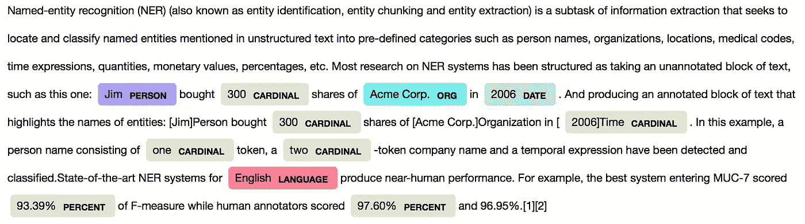
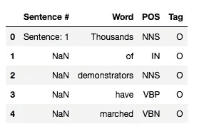
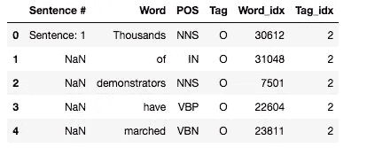
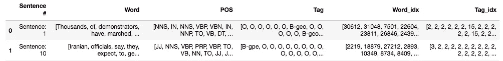
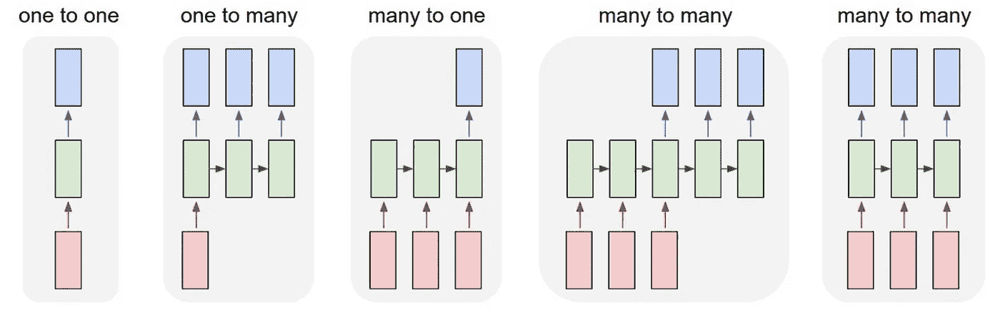
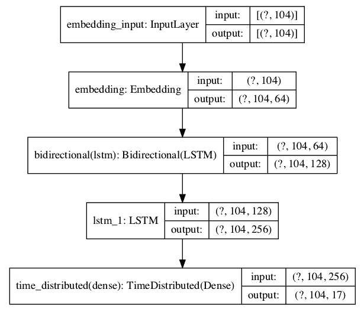
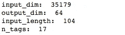
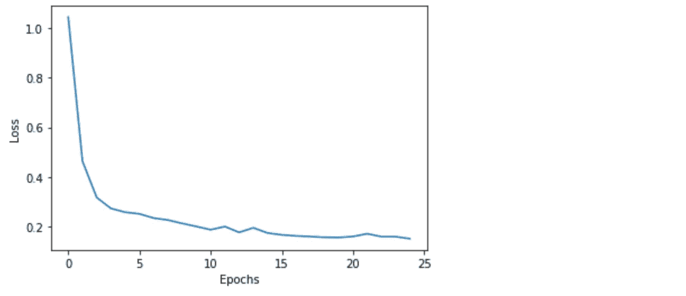
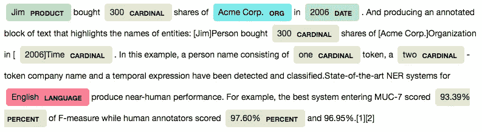

# 使用 Keras 双向 LSTM 的命名实体识别(NER)

> 原文：<https://towardsdatascience.com/named-entity-recognition-ner-using-keras-bidirectional-lstm-28cd3f301f54?source=collection_archive---------2----------------------->

## 通过双向 LSTM 理解句子的上下文进行分类，而不删除停用词。



使用 spaCy 实体的句子示例，突出显示句子中的实体。

> [**命名实体识别**(**【NER】**)](https://en.wikipedia.org/wiki/Named-entity_recognition)(也称为**实体识别**、**实体分块、**和**实体提取**)是信息提取的一个子任务，它试图定位非结构化文本中提到的命名实体并将其分类成预定义的类别，例如人名、组织、位置、医疗代码、时间表达式、数量、货币值、百分比等。

在这个项目中，我们将使用 Kaggle 提供的 NER 数据集。数据集可以在这里访问[。该数据集是从 GMB 语料库中提取的，该语料库经过标记、注释和专门构建，用于训练分类器来预测命名实体，如名称、位置等。数据集还包括一个额外的特征，可以用于分类的词性。然而，在这个项目中，我们只使用一个特色句子。](https://www.kaggle.com/abhinavwalia95/entity-annotated-corpus)

# 1.加载数据集

让我们从加载和可视化数据集开始。要下载 ner_dataset.csv，请转到 Kaggle 中的这个[链接](https://www.kaggle.com/abhinavwalia95/entity-annotated-corpus?select=ner_dataset.csv)。

*加载数据时请使用 encoding = 'unicode_escape'。该函数使用一个参数来切换换行引号的添加，并在字符串中转义该引号。*

```
import pandas as pd
data = pd.read_csv('ner_dataset.csv', encoding= 'unicode_escape')
data.head()
```



请注意，数据集中的句子在“单词”列中被标记化。“句子#”列显示一次句子编号，然后打印 NaN，直到下一个句子开始。“标签”列将是我们的标签(y)。

# 2.提取神经网络所需的映射

为了训练神经网络，我们将使用下面给出的两个映射。

*   {**token**} to {**token id**}:寻址当前 token 的嵌入矩阵中的行。
*   { **tag** }至{ **tag id** }:用于计算网络输出损耗的单热点真实概率分布向量。

这一步在任何机器学习模型中都是需要的，包括需要整数作为输入的神经网络。

```
data['Word_idx'] = data['Word'].map(token2idx)
data['Tag_idx'] = data['Tag'].map(tag2idx)
data.head()
```



我们可以看到，该函数为 X (Word_idx)和 y (Tag_idx)变量添加了两个新的索引列。接下来，让我们按照各自的顺序将令牌收集到数组中，以充分利用递归神经网络。

# 3.转换列以提取顺序数据

为了将列转换成顺序数组，我们将

*   使用 fillna 中的 ffill 方法在“句子#”列中填写 NaN。
*   接下来，按句子列进行分组，以获得标记和标签的数组。

```
# Fill na
data_fillna = data.fillna(method='ffill', axis=0)# Groupby and collect columns
data_group = data_fillna.groupby(
['Sentence #'],as_index=False
)['Word', 'POS', 'Tag', 'Word_idx', 'Tag_idx'].agg(lambda x: list(x))# Visualise data
data_group.head()
```



用令牌和标签序列转换数据。

# 4.将数据集分成训练集，填充后测试

**填充**:LSTM 层只接受相同长度的序列。因此，每一个用整数表示的句子(' Word_idx ')都必须被填充以具有相同的长度。我们将处理最长序列的最大长度，并填充较短的序列来实现这一点。

*请注意，我们也可以使用较短的衬垫长度。在这种情况下，您将填充较短的序列并截断较长的序列*。

我们还将使用 Keras 中的 to _ categorical 函数将 y 变量转换为 one-hot 编码向量。让我们导入所需的包。

```
from sklearn.model_selection import train_test_split
from keras.preprocessing.sequence import pad_sequences
from keras.utils import to_categorical
```

# 5.构建模型架构

神经网络模型使用图形结构。因此，我们首先需要设计架构，并为每一层设置输入和输出维度。rnn 能够处理不同的输入和输出组合。对于这项任务，我们将使用“多对多”架构。参考下图中的最后一个架构。我们的任务是输出在每个时间步摄取的令牌(X)的 tag (y)。



rnn 能够处理不同的输入和输出组合。

让我们从加载所需的包开始。

```
import numpy as np
import tensorflow
from tensorflow.keras import Sequential, Model, Input
from tensorflow.keras.layers import LSTM, Embedding, Dense, TimeDistributed, Dropout, Bidirectional
from tensorflow.keras.utils import plot_model
```

为可复制性设定一个种子总是最好的。

```
from numpy.random import seed
seed(1)
tensorflow.random.set_seed(2)
```

为了更好地理解层的输入和输出尺寸，请将模型图中的层与下图(模型图)中给出的每个层的简介进行比较。

在该架构中，我们主要使用三层(嵌入、bi-lstm、lstm 层)和第四层(时间分布密集层)来输出结果。我们将在下面的章节中详细讨论这些层。



*   **第 1 层—嵌入层:**我们将指定填充序列的最大长度(104)。在网络被训练之后，嵌入层将把每个令牌转换成 n 维向量。我们选择 n 维为(64)。

尺寸(？，104，64)来自这些规范。请注意第一维显示“？”或者在情节中没有。它们代表批量大小。如果没有提供，它们会显示“？”或者没有，这意味着模型可以接受任何批量大小。

*   **第二层——双向 lstm:** 双向 LSTM 以一个递归层(如第一个 LSTM 层)作为自变量。该层从先前的嵌入层(104，64)获取输出。

由于这是双向 lstm，我们将有前向和后向输出。在将这些输出传递到下一层之前，通过求和、取平均值、连接或相乘来组合它们。在 bi-lstm 层的合并模式参数中找到这些函数。在默认模式下，输出被连接在一起，从而使下一层的输出数量加倍。在我们的例子中，它变成了 128(64 * 2)。

*   **第 3 层——LSTM 层:**一个 [LSTM](https://adventuresinmachinelearning.com/keras-lstm-tutorial/) 网络是一个递归神经网络，它用 LSTM 细胞块代替了我们的标准神经网络层。这些单元有不同的组成部分，称为输入门、遗忘门和输出门。

该层从先前的双向 lstm 层(？104，128)和输出(？, 104, 256)

*   **第 4 层——时间分布式层:**我们正在处理多对多 RNN 架构，我们期望从每个输入序列得到输出。这里有一个例子，在序列(a1 →b1，a2 →b2…an →bn)中，a 和 b 是每个序列的输入和输出。TimeDistributeDense 层允许在每个时间步长的每个输出上进行密集(全连接)操作。不，使用这一层将产生一个最终输出。

该层采用前一 lstm 层(104，256)的输出维度，并输出最大序列长度(104)和最大标签(17)。

```
input_dim = len(list(set(data['Word'].to_list())))+1
output_dim = 64
input_length = max([len(s) for s in data_group['Word_idx'].tolist()])
n_tags = len(tag2idx)print('input_dim: ', input_dim, '\noutput_dim: ', output_dim, '\ninput_length: ', input_length, '\nn_tags: ', n_tags)
```



下面给出了用于构建我们上面讨论的模型架构的代码。在拟合模型之前，通过使用 plot_model 函数绘制模型或运行 model.summary()获取模型摘要来检查模型图。

# 6.符合模型

我们将用 for 循环来拟合模型，以保存和可视化每个时期的损失。

```
results = pd.DataFrame()model_bilstm_lstm = get_bilstm_lstm_model()
plot_model(model_bilstm_lstm)results['with_add_lstm'] = train_model(train_tokens, np.array(train_tags), model_bilstm_lstm)
```

该模型以 0.9169 的精度开始，以 0.9169 的精度结束。以 1000 个批量运行 25 个时期后，最终精度为 0.9687。



请使用不同的批量大小、差值、优化器、指标和层来试验模型，以获得更好的结果。在 [Github 资源库](https://github.com/snehalnair/Named-Entity-Recognition)中找到该项目的完整代码。

对于任何感兴趣的人来说，这里有一段代码，它将使用 spaCy 突出显示任何给定句子中的实体。

```
import spacy
from spacy import displacy
nlp = spacy.load('en_core_web_sm')text = nlp('Jim bought 300 shares of Acme Corp. in 2006\. And producing an annotated block of text that highlights the names of entities: [Jim]Person bought 300 shares of [Acme Corp.]Organization in [2006]Time. In this example, a person name consisting of one token, a two-token company name and a temporal expression have been detected and classified.State-of-the-art NER systems for English produce near-human performance. For example, the best system entering MUC-7 scored 93.39% of F-measure while human annotators scored 97.60% and 96.95%.[1][2]')displacy.render(text, style = 'ent', jupyter=True)
```



**参考文献**:

[](https://github.com/keras-team/keras/issues/1029) [## 何时以及如何使用 TimeDistributedDense 问题#1029 keras-team/keras

### 解散 GitHub 是超过 5000 万开发者的家园，他们一起工作来托管和审查代码，管理项目，以及…

github.com](https://github.com/keras-team/keras/issues/1029) [](https://machinelearningmastery.com/timedistributed-layer-for-long-short-term-memory-networks-in-python/) [## 如何在 Keras 中使用时间分布层-机器学习掌握

### 最近更新的长短期网络或 LSTMs 是一种流行和强大的递归神经网络，或 RNN…

machinelearningmastery.com](https://machinelearningmastery.com/timedistributed-layer-for-long-short-term-memory-networks-in-python/)