# 使用 spaCy 的命名实体识别| NLP |第 4 部分

> 原文：<https://towardsdatascience.com/named-entity-recognition-ner-using-spacy-nlp-part-4-28da2ece57c6?source=collection_archive---------3----------------------->

## 使用 spaCy | NLP 库进行文本处理

命名实体识别是信息检索中最重要的，或者说是最开始的一步。信息检索是从非结构化的原始文本文档中提取重要有用信息的技术。命名实体识别 NER 的工作原理是定位和识别非结构化文本中的命名实体，将其分为标准类别，如人名、位置、组织、时间表达式、数量、货币值、百分比、代码等。Spacy 附带了一个非常快速的统计实体识别系统，该系统将标签分配给连续范围的标记。

> [*Spacy 安装和基本操作| NLP 文本处理库|第 1 部分*](https://ashutoshtripathi.com/2020/04/02/spacy-installation-and-basic-operations-nlp-text-processing-library/)

Spacy 提供了向实体识别系统添加任意类和更新模型的选项，甚至包括除了模型中已经定义的实体之外的新示例。

Spacy 具有 **'ner'** 管道组件，用于识别符合一组预定命名实体的令牌跨度。这些可以作为 Doc 对象的**ents**属性使用。

```
# Perform standard imports import spacy nlp = spacy.load('en_core_web_sm')# Write a function to display basic entity info: def show_ents(doc): if doc.ents: for ent in doc.ents: print(ent.text+' - ' +str(ent.start_char) +' - '+ str(ent.end_char) +' - '+ent.label_+ ' - '+str(spacy.explain(ent.label_))) else: print('No named entities found.')doc1 = nlp("Apple is looking at buying U.K. startup for $1 billion") show_ents(doc1)
```

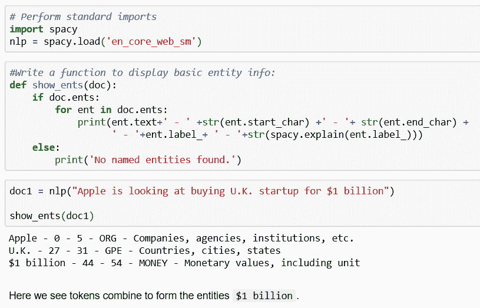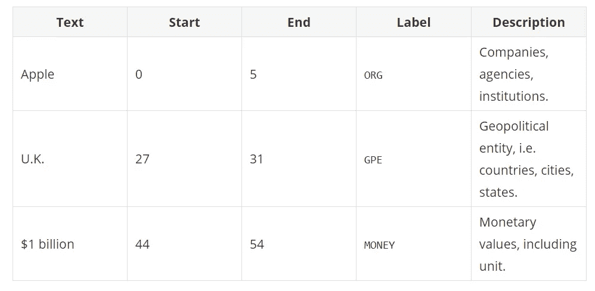

```
doc2 = nlp(u'May I go to Washington, DC next May to see the Washington Monument?') show_ents(doc2)
```

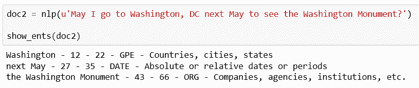

这里我们看到令牌组合起来形成了实体`next May`和`the Washington Monument`

```
doc3 = nlp(u'Can I please borrow 500 dollars from you to buy some Microsoft stock?') for ent in doc3.ents: print(ent.text, ent.start, ent.end, ent.start_char, ent.end_char, ent.label_)
```

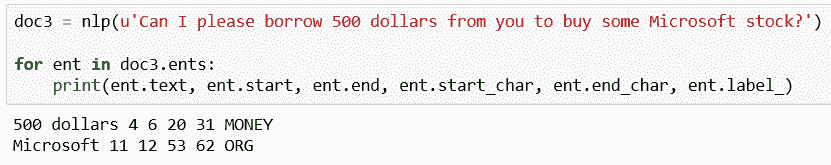

# 实体注释

`Doc.ents`是具有自己的注释集的记号跨度。

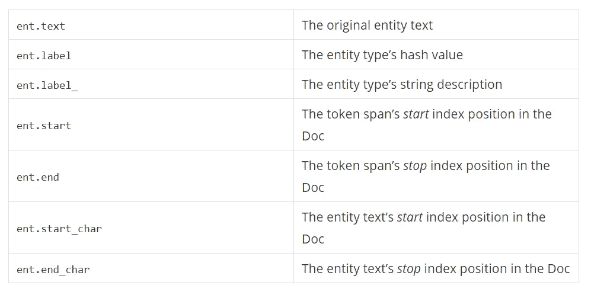

# 访问实体注释

访问实体注释的标准方法是 doc.ents 属性，它产生一系列 Span 对象。实体类型既可以使用 **ent.label** 作为哈希值访问，也可以使用 **ent.label_** 作为字符串访问。

Span 对象充当一系列标记，因此您可以迭代实体或对其进行索引。您还可以获得整个实体的文本形式，就像它是单个令牌一样。

还可以使用 token.ent_iob 和 token.ent_type 属性来访问令牌实体注释。token.ent_iob 指示实体是在标记上开始、继续还是结束。如果令牌上没有设置实体类型，它将返回一个空字符串。

```
doc = nlp("San Francisco considers banning sidewalk delivery robots") # document level for e in doc.ents: print(e.text, e.start_char, e.end_char, e.label_) # OR ents = [(e.text, e.start_char, e.end_char, e.label_) for e in doc.ents] print(ents)#token level # doc[0], doc[1] ...will have tokens stored. ent_san = [doc[0].text, doc[0].ent_iob_, doc[0].ent_type_] ent_francisco = [doc[1].text, doc[1].ent_iob_, doc[1].ent_type_] print(ent_san) print(ent_francisco)
```

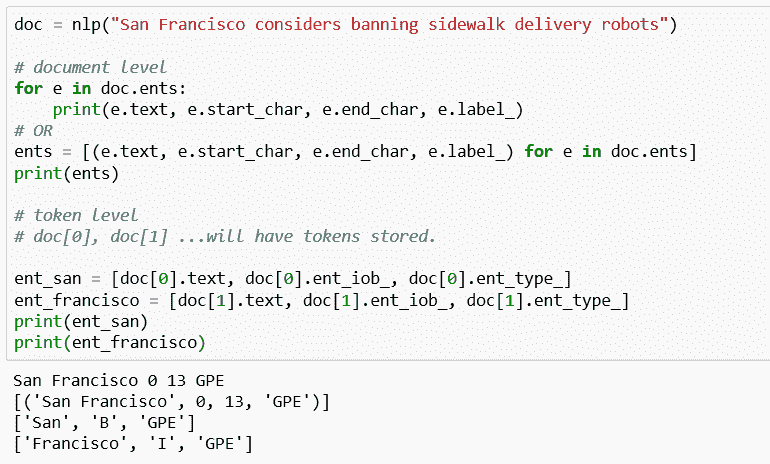

```
IOB SCHEME I - Token is inside an entity. O - Token is outside an entity. B - Token is the beginning of an entity.
```

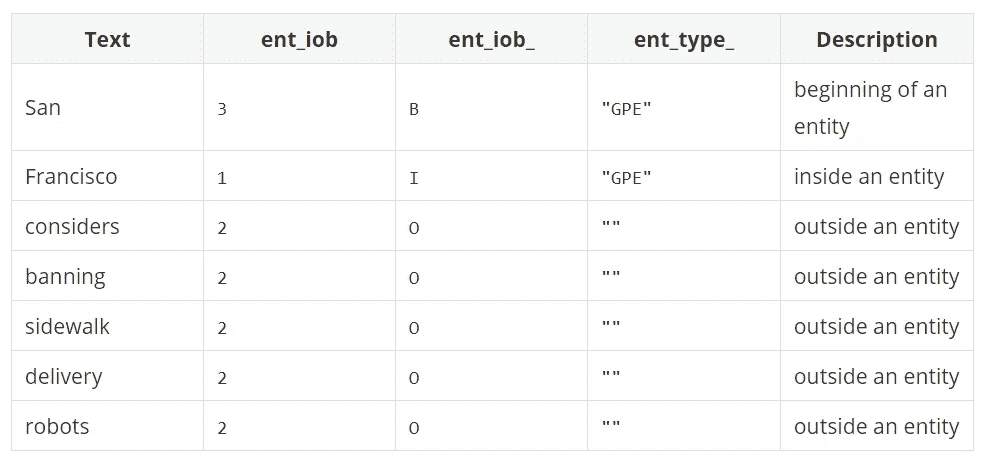

**注意:**在上面的例子中，只有`San Francisco`被认为是一个命名实体。因此，其余的令牌被描述为在实体之外。而在`San Francisco`中`San`是实体的起点而`Francisco`是实体内部。

标签可以通过实体的`.label_`属性来访问。

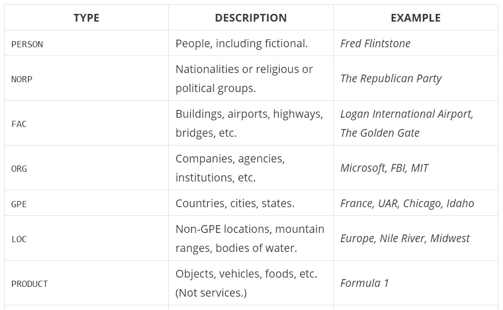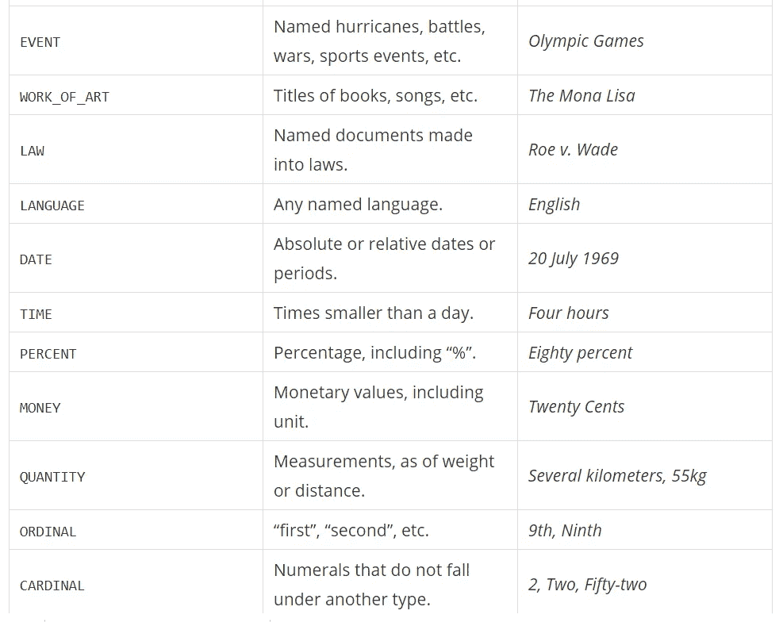

# 用户定义的命名实体并将其添加到 Span

通常我们会让 spaCy 通过对几个文本样本进行训练来建立一个命名实体库。
有时候，我们想给一个特定的令牌分配一个命名实体，但这个实体不能被训练好的空间模型识别。我们可以这样做，如下面的代码所示。

# 示例 1

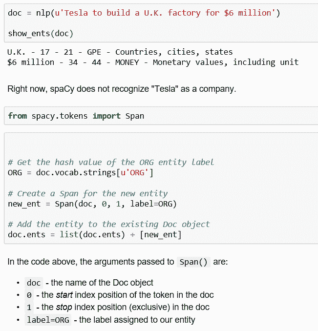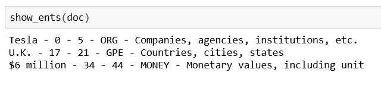

# 示例 2

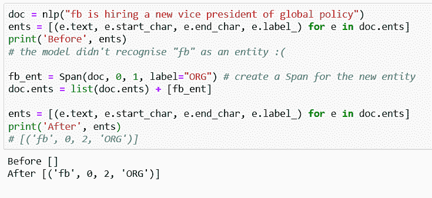

# 将命名实体添加到所有匹配范围

如果我们想要标记一个令牌的所有出现的*会怎样？在本节中，我们将展示如何使用 PhraseMatcher 来识别文档中的一系列跨度:*

```
doc = nlp(u'Our company plans to introduce a new vacuum cleaner. If successful, the vacuum cleaner will be our first product.') show_ents(doc) #output: first - 99 - 104 - ORDINAL - "first", "second", etc.#Import PhraseMatcher and create a matcher object: from spacy.matcher import PhraseMatcher matcher = PhraseMatcher(nlp.vocab)#Create the desired phrase patterns:
phrase_list = ['vacuum cleaner', 'vacuum-cleaner']
phrase_patterns = [nlp(text) for text in phrase_list]#Apply the patterns to our matcher object:
matcher.add('newproduct', None, *phrase_patterns)#Apply the matcher to our Doc object:
matches = matcher(doc)#See what matches occur: matches #output: [(2689272359382549672, 7, 9), (2689272359382549672, 14, 16)]
```

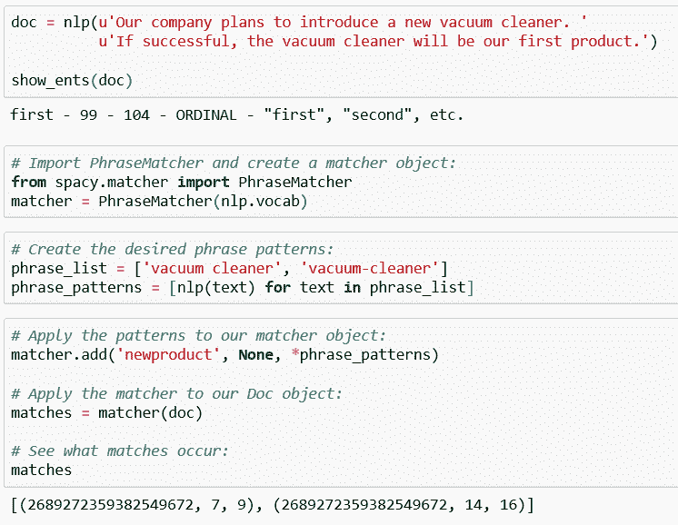

```
#Here we create Spans from each match, and create named entities from them: from spacy.tokens import Span PROD = doc.vocab.strings[u'PRODUCT'] new_ents = [Span(doc, match[1],match[2],label=PROD) for match in matches] #match[1] contains the start index of the the token and match[2] the stop index (exclusive) of the token in the doc. doc.ents = list(doc.ents) + new_ents show_ents(doc)output: vacuum cleaner - 37 - 51 - PRODUCT - Objects, vehicles, foods, etc. (not services) vacuum cleaner - 72 - 86 - PRODUCT - Objects, vehicles, foods, etc. (not services) first - 99 - 104 - ORDINAL - "first", "second", etc.
```

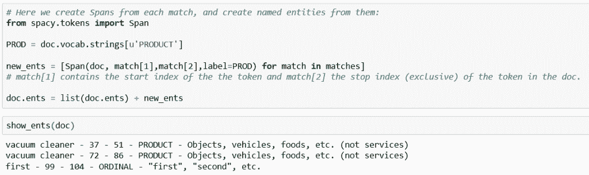

# 计数实体

虽然 spaCy 可能没有内置的实体计数工具，但我们可以将条件语句传递给列表理解:

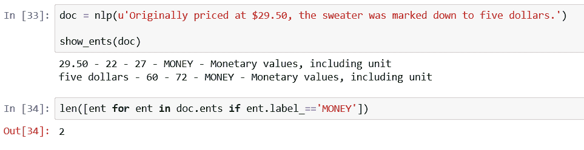

# 想象 NER

Spacy 有一个名为“displaCy”的库，它帮助我们交互式地探索实体识别模型的行为。

如果你正在训练一个模型，自己运行可视化是非常有用的。

你可以传递一个`Doc`或一个`Doc`对象列表来显示并运行`displacy.serve`来运行网络服务器，或`displacy.render`来生成原始标记。

```
#Import the displaCy library
from spacy import displacy
```

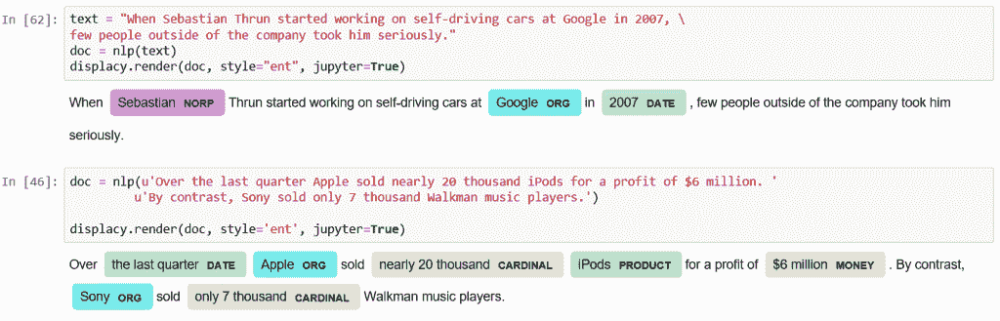

# 一行一行地想象句子

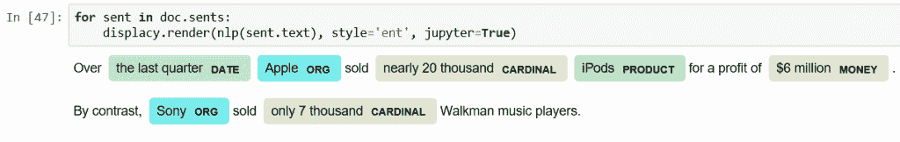

# 查看特定实体

您可以传递实体类型列表来限制可视化:

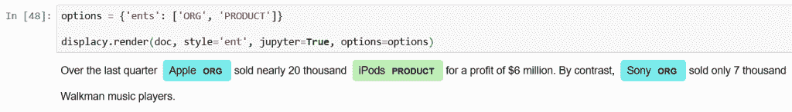

# 造型:定制颜色和效果

您还可以传递背景颜色和渐变选项:

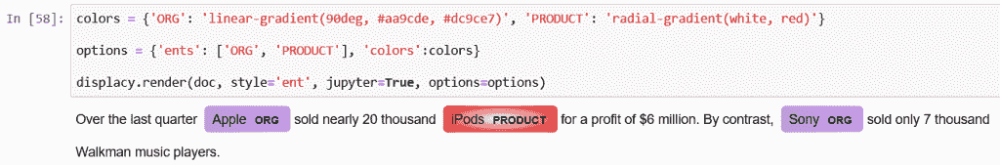

这是所有关于命名实体识别 NER 和它的可视化使用空间。希望你喜欢这篇文章。

在下一篇文章中，我将描述句子分割。敬请期待！

如果您有任何改进内容的反馈或想法，请写在下面的评论部分。你的评论很有价值。

spaCy NLP 系列以前的文章:

*   [SPACY 安装和基本操作| NLP 文本处理库|第 1 部分](https://ashutoshtripathi.com/2020/04/02/spacy-installation-and-basic-operations-nlp-text-processing-library/)
*   [使用 SPACY | NLP |第 2 部分](https://ashutoshtripathi.com/2020/04/06/guide-to-tokenization-lemmatization-stop-words-and-phrase-matching-using-spacy/)进行标记化、词条化、停用词和短语匹配的快速指南
*   [使用 SPACY | NLP |第 3 部分的词性标注和依存解析](https://ashutoshtripathi.com/2020/04/13/parts-of-speech-tagging-and-dependency-parsing-using-spacy-nlp/)

谢谢大家！

参考资料:

*   [https://spacy.io/usage/spacy-101](https://spacy.io/usage/spacy-101)

*原载于 2020 年 4 月 27 日*[*http://ashutoshtripathi.com*](https://ashutoshtripathi.com/2020/04/27/named-entity-recognition-ner-using-spacy-nlp-part-4/)*。*