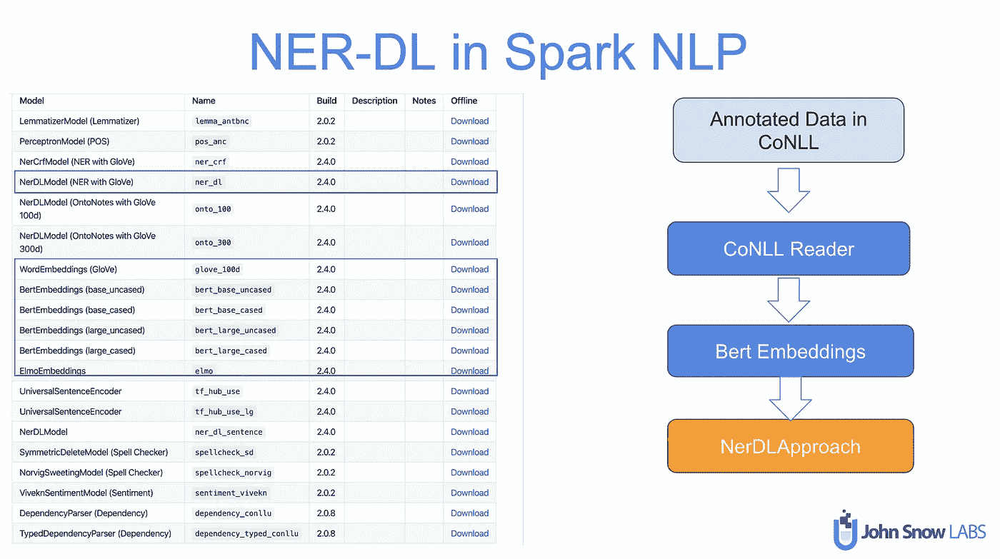

# Spark 自然语言处理中基于 BERT 的命名实体识别(NER)

> 原文：<https://towardsdatascience.com/named-entity-recognition-ner-with-bert-in-spark-nlp-874df20d1d77?source=collection_archive---------2----------------------->

## 用 BERT 在 Spark NLP 中的几行代码训练一个 NER，获得 SOTA 精度。


照片由 [Jasmin Ne](https://unsplash.com/@jasminnb?utm_source=medium&utm_medium=referral) 在 [Unsplash](https://unsplash.com?utm_source=medium&utm_medium=referral) 上拍摄

NER 是信息提取的一个子任务，它试图定位非结构化文本中提到的命名实体并将其分类成预定义的类别，例如人名、组织、位置、医疗代码、时间表达式、数量、货币值、百分比等。


NER 在自然语言处理(NLP)的很多领域都有应用，它可以帮助回答很多现实世界的问题，比如:

*   新闻中提到了哪些公司？
*   哪些测试适用于患者(临床报告)？
*   推文中有提到产品名称吗？


Spark 自然语言处理库中的临床 NER 模型

# NER 系统公司

NER 是 NLP 和[的一个活跃话题，多年来研究工作一直在进行](https://arxiv.org/abs/1910.11470)。我们可以将这些努力总结为以下主题:

1.  传统方法(基于规则)
2.  ML 方法

*   多类分类
*   条件随机场

3.DL 方法

*   [双向 LSTM-CRF](https://arxiv.org/pdf/1508.01991v1.pdf)
*   [双向 LSTM 有线电视新闻网](https://arxiv.org/pdf/1511.08308.pdf)
*   [双向 LSTM-CNN-CRF](https://arxiv.org/pdf/1603.01354.pdf)
*   预先训练的语言模型( [Elmo](https://allennlp.org/elmo) 和 [BERT](https://arxiv.org/abs/1810.04805)

4.[混合方法](https://www.aclweb.org/anthology/P19-1527/) (DL + ML)

# NER 和伯特在星火 NLP

在本文中，我们将尝试向您展示如何使用 BERT 在 [Spark NLP 库中构建一个最先进的 NER 模型。](https://nlp.johnsnowlabs.com/)我们要实现的模型受到了 NER 以前的艺术模型的启发: [Chiu & Nicols，*使用双向 LSTM 的命名实体识别-CNN*](https://arxiv.org/abs/1511.08308) 并且它已经嵌入在 Spark NLP [NerDL 注释器](https://nlp.johnsnowlabs.com/docs/en/annotators#ner-dl)中。这是一种新颖的神经网络架构，使用混合双向 LSTM 和 CNN 架构自动检测单词和字符级特征，无需大多数特征工程。

在开发该模型时，没有类似 BERT 的语言模型，并且在原始论文中使用了 Glove 单词嵌入。但是在本文中，我们将使用 BERT 替换 Glove。


Spark NLP NER DL 基准

在 Spark NLP 中，有三种不同的预训练单词嵌入模型(及其变体),您可以根据您的使用情况即插即用。


为了简单和节省您的时间，我们将跳过安装步骤。我们已经有另一篇文章详细介绍了 Spark NLP。而我们会做好 [Colab](https://colab.research.google.com/notebooks/intro.ipynb#recent=true) 里的所有工作，让你直接跳到 Spark NLP。

我们开始吧！

我们从下载训练和测试集开始。我们将使用官方的 CoNLL2003 数据集，这是一个几乎在所有 NER 论文中都使用过的基准数据集。你可以在这里下载这个数据集[。](https://github.com/JohnSnowLabs/spark-nlp/tree/master/src/test/resources/conll2003)

让我们简单解释一下什么是 CoNLL。作为“*自然语言学习会议”的缩写，* CoNLL 也是用于训练集以训练 NER 模型的注释的标准格式。这是它的样子。您可以在 CONLL 中注释自己的数据，然后在 Spark NLP 中训练一个自定义 NER。还有一些免费的注释工具[可以用来标记你自己的数据。](https://medium.com/dida-machine-learning/the-best-free-labeling-tools-for-text-annotation-in-nlp-844525c5c65b)


下面是我们要一一讲解的流程。



我们导入相关的包，然后开始编码。

```
from pyspark.sql import SparkSession
from pyspark.ml import Pipelinefrom sparknlp.annotator import *
from sparknlp.common import *
from sparknlp.base import *import sparknlp
spark = sparknlp.start()print("Spark NLP version: ", sparknlp.version())
print("Apache Spark version: ", spark.version)*>> Spark NLP version:  2.4.1 
>> Apache Spark version:  2.4.4*
```

如果你想在 GPU 上训练你的模型，你可以用`spark = sparknlp(gpu=True)` *开始你的 Spark 会话。*

然后，我们将 CoNLL 文件转换为 Spark 数据帧，并生成所有附加字段供以后使用。

```
from sparknlp.training import CoNLL
training_data = CoNLL().readDataset(spark, './eng.train')
training_data.show()
```


如您所见，输入数据集只有线和标注，现在这里有几列。Spark NLP 中的 CoNLL helper 类将数据集作为输入，并准备我们将使用的 NER 算法所需的令牌、词性和句子。您需要做的就是准备或下载一个 CoNLL 格式的数据集。

*(注意:尽管原文建议使用 POS，但在 Spark NLP 培训中不会使用。因为 POS 标签是 CoNLL 格式的，所以 CoNLL helper 类从作为输入给出的 CONLL 文件中提取它们。因此，我们甚至可以用-X-来代替在源文件中张贴标签。)*

下一步是通过 BERT 获得单词嵌入。我们将使用名为`BertEmbeddings()` *的 Spark NLP 注释器。*

```
bert = BertEmbeddings.pretrained('bert_base_cased', 'en') \    .setInputCols(["sentence",'token'])\
.setOutputCol("bert")\
.setCaseSensitive(False)\
.setPoolingLayer(0) # default 0
```

在 Spark NLP 中，我们有四种预先训练好的 BERT 变体:`bert_base_uncased`、`bert_base_cased`、`bert_large_uncased`、`bert_large_cased`。使用哪一个取决于您的用例、训练集以及您试图建模的任务的复杂性。

在上面的代码片段中，我们基本上从 Spark NLP 公共资源加载了`bert_base_cased`版本，并将`sentence`和`token`列指向`setInputCols().`简而言之，`BertEmbeddings()`注释器将获取`sentence`和`token`列，并在`bert`列中填充 Bert 嵌入。一般来说，每个单词被翻译成一个 768 维的向量。参数`setPoolingLayer()`可以设置为`0`为第一层最快，`-1`为最后一层，`-2`为`second-to-last-hidden layer`。

*正如官方* [*BERT 论文*](https://arxiv.org/pdf/1810.04805v2.pdf) *的作者所解释的，不同的 BERT 层捕捉不同的信息。最后一层在预训练期间太接近目标函数(即，掩蔽语言模型和下一句预测)，因此它可能偏向那些目标。如果你想使用最后隐藏层，请随意设置* `*pooling_layer=-1*` *。直观上，* `*pooling_layer=-1*` *接近训练输出，所以可能会偏向训练目标。如果你不微调模型，那么这可能会导致一个坏的表现。也就是说，这是模型准确性和您拥有的计算资源之间的权衡问题。*

然后我们导入`NerDLApproach()`注释器，它是负责训练 NER 模型的主要模块。

```
nerTagger = NerDLApproach()\
.setInputCols(["sentence", "token", "bert"])\
.setLabelColumn("label")\
.setOutputCol("ner")\
.setMaxEpochs(1)\
.setRandomSeed(0)\
.setVerbose(1)\
.setValidationSplit(0.2)\
.setEvaluationLogExtended(True)\
.setEnableOutputLogs(True)\
.setIncludeConfidence(True)\
.setTestDataset("test_withEmbeds.parquet")
```

让我们解释一下每个参数:

`.setInputCols([“sentence”, “token”, “bert”])`:NER 模型将用来生成特征的列。

`.setLabelColumn(“label”)`:目标列

`.setOutputCol(“ner”)`:预测将被写入`ner`栏

`.setMaxEpochs(1)`:训练的历元数

`.setVerbose(1)`:训练时的日志级别

`.setValidationSplit(0.2)`:每个历元上要对照模型验证的训练数据集的比例。该值应介于 0.0 和 1.0 之间，默认情况下为 0.0 和关闭。

`.setEvaluationLogExtended(True)`:是否延长验证日志:显示每个标签的时间和评估。默认值为 false。

`.setEnableOutputLogs(True)`:是否输出到日志文件夹。当设置为真时，日志和训练指标将被写入主文件夹中的文件夹。

`.setIncludeConfidence(True)`:注释元数据中是否包含置信度得分。

`.setTestDataset(“test_withEmbeds.parquet”)`:测试数据集的路径。如果设置了，它将用于在训练期间对其进行统计。这也是一种 CoNLL 格式，但是嵌入像以前一样通过添加并保存到磁盘。如果你不需要在 Spark 中一个不可见的测试集上评估你的模型，你就不需要设置这个。

```
test_data = CoNLL().readDataset(spark, './eng.testa')
test_data = bert.transform(test_data)
test_data.write.parquet("test_withEmbeds.parquet")
```

还可以设置学习率(`setLr`)、学习率衰减系数(`setPo`)、`setBatchSize`和`setDropout`速率。完整名单请见[官方回购](https://github.com/JohnSnowLabs/spark-nlp/blob/master/src/main/scala/com/johnsnowlabs/nlp/annotators/ner/dl/NerDLApproach.scala)。

现在我们可以在管道中添加这两个注释器。

```
ner_pipeline = Pipeline(stages = [bert, nerTagger])ner_model = ner_pipeline.fit(training_data)
```

根据数据集大小和您设置的历元数完成拟合后，它就可以使用了。让我们看看仅仅一个时期后的日志是什么样子的(在你的主文件夹的`annotators_log`文件夹中)。

你可以在`Colab`实例的根目录下找到这个文件夹。


拟合时，训练日志被写入磁盘

```
*Please check* [*here*](https://nlp.johnsnowlabs.com/docs/en/graph) *in case you get an IllegalArgumentException error with a description such as: Graph [parameter] should be [value]: Could not find a suitable tensorflow graph for embeddings dim: [value] tags: [value] nChars: [value]. Generate graph by python code in python/tensorflow/ner/create_models before usage and use setGraphFolder Param to point to output.*
```

总之，我们可以用 Spark NLP 中的几行代码在 SOTA 算法中训练一个自定义的 NER。


在 Spark NLP 中训练 NER 的整个流程

我们也可以将这个拟合的 NER 模型保存到磁盘上。由于 NERDL 模型是管道中的第二个阶段(第一个阶段是 BertEmbedding annotator)，我们可以通过在阶段中建立索引来引用它。

```
ner_model.stages[1].write().save('NER_bert_20200221')
```

然后使用`NerDLModel` 注释器加载回来。

```
loaded_ner_model = NerDLModel.load("NER_bert_20200221")\
   .setInputCols(["sentence", "token", "bert"])\
   .setOutputCol("ner")
```

并在另一个流水线(即预测流水线)中使用


拟合管道并获得预测。

```
text = "Peter Parker is a nice man and lives in New York"prediction_data = spark.createDataFrame([[text]]).toDF("text")prediction_model = custom_ner_pipeline.fit(prediction_data)preds = prediction_model.transform(prediction_data)preds.show()
```


我们还可以编写一些 PySpark 函数，在 NerConverter 的`ner_span`的帮助下，使输出更加漂亮和有用。


我们也可以将此管道转换为 LightPipeline，以消除开销中的火花，并进行光速推断。一旦您将任何拟合的管道转换为 LightPipeline，您可以更快地轻松获得字符串或字符串列表的预测。你可以在这里找到更多关于光线管道的细节。


所有代码都可以在 [Github](https://github.com/JohnSnowLabs/spark-nlp-workshop/blob/master/tutorials/blogposts/3.NER_with_BERT.ipynb) 获得。在我们通过 Github 分享的笔记本中，你甚至会看到带有各种其他嵌入的附加实现，以及如何准备自己的 CoNLL 文件来训练定制的 NER 模型。

# 结论

目前就这些。在这篇文章中，我们讨论了如何在 Spark NLP 中与 BERT(NLP 镇上最酷的孩子)一起训练最先进的 NER 模型。我希望你喜欢！

我们还举办了一场关于这个主题的网络研讨会，录音[可在此处](https://register.gotowebinar.com/recording/8789202788019102477)获得！

我们希望您已经阅读了我们的[官方媒体页面](https://medium.com/spark-nlp)上的前几篇文章，并开始使用 Spark NLP。以下是其他文章的链接。别忘了关注我们的页面，敬请期待！

[NER 与伯特在 Spark NLP 笔记本](https://colab.research.google.com/github/JohnSnowLabs/spark-nlp-workshop/blob/master/tutorials/Certification_Trainings/Healthcare/1.Clinical_Named_Entity_Recognition_Model.ipynb#scrollTo=FcOwTCgB-VnC)(本文)

[如何使用其他单词嵌入在 Spark NLP 中训练 NER 模型(Colab)](https://colab.research.google.com/github/JohnSnowLabs/spark-nlp-workshop/blob/master/tutorials/Certification_Trainings/Public/4.NERDL_Training.ipynb#scrollTo=8NFG_NK6G67o)

[在空气间隙网络中安装 Spark NLP 和 Spark OCR(离线模式)](https://medium.com/spark-nlp/installing-spark-nlp-and-spark-ocr-in-air-gapped-networks-offline-mode-f42a1ee6b7a8)

[Spark NLP 简介:基础和基本组件(第一部分)](https://medium.com/spark-nlp/introduction-to-spark-nlp-foundations-and-basic-components-part-i-c83b7629ed59)

[Spark NLP 简介:安装和入门(第二部分)](https://medium.com/spark-nlp/introduction-to-spark-nlp-installation-and-getting-started-part-ii-d009f7a177f3?source=collection_home---6------0-----------------------)

[Spark NLP Youtube 频道](https://www.youtube.com/channel/UCmFOjlpYEhxf_wJUDuz6xxQ/videos)