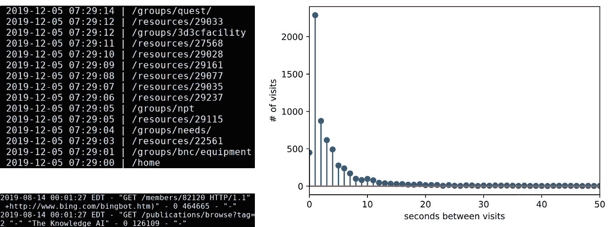
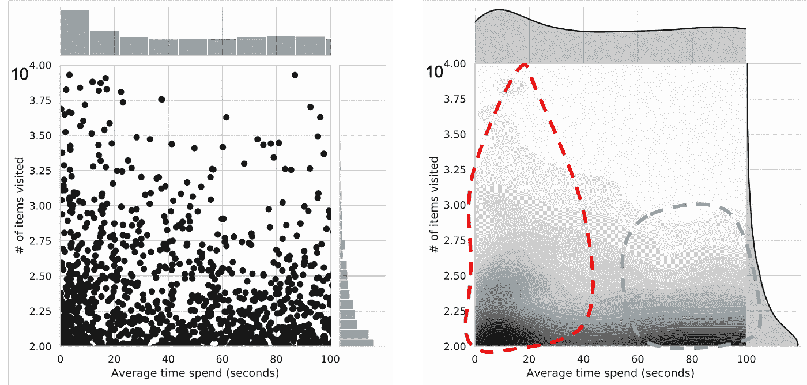
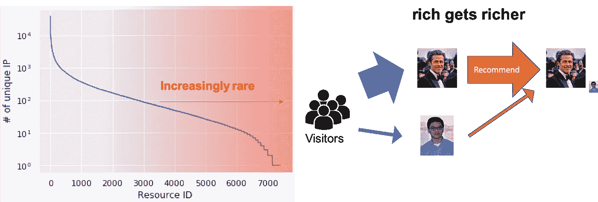
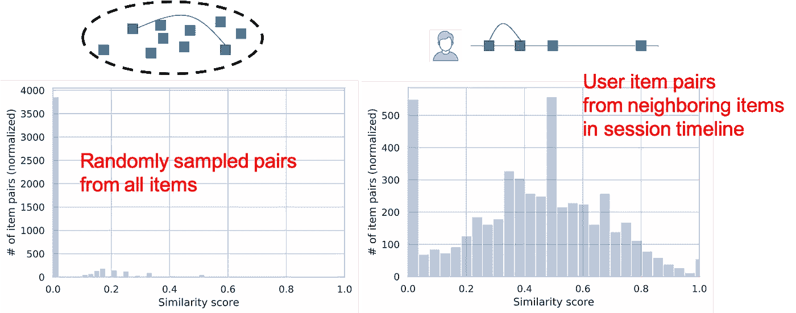
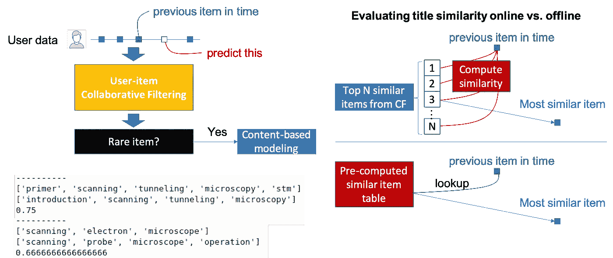
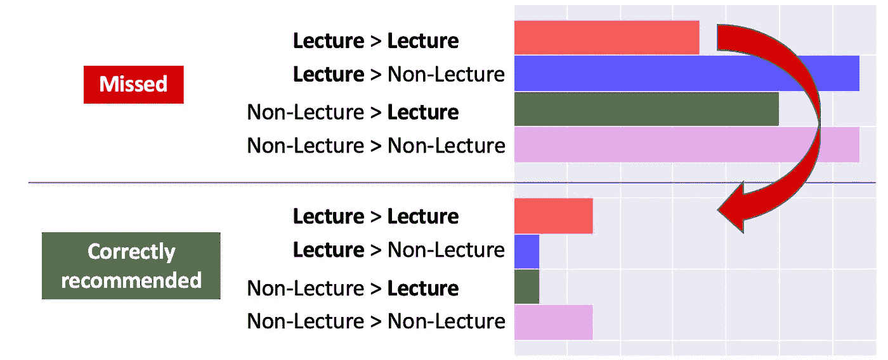
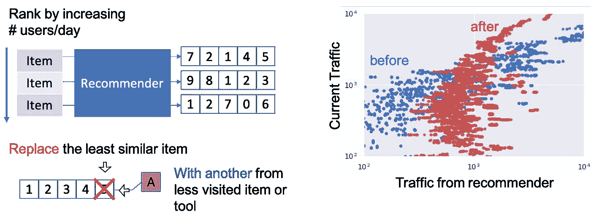
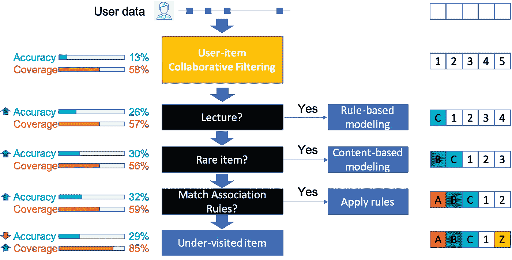

# 为 nanoHUB.org 构建一个混合推荐系统

> 原文：<https://towardsdatascience.com/nanohub-rec-b91e1a0beb06?source=collection_archive---------23----------------------->

## 为访问者和贡献者定制在线教育平台推荐器原型的案例研究

*本文记录了我在* [*洞察数据科学*](https://www.insightdatascience.com/) *担任研究员期间(1 月-3 月)项目的构思、思考过程和结果。2020).*

# **背景**

nanoHUB.org([www.nanohub.org](http://www.nanohub.org))是一个纳米技术教育/研究的在线平台。该网站的年访问量超过 140 万，是最大、最活跃的纳米技术在线社区之一。

图一:nanoHUB.org 主页(2020/2/10 快照)

> *“我们的使命是通过以用户为中心的科学工程来加速创新。我们的愿景是让科学工程产品对学习者、教育工作者、研究人员和商业人士来说是可用的、可发现的、可复制的和易于创造的。”—nanoHUB.org 使命宣言，*[https://nanohub.org/about](https://nanohub.org/about)

当深入研究这 140 万访问者的用户行为时，我对高流失率感到惊讶。如下图所示，大约 73%的访问者在离开网站前只访问了一个项目。换句话说，跳出率很高，这不是一个好消息。

图 2:2004 年至 2020 年数据的访客跳出率。

此外，这些反弹并不都发生在主页上，而是分散在整个网站的各个项目中。大多数流量来自搜索引擎——例如，当一名学生在谷歌上搜索一个纳米技术术语时，可能会出现几个 nanoHUB 项目。因此，这不是主页设计的 UX 问题，而是访问者在查看一个项目后失去兴趣的普遍问题。

> *“消费者研究表明，典型的网络会员在做出选择大约 60 至 90 秒后会失去兴趣……”卡洛斯·戈麦斯·乌里韦和尼尔·亨特。2016.网飞推荐系统:算法、商业价值和创新。ACM Trans 管理。Inf。系统。6、4、第十三条(2016 年 12 月)，DOI:https://DOI . org/10.1145/2843948*

推荐系统的主要目标是通过将相关商品放在点击可及的范围内来吸引访问者，看起来这正是 nanoHUB 所需要的。

提高访客留存率有利于 nanoHUB 的商业模式。作为一个内容依赖于社区贡献者自愿贡献的在线平台，贡献者群体与访问者群体相比同样重要。所以在设计推荐人制度的时候，不能忘记投稿人的利益。

一般来说，贡献者希望他们的内容被使用和认可。新内容尤其难以吸引注意力。如果一个推荐系统建立的不小心，那么受欢迎的项目会获得更多的推荐流量，在推荐系统中这个所谓的“富人越来越富”的问题上变得更加受欢迎(详见下面 Baptiste Rocca 的精彩文章)。显然，在设计有效的推荐系统时，还必须考虑贡献者的利益，即公平地重新分配推荐者流量，以推广新的和未充分使用的项目。

 [## 推荐系统简介

### 几种主要推荐算法综述。

towardsdatascience.com](/introduction-to-recommender-systems-6c66cf15ada) 

最后，与贡献者的兴趣相似，nanoHUB 的商业模式更喜欢推广一种特殊的项目——在线模拟工具([https://nanohub.org/resources/tools](https://nanohub.org/resources/tools))。这些工具是 nanoHUB 的明星产品，具有长期的商业重要性和影响。只要有可能，我想把它们推荐给用户来推广它们。

# 业务 KPI

综上所述，本项目追求三个业务 KPI:
1 .**推荐器有效性**:该 KPI 可以基于 ML 模型的准确性进行评估。
2。覆盖率:这个 KPI 被定义为推荐者流量覆盖项目的均匀程度。
3。**特殊产品促销**:该 KPI 定义为特殊种类物品——模拟工具——的预期流量增加量。

我想花点时间来回答这个问题“人为地保持所有项目的覆盖范围一致真的公平吗？”在我看来，不是的。项目的质量当然各不相同，高质量的内容自然会吸引更多的访问者。人为地保持所有项目接收相同的流量将冲淡用户观看的内容质量。因此，从长远来看，这样做会损害业务。然而，策略是最初提供统一的覆盖作为起点，低质量的内容将获得低评级。在未来的某一点上，项目的评级将成为推荐系统的一个特征，并且覆盖范围将根据项目的评级进行相应的调整。这超出了为期 3 周的洞察项目的范围，将在下一阶段实施。

# **数据准备和设置**

为了建立推荐系统，需要访问者-项目交互数据。这些数据告诉我们哪个访问者在什么时间查看了哪个项目。由于 nanoHUB 不需要注册就可以查看除模拟工具之外的项目，所以我不能依靠注册用户的网络数据来形成训练集。这样形成的数据集是不完整的，并且严重偏向模拟工具，因为访问者需要注册和登录才能使用模拟工具。此外，网络 cookie 的使用是最近为 nanoHUB 添加的，仍处于实验阶段，所以我不能依赖 cookie 来形成用户活动会话。因此，需要一种特别的方法。

为了简单起见，我决定使用 nanoHUB OLAP 数据库中的 web 日志表。这个 web 日志表是原始 Apache web 日志的过滤版本，由跨越 17 年的 4 亿行组成。

图 3:数据清理过程和访问者会话形成的总结。

在检查了 web 日志之后，我意识到在这个数据清理过程中有两个挑战。如何有效聚合日志形成用户会话？
2。移除 bot/crawler 流量

用户会话被定义为访问者连续活动的一部分。比如 IP 123.456.789.11 在特定时间访问了 A 项、B 项、C 项。这些形成了构建推荐系统所需的用户-项目交互矩阵。具有少于 2 个项目的任何会话对于形成用户-项目交互矩阵是无用的，因此被移除。为了防止共享相同 IP 地址的两个访问者的错误加入(这种情况可能发生在例如大学实验室中),当 IP 地址在 12 小时后变为非活动时，会话结束。

为了处理大量数据，SQLAlchemy 用于将数据从 OLAP 数据库虹吸到本地 HPC 环境中，Spark 用于将日志映射到会话中。在具有 20 个核心和 64 GB RAM 的单个节点下，这个 mapreduce 过程可以在 8 小时内完成。

数据探索过程中的一个观察结果是发现了剩余的 bot/crawler 流量。SQL 中过滤后的 web 日志应该会删除所有 bot/crawler 流量。然而，发现事实并非如此。从原始的 Apache web 日志到 SQL，这个过程主要依赖于 bot/crawler 的自我识别。例如，来自 Bing bot 和 Knowledge AI 的两个日志如下图所示。

图 4:(左上)一个可疑机器人从主页爬行的网络日志。(右)可疑机器人的访问次数与在每个页面上花费的秒数。显然，在 2300 页上花 1 秒钟很可能是非人类行为。(左下)来自 Bing 和 Knowledge AI 的自识别爬虫流量。

并非所有的机器人/爬虫都能自我识别。在上图中，检测到一个可疑 bot 行为的实例，显示从主页开始的周期性(大约 1 秒)爬行行为。这种记录必须被识别和删除，因为它们是非人类的，并且使结果偏向网络图的连通性。部署了两种策略来对抗这些非自我识别的机器人/爬虫:1 .基于聚类的僵尸检测技术；2 .使用用户项目协同过滤技术。

图 5:(左)散点图和(右)KDE 图，显示了已访问的项目数与活动(> 200 个已访问项目)人群的平均时间。每个点都是一个独立的 IP 地址。

为了获得可疑 bot/crawler 流量的概览，我绘制了每个 IP 地址访问的项目数与平均花费时间的关系。这些聚集的度量是 IP 地址行为的相当粗糙的表示。可以使用会话来代替，但是如果检测到某个 IP 地址有 bot/crawler 行为，它的所有会话都会被丢弃。选择这些指标也是为了避免大量的数据点。总体而言，散点图和 KDE 图中的已访问项目数与平均花费时间图如上所示，其中仅显示了已访问项目数> 100 的部分，从现在开始，我将称之为“高使用率人群”。从 KDE 图中，可以看到两个不同的高使用率人群。一个是用红色虚线标记的，圈出了平均每项花费时间低而使用率高的人群。这对应于 IP 是爬虫的高可能性。另一方面，用蓝色虚线标记的另一条曲线，圈出了显示每个项目平均花费时间高和使用率高的人群。这可能是一个正常的活跃用户。

在没有进行详细的聚类分析的情况下，我应用了一个简单的截止方法，从数据集中删除大于 200 个项目并且平均花费时间少于 40 秒的 IP。

总体而言，与总体会话相比，可疑的 bot/crawler 数量较少。此外，用户-项目协同过滤技术具有一定的防范爬虫的能力。直觉是，机器人/爬虫的行为方式类似，查看大量与 web 图形空间密切相关的项目，并且很可能集中在主页周围。这导致内容相似的大型会话。普通访客的会话要小得多，内容也多样化。在用户项目协同过滤下，当寻找与普通访问者行为相似的访问者时，机器人/爬虫因此被过滤掉。

由于 bot 检测不是这个项目的主要主题，我不会进一步复杂化这项工作，而是使用清理后的数据集(总共约 200 万个会话)来构建 nanoHUB 的推荐系统。

注意:小型数据集可能面临许多独特的挑战。我最近了解到一个有趣的项目，该项目通过 Minting 预测了加州附属住宅单元的采用，Minting 遇到了一个小数据集问题，并使用各种 ML 技术解决了该问题。

 [## 甜蜜的家！

### 预测加州附属住宅单元的采用情况

medium.com](https://medium.com/@mintingye_43620/home-sweet-home-747df73d8808) 

# EDA:基础

进行基本的 EDA 是为了理解数据、获得洞察力、确认直觉和发现异常。其中包括以下:
1。**每次会话查看的项目数量直方图**:如图 2 所示，证实了高跳出率的用户行为。
2。**跟踪已知用户以验证会话形成**:我检查已知用户(包括我自己)的会话，并直观地检查活动。这些行为可以被直观地解释，并且从这种观察来看，会话被认为是准确的。
3。**特性探索，会话长度**:项目之间的持续时间可以解释为用户在该项目上花费的时间。这可能与用户对该项目的情感相关，因为被吸引的用户更关注该项，导致更长的会话。然而，这取决于各种因素，包括项目内容长度、假设用户没有停止另一个活动(午休、访问一些其他网站等)。).因此，该特征不包括在研究中。
4。**特征探索、内容相似度**:当按时间顺序(项目+下一个查看的项目)检查相邻活动时，发现内容相似度很高。这将在后面的章节中讨论，并成为提高推荐器准确性的重要特征。

# EDA:覆盖率

网站流量常见的一个关键问题是[“长尾”问题](https://link.springer.com/chapter/10.1007/978-3-642-13287-2_4):很少有高访问量的热门项目，而很多访问量低的项目。这也发生在 nanoHUB 上，如图 6 所示。

图 6:(左)nanoHUB.org 项目(资源)的“长尾”。(右图)在未优化推荐流量的情况下实施标准推荐系统时，“越富越富”问题的图示。

这种“长尾”问题对 nanoHUB 的贡献者来说是不可取的，并伤害了他们贡献内容的动机，这对 nanoHUB 依赖自愿贡献者的内容来繁荣的商业模式产生了负面影响。贡献者更喜欢他们自己内容被广泛快速的曝光。“广泛”曝光是指浏览该项目的访问者数量。这是一个长期的指标，也是基于项目的优点-如果项目是低质量的，这是可以理解的，也是合理的低流量。这种基于价值的度量是项目的评级，并且由于时间限制，在推荐系统中没有实现。“快速”曝光意味着新发布的内容需要以主动的方式“推”给相关受众，而不是被动地等待被发现。通过修改覆盖范围并积极地推广未被访问的和新的项目，推荐系统可以给贡献者快速展示他们的新内容。

# 模型

推荐系统有多种模型，从协同过滤技术到神经网络。对于这些技术的回顾，我推荐 Pavel 的关于推荐系统的[机器学习系列。为了演示基于神经网络的推荐系统如何为用户提供有效和定制的体验，我想向您介绍我的朋友 Sid Wang 博士最近的项目:commaful 的故事推荐系统。](https://medium.com/recombee-blog/machine-learning-for-recommender-systems-part-1-algorithms-evaluation-and-cold-start-6f696683d0ed)

 [## 面向商业的故事推荐系统；

### 你读故事，我们读你

medium.com](https://medium.com/@yuwang2020/a-story-recommender-system-for-commaful-c9fd08045aaf) 

对于这项工作，我选择了用户项目协作过滤技术，因为它的简单性和可解释性。此外，正如附录中所讨论的，它提供了一定程度的抵御 bot/crawler 流量的健壮性，我只是以一种非常简单和特别的方式删除了它。

用户项目协同过滤技术的基本原理如图 7 所示。为了向访问者(“A”)推荐下一个项目，只需找到最相似的访问者(“B”)，并向访问者 A 推荐访问者 B 的项目。这是通过 kNN 搜索完成的，每个项目是一个特征(维度)，每个用户是一个数据点。

图 7:用户项目协同过滤技术的图示。

整个流程如图 8 所示。大约 200 万个会话被分成 85%-15%的训练测试部分。训练数据集用于构建用于协同过滤的用户-项目交互矩阵。测试数据集从每个会话中移除 1 个项目，并等待测试。对于测试数据集中的每个会话，推荐器给出 5 个推荐项目。将这些推荐项目与延期结果进行比较，如果延期结果与 5 个推荐项目中的任何一个匹配，则得分为 1，否则为 0。最终，标准的用户项目协同过滤技术给出了大约 15%的准确率，推荐了 5 个项目。

图 8:采用标准用户项目协同过滤技术的推荐系统的整体流程。

不算太坏。让我们花点时间研究一下这个误差，看看这个误差是否可以减小。因此，该策略是混合推荐系统的策略。对于标准用户项目协同过滤所缺乏的各个方面，我用来自更强预测器的另一个项目替换最不相似的项目。因此，混合推荐系统应该优于标准的用户-项目协同过滤。

图 9:这项工作的一般策略:用来自更强预测器的另一个项目替换最不相似的项目。这就是混合推荐系统的本质。

# 错误减少:关联规则挖掘

关联规则挖掘，也称为购物篮分析或 apriori 算法，是一种发现项目之间关联的技术。我推荐 Surya 的文章[关联规则挖掘](/association-rule-mining-be4122fc1793)来回顾这个概念。本质上，从用户-项目交互矩阵中，它能够说出诸如“如果访问者选择了项目 A 和 B，根据我对这种情况的观察，我非常确定项目 C 也被选择了”这样的陈述(规则)直观上，这种陈述的确定性称为“置信度”，这种规则的观察次数称为“支持度”。图 10 显示了挖掘出的强关联规则及其分布的例子。

图 10:(左)从训练数据集中挖掘强关联规则的例子。显示置信度和支持度(以计数为单位，而不是通常的百分比)。(右)所有挖掘出的关联规则的置信度分布显示出包含高置信度规则的递减尾部。

为什么要在用户项目协同过滤中挖掘关联规则？用户-项目协同过滤依赖于用户相似性进行推荐。另一方面，关联规则挖掘依赖于项目间的相关性来进行推荐。有了以上的理解，另一个奇怪的问题出现了:“关联规则挖掘比传统的项目-项目协同过滤有什么优势？”

事实上，关联规则挖掘和项目-项目协同过滤之间的差异很小，而且经常讨论不足。到目前为止，我发现的最好的讨论之一来自一个交叉验证的帖子[这里](https://stats.stackexchange.com/questions/256012/item-item-collaborative-filtering-vs-market-basket-analysis)。另外我想提供一些我的看法:
1。**关联规则挖掘给出了两个直观的度量**:置信度和支持度。这些度量标准，由于其直观的本质，在选择包含什么规则时是非常好的处理方法。例如，在这项工作中，我选择置信下限为 85%，支持值为 200。这直观地解释为“任何具有 85%正确率并在我的数据集中出现超过 200 次的关联规则，我将直接应用它们，而不管其他条件。”
2。关联规则挖掘对于流行项目的优势是健壮的。例如，如果项目 A & B 作为一个事实总是一起出现，但是访问者使用了项目(A，X，Y，Z)。(X，Y，Z)可以是非常受欢迎的项目，并且用户-项目或项目-项目协同过滤技术可以基于(X，Y，Z)推荐而忽略(A)。因为我们在 200 个计数上应用了支持截止，所以关联规则加强了对中等流行项目的预测。

# 减少错误:基于内容的建模

对我来说，在 EDA 过程中出现了一个“啊哈”时刻:如果没有有效的推荐系统，访问者如何从一个项目跳到下一个项目？无论答案是什么，都应该是一个需要考虑的重要特征。

为了发现项目之间的关联活动，我查看网络活动日志寻找答案。这一次，项目访问之间的事件掌握着线索。通过对一个月(2019/3/1–2019/4/1)的网络日志进行子采样，约 60%的关联事件是文本搜索、作者姓名 URL 点击或内容标签点击。因此，我决定使用标题文本相似性作为构建基于内容的模型的关键特征。由于时间限制，也为了避免受欢迎的作者占主导地位，作者姓名作为一个功能被放弃了——“富人越来越富”的问题，但就作者而言。由于 nanoHUB 计划对标签进行彻底检查，因此放弃了将标签作为一项功能。标签的质量也很低 nanoHUB 上的标签数量比商品总数还多，许多作者疯狂地将从“yoga”到自己名字的任何东西都贴上标签。

图 11:EDA 过程中的“啊哈”时刻。游客如何从一个项目转移到下一个项目？

标准的自然语言处理过程被应用于将标题转化为可用特征的准备工作中。使用 SpaCy，停用词首先被删除，但是词干化和词条化没有被应用，因为许多词是高度技术性的。比如“隧穿”是一个物理学术语，简化为“隧道”可能不太合适。在停用词被删除后，词频被绘制出来，如图 12 中左图所示。项目标题的词频，不出所料，大多遵循 [Zipf 定律](https://en.wikipedia.org/wiki/Zipf%27s_law)。最常见的词出现违规，这些词大多是与纳米技术相关的领域关键词。换句话说，这些包含的信息很少，在将一个项目与另一个项目分开时帮助很小。

为了加快速度，我决定去掉流行的词，只保留不常用的词，但是我还需要确保不常用的词能够覆盖所有的条目。图 12 的右侧显示了项目覆盖率与应用文档频率截止的关系。通过包含仅在所有标题中出现约 1%的罕见词，几乎所有条目都可以被表示。这样做可以减少词汇量，提高计算速度。

图 12:(左)去除停用词后的词频图。(右)涵盖的项目数与文档频率截止值

在将完整的标题简化为用生僻字表示的形式后，我准备分析它们的相似性。在两个标题之间，相似性被定义为(共享单词的数量)/(较短标题中的单词的数量)。这是相似性的一个相当粗略但快速的定义。

进行 t 检验:1 .训练集中每个会话中按时间顺序相邻的项目对，以及 2。来自所有标题的随机项目对。结果分布如图 13 所示。

图 13 :(左)随机配对抽样与(右)相邻配对抽样的相似性得分分布。

很明显，两个抽样分布偶然出现的零假设可以被拒绝。访问者选择的项目和下一个项目具有相似的标题。

图 14:在线和离线评估标题相似性的内容建模管道。左下角显示了两个相似性得分示例。

因此，从现在开始，推荐者的任务是琐碎的。给定前一个项目，推荐器在所有项目中搜索并找到一个具有最相似标题的项目。如果相似性得分高于临界值(在本工作中，相似性临界值= 0.75)，则该项目被接受为推荐。否则，不进行基于内容相似性的推荐。这遵循混合推荐系统的一般策略:尝试用来自更强预测器的项目替换最不相似的项目，如果这样的预测器存在的话。

寻找具有最相似标题的项目可能是一项计算量很大的任务。例如，对于 8000 个项目的总体而言，(8000 * 8000/2–8000)=必须进行超过 3100 万次评估。这对于并行处理来说还是可以管理的，但是随着项目数量的成倍增长，这很快就会变成一项不可能完成的任务。使用这种预先生成的表的优点是速度，因为它有效地减轻了离线计算标题相似性的负担，即每周重新计算相似性表。在在线评估中，计算标题相似性的任务是即时完成的。然而，这并不意味着需要评估(1 * 8000–1)= 7999 次，因为不是与一般项目群体进行比较，而是可以将其与来自用户项目协同过滤的候选项目进行比较，这减少了所需的评估数量。在这个项目中，我选择在线评估。

注意，通过以这种方式引入基于内容的建模，解决了标准协作过滤技术的另一个弱点:缺少项目的时间顺序作为特征。事实上，访问者所访问的项目的特定顺序对于协同过滤技术没有价值，因为用户-项目交互矩阵去除了任何时间顺序和重复。事实上，访问者决定下一步要看的内容，从邻居抽样项目对中可以明显看出，在内容相似性方面是高度相关的。因此，基于内容的建模的引入解决了标准用户-项目协同过滤技术的缺点，并增强了推荐系统。

# 减少错误:基于规则的建模

另一个观察结果来自前面的标题相似性方面:标题相似的一个主要原因是它们中的很大一部分是讲座。图 15 显示了在测试数据集中正确和错误推荐的情况下相邻对的项目类型。讲座与讲座之间的差异是误差的重要组成部分。

图 15:在测试数据集中正确和错误推荐的情况下，来自相邻对的不同类型的项目

访问者与讲座相关的行为是相当可预测的:访问者倾向于观看系列中的下一个讲座。这可以简单地通过观察相邻项目对中的项目来得出结论，这具有直观的意义。

图 16:基于内容的建模管道。如果时间上的前一个项目是一个讲座，则推荐系列的下一个讲座。

为了捕捉访问者可能观看系列中的下一个讲座的趋势，我实现了检测讲座并找到系列中的下一个讲座的函数。该功能扫描所有项目，以“ABC 123 讲座 09…”的形式捕获标题，“XYZ 123:标题”等。对于讲座编号不存在的情况，例如“XYZ 123:标题”，讲座按照访问者数量降序排序。这是基于一个假设，即随着讲座系列的继续，观众的数量会减少。

# 覆盖范围-准确性权衡

除了提高推荐准确率，还必须满足业务 KPIs)和(3):
2。**覆盖率**:这个 KPI 被定义为推荐者流量覆盖项目的均匀程度。
3。**特殊产品推广**:该 KPI 定义为特殊种类物品——模拟工具的预期流量增加量。

如果推荐系统按原样部署，也就是说，在不考虑其他因素的情况下被调整到最大的准确性，则所得到的流量模式被标记为“之前”,如图 17 所示。图 17 中显示的每个点都是一个单独的项目。“当前流量”是该项目从网络活动日志中收到的访问者数量。然后，每个项目的“当前流量”被平均分成 5 份，并分配给 5 个推荐项目中的每一个。这是一个非常理想的情况，假设访问者会点击推荐者。这样一来，原来的流量被重新分配，被贴上了“来自推荐者的流量”的标签。显然，存在“富人越来越富”的问题——已经受欢迎的项目也从推荐者那里获得更多的重定向流量。

为了提升较少访问的项目，使用先前的替换方法，除了不是用来自更强预测器的项目替换最不相似的项目，而是现在用较少访问的项目替换它。当然，就推荐器性能而言，这个较少访问的项目将不如它所替代的项目好。希望是，通过替换 5 个推荐项目列表中最不相似的项目，准确度损失的量将很小，而覆盖增益的量将很大。换句话说，我愿意用精确度的小幅度下降来换取覆盖范围的大幅度增加。

图 17:(左)推荐较少访问项目的策略。通过将每个较少访问的项目与 5 个推荐反向配对，并随后根据可见性(访问者数量/天)对它们进行排名，覆盖范围和相关性得到了平衡。(右)覆盖优化前后访客流量与推荐者重定向流量的对比。

当选择这种较少访问的项目时，必须在相关性和覆盖范围之间保持微妙的平衡。为了选择较少被访问但也相关的项目，首先基于项目的可见性对其进行排序，可见性被定义为每天的平均访问者数量。这为项目建立了一个优先级队列——当被选择推荐时，较稀有的项目将具有优先级。每个项目通过推荐系统运行，以获得 5 个最相关的项目。这是一个单项建议，如图 17 所示。为了不与主推荐者混淆，我将这个表称为“较少访问的项目推荐者列表”。当向访问者发布推荐时，从最少访问的项目开始遍历“较少访问的项目推荐者列表”，并且如果任何推荐的项目与访问者在会话日志中查看的任何项目相匹配，则选择较少访问的项目来替换推荐者列表中最不相似的项目。

由此产生的覆盖率改进如图 17 所示。在覆盖优化之前(标为“之前”)，存在“富者愈富”的问题。优化后(标记为“After”)，所有项目的推荐流量更加平衡，确保所有项目通过推荐系统对访问者具有良好的可见性。

另一个重要的商业指标是模拟工具的推广。为了保持管道简单，模拟工具，不管受欢迎程度如何，都被放在“较少访问的项目推荐列表”的顶部。这给了他们被选中的最高优先权。

# 结果

对于上面描述的所有模型例程，整个管道如图 18 所示。

图 18:整个推荐系统管道。

在引入基于规则的建模、基于内容的建模和关联规则挖掘之后，整个混合推荐系统达到了 32%的准确率，相比之下，标准协同过滤技术的初始准确率为 13%。在将最不相似的项目替换为较少访问的项目后，准确率略微损失到 29%，但覆盖率显著增加到 85%。这就是上一节提到的“精确度-覆盖率”的折衷。

关于管道的一个细节是模型的排列(用黑色标记),遵循标准的协同过滤。没有直接的比较来定量地衡量从各种技术中选取的项目之间的相似性得分。一个假设是，随后的模型是比标准的协同过滤技术更强的预测器。因此，插入总是出现在队列的开头，而移除总是在末尾。

# **生产实施计划**

由于时间限制，推荐系统是在 Jupyter 笔记本环境中原型化的，不适合生产。然而，这并不意味着推荐系统的设计没有考虑产品。我想在这里简单地谈谈我将这个模型投入生产的计划，这是这个项目的下一阶段。

为了使其适合于生产，推荐系统是用流线型的、更简单的模型而不是计算昂贵的、高级的模型如神经网络来构建的。正如前面所讨论的，这个决定对我们的模型施加了一些限制:协同过滤不考虑事件的特定时间顺序，但是像 LSTM 和马尔可夫链模型这样的高级技术可以。访问者查看的项目已被证明在时间顺序上是相关的，这一缺失的特征可能有助于进一步提高模型的准确性。模型复杂性、可解释性和产品可部署性之间的权衡是一个重要的优化，需要进一步的工作。目前，我坚持使用不太复杂的模型，以获得更好的可解释性和可部署性。

生产的另一个重要方面是计算成本。如果建议是基于访问者的会话日志，那么这个建议是在线的，这意味着根据访问者的当前会话数据实时计算接下来的 5 个项目。这可能是一项计算量很大的任务。当我以稍微不同的方式对模型进行训练测试时，发生了一些奇怪的事情。不是使用每个访问者的完整会话日志，而是将会话分成 2 个一组的元组。例如，如果访问者以时间顺序(1，2，3，4)查看项目，则结果元组是(1，2)，(2，3)，(3，4)。每个元组可以被视为一个新的小型会话。测试集以相同的方式形成，并且元组中的第二项(时间上较晚的项)被保留。如果用这样的二元组训练推荐系统，得到的准确度大约是 19%。

这是一个奇怪的观察，因为它表明了访问者的项目偏好的马尔可夫属性，也就是说，访问者的下一个项目很可能依赖于并且仅依赖于之前查看的项目。访问者行为的马尔可夫性假设可以将推荐计算的负担从在线转移到离线，代价是准确率下降约 10%。如果我愿意做出这样的折衷，生产的解决方案就会变得简单得多。推荐器离线基于从 web 日志生成的访问者会话的二元组为每个项目计算 5 个项目。例如，这种刷新可以由 cron 调用，并且每周执行一次。
2。产生的推荐可以存储在 SQL 表中，主键是项目 ID，一列包含 5 个推荐的项目。
3。推荐 SQL 表可以由前端拉，并显示在现场网站。

# 结论

在这个项目中，一个混合推荐系统的原型是 nanoHUB.org，一个每年有超过 140 万访问者的在线教育和研究平台。混合推荐系统由用户-项目协同过滤、基于内容的模型、基于规则的模型和关联规则挖掘组成。附加模块修改最终建议，以优化覆盖范围和模拟工具推广。总体而言，推荐系统实现了 29%的准确率和 85%的覆盖率。推荐系统满足目标业务 KPI，包括推荐准确性、覆盖范围和特殊内容推广。我希望这个新功能可以增强每年 140 万用户的 nanoHUB 浏览体验，并了解更多关于纳米技术的知识！