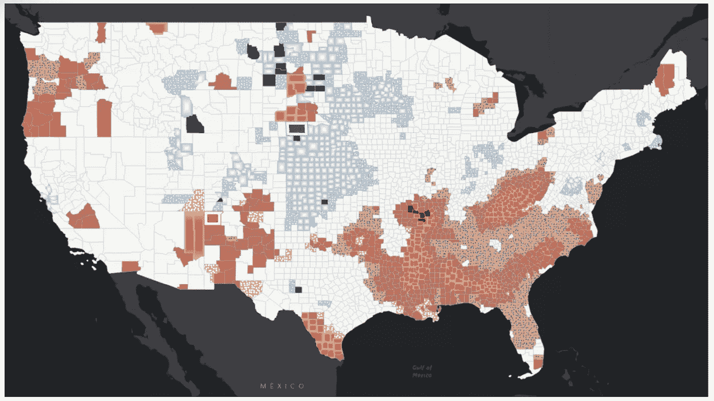
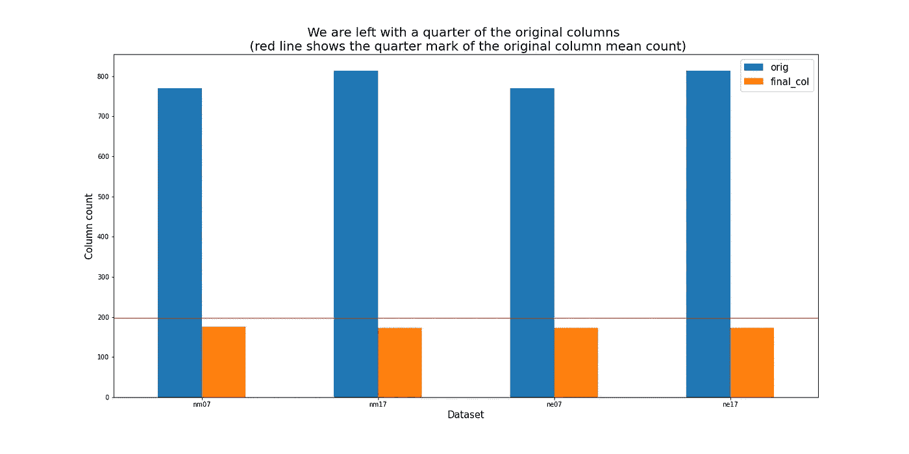
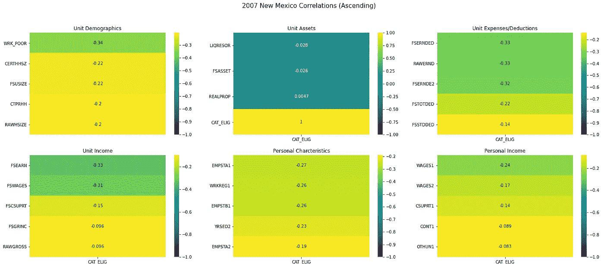
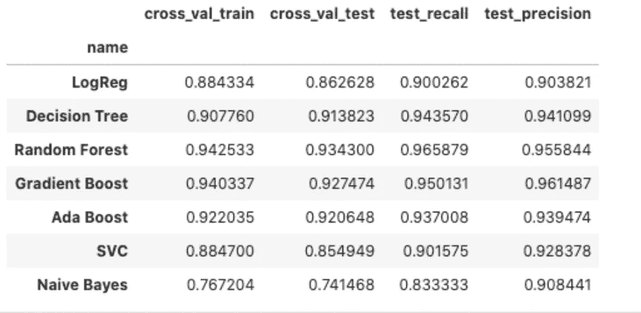

# 缩小数据范围

> 原文：<https://towardsdatascience.com/narrowing-the-data-3adeb6e04b02?source=collection_archive---------41----------------------->

## 缩小大型数据集范围的技术探索。

阿什利·朱利斯在 [Unsplash](https://unsplash.com/s/photos/blue-data?utm_source=unsplash&utm_medium=referral&utm_content=creditCopyText) 上拍摄的照片

最近，我完成了一个项目，预测美国面临粮食不安全风险的社区。你可以在这里找到关于那个项目[的信息，包括代码和一个 PowerPoint 演示。在那个项目中，我使用了美国农业部的政府数据集，名为 SNAP QC 数据。这些是超过 40k 条记录和 800 多个特性的大规模数据集，并附有解释特性的技术文档。我将对我如何缩小数据集进行技术分析。](https://www.melissa-anthony.com/help-in-a-snap)

# 什么是 QC 数据集？

美国农业部的 SNAP 程序使用“质量控制”数据。这些是质量控制数据集，这意味着它们已经以某种方式被手工挑选出来，以纳入最终的数据集。不幸的是，这些精挑细选的标准每年都在变化，尽管变化并不剧烈。由于政府数据对于这些项目来说是如此庞大，统计学家们正试图实现一些“特征”,这些特征代表了对那些参与项目的人的外部影响。对于 SNAP 参与者，大量不完整的申请被排除在外，这导致这些数据集更能代表受益者，而不是所有申请该计划的人。此外，这些数据集是加权的。这些权重是由对各州的经济影响决定的。例如，如果一个州宣布进入紧急状态，参与者的权重就会降低，以减少异常值对整个数据集的影响。

# 缩小数据范围:GIS

对 2007-2008 年数据的空间分析显示，与邻近县相比，这些县是异常值。这是在 ESRI 空间数据科学 MOOC 期间完成的。首先，构建了一个 2D 模型，它可以直观地显示一个县一年到下一年的变化。这是用 ESRI 的“2D 时间序列分析”工具建立的。接下来，使用他们的“新兴热点分析”工具来显示从 2007 年到 2008 年在统计上与其周围邻居有显著差异的县。

它通过“使用您提供的空间关系的**概念化**值来计算每个条柱的 [Getis-Ord Gi*统计](https://pro.arcgis.com/en/pro-app/tool-reference/spatial-statistics/h-how-hot-spot-analysis-getis-ord-gi-spatial-stati.htm) ( [热点分析](https://pro.arcgis.com/en/pro-app/tool-reference/spatial-statistics/hot-spot-analysis.htm))来实现这一点。时空热点分析完成后，输入 NetCDF 立方体中的每个条柱都会添加相关的 z 值、p 值和热点条柱分类。接下来，使用 [Mann-Kendall 趋势测试](https://pro.arcgis.com/en/pro-app/tool-reference/space-time-pattern-mining/learnmorecreatecube.htm#ESRI_SECTION1_F1EA94A3BA8940E0B56AB08A302D1C08)评估这些热点和冷点趋势。使用数据得到的每个[位置的趋势 z 值和 p 值，以及每个条柱的热点 z 值和 p 值，](https://pro.arcgis.com/en/pro-app/tool-reference/space-time-pattern-mining/emerginghotspots.htm#ESRI_USAGE_70F085D5839440D58C10E39343674812)[新兴热点分析](https://pro.arcgis.com/en/pro-app/tool-reference/space-time-pattern-mining/emerginghotspots.htm)工具对每个研究区域位置进行分类。—摘自工具上的 [ArcGIS Pro 文档](https://pro.arcgis.com/en/pro-app/tool-reference/space-time-pattern-mining/learnmoreemerging.htm)。

结果突出了新墨西哥州圣胡安的一个使用增加的热点。以及内布拉斯加州樱桃县的一个新兴冷点，那里的参与者减少了。由于 QC 快照数据来自州一级，无法按县过滤，我选择比较内布拉斯加州和新墨西哥州，以突出极端情况。我还想做一个 10 年的缺口分析，以反映 2008 年危机对面临粮食不安全风险的社区的影响。所以我最终得到了 4 个数据集:2007 年新墨西哥州和内布拉斯加州，2017 年新墨西哥州和内布拉斯加州。

由此产生的“新兴热点分析”图。(图片由作者提供)

# 缩小数据范围:高无效性

为了进一步缩小数据范围，我选择移除 100%为空的列，这意味着它们是不包含数据的要素。这些功能可能是为了在全国范围内使用而添加的，根本不符合内布拉斯加州或新墨西哥州申请人的任何用例。对于内布拉斯加州和新墨西哥州来说，这些列是不同的，从 2007 年到 2017 年，它们也是不同的列。简单地说，每个数据集中所有空值的列都被删除。

接下来，我发现了一篇名为“[缺失数据的比例不应用于指导多重插补的决策](https://www.researchgate.net/publication/331726516_The_proportion_of_missing_data_should_not_be_used_to_guide_decisions_on_multiple_imputation)”的论文，该论文讨论了高无效性的潜在概念。这篇论文得出的结论是，如果没有足够的信息来真实地表现这些特征，从这些栏目中收集的信息的完整性就会受到威胁。作者测试并得出结论，数据的价值比缺失的信息量更重要。因此，我决定将这些数据集中的高空性定义为超过 50%的记录被标记为空值的列。我做出这个假设是基于这样一个事实，即我在每个数据集中有大量的记录，这些记录至少有 50%或更多的数据是原始的。然后我删除了那些高无效列。

最后，在使用预测模型之前，我必须考虑数据集中剩余的空值。因此，我使用 sklearn 的简单估算器来输入其余值的平均值。使用平均值是因为一旦去除了高无效性特征，它是原始数据的合理表示。

移除高 nullity 值的列后剩余的列数。(图片由作者提供)

# 缩小数据范围:相关性

我选择将我的模型作为监督模型运行，目标变量为“猫 _ELIG”。这是一个将每个应用程序标记为“是”或“否”的字段，表示它们有资格获得 SNAP 优势。这在 2007 年还好，但在 2017 年，内布拉斯加州和新墨西哥州的所有申请都被接受。因此，与目标变量的相关性仅在使用 2007 年数据集时有效。为了进一步增加相关性的维度，我可以使用 PCA(主成分分析)来运行 2017 年的数据，PCA 最适合推断无监督数据之间的相关性(这意味着不定义目标变量，因为所有应用程序在 2017 年对“CAT_ELIG”都标记为“是”)。不过，我在这里的目的是在 2007 年，即最初的 GIS 热点分析年，找到统计上显著的相关性，并看看它们在 2017 年如何变化。

技术文件包括 6 个观察部分。我的最终数据集是每个部分的前 5 个相关特征，作为最终的列集。每个数据集都有非常相似的前 5 个相关要素，从新墨西哥州到内布拉斯加州只有一些差异。最终结果是 32 个特性+目标列。

使用 2007 年新墨西哥州数据集的每个类别的前 5 个相关性的示例。(图片由作者提供)

# ***缩小数据:型号***

对于这一分析，我想要一个可解释的模型，以便更准确地描述是什么影响了粮食不安全。由于高度多重共线性的内在可能性，我需要在最终模型中降低这种风险。一篇名为“[支持向量机与随机森林用于遥感图像分类:元分析和系统综述](https://www.researchgate.net/publication/344437400_Support_Vector_Machine_vs_Random_Forest_for_Remote_Sensing_Image_Classification_A_Meta-analysis_and_systematic_review)的论文讨论了 SVM 自 70 年代以来一直存在，是机器学习的真正进步，但它受到相关特征的高度影响。然而，兰登森林在一些情况下胜过了 SVM。由于随机森林使用 bootstrap 和要素采样，因此它可以同时处理行和列级别的数据集，从而大大降低多重共线性对结果的影响。最终，我选择了 Random Forest 来:

1.  帮助缓冲与其他功能相关的功能的影响。
2.  这给了我一个更高的精度和更少的超参数调整，从而通过不使其成为“黑盒”模型来增加其系数的可解释性。

最终找到正确模型的一个好方法是对数据进行几次初始测试，并比较分数。这可以告诉你哪些数据处理得很好。在测试和训练集上比较交叉验证的分数，以查看数据中有多少差异。对于这个项目来说，重要的是在正面预测方面出错，不管它们是否正确。这是因为，低估有需要的领域比担心被标记为需要更多支持但并不需要支持的领域更危险。因此，回忆被用来显示做出了多少正面预测，而精确则显示了多少正面预测是正确的。数字越接近，预测模型就越准确。

图片作者。

我使用带有随机森林、梯度推进和 Bagging 分类器的投票分类器来给出 95%的交叉验证分数。

*   出于上面给出的原因，我使用了随机森林。
*   通过平衡正精度来提高精度的梯度增强。
*   和精度分数的 bagging 分类器。

# 最后的想法

每个项目都是独一无二的。虽然在这种情况下选择可解释的模型减少了可以设置的超参数，但这使得特征选择成为提高准确性的少数方法之一。数据科学家是数据将讲述什么故事的最终决定者。有很多方法可以微调我用来缩小数据的步骤，但缩小特征的数量是至关重要的，因为高方差对准确性和解释非常不利。最终，数据科学家必须根据数据和手头项目的最佳表现做出决策。