# 使用贝叶斯状态空间模型的预测

> 原文：<https://towardsdatascience.com/natural-gas-price-prediction-using-bayesian-state-space-model-for-time-series-forecasting-f630dda1c808?source=collection_archive---------14----------------------->

## 基于单变量时间序列的价格预测

## 随机和季节性时间序列预测

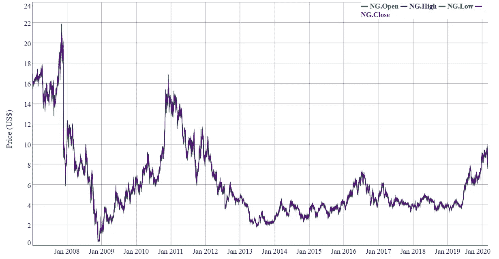

作者图片

ime 序列观测值被假定为线性依赖于一个未被观测的状态向量，该状态向量是由状态空间分析中的随机动态过程产生的。进一步假设观测值受测量误差的影响，并且与状态向量无关。因此，构成状态空间模型的两个主要部分是观察到的数据和未观察到的状态。

时间序列由随机过程(Yt；t = 1，2，.。。)，即由索引为 t(时间)的随机向量的有序序列。为简单起见，我们将考虑等距的时间点(每日数据、每月数据等等)。目标是预测下一个观测值[yn+1]的值，该值具有直到时间 n 的观测数据，(y1 = y1，.。。，yn)]。

## 数据加载和可视化:

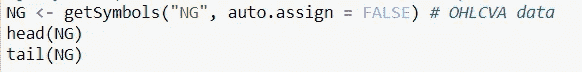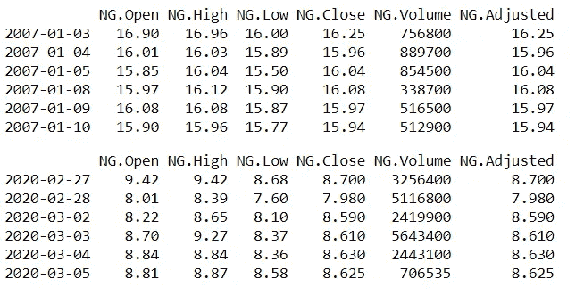

```
barChart(NG)
```

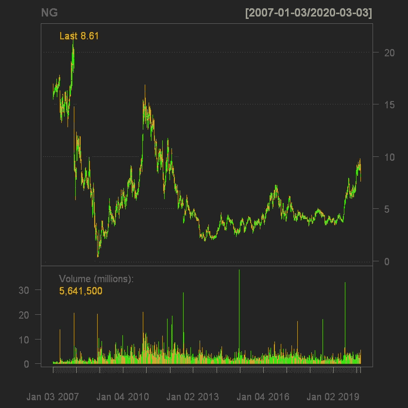

这一系列看起来显然是非平稳的，实际上是非常不规则和不稳定的。从 2007 年至今，该数据处于日常水平。我们可以看到，在 2008/2009 年期间，价格从近 20 美元大幅下跌至近 1 美元，然后在 2010/2011 年期间上涨至约 15 美元；然而，一个高度动荡的状态，因为可以看到所有的日期和最后的价格记录为 8.61 美元。

*   从这个时间序列中我们可以看出，价格肯定有一些季节性变化；每年冬天都有一个高峰，几乎每年冬天都有一个低谷的转折点。
*   同样，这似乎可以用一个加法模型来描述，因为季节性波动的大小在一段时间内大致恒定，似乎不取决于时间序列的水平，而随机波动似乎在一段时间内恒定。

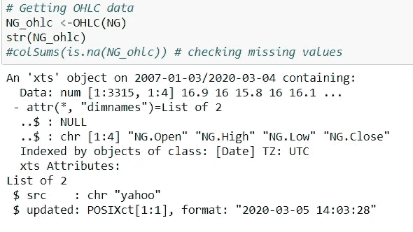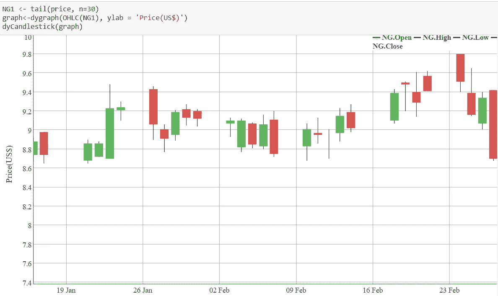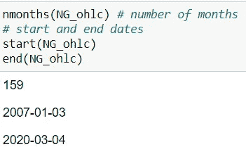

我们将进行单变量分析；因此，让我们从数据集中提取每月的“接近”价格。月度数据是为了便于计算。根据可用的计算能力，可以每小时、每天或每周采集数据。

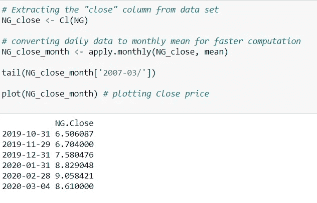

后续数据处理对于将数据转换为数据框架和进一步的时间序列以供未来分析非常重要。

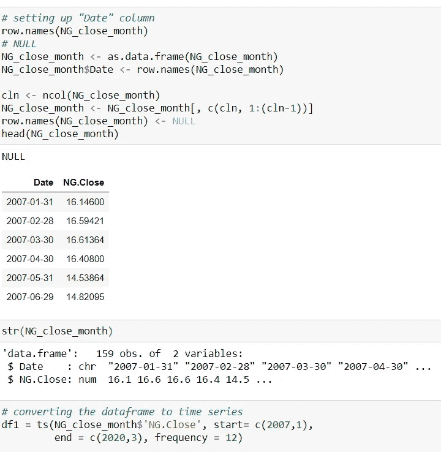

在这里，我们的数据集现在已被处理，我们准备好执行进一步的分析。

## 概率分布:

大多数统计模型依赖于正态分布，这种分布是对称的，具有典型的钟形。概率分布通常(不完全)用图表来表示，图表的横轴表示变量的可能值，纵轴表示发生的概率。

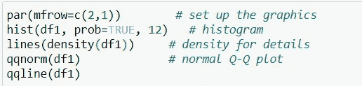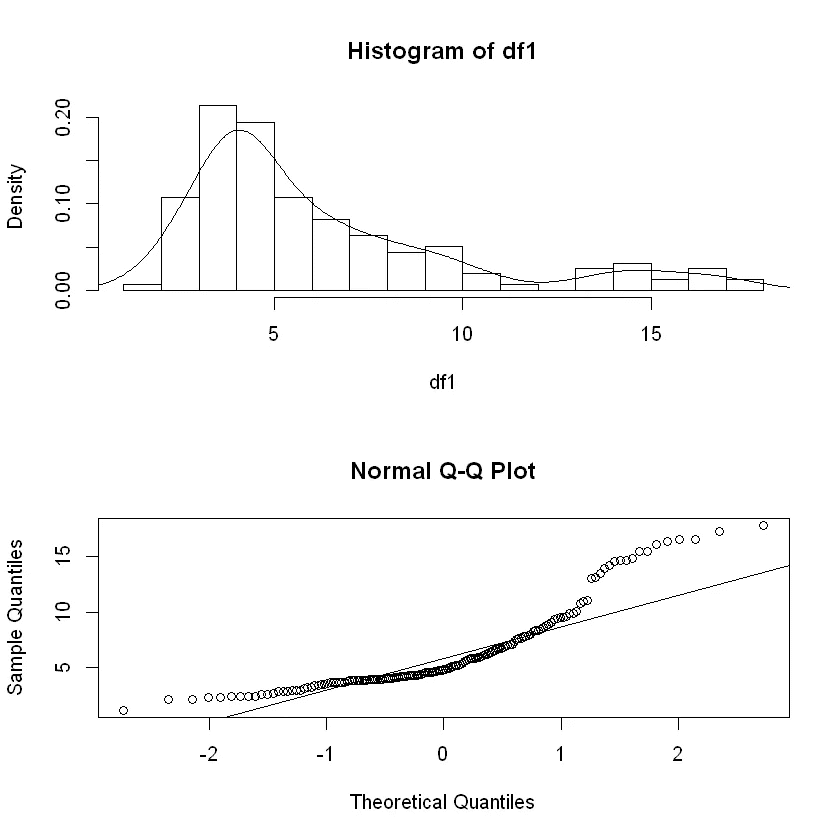

上面包括密度和正态 Q-Q 图的分布图清楚地表明，数据分布不是正态的，反映了非高斯特征。

## 平稳性测试:

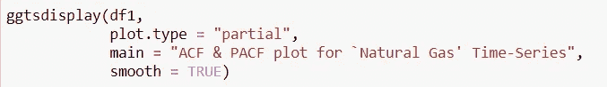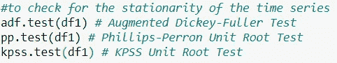

上述平稳性测试的输出显示了数据的非平稳特征。

## 标准化:

由于随机行为的值，我们将股票预测场景中的数据规范化。这里，不建议最小-最大归一化，因为股票值不限于某个价格范围；价格具有布朗运动，可以剧烈变化。因此，建议用初等标准化函数来标准化股票价格:

z =(X-平均值(X))/标准差(X)

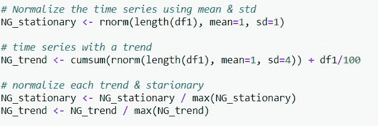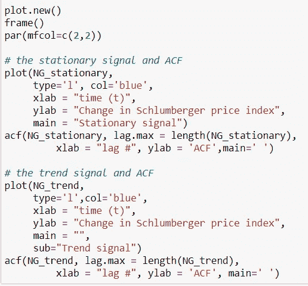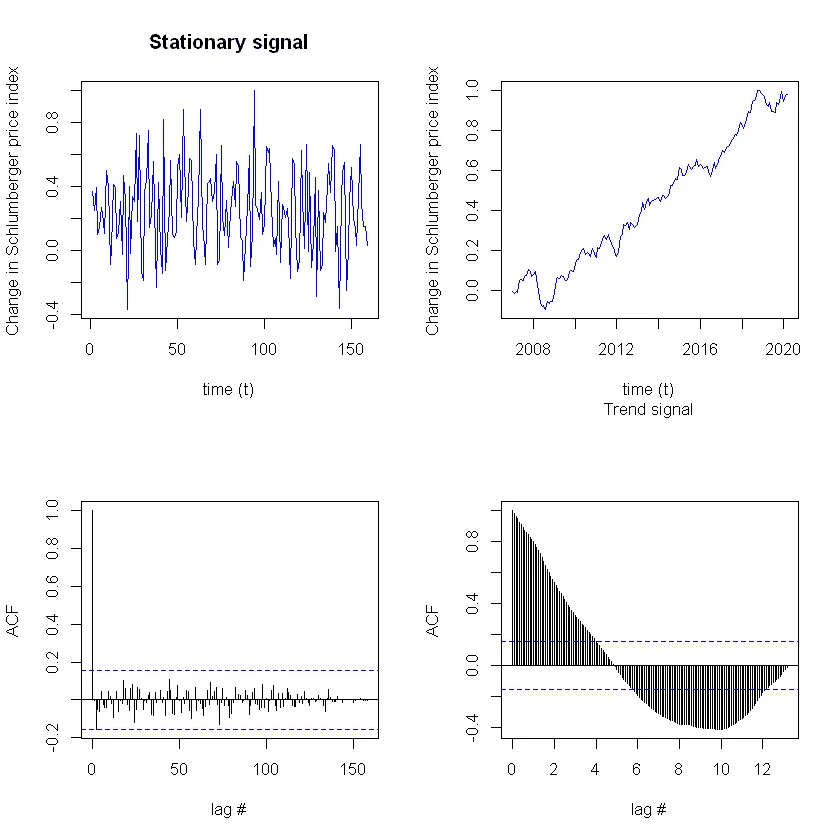

我们在这里看到:

*   稳定信号几乎没有超过 ACF CI 的滞后。
*   这种趋势导致几乎所有的滞后都超过了置信区间。

因此，可以断定 ACF 信号是平稳的。但是，趋势信号不是静止的。平稳序列在平均水平附近具有更好的方差，峰值是原始序列中干预的证据。我们将进一步分解时间序列，包括水平、趋势、季节性和噪声成分的组合。分解有助于在分析和预测过程中更好地理解问题。

## 分解:

分解一个时间序列意味着把它分成它的组成部分，这些组成部分通常是一个趋势部分和一个随机部分，如果数据是季节性的，则是一个季节性部分。

## 分解非季节性数据:

非季节性时间序列由趋势成分和随机成分组成。分解时间序列包括试图将时间序列分成这些单独的部分。一个季节性时间序列，除了趋势和随机成分外，还具有季节性成分。分解季节性时间序列意味着将时间序列分成这三个部分。让我们估计天然气 ts 的趋势、季节性和随机成分。

```
plot(decompose(df1), yax.flip=TRUE) # Decompose time-series
```

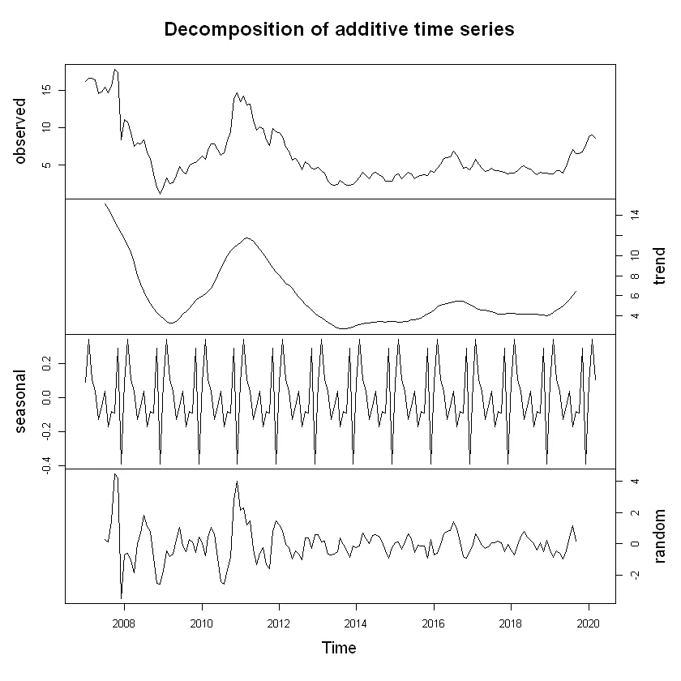

上面的图清楚地显示了趋势是不稳定的，我们可以从标准化部分的趋势信号图中看到这一点。季节性因素每年都存在一小段时间，最有可能是在冬季。总的来说，随着随机游走，价格波动很大。

## 单变量线性高斯状态空间模型的滤波、平滑和预测

不幸的是，状态空间模型没有普遍接受的符号。然而，在统计学和计量经济学应用中最常用的符号可以在 Harrison & Stevens (1976)和 West & Harrison (1997)的工作中找到。贝叶斯分析的主要焦点是未知参数的最大似然估计。我们将从一个局部模型开始介绍这种方法。

我们将使用一个基本水平模型进行预测，然后使用 ARIMA 和动态线性模型来比较预测结果。

## 状态空间模型:

状态空间模型基于这样的想法，即时间序列(Yt)是一些潜在的不可观测过程(θt，t = 1，2，.。。)，称为状态过程。

## 结构时间序列:

状态空间框架促进了时间序列分析的结构方法。在这种方法中，不同的未观察到的成分负责系列的动态。这些是趋势变量、季节性变量、周期变量，解释变量和干预变量的影响在被放入状态空间模型之前被分别识别。让我们理解局部水平模型的数学直觉。

时间序列通常被认为是一组按时间顺序排列的观察值 y1，…，yn。这里，表示时间序列的基本模型是加法模型。该公式可以写成:

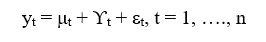

*   μt 是一个缓慢变化的分量，称为趋势；
*   ϒt 是固定周期的周期性成分，称为季节性；
*   εt 是随机噪声或称为误差的不规则分量；

为了开发合适的模型以及μt 和ϒt，我们需要随机游动的概念。我们可以考虑一个简单形式的模型，其中μt = αt，其中αt 是随机游走，不存在季节性，所有随机变量都是正态分布。我们假设εt 具有恒定方差σ2ε。这给出了模型:

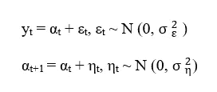

对于 t = 1，…..，n，其中εt 和ηt 相互独立，独立于α1。有两个参数，σ2η。这是一个 ARIMA(0，1，1)模型，但对参数集有限制。这被称为局部水平模型，为我们的分析提供了基础。它展示了状态空间模型的特征结构，其中有一系列不可观测值α1，…，αn，它们是状态，代表所研究系统随时间的发展以及一组观察值 y1，…，yn，它们通过状态空间模型与αt 相关。这适用于经典分析和贝叶斯分析。在εt 和ηt 不是正态分布的情况下，我们从最小方差线性无偏估计的角度得到了等价的结果。

最初我们假设，α1 ~ N(α1，P1)，其中α1 和 P1 已知，σ2ε和σ2η已知。因为随机行走是非平稳的，所以模型是非平稳的，并且随机变量 yt 和αt 的分布依赖于时间 t。

局部线性趋势模型，type = "trend "，具有相同的测量方程，但是在动态中具有时变斜率。基本结构模型 type = "BSM "，是一个带有额外季节性成分的局部趋势模型。

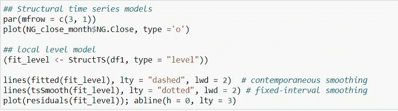

```
Call:
StructTS(x = df1, type = "level")

Variances:
  level  epsilon  
   1.26     0.00
```

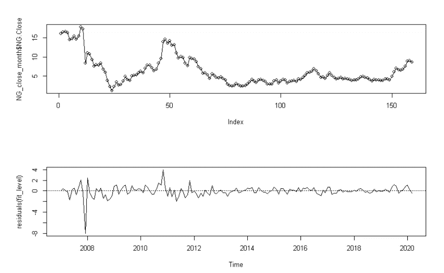

线性高斯状态空间模型中的所有显著性检验(以及置信区间的构建)都基于关于分析残差的假设。残差应该满足独立性、同方差性和正态性。残差的独立性和正态性可以使用 Box-Ljung 检验统计量进行诊断。可以通过检验标准化预测误差的方差来检查同方差性。

## 结构时间序列的预测；

下图显示了 12 个月的预测收盘价数据，以及 50%和 90%的概率区间。

```
plot(forecast::forecast(fit_level, level = c(50, 90), h = 12), xlim = c(2016, 2021))
```

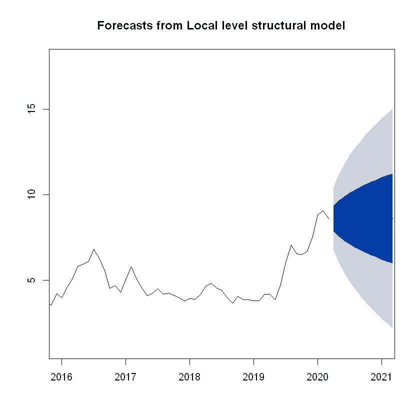

## 预测输出(结构局部水平):

```
pred <- predict(fit_level, n.ahead = 12)
```

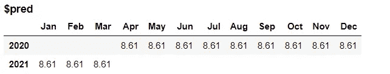

## ARIMA 模式:

自回归综合移动平均(ARIMA)模型可以转化为状态空间形式。

> 在 auto 中，arima 能够决定是否使用季节性 arima (SARIMA)模型。

```
auto.arima(df1, trace = T, stepwise = F, approximation = F)
```

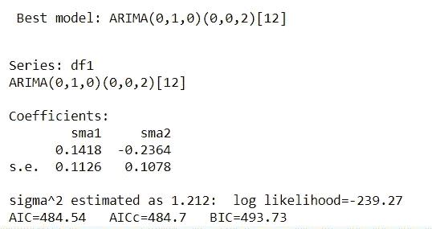

```
# Arima 
arima <- Arima(df1, order = c(0,1,0))
checkresiduals(arima)
```

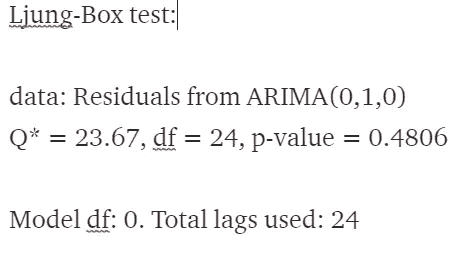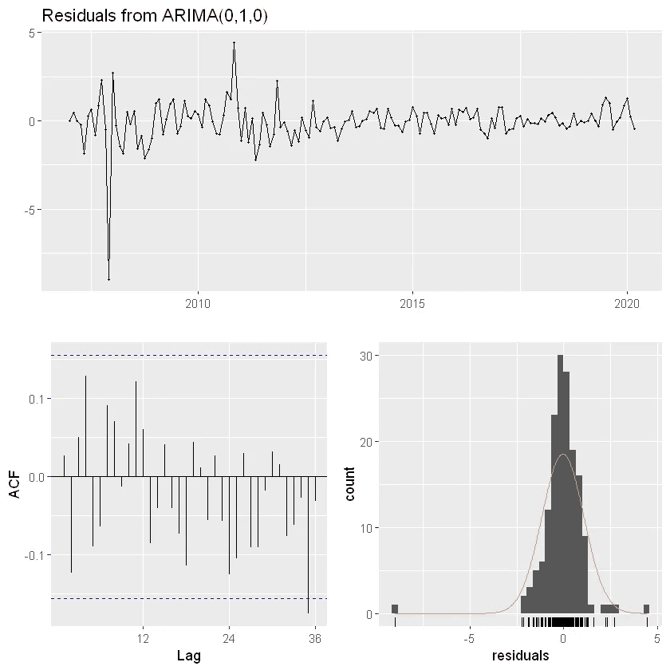

我们可以从第一个和最后一个图中看到，残差似乎不是白噪声。ACF 图显示残差之间不存在显著的相关性。

```
# Forecast of 12 months
pred_arima <- forecast::forecast(arima, h=12)
plot(pred_arima)
```

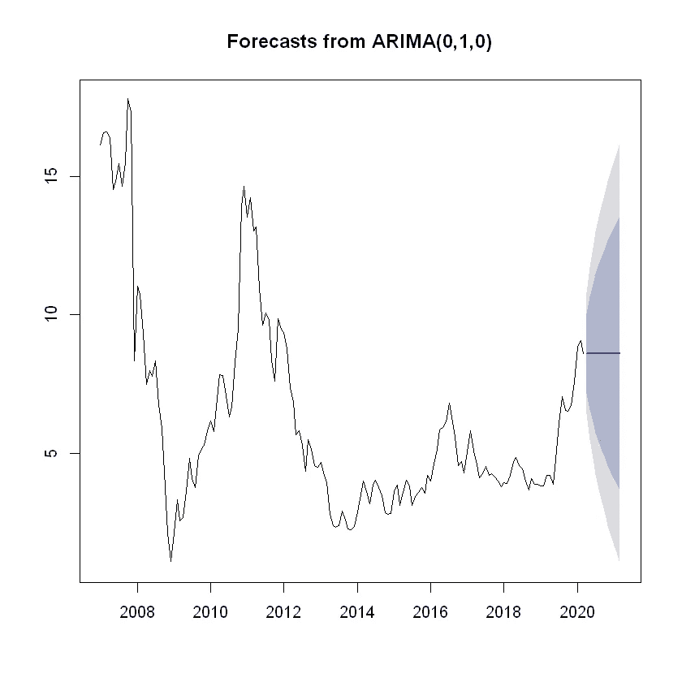

## 预测产量(ARIMA):

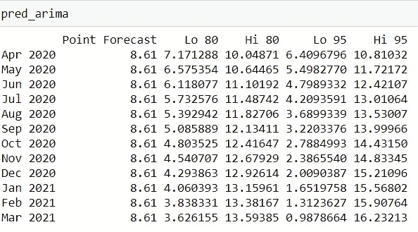

这种预测类似于结构时间序列。然而，我们将在下一节进一步检查动态线性模型。

## 动态线性模型(DLM):

动态线性模型是状态空间模型的特殊情况，其中状态和观察分量的误差是正态分布的。DLM 可以用两个方程来表示

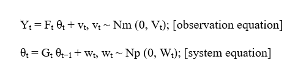

这里，Gt 和 Ft 是已知的矩阵，而(vt)和(wt)是两个独立的白噪声序列(即，它们是独立的，在它们之间和它们的每一个内)，分别具有均值为零和已知的协方差矩阵 Vt 和 Wt。

单变量时间序列(Yt，t = 1，2，.。。)是所谓的随机游走加噪声模型，定义如下:

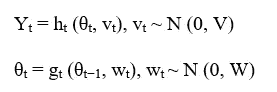

具有任意功能 gt 和 ht，更加灵活。误差序列(vt)和(wt)是独立的。线性状态空间模型将 gt 和 ht 指定为线性函数，而高斯线性模型添加了高斯分布的假设。

## 随机水平和确定性季节性:

多项式 DLM(局部水平模型是一阶多项式 DLM)，局部线性趋势是二阶多项式 DLM)。你可以在这里 找到更多 dlm 型号 [***的细节。***](https://www.jstatsoft.org/article/view/v041i04)

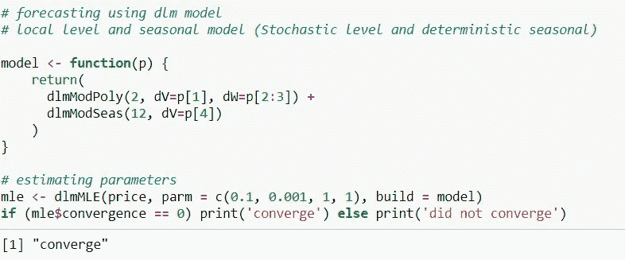

自变量 dV 和 dW 分别用于指定观测和演化协方差矩阵的对角线。

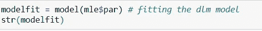

## 卡尔曼滤波器:

卡尔曼滤波器的主要目的是仅考虑观测值{y1，y2，.。。，yt1 }。因此，预测状态及其相关估计的关键属性是它们仅基于序列的历史值。过滤的目的是在每次引入新的观察值 yt 时更新我们对系统的了解。

```
# applying kalman filter
model_filter <- dlmFilter(df1, modelfit)
plot(residuals(model_filter, sd = FALSE), type = “o”, ylab = “Standardized prediction error”)
abline(h = 0)
```

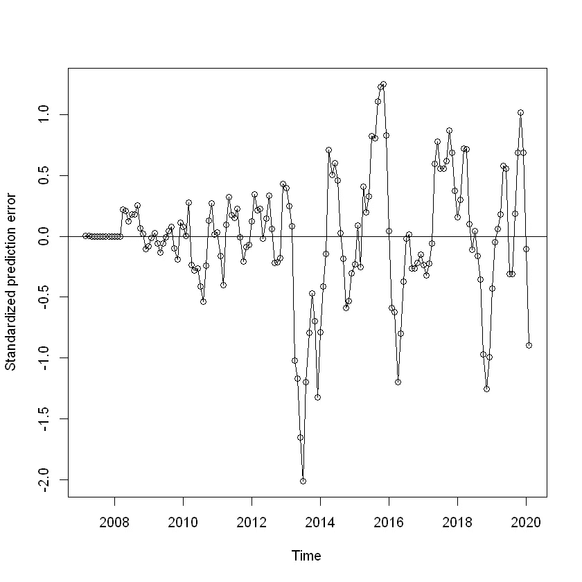

## 卡尔曼平滑器:

卡尔曼平滑器允许计算θt|DT 的密度，从 T = t1 开始，在这种情况下，θT|DT ~ N(sT = mT，ST = CT)，然后向后计算 T = T2、T = T3 等情况下的θT|DT 的密度。

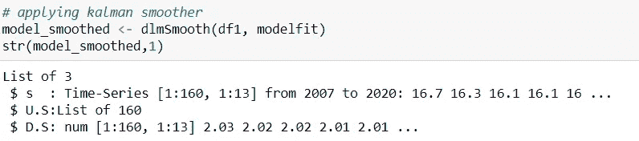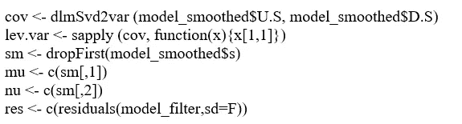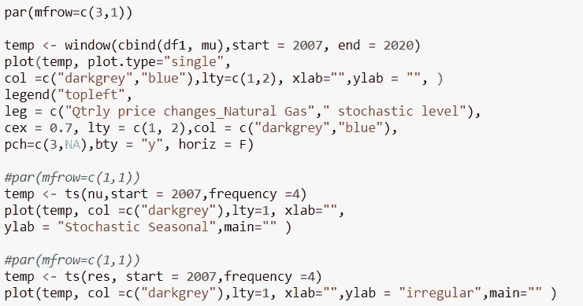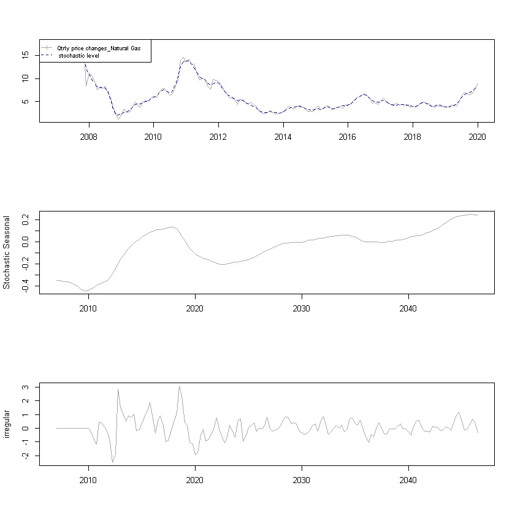

## 随机水平和确定性季节模型的随机水平及其 90%置信区间:

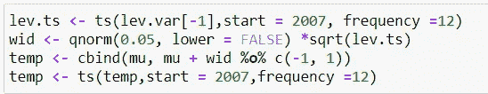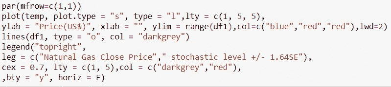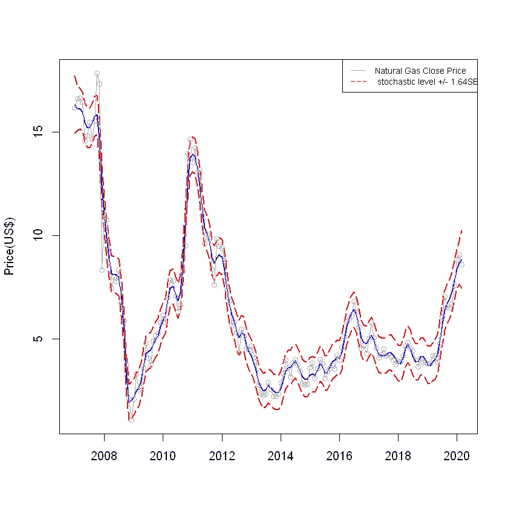

## 预测产量(DLM):

```
*forecast$f*
```

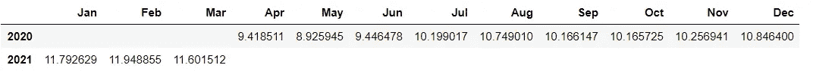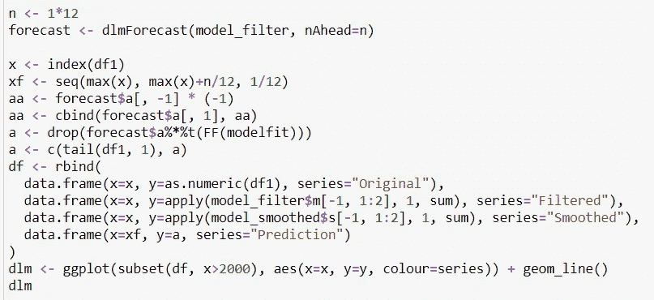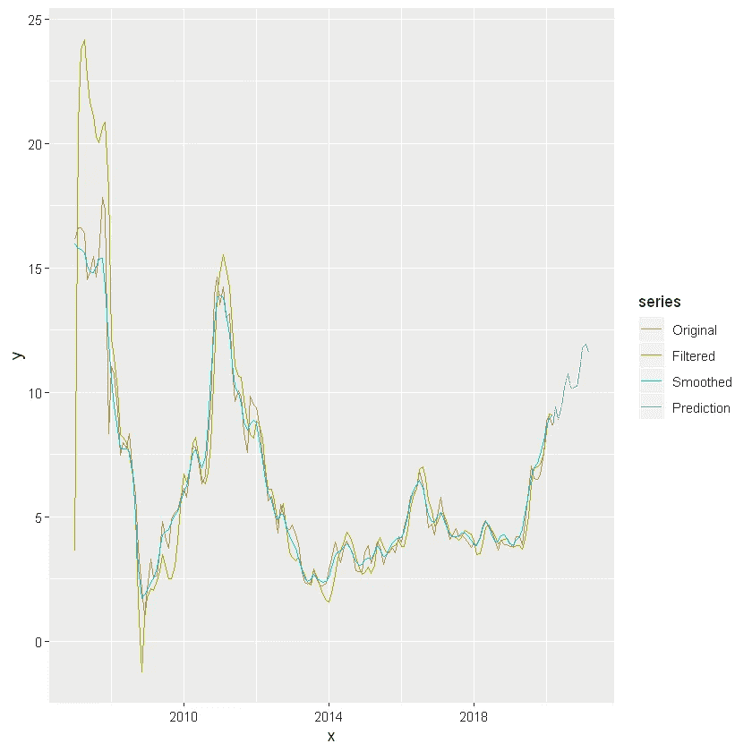

在这里，我们可以从上面的图中看到，该模型已经能够很好地捕捉趋势。经过过滤和平滑的线条在序列中一起移动，彼此没有太大差异。未来 12 个月的预测系列线是从原始系列结束的地方选取的

如果我们比较三种预测结果，我们发现，DLM 模型能够更好地捕捉趋势。

# 结论:

类似的方法可以用于分析和预测单变量和多变量时间序列。这里，结构时间序列计算基本结构模型的方差参数和状态向量的滤波均值的最大似然估计，即由随机游走加噪声组成的常数 DLM，局部线性趋势。为了保持一致性，我们在所有三个模型中使用了相同的数据集。有趣的是，ARIMA &结构模型不能像 dlm 模型那样提取季节性成分。在 dlm 建模的情况下，我们没有考虑季节因素。但是，为了更好地预测，也可以添加季节性因素。

DLM 是一个相当有趣的软件包，我想在未来进一步使用它进行多变量分析。

**我可以到达** [***这里***](https://www.linkedin.com/in/saritmaitra/) 。

*注意:此处描述的程序是实验性的，应谨慎使用。所有此类使用风险自负。*

*参考文献:*

1.  *Petris，g .，Petrone，S., & Campagnoli，P. (2009 年)。动态线性模型。在带 R 的动态线性模型中(第 31-84 页)。纽约州纽约市斯普林格。*
2.  乔瓦尼·佩特里斯(2010 年)。动态线性模型的 R 包。统计软件杂志，36(12)，1–16。
3.  *德宾 J，库普曼 SJ (2001 年)。用状态空间方法进行时间序列分析。牛津大学出版社，牛津。*
4.  哈里森 PJ，史蒂文斯 CF (1976)。“贝叶斯预测。”皇家统计学会杂志 B，38，205–247。