# 基于人工神经网络的天然气现货价格预测

> 原文：<https://towardsdatascience.com/natural-gas-spot-price-prediction-using-artificial-neural-network-56da369b2346?source=collection_archive---------21----------------------->

## 基本面分析的明确指南&时间序列价格预测

## 使用门控循环单元(GRU)架构的多变量案例研究

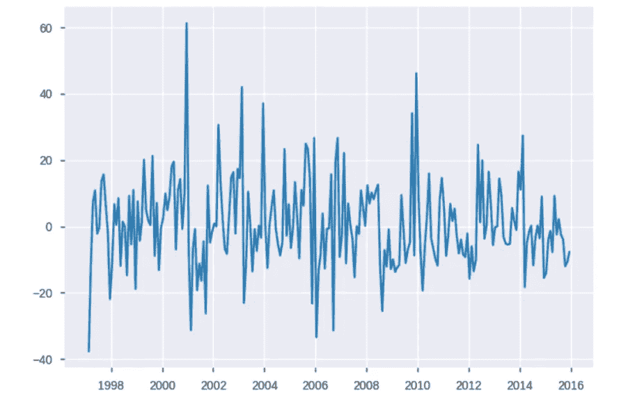

P **天然气价格的预测**因为与原油的关联变得越来越重要。包括天然气价格在内的能源商品波动剧烈，具有高风险和不确定性。在这里，我们将研究天然气现货价格和其他变量，如气象数据、经济数据等。与气候相关的数据，包括生产相关数据、消费相关数据和温度相关数据。

数据集结合了亨利中心和 WTI 历史现货价格的月度数据以及其他相关因素( *46 个变量，不包括亨利中心和 WTI* )。

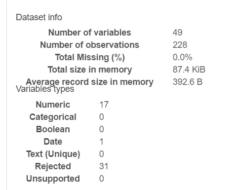

# 问题描述

尽管我们都知道这样一个事实，冬季期间的天然气消耗量历来很高，这导致市场价格上涨。然而，市场并不按照我们预期的方式运行；问题是，与普遍的看法相反，几乎全年的价格都有显著的偏差。

为了解决上述问题，我们将使用机器学习算法来检验我们是否可以通过添加可能对天然气价格产生外部直接或间接影响的不同参数来预测未来价格。我们将尝试开发一个预测模型，根据历史价格预测天然气的现货价格。

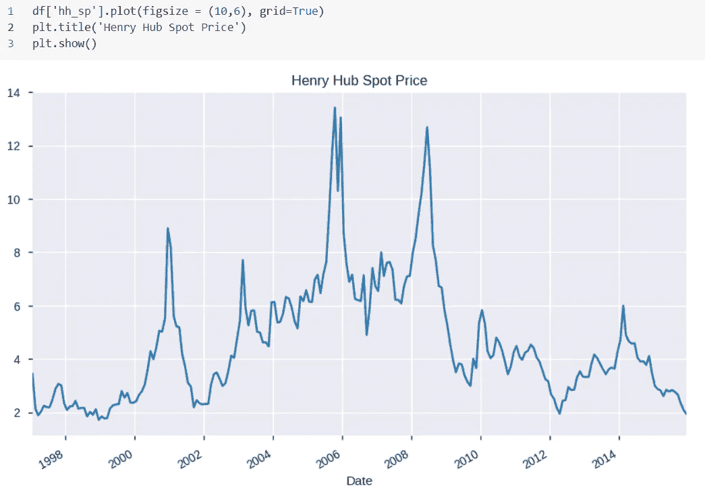

滞后散点图可用于检查自相关性；x 轴上的数据(t)与 y 轴上的上月数据 *"t-1/t-2/t-3/t-4"* 。带有大圆点的对角线清楚地显示了一种关系或某种相关性。这里也可以看到中间缺少的值。

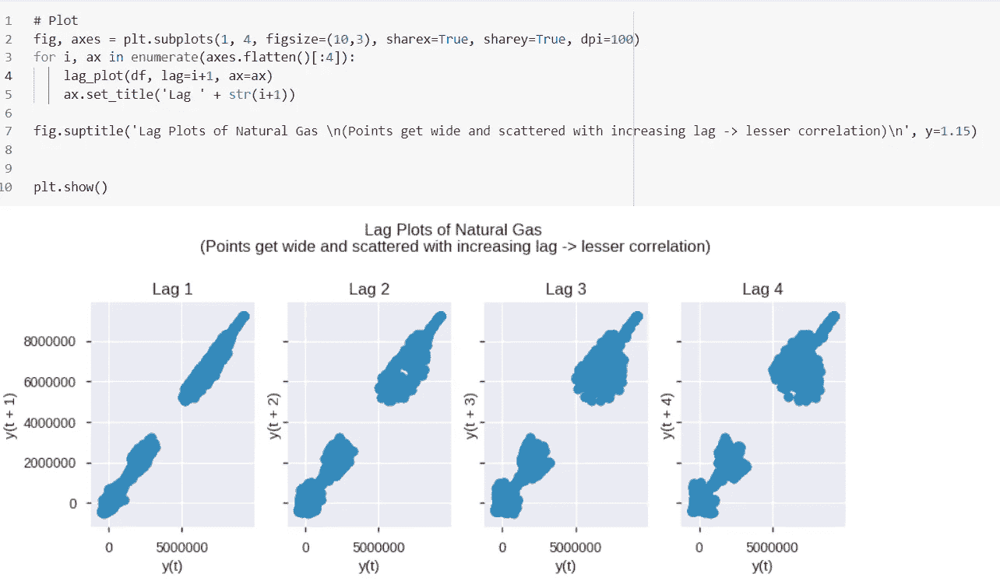

我们可以看到，序列中存在一些模式，并且序列是自相关的。滞后 1 显示数据大多集中且高度相关。然而，我们将用自相关图进一步验证这一点。空白是因为数据中缺少值。

下面，我们添加了另一个变量，即月度回报百分比变化，这使数据正常化，但巨大的波动仍然显示了亨利中心现货价格(HH)的高波动性和随机性。

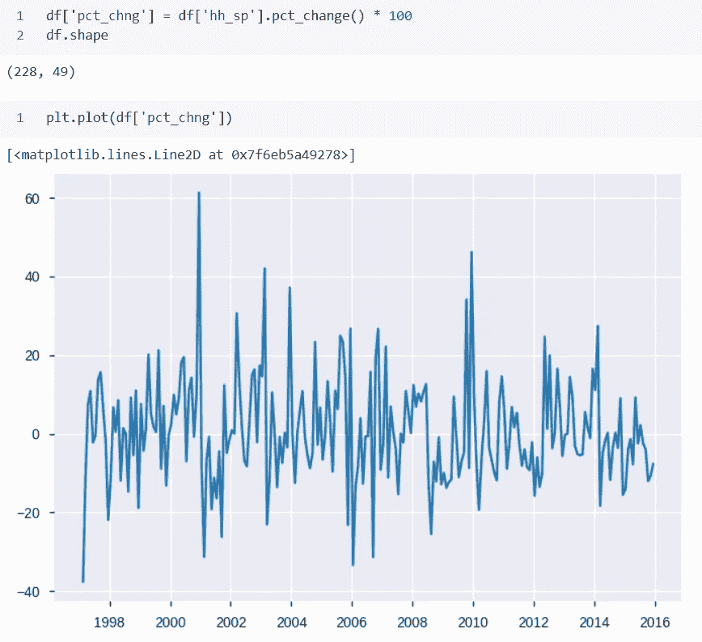

让我们回顾一下 HH 时间序列在其滞后版本之间的相互关系。在下图中，蓝色阴影区域是 95%的置信区间。我们可以看到几个滞后到 10 个月。

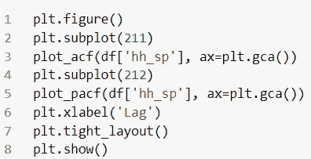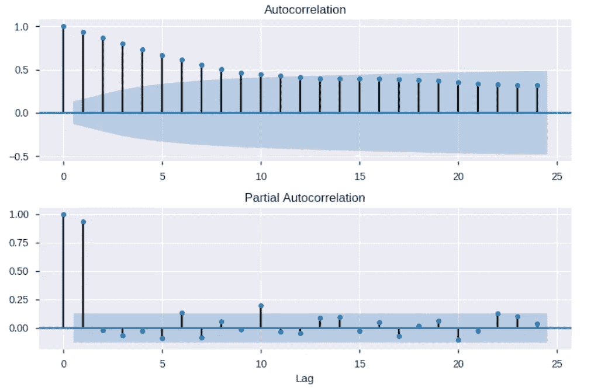

这里，我们假设当前值依赖于它以前的值，有一些滞后。为了找到可以用来预测未来价格的最大滞后，我们查看部分自相关图，并确定大多数滞后不显著之后的滞后。这里，我们从 pacf 中看到，1 个月后有一个大的峰值，这可以用作未来预测的回顾期。

理想情况下，我们应该尝试一些不同的滞后组合

1.  根据某种信息标准(AIC 或 BIC)选择其中的最佳者
2.  基于它们的可能性、信息标准等对模型进行加权。

我们的数据集有很多缺失值。因此，我们创建了一个函数，用以前的值来填充丢失的值。

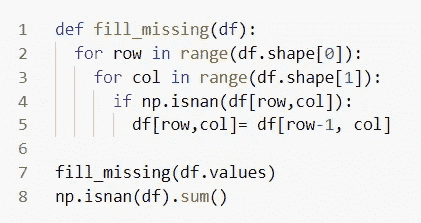

## 统计分析

让我们研究一下时间序列分布。从下面的直方图和 Jarque-Bera 正态性检验表明，价格时间序列不是正态分布的。然而，对数价格遵循高斯分布。

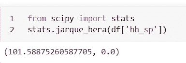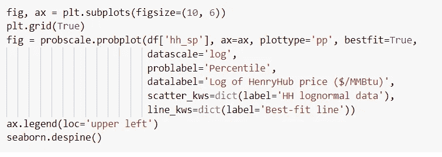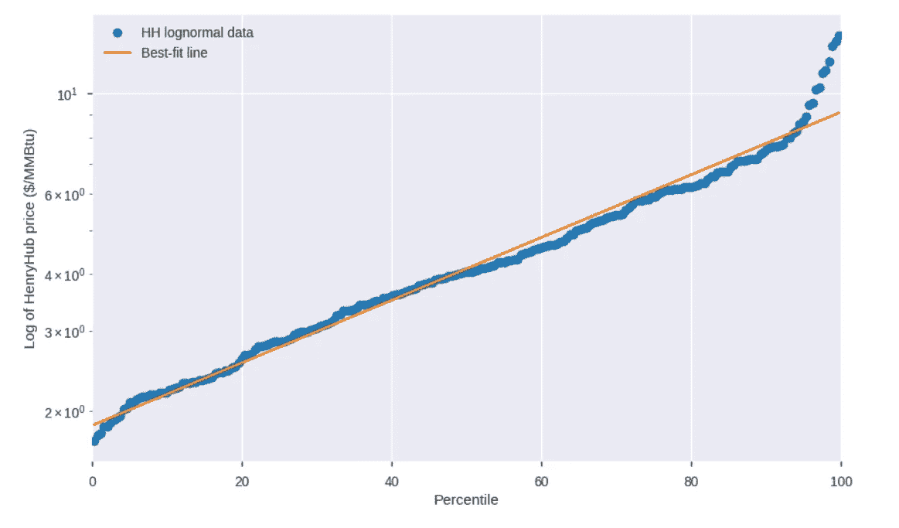

所以，我们可以先假设正态分布为变量的差和或天然气价格的对数。

## 差异通货膨胀系数(VIF)

很难从下面的相关性皮尔逊相关图中识别变量并做出任何假设。

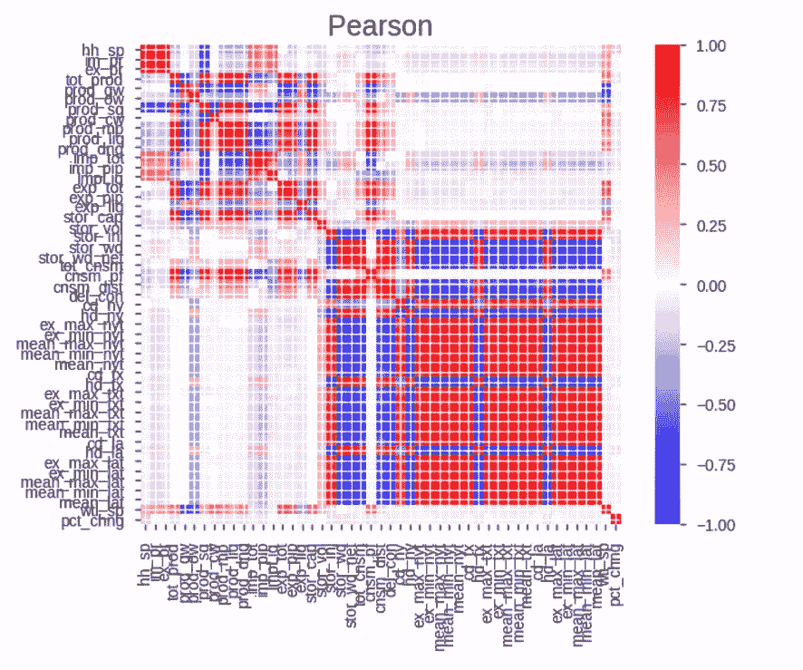

除了相关图之外，为了确定在回归分析中导致标准误差的变量，我们使用了一个易于理解的指标(方差膨胀因子)。因此，这有助于检测数据集中的多重共线性。大 VIF (> 5)意味着存在显著的多重共线性，理想情况下，我们应该从回归分析中删除这些变量。

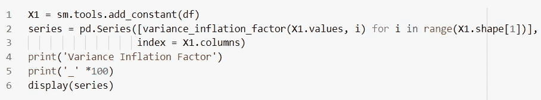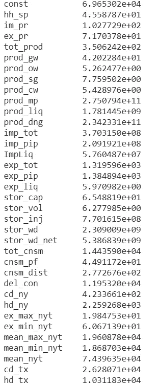

对于一些变量，我们的 VIF 系数大于 5，甚至更高。所有上述分析表明，使用神经网络将是一个理想的选择，也表明，理论上我们可以使用一个高自相关滞后(1)来开发一个神经网络模型。

> LSTMs 在涉及自相关的时间序列预测任务中非常有用，因为它们能够在时间序列的长度上保持状态和识别模式。递归架构使得状态能够持续，或者随着每个时期的进展在权重的更新之间通信。

## 单变量和多变量

价格预测可以是单变量或多变量模型。

1.  单变量模型试图通过目标变量本身及其滞后来模拟现象。在此模型中，假设所有原因都反映在价格中，则不考虑可能影响因变量行为的其他变量。
2.  具有不同相关变量并可能影响相关价格变量的多变量模型称为外生变量。这些变量可能会根据不同的情况(如经济、社会、政治或环境)影响因变量的行为。这类模型需要预测未来的关联变量，以便预测目标变量。

这里，我们将研究使用 GRU 网络架构的第二种模型。GRU 控制信息流，而不需要使用存储单元。它相对较新，计算效率更高，结构不太复杂。

## 训练/测试分割

值序列对于时间序列数据至关重要。因此，我们使用如下的系统方法将训练和测试中的数据分开。此外，需要标准化来拟合用于神经网络架构学习的数据。

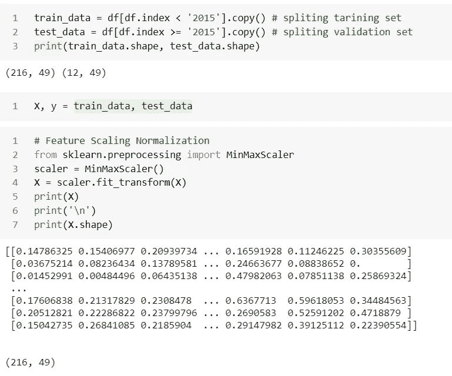

## 为神经网络准备数据

我们将准备 X_train，y_train，回看选项为 1，如前面的 acf/pacf 图所示。

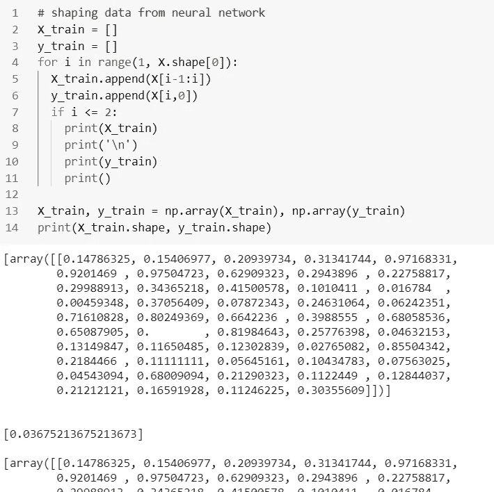

# GRU 网络架构

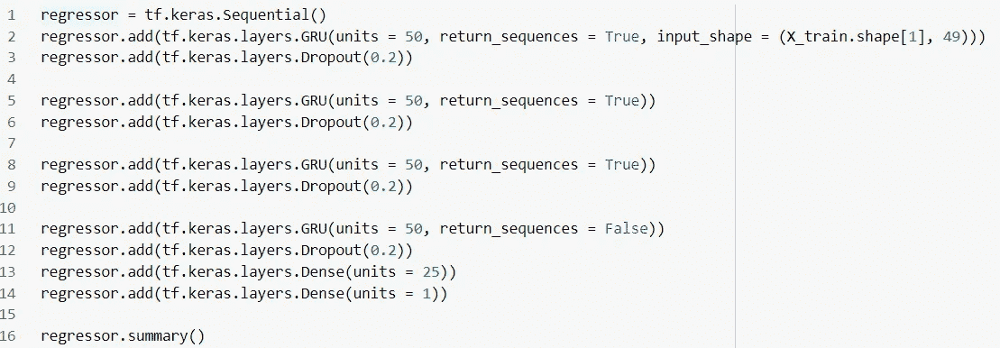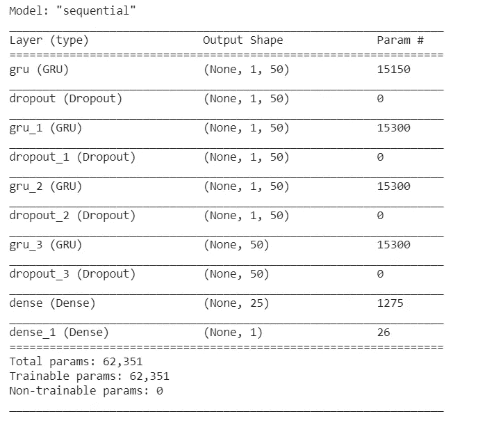

## 准备测试数据

一旦模型适合训练数据，我们希望看到模型在样本外数据上的技巧。与我们在训练集中所做的一样，我们将准备测试集，并且我们需要从训练数据中提取回望值。回看是用作输入变量的先前时间步长的数量，以预测下一个时间段*(本例中为 1)。*

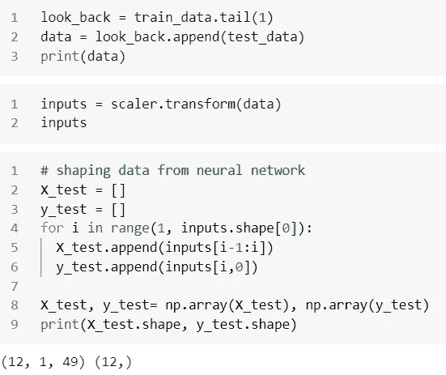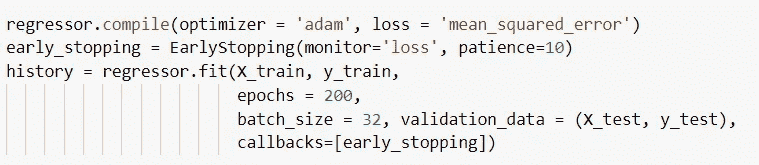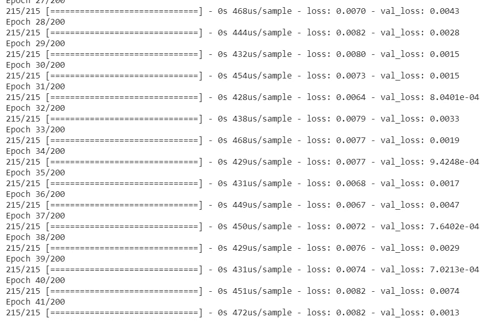

## 诊断图

该算法的目标是在过拟合和欠拟合模型之间找到一个位置。一个好的拟合是由一个训练和验证损失确定的，该损失减少到一个稳定点，在两个最终损失值之间有一个最小的差距。你可以阅读[这里](https://machinelearningmastery.com/learning-curves-for-diagnosing-machine-learning-model-performance/)了解更多关于诊断情节。

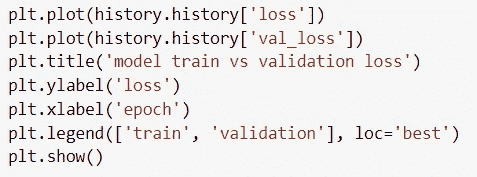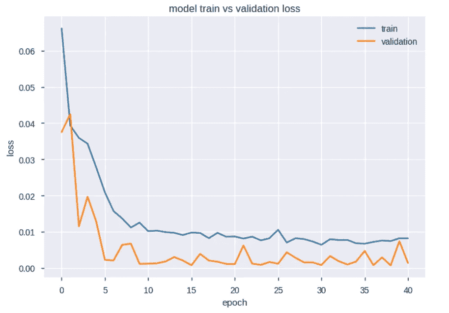

训练数据集的模型损失几乎总是低于验证数据集。这意味着我们应该预料到训练和验证损失学习曲线之间的一些差距。这种差距被称为“泛化差距”

然而，诊断图显示了非代表性训练数据集的符号，这意味着模型没有从训练集中获得足够的信息来学习问题。

# 实际结果与预测结果

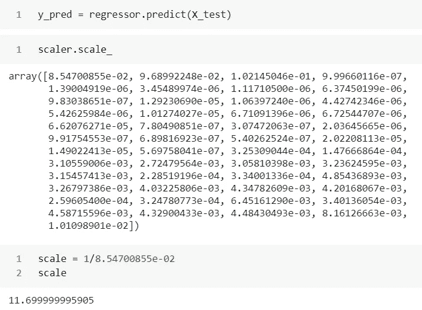

## 换算预测值

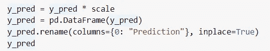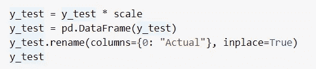

我们将观察值和预测值连接在一个数据框中，以便更好地表示和报告。

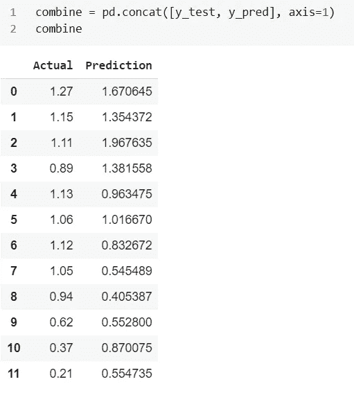

## 准确性指标

**均方误差(MSE)** : MSE 测量误差平方的平均值，即估计值和实际值之间的平均平方差。MSE 越小，我们就越接近最佳拟合模式。

**均方根误差(RMSE)** : RMSE 是预测值和实际观测值之间的平均平方差的平方根。由于在取平均值之前误差是平方的，RMSE 对大的误差给予相对高的权重。这使得 RMSE 在不希望出现大误差时最为有效。

**平均绝对误差(MAE)** : MAE 是预测值和实际观测值之间绝对差异的测试样本的平均值，其中所有个体差异具有相同的权重。

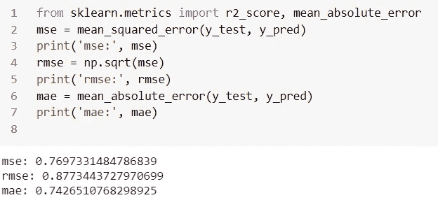

## 实际与预测图

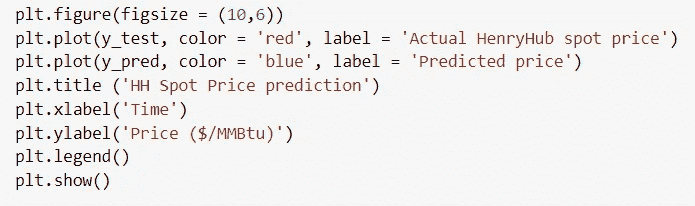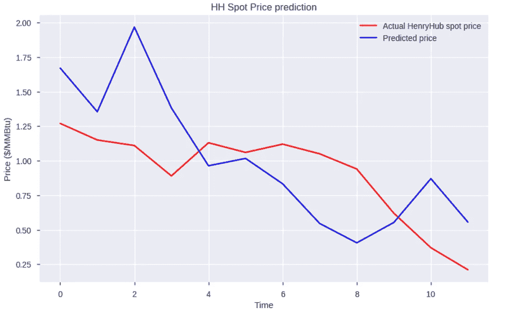

我们可以看到，结果并不如预期。但在这里，我们的目标是找到一个模型，拟合和预测天然气现货价格。我们采用了 1 个月的时间范围，我们的算法能够学习和预测未来的价格。学习能力和泛化能力是神经网络的关键特征。此外，其中一个优点是，可以应用线性或非线性的激活函数***(model . add(Activation(" relu "或" sigmoid"))*** 。网络架构的内存块通过层连接。每个模块都包含用于管理状态和输出的门，并根据输入序列进行操作。而且，一个街区内的每个门都用 ***激活*** 单元来控制。默认情况下，架构使用***【sigmoid】***激活。这里，通过选择各种非线性函数以及神经元和层的不同排列，捕获对刺激的非线性响应。最后，我们观察到，GRU 网络结构可以有效地用于预测我们的时间序列数据的未来市场价格。

模型精度需要用更多的训练数据来测试，批量大小可以配置为 64 或 128，输入参数的数量可以是选择性的。我们使用了月度数据集，其中每日数据可能有助于实现更好的准确性。

# 特征重要性

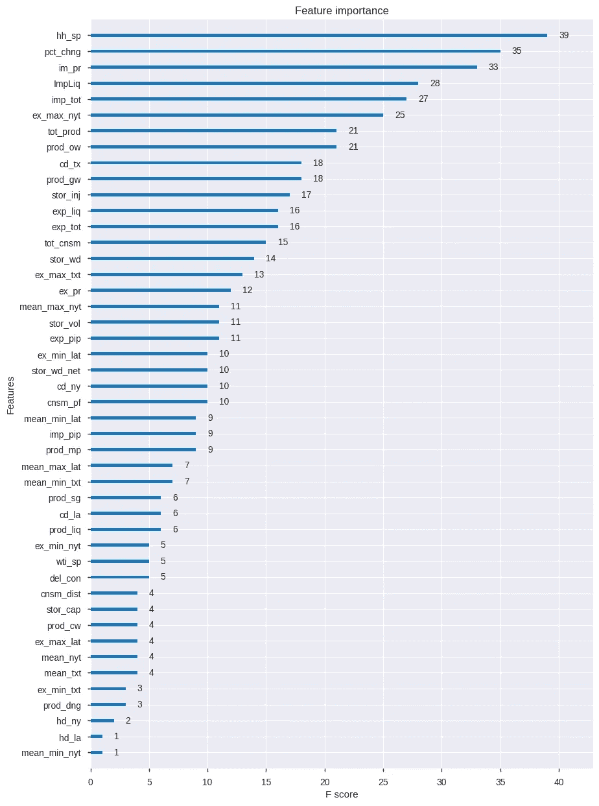

我们可以从如下所述的数据集中找出 10 大重要特征来预测 Henry Hub 现货价格的月度价格变动:

1.  美国天然气进口价格，
2.  美国液化天然气进口，
3.  美国天然气进口，
4.  极端最高日温度—纽约，
5.  美国天然气总提取量，
6.  美国从油井中提取的天然气总量，
7.  冷却度天数— TX，
8.  美国天然气从气井中的总提取量
9.  美国注入地下储气库的天然气总量
10.  美国液化天然气出口

## 摘要

预测股票市场指数的准确每日价格一直是一项困难的任务。许多因素，如政治事件、总体经济状况和交易者的预期，都可能对现货价格指数产生影响。这里，我们应用了几个输入变量来预测未来 12 个月的价格方向。然而，通过选择有效的输入指示符，可以进一步提高预测性能。此外，我们可以包括一些可能影响预测性能的其他技术指标。实验中的模型以回归的方式解决了这个问题。回归模型可以与预测上升和下降的分类模型相结合，以提高精确预测的方向准确性。此外，由于非参数建模方法需要更多的训练数据来估计映射函数，因此需要用大量数据来测试同一模型的预测精度。

**我可以到达** [***这里***](https://www.linkedin.com/in/saritmaitra/) **。**