# 自然梯度

> 原文：<https://towardsdatascience.com/natural-gradient-ce454b3dcdfa?source=collection_archive---------4----------------------->

## [梯度助推器](http://towardsdatascience.com/tagged/the-gradient-boosters)

## 梯度下降更好的梯度？

我们从这个系列中走了一个简短的弯路来理解什么是自然渐变。我们在梯度推进世界中考察的下一个算法是 NGBoost，为了完全理解它，我们需要理解什么是自然梯度。

由[保罗·吉尔摩](https://unsplash.com/@paulgilmore_?utm_source=unsplash&utm_medium=referral&utm_content=creditCopyText)在 [Unsplash](https://unsplash.com/s/photos/mountains?utm_source=unsplash&utm_medium=referral&utm_content=creditCopyText) 上拍摄的照片

> **预读**:我将谈论 KL 散度，如果你对这个概念不熟悉，暂停一下，跟上进度。我在另一篇文章中给出了熵、交叉熵和 KL 散度背后的数学和直觉。
> 
> *我也假设对梯度下降基本熟悉。我相信你会在网上找到上百万篇关于梯度下降的文章。*
> 
> 有时，在解释过程中，我们可能会涉及一些数学内容。但是只要有可能，我也会提供直觉，这样如果你不喜欢数学和方程式，你可以直接跳到直觉。

# 梯度下降

互联网上有一百万篇文章解释什么是梯度下降，但这不是第一百万篇文章。简而言之，我们将只涉及足够的梯度下降，使前面的讨论相关。

问题设置是:给定一个函数，我们想找到它的最小值。在机器学习中，这通常是损失函数，并且是算法的参数(例如，在神经网络中是网络的权重和偏差)。

1.  我们为 ***x*** 取一个初始值，大多是随机的，
2.  我们计算损失函数的梯度 w.r.t .参数 ***x*** ，

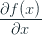

3.我们调整参数 ***x*** ，使得

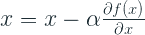

，其中α是学习率

1.  重复 2 和 3，直到我们对损失值感到满意。

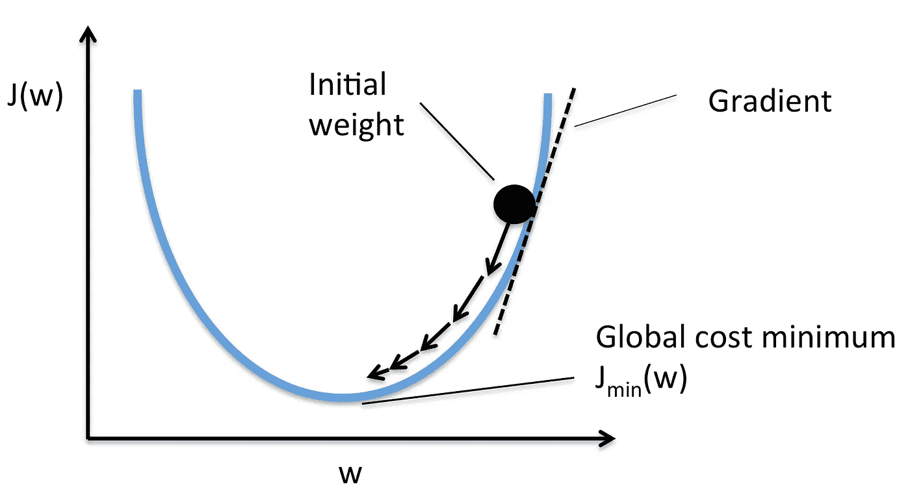

来源:关于梯度下降的更多数学公式，你可以访问 Sebastian Raschka 的 mlxtend

该算法有两个主要成分——梯度和学习率。

**梯度**无非是损失函数 w.r.t .的一阶导数。这也叫做函数在该点的斜率。从高中几何中，我们知道斜率可以有符号，根据符号我们知道哪个方向是“下”。例如，在上图中，梯度或斜率是负的，我们知道我们必须向负方向移动才能达到最小值。所以梯度也给了你需要移动的方向，这就是梯度下降使用的性质。

***学习率*** 是一个必要的缩放，应用于每次的梯度更新。它只是一个很小的量，我们用它来限制基于梯度的参数更新，以确保我们的算法收敛。我们将很快讨论为什么我们需要它。

# 限制

梯度下降的第一个陷阱是步长。我们使用损失函数的梯度来调整参数 ***x*** (按学习率缩放)。

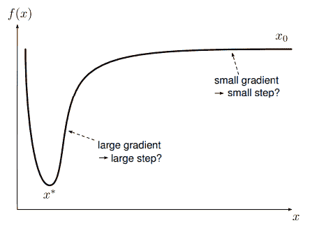

来源:[讲稿马克·图森](https://ipvs.informatik.uni-stuttgart.de/mlr/marc/notes/gradientDescent.pdf)

梯度是损失函数的一阶导数，根据定义，它只知道计算点的斜率。这是短视的，因为斜率甚至是无穷小距离上的一点。在上图中，我们可以看到两个点，陡坡上的点具有较高的梯度值，几乎平坦的点具有较小的梯度值。但这是否意味着我们应该分别迈出更大或更小的步伐？因此，我们只能将梯度给出的方向作为绝对真理，并使用超参数 ***学习速率*** 来管理步长。这个超参数确保我们不会跳过最小值(如果步长太大)或永远达不到最小值(如果步长太小)。

这是你在几乎所有一阶优化算法中都能找到的一个陷阱。解决它的一种方法是使用二阶导数，它也告诉你函数的曲率，并在此基础上进行更新步骤，这就是牛顿拉夫森优化方法所做的(在以前的一篇博客文章中的[附录)。但是二阶优化方法有其自身的问题——计算和分析的复杂性。](https://deep-and-shallow.com/2020/02/09/the-gradient-boosters-ii-regularized-greedy-forest/)

另一个缺陷是，这次更新通过学习率来衡量所有的参数，从而将所有的参数都一视同仁。可能有一些参数对损失函数的影响比其他参数更大，通过限制这些参数的更新，我们使算法收敛的时间更长。

# 替代方案

有什么选择？恒定的学习率更新就像是我们给算法的一个安全垫，这样它就不会盲目地从一个点冲到另一个点，完全错过最小值。但是我们可以用另一种方法来实现这个安全垫。

我们可以固定目标输出的分布空间中的距离，而不是固定每个参数移动的欧几里德距离(参数空间中的距离)。即，不是在ε距离内改变所有参数，而是我们将模型的输出分布约束在来自前一步骤的分布的ε距离内。

现在我们如何测量两个分布之间的距离？库尔贝克-莱布勒散度。虽然从技术上来说不是距离(因为它是不对称的)，但在它被定义的位置上，它可以被认为是距离。这对我们来说很好，因为我们也关心当我们在参数空间中做小的步骤时，输出分布如何变化。本质上，我们不像在正常梯度下降中那样在欧几里得参数空间中移动。但是在以 KL 散度为度量的分布空间中。

# 费希尔信息矩阵和自然梯度

我将跳到最后，告诉你有一个神奇的矩阵，称为费歇尔信息矩阵，如果我们将它包括在常规梯度下降公式中，我们将得到自然梯度下降，它具有在每个更新步骤中约束输出分布的属性[1]。

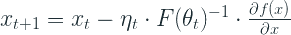

这正是梯度下降方程，有一些变化:

1.  α，即学习速率，用ηₜ代替，以清楚地表明步长可能在每次迭代中变化
2.  在正常梯度上增加了一项 F(θₜ)₋₁。

当正常梯度与费希尔矩阵的逆成比例时，我们称之为自然梯度。

现在，对于那些能够接受费舍尔矩阵是一个神奇的量，使正常梯度自然的人来说，跳到下一节。对于那些留下来的勇敢的人来说，一点数学知识正在你的路上。

# 数学(费希尔矩阵)

我假设每个人都知道 KL 散度是什么。我们将从 KL 散度开始，看看它如何转化为费雪矩阵，什么是费雪矩阵。

正如我们在[深度学习和信息理论](https://deep-and-shallow.com/2020/01/09/deep-learning-and-information-theory/)中看到的，KL 散度被定义为:

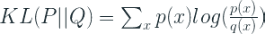

那是当我们谈论一个离散变量，像一个分类结果。在更一般的意义上，我们需要用积分来代替求和。让我们也切换符号，以适应梯度下降框架，我们正在工作。

不把 P 和 Q 作为两个分布，我们说*P(x；θ)* 和*p(x；θ + δθ)* 是两个分布，其中 x 是我们的输入特征或协变量，θ是损失函数的参数(例如，神经网络中的权重和偏差)，δθ是我们在梯度更新步骤中对参数的微小改变。因此，在新的符号下，KL 散度被定义为:

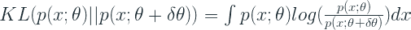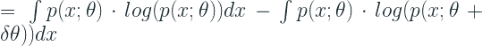

让我们用*p(x；来重写方程的第二项；θ)* 利用二阶泰勒展开式(即利用特定点的导数进行近似)。[泰勒展开](https://www.youtube.com/watch?v=3d6DsjIBzJ4)在其一般形式下是:

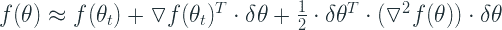

以这种形式重写第二项，我们得到:

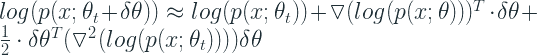

让我们把高中微积分中可靠的链式法则拿出来应用到第一学期。Log x 的导数为 1/x，第二项的泰勒展开式为:

把这个代入 KL 散度方程。我们得到:

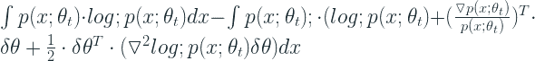

重新排列我们现有的术语:

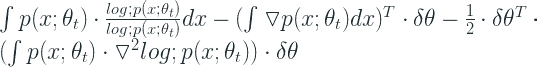

第一项是同一分布之间的 KL 散度，它将为零。另一种思考方式是 log 1 = 0，因此第一项变成 0。

第二项也将为零。下面我们来看看。我们用来推断零的关键属性是概率分布 P(x)对 x 的积分是 1(就像概率分布曲线下面积的总和是 1)。

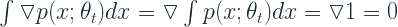

现在，留给我们的是 log p(x；)θₜ。一点数学知识(*手摇*)让我们明白:

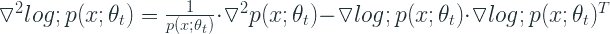

让我们把这个放回 KL 散度方程。

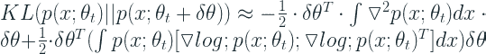

第一项变成零，因为正如我们之前看到的，概率分布 P(x)对 x 的积分是 1。1 的一阶和二阶导数是 0。在第二项中，积分称为费雪矩阵。姑且称之为 **F** 。所以 KL 散度方程变成了:

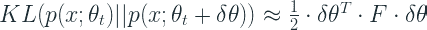

# 直觉(费希尔矩阵)

费希尔矩阵中 x 上的积分可以解释为期望值。而构成费希尔矩阵的是*log p(x；*)θₜ。和*log p(x；*)无非是对数似然。我们知道一阶导数给出了斜率，二阶导数(Hessian)给出了曲率。因此，费希尔矩阵可以被视为对数似然函数的曲率。

费希尔矩阵也是得分函数的协方差。在我们的例子中，得分函数是对数似然，它衡量我们预测的好坏。

# 数学(自然渐变)

我们看了什么是费希尔矩阵，但是我们仍然没有把它和梯度下降联系起来。现在，我们知道 KL 散度是 Fisher 矩阵和两个分布之间参数的 delta 变化的函数。正如我们之前所讨论的，我们的目标是确保在将 KL 散度保持在恒定的***【c】***内的前提下，使损失最小化。

形式上，可以写成:

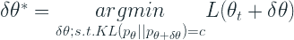

让我们采用问题的[拉格朗日松弛法](https://en.wikipedia.org/wiki/Lagrangian_relaxation)，并使用我们信任的一阶泰勒松弛法

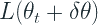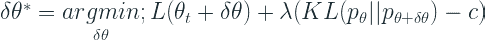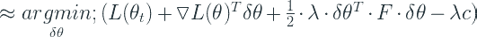

为了最小化上面的函数，我们将导数设置为零并求解。上述函数的导数为:

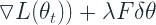

将其设置为零并求解 *δθ* ，我们得到:

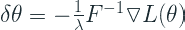

这意味着因子为 1/λ(这是我们接受的拉格朗日松弛的误差容限)，我们得到最佳下降方向，考虑到在该点对数似然的曲率。我们可以把这个放松的常数因素带入学习速率，并把它看作是同一个常数的一部分。

最后一点数学技巧是，我们有自然梯度，

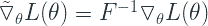

# 渐变与自然渐变

我们已经讲了很多关于渐变和自然渐变的内容。但是理解自然梯度不同于正常梯度的原因对于理解自然梯度下降如何不同于梯度下降是至关重要的。

在这一切的中心，是一个损失函数，衡量预测输出和地面真相之间的差异。我们如何改变这种损失？通过改变改变预测输出从而改变损失的参数。所以，在正态梯度中，我们取损失函数对参数的导数。如果预测的概率分布更接近真实分布，导数将会很小，反之亦然。这表示如果您将每个参数移动一个单位，您的损失将会改变。因此，当我们应用学习率时，我们将梯度更新按固定量缩放到这些参数。

在自然渐变世界中，我们不再限制参数空间中参数的移动。相反，我们在每一步都阻止了输出概率分布的移动。我们如何测量概率分布？对数可能性。费希尔矩阵给出了对数似然的曲率。

正如我们之前看到的，法线梯度不知道损失函数的曲率，因为它是一阶优化方法。但是，当我们将 Fisher 矩阵包括到梯度中时，我们所做的是用对数似然函数的曲率来缩放参数更新。因此，在对数似然随参数快速变化的分布空间中，相对于分布空间中的平坦平面，参数的更新会更少。

除了使用曲率信息调整我们的更新的明显好处之外，自然渐变还允许我们直接控制你的模型在预测空间中的移动。在正常梯度中，你的运动严格地在参数空间中，我们用一个学习率来限制该空间中的运动，希望预测空间中的运动也被限制。但是在自然梯度更新中，我们通过规定模型在 KL 散度项中仅移动固定的距离来直接限制预测空间中的移动。

# 因此..为什么我现在才听说？

一个显而易见的问题是，很多人会想:如果自然梯度下降真的很棒，而且明显比梯度下降好，为什么它不是神经网络中的事实标准呢？

这是实用主义战胜理论的领域之一。理论上，使用自然渐变的想法是美好的，而且它也像预期的那样工作。但问题是，当参数数量巨大时，计算费希尔矩阵及其逆矩阵成为一个棘手的问题，就像在典型的深度神经网络中一样。此计算存在于 n_parameter 中。

自然梯度没有受到太多关注的另一个原因是，深度学习研究人员和实践者想出了一些聪明的技巧/启发，在二阶导数中近似信息，而不计算它。深度学习优化器已经从 [SGD](https://en.wikipedia.org/wiki/Stochastic_gradient_descent) 走了很长一段路，很多进展都是在使用这样的技巧来获得更好的梯度更新。[动量](https://en.wikipedia.org/wiki/Stochastic_gradient_descent#Momentum)、 [RMSProp](https://en.wikipedia.org/wiki/Stochastic_gradient_descent#RMSProp) 、[亚当](https://en.wikipedia.org/wiki/Stochastic_gradient_descent#Adam)，都是 SGD 的变体，其使用梯度的移动平均值和/或移动方差来近似二阶导数，并使用该信息来进行梯度更新。

与计算二阶导数或自然梯度相比，这些试探法的计算量要小得多，并且已经使得深度学习能够扩展到当前的水平。

也就是说，自然梯度在一些情况下仍然有用，其中要估计的参数相对较小，或者预期分布相对标准，如高斯分布，或者在强化学习的一些领域。最近，它也被用于一种形式的梯度增强，我们将在本系列的下一部分讨论。

在我们系列的下一部分中，让我们来看看新的产品— **NgBoost**

其他文章在[T3T5【渐变助推器】](http://towardsdatascience.com/tagged/the-gradient-boosters)

*   [老好的渐变增强](/the-good-old-gradient-boosting-f4614b0e62b0)
*   [正规化的贪婪森林](/regularized-greedy-forest-a17cd0c85f06)
*   [XGBoost](/xgboost-b736c2ab10ce)
*   [LightGBM](/lightgbm-800340f21415)
*   [CatBoost](/catboost-d1f1366aca34)
*   自然渐变(你在这里)

# 参考

1.  甘利顺一。自然梯度在学习中很有效。神经计算，第 10 卷，第 2 期，第 251–276 页。
2.  这很自然:过度深入自然梯度优化，[https://towards data science . com/its-Only-Natural-An-over-Deep-Dive-into-Natural-Gradient-Optimization-75d 464 b 89 dbb](/its-only-natural-an-excessively-deep-dive-into-natural-gradient-optimization-75d464b89dbb)
3.  拉特里夫，内森，信息几何与自然渐变，[https://ipvs . informatik . uni-stuttgart . de/MLR/WP-content/uploads/2015/01/mathematics _ for _ intelligent _ systems _ lecture 12 _ notes _ I . pdf](https://ipvs.informatik.uni-stuttgart.de/mlr/wp-content/uploads/2015/01/mathematics_for_intelligent_systems_lecture12_notes_I.pdf)
4.  自然渐变下降，[https://wise odd . github . io/tech blog/2018/03/14/natural-Gradient/](https://wiseodd.github.io/techblog/2018/03/14/natural-gradient/)
5.  费舍尔信息矩阵，[https://wise odd . github . io/tech blog/2018/03/11/fisher-Information/](https://wiseodd.github.io/techblog/2018/03/11/fisher-information/)
6.  什么是自然渐变，它是如何工作的？，[http://kvfrans . com/what-the-natural-gradient-and-where-it-appeared-in-trust-region-policy-optimization/](http://kvfrans.com/what-is-the-natural-gradient-and-where-does-it-appear-in-trust-region-policy-optimization/)

*原载于 2020 年 4 月 1 日*[*【http://deep-and-shallow.com】*](https://deep-and-shallow.com/2020/04/01/the-gradient-boosters-via-natural-gradient/)*。*