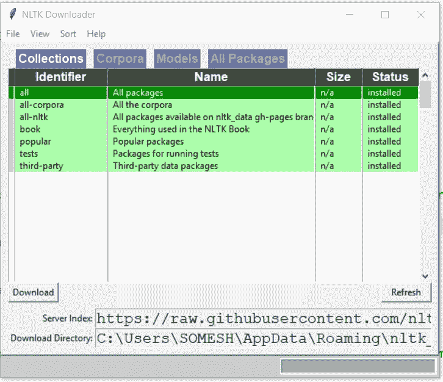
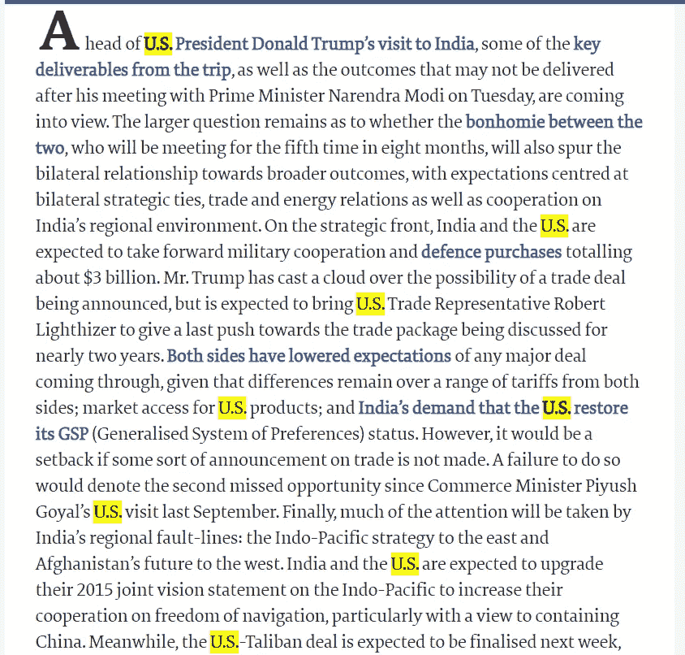
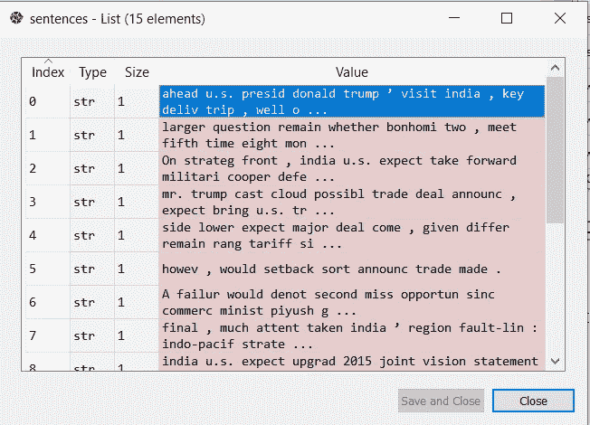
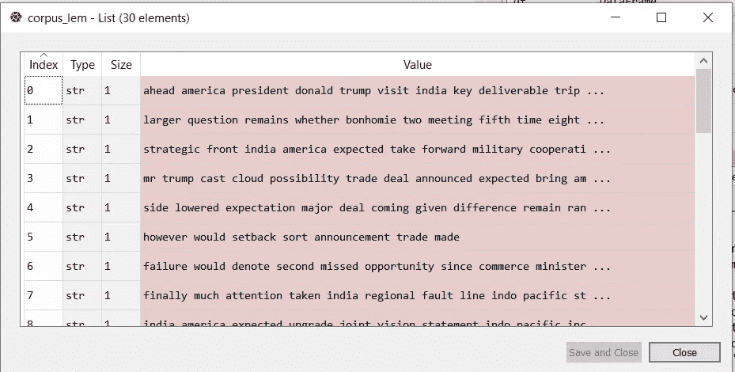
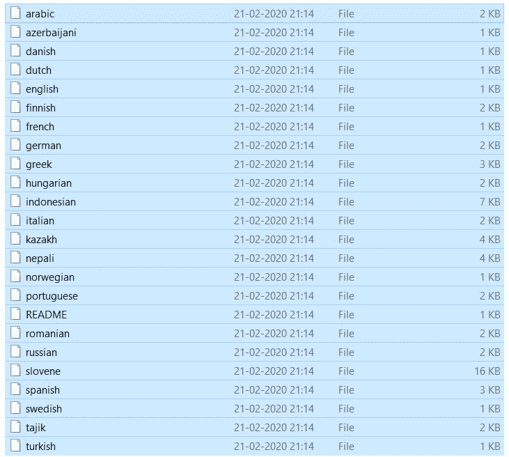
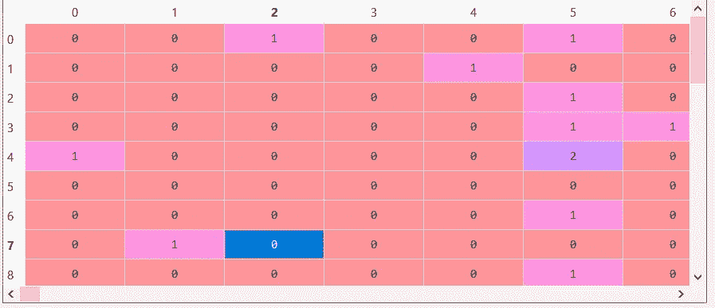
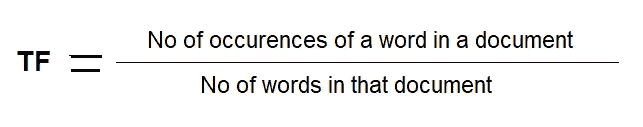
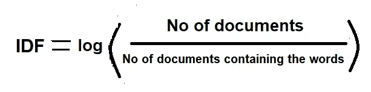
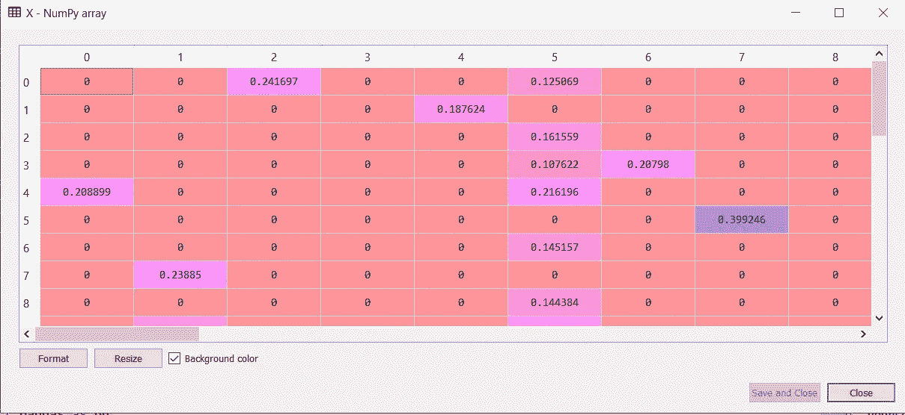

# 自然语言处理:初学者指南第一部分

> 原文：<https://towardsdatascience.com/natural-language-processing-a-beginners-guide-part-i-1a5880cc3bdc?source=collection_archive---------26----------------------->

从零开始用 nltk 库学习 NLP


[https://unsplash.com/](https://unsplash.com/)

表达式包含大量数据。每次我们说话或写作时，它都有一些与特定主题、社区、教义等相关的解释。，可以在更大范围内影响人。作为一个人，分析这些数据非常困难，但由于机器学习和人工智能，这变得很容易！

在网民时代，信息在各种社交媒体平台、不同语言的电子报纸中流通。通过**自然语言处理，收集这些非结构化数据并分析其不同的解释现在已经成为可能。**

> 自然语言处理是人工智能领域，处理机器和人类语言之间的交互。换句话说，NLP 帮助机器理解人类(自然)语言的含义。

## 用例

> **智能助手**如谷歌助手、SIRI、亚马逊 Alexa 等。基于 NLP 概念的工作。这些助手将你的演讲转换成文本，进行分析，然后付诸行动。
> 
> 情绪分析:在社交媒体平台中，人们对你可以使用 NLP 分析的推文或帖子的情绪。组织通过使用 NLP 的反馈处理来分析客户对产品的情感，并在业务中获得收益。
> 
> **主题建模**:你可以使用 LDA(潜在狄利克雷分配 **)** 技术深入主题建模的世界。我将在这个博客的第二部分对此进行更多的讨论。
> 
> **垃圾邮件检测**:公司使用 NLP 对流经其服务器的垃圾邮件进行分类。
> 
> **假新闻检测:**一些机构使用自然语言处理来检测社交媒体、电子媒体中的假新闻。

NLP 还有许多其他的用例。在这篇博客中，你将作为初学者理解使用 NLP 对一篇[报纸](https://www.thehindu.com/opinion/editorial/trump-cards-the-hindu-editorial-on-us-president-donald-trumps-india-visit/article30873581.ece)文章的文本分析。为此，您可以直接转到链接并复制文章进行处理，也可以使用 Python 进行抓取。网络抓取真的很有趣，我会在另一个博客中讨论它。

让我们用 NLP 做一些伟大的事情！


[https://unsplash.com/](https://unsplash.com/)

基本安装:

对于这个博客来说， [**nltk**](https://www.nltk.org/) 开源库和 spyder IDE 将会得心应手。这个库描述了 NLP 的许多功能。首先，您需要导入 **nltk** 库，然后从 GitHub 库下载一些必需品。

```
#import library nltk
import nltk
nltk.download()
```

一旦您在 spyder IDE 中运行这些东西，就会出现如下弹出窗口。你需要全部下载。



从我的电脑输出

**记号化**:它是文本处理部分，帮助你将一个大的字符串分割成几个记号。换句话说，这种技术可以帮助你将段落分成一系列的句子，将一个句子分成一系列的单词。

```
paragraph =’’’
Ahead of U.S. President Donald Trump’s visit to India, some of the key deliverables from the trip, as well as the outcomes that may not be delivered after his meeting with Prime Minister Narendra Modi on Tuesday, are coming into view. The larger question remains as to whether the bonhomie between the two, who will be meeting for the fifth time in eight months, will also spur the bilateral relationship towards broader outcomes, with expectations centred at bilateral strategic ties, trade and energy relations as well as cooperation on India’s regional environment. On the strategic front, India and the U.S. are expected to take forward military cooperation and defence purchases totalling about $3 billion. Mr. Trump has cast a cloud over the possibility of a trade deal being announced, but is expected to bring U.S. Trade Representative Robert Lighthizer to give a last push towards the trade package being discussed for nearly two years. Both sides have lowered expectations of any major deal coming through, given that differences remain over a range of tariffs from both sides; market access for U.S. products; and India’s demand that the U.S. restore its GSP (Generalised System of Preferences) status. However, it would be a setback if some sort of announcement on trade is not made. A failure to do so would denote the second missed opportunity since Commerce Minister Piyush Goyal’s U.S. visit last September. Finally, much of the attention will be taken by India’s regional fault-lines: the Indo-Pacific strategy to the east and Afghanistan’s future to the west. India and the U.S. are expected to upgrade their 2015 joint vision statement on the Indo-Pacific to increase their cooperation on freedom of navigation, particularly with a view to containing China. Meanwhile, the U.S.-Taliban deal is expected to be finalised next week, and the two leaders will discuss India’s role in Afghanistan, given Pakistan’s influence over any future dispensation that includes the Taliban.Any high-level visit, particularly that of a U.S. President to India, is as much about the optics as it is about the outcomes. It is clear that both sides see the joint public rally at Ahmedabad’s Motera Stadium as the centrepiece of the visit, where the leaders hope to attract about 1.25 lakh people in the audience. Despite the Foreign Ministry’s statement to the contrary, the narrative will be political. Mr. Trump will pitch the Motera event as part of his election campaign back home. By choosing Gujarat as the venue, Mr. Modi too is scoring some political points with his home State. As they stand together, the two leaders, who have both been criticised in the last few months for not following democratic norms domestically, will hope to answer their critics with the message that they represent the world’s oldest democracy and the world’s largest one, respectively.
‘’’
#tokenizing sentences
sentences = nltk.sent_tokenize(paragraph)#tokenizing words
words = nltk.word_tokenize(paragraph)
```

这里的段落包含一篇特定的报纸文章。使用 sent_tokenize()和 word_tokenize()可以创建令牌列表。

**词干化:**将派生单词还原为其词干或词根形式的过程。

```
Negligence    |
Negligently   | ============> Negligen 
Neglligent    |
```

在这里，疏忽、疏忽、过失这些词将被简化为疏忽。但是它有一个缺点——词干可能没有意义。

```
from nltk.stem.porter import PorterStemmer
from nltk.corpus import stopwords
```

您需要创建一个 PorterStemmer 对象，并遍历句子标记来执行词干提取。

**词汇化:**是一种类似词干化的活动。但在这种情况下，基本词会有一些意义。

```
from nltk.stem import WordNetLemmatizer
```

注意:

1.  每次执行词汇化或词干化时，都需要将标记转换成小写，并删除停用词。

```
from nltk.corpus import stopwords
```

2.如果需要更多的文本清理活动，您可以使用 Python [re 模块](https://docs.python.org/3/library/re.html)。



[https://www.thehindu.com/opinion/editorial/](https://www.thehindu.com/opinion/editorial/)

在目前的讨论中，文章多次包含**美国**。因为它与文章更相关，所以你需要转换美国。使用 replace()方法对' **America** '进行替换。执行上述功能后，输出如下。



从我的电脑输出

在此图中，显然'**可交付物'**'已被简化为'**交付物'**。它没有任何意义。所以我进行了词汇化。这是输出。看看第一行中的单词'**可交付物**'。



从我的电脑输出

**停用词:** nltk 支持各种语言，每种语言都有不同的停用词。对于英语来说，停用词就像“a”、“the”、“where”等。



从我的电脑输出

*恭喜你！！！*

*你已经成功的将句子记号词条化了！*

**包话:**

它是一个帮助你理解单词在文档或句子中出现的模式，而不管语法和单词的顺序。

您可以创建一个对象 [CountVectorizer](https://scikit-learn.org/stable/modules/generated/sklearn.feature_extraction.text.CountVectorizer.html) 来执行这个操作。

```
from sklearn.feature_extraction.text import CountVectorizer
```



从我的电脑输出

到目前为止，我们可以从讨论中得出两个推论。

1.  在词汇化和词干化中，所有的单词都具有同样的重要性。
2.  在我们收集的单词中没有语义信息。

为了克服这些问题，采用了另一种方法— **TFIDF** 。

**词频和逆文档频:**

> 你是否有一些信息，以生僻字的形式出现，但在文本分析中却非常重要？
> 
> 别担心，TFIDF 会帮你解决的！



版权所有-Somesh



版权所有-Somesh

**TFIDF = TF * IDF**

再次感谢 Sci-Kit Learn library 减少了您的一些努力。创建 [TfidfVectorizer](https://scikit-learn.org/stable/modules/generated/sklearn.feature_extraction.text.TfidfVectorizer.html) 的 sn 对象来应用这个概念。

```
from sklearn.feature_extraction.text import TfidfVectorizer
```

看一下结果



这些不同的小数输出显示了单词相对于文档/句子的实际重要性。同样，这种方法既没有语义也没有上下文。但这是一种奖励词语的方法，却忽略了词语的频繁出现。

此外，我们可以利用主题模型，分析具有相同上下文的其他来源的文章，以了解作者的情绪。

但是这些内容将在第 2 部分中讨论！！！

自然语言处理是人工智能的一个广阔和蓬勃发展的领域，尽管在这方面工作非常具有挑战性。从智能助手到疾病检测，自然语言处理在很多领域都非常有用。

***祝贺并欢迎所有从事自然语言处理的人！！！***

感谢克里斯·纳伊克，是他让这一旅程成为可能。

对于建议，我将在 [LinkedIn](https://www.linkedin.com/in/somesh-kumar-routray/) 、 [Gmail](http://somesh.routray11@gmail.com) 上，并在 [GitHub](https://github.com/someshkr) 关注我的工作。