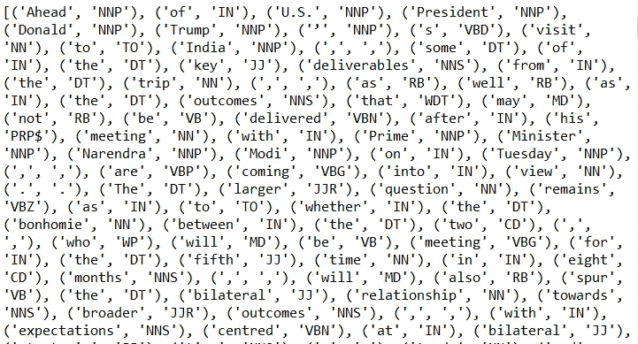
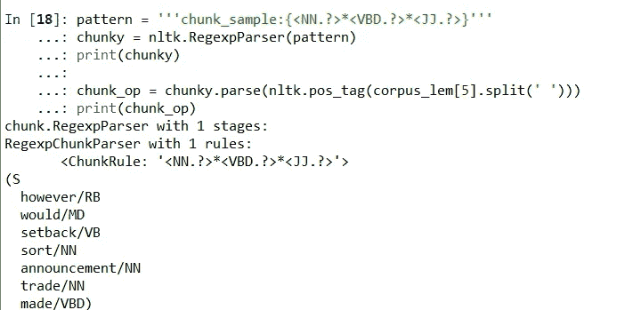
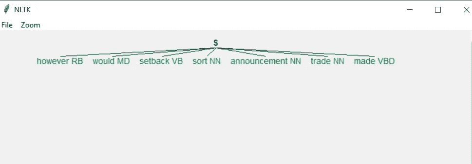
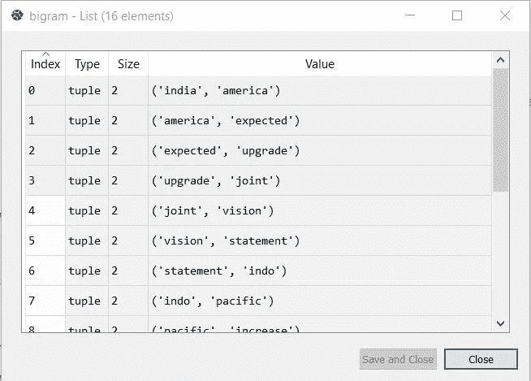
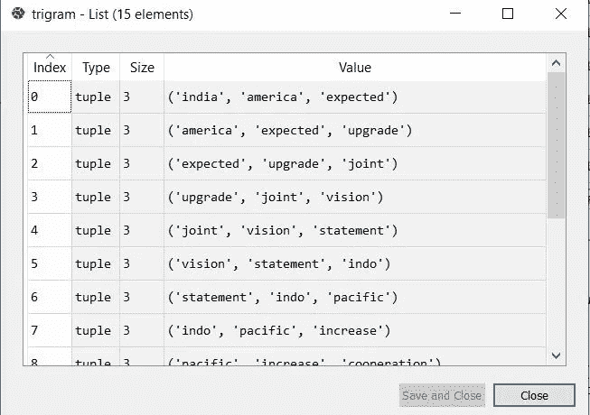
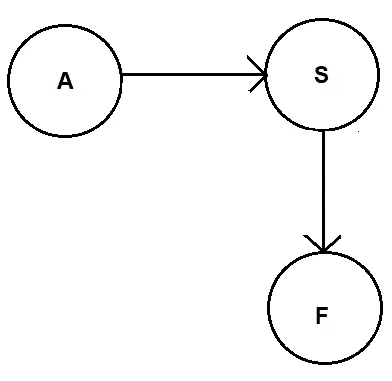
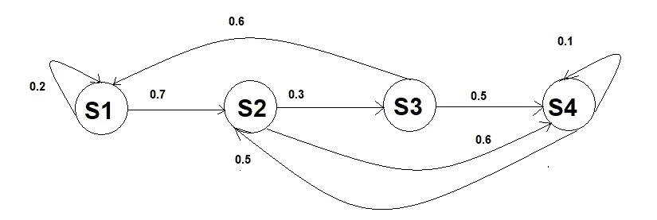
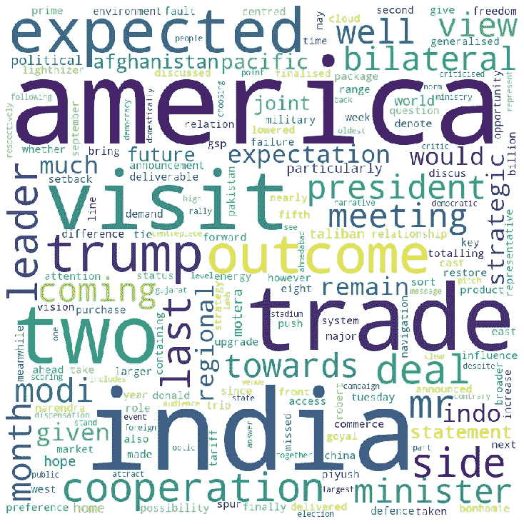

# 自然语言处理:初学者指南第二部分

> 原文：<https://towardsdatascience.com/natural-language-processing-a-beginners-guide-part-ii-54a1bf8c0497?source=collection_archive---------40----------------------->

## 让我们再深入一点…

我已经在 NLP 系列的第一部分讨论了 NLP 的基础知识。您会注意到，TF-IDF 的概念没有传达任何语义或上下文。但是你可以从语法的角度来解释这些文章。

让我们一起来探索语料库的隐藏之美吧！


[来源](https://unsplash.com/)

位置标签

这指的是句子中的*词类*的概念，你们在高中已经学过了。使用 nltk 库，你可以给每个单词甚至短语添加词性标签。这是一个复杂的过程，有时单词在句子的形式上有模糊的意思。语料库有两种词性标注。

1.基于规则的位置标记:

当你遇到模棱两可的词时，你可以使用这个技巧。分析前人和后人。它也是特定于特定语言的。大写和标点词性标注是这种技术的一部分。

其中一个例子是布里尔的标签。它是一个基于规则的标记器，在训练数据中实现，找出词性标记错误较少的规则集，对数据进行最佳定义。

2.随机位置标记:

如果一个单词在训练句子中被标记了特定的标签，分析最高频率或概率，该单词将被赋予一个特殊的标签。

这也被称为 **n 元语法方法**，指的是基于具有 n 个先前标签的概率来决定单词的事实。

```
import nltkparagraph =’’’
Ahead of U.S. President Donald Trump’s visit to India, some of the key deliverables from the trip, as well as the outcomes that may not be delivered after his meeting with Prime Minister Narendra Modi on Tuesday, are coming into view. The larger question remains as to whether the bonhomie between the two, who will be meeting for the fifth time in eight months, will also spur the bilateral relationship towards broader outcomes, with expectations centred at bilateral strategic ties, trade and energy relations as well as cooperation on India’s regional environment. On the strategic front, India and the U.S. are expected to take forward military cooperation and defence purchases totalling about $3 billion. Mr. Trump has cast a cloud over the possibility of a trade deal being announced, but is expected to bring U.S. Trade Representative Robert Lighthizer to give a last push towards the trade package being discussed for nearly two years. Both sides have lowered expectations of any major deal coming through, given that differences remain over a range of tariffs from both sides; market access for U.S. products; and India’s demand that the U.S. restore its GSP (Generalised System of Preferences) status. However, it would be a setback if some sort of announcement on trade is not made. A failure to do so would denote the second missed opportunity since Commerce Minister Piyush Goyal’s U.S. visit last September. Finally, much of the attention will be taken by India’s regional fault-lines: the Indo-Pacific strategy to the east and Afghanistan’s future to the west. India and the U.S. are expected to upgrade their 2015 joint vision statement on the Indo-Pacific to increase their cooperation on freedom of navigation, particularly with a view to containing China. Meanwhile, the U.S.-Taliban deal is expected to be finalised next week, and the two leaders will discuss India’s role in Afghanistan, given Pakistan’s influence over any future dispensation that includes the Taliban.Any high-level visit, particularly that of a U.S. President to India, is as much about the optics as it is about the outcomes. It is clear that both sides see the joint public rally at Ahmedabad’s Motera Stadium as the centrepiece of the visit, where the leaders hope to attract about 1.25 lakh people in the audience. Despite the Foreign Ministry’s statement to the contrary, the narrative will be political. Mr. Trump will pitch the Motera event as part of his election campaign back home. By choosing Gujarat as the venue, Mr. Modi too is scoring some political points with his home State. As they stand together, the two leaders, who have both been criticised in the last few months for not following democratic norms domestically, will hope to answer their critics with the message that they represent the world’s oldest democracy and the world’s largest one, respectively.
‘’’#tokenizing sentences
sentences = nltk.sent_tokenize(paragraph)#tokenizing words
words = nltk.word_tokenize(paragraph)#pos tagging
for word in words:
 print(nltk.pos_tag(words))
```

运行上面这段代码，你可以看到单词和相应的 pos 标签压缩在一个列表中。



仅代表目的。版权所有 Somesh

这里的缩写像 NNP——专有名词，单数。

IN 表示介词等。您也可以探索 nltk 库中关于缩写的更多信息。

还可以进行组块操作，得到一组单词。组块用来给句子增加更多的结构。您还可以添加正则表达式技术来形成不同种类的标记组或名词短语组等。它也被称为浅层解析或轻量解析。

```
pattern = ‘’’chunk_sample:{<NNP.?>*<IN.?>}’’’
chunky = nltk.RegexpParser(pattern)
print(chunky)chunk_op = chunky.parse(nltk.pos_tag(words))
print(chunk_op)
```

这里的模式告诉我们如何从单词标记中创建组块。

关于模式创建的一些有用信息:

```
Special Symbols       Meaning
.                    Any character except newline*                    Match 0 or more repetitions?                    Match 0 or 1 repetitionspattern = '''chunk_sample:{<NN.?>*<VBD.?>*<JJ.?>}'''
chunky = nltk.RegexpParser(pattern)
print(chunky)#corpus_lem[5]=['however','would','setback','sort','announcement','trade made']chunk_op = chunky.parse(nltk.pos_tag(corpus_lem[5].split(' ')))
print(chunk_op)chunk_op.draw()
```

如果您运行上面这段代码，您可以更好地理解分块技术，并将其可视化。



版权所有 Somesh



版权所有 Somesh

这里的图表描述了每个带有词性标签的单词。您可以更多地使用 RegexpParser 来从语法上理解标记，并可以制作漂亮的图形来更好地可视化。

```
#Ngram in nltk 
from nltk import ngramsbigram = list(ngrams(corpus_lem[8].split(),2))
trigram = list(ngrams(corpus_lem[8].split(),3))
```



BIGRAM 输出版权 somesh



三元模型输出版权所有 Somesh

您可以清楚地看到二元模型方法形成了两个单词的元组，三元模型方法形成了三个单词的元组。

**隐马尔可夫模型:**

这些是概率模型，基于先前识别的单词和当前单词，帮助决定最可能的决定。

HMM 是具有单个状态变量 **S** 和单个观察变量 **O，**的概率模型，因此该模型将具有两个概率部分。诸如

(I)过渡模型——它告诉我们一个国家在一段时间内的过渡。

(ii)观察模型——它告诉我们在给定的状态下，您获得不同观察结果的可能性有多大。(参考下图)



版权所有 Somesh

下面是 HMM 概念的图形表示，称为结构化转换模型。这些数值对应的是在给定时间状态到当前状态的每一次转移的概率。每个节点都是一个特定的指定状态变量。

在这里，S1 以 0.7 的概率转移到 S2，并以 0.2 的概率停留在原来的状态。其他州也有类似的解释。



版权所有 Somesh

这是关于 HMM 的概念。它被广泛用于 NLP 项目中，如机器人定位、语音识别、生物序列分析、文本分析等。我将在接下来的故事中讨论详细的模型和编码部分。

到目前为止，我们只分析了使用 nltk 库的单词。在这里，我将尝试使用 wordcloud 赋予文字艺术感。很迷人，不是吗？

如下导入所需的库。将每个句子的词条转化成一个字符串，使用 wordcloud 你可以表达它。

```
#to intsall wordcloud in anaconda type "pip install wordcloud" in #anaconda prompt#import librariesimport pandas as pd
from wordcloud import WordCloud#convert the corpus_lem to a dataframe
df = pd.DataFrame(data=corpus_lem,columns=[‘words’])stop_words = set(stopwords.words(‘english’))
words_test = ‘’#convert all the lematized sentence token to a string
for i in df.words:
 words_test = words_test+i+’ ‘

#put it in a wordcloud
word_cloud = WordCloud(width = 900, height = 900,stopwords = stop_words,
 background_color = ‘white’,min_font_size = 12).generate(words_test)#show using matplotlib
import matplotlib.pyplot as pltplt.figure(figsize = (10, 10), facecolor = None) 
plt.imshow(word_cloud) 
plt.axis(“off”) 
plt.tight_layout(pad = 0) 

plt.show()
```



版权所有 Somesh

在这里，你可以发现作者试图将重点放在像 ***美国、印度、贸易、合作、莫迪、特朗普等词上。***

稍后我将解释 HMM，Word2Vec 概念，以便更深入地理解 NLP &请务必阅读本系列的第 1 部分，以便更好地理解这个故事。

直到那时享受自然语言处理！！！

我希望你喜欢自然语言处理[第一部分](/natural-language-processing-a-beginners-guide-part-i-1a5880cc3bdc)。在 [**媒体**](https://medium.com/@somesh.routray11) 上关注我，或者订阅我的博客来了解他们。一如既往，我欢迎反馈和建设性的批评，可以通过 Twitter @RoutraySomesh 联系。