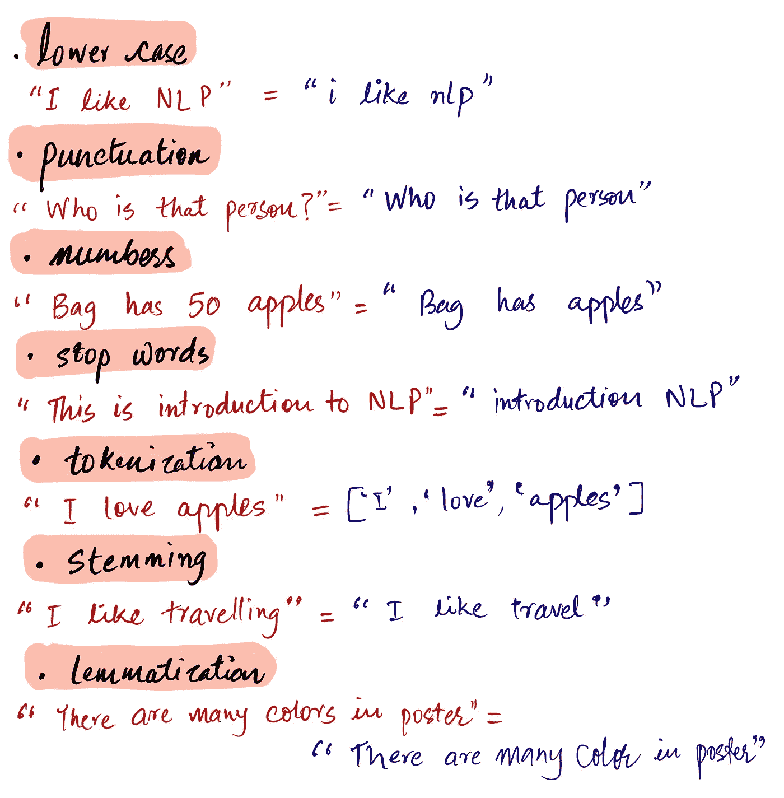
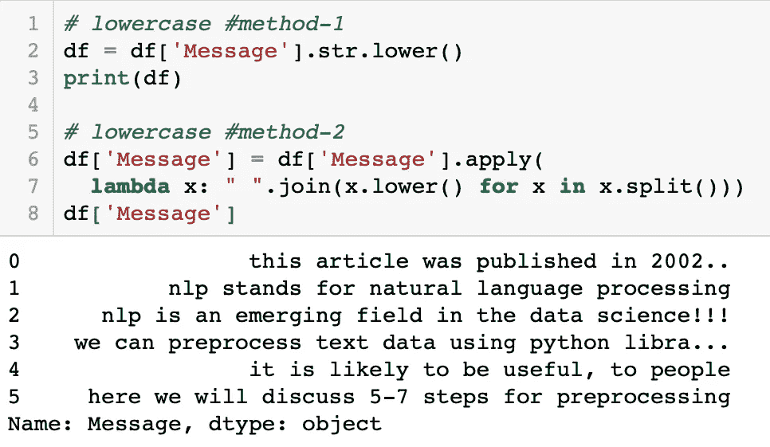
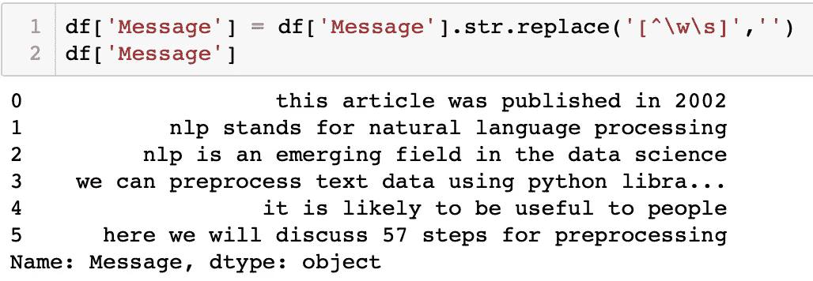
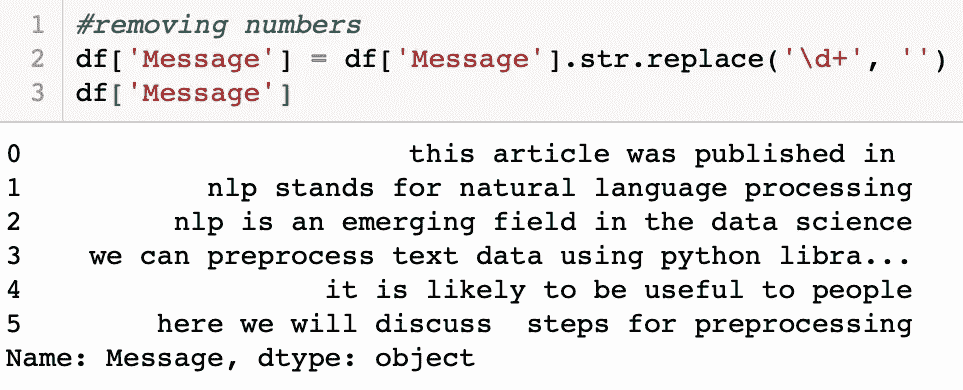
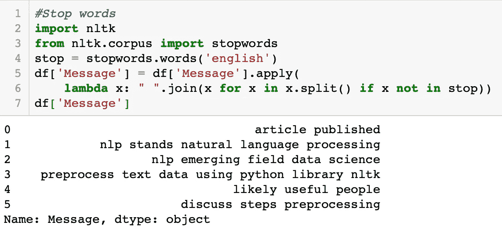
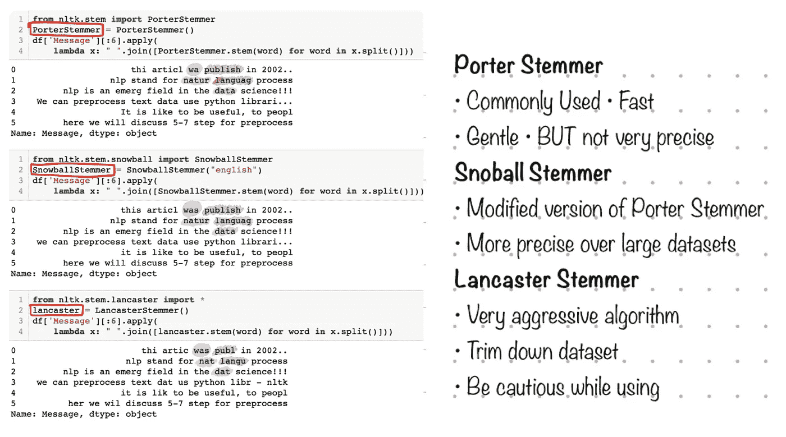
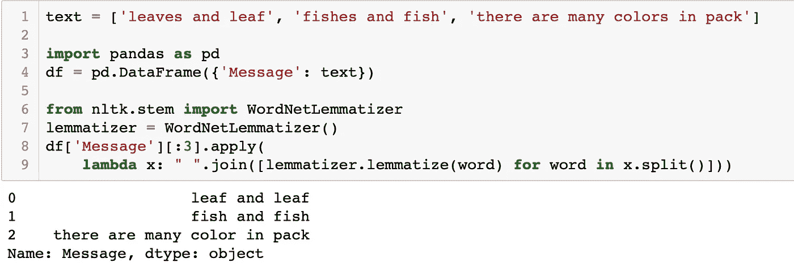

# 自然语言处理

> 原文：<https://towardsdatascience.com/natural-language-processing-a1496244c15c?source=collection_archive---------12----------------------->

## 使用 NLTK 的介绍和预处理

科伦萨·皮克特在 [Unsplash](https://unsplash.com/s/photos/scripts?utm_source=unsplash&utm_medium=referral&utm_content=creditCopyText) 上拍摄的照片

# **什么是自然语言处理？**

自然语言处理(NLP)是用于帮助机器理解和学习文本和语言的技术。通过 NLP 数据，科学家们旨在教机器理解所说的和所写的，以理解人类语言。用于将**机器学习**算法应用于**文本**和**语音**。

> 在本文中，我们将通过机器学习来了解 NLP 工作是如何理解人类语言的。

## ***对我们重要吗？***

我们可以使用 NLP 来创建类似于**语音识别**、**机器翻译**、**垃圾邮件检测、文本简化**、**问题回答、自动完成、预测打字、情感分析、文档摘要**和**等等**的系统。几个例子包括:

**谷歌翻译** —语言翻译应用

**语法上** —使用自然语言处理检查文本的语法准确性

**个人协助**——OK 谷歌、Siri、Cortana、Alexa 等应用。

**关键词搜索**，拼写检查，同义词搜索。

**查询**如产品价格、位置、公司名称等。在搜索引擎上。

## 这是一项容易的任务吗？

> ***NLP，情感*和歧义:**教计算机关于语言的确切意义和情感被认为是计算机科学中的一个难题。

[腾雅特](https://unsplash.com/@tengyart?utm_source=unsplash&utm_medium=referral&utm_content=creditCopyText)在 [Unsplash](https://unsplash.com/s/photos/emotions?utm_source=unsplash&utm_medium=referral&utm_content=creditCopyText) 上拍照

完全理解和表达语言的意义是一个极其困难的目标。开发 NLP 应用程序的主要挑战之一是，计算机很可能需要结构化数据，但就人类语音而言，这些数据是非结构化的，而且常常是模糊的。

使用自然语言指导信息的规则对于计算机来说不容易理解和翻译，尤其是感知语气，例如，如果某人使用讽刺的话来传递信息。这意味着计算机必须全面理解单词的含义以及单词背后的意图或情感。与编程不同，人类语言是模糊的，这使得它们复杂而难学。

## NLP 中用到的技术有哪些？

自然语言处理主要有两个方面:[自然语言理解](https://en.wikipedia.org/wiki/Natural-language_understanding) (NLU)或自然语言解释(NLI)(即人对机器)和[自然语言生成](https://medium.com/@AutomatedInsights/the-ultimate-guide-to-natural-language-generation-bdcb457423d6) (NLG)(即机器对人)。简而言之，人们可以说 NLG 是 NLU 的逆(广义上称为 NLP)。自然语言生成(NLG)是指软件自动将数据转换成书面叙述。

## 句法和语义分析

自然语言处理任务主要通过句法分析和语义分析来实现。

> 术语 ***句法*** 指的是文本的语法结构，而 ***语义*** 指的是句子的意思。句法正确的句子并不意味着语义总是正确的。

**句法分析**(句法分析或解析)，使用形式语法分析自然语言。语法规则适用于类别和词组，但不适用于单个单词。

示例:

*   *解析* —包括对提供的句子进行语法分析。
*   *词汇化* —将一个单词的各种屈折形式简化为单一形式。
*   *词干* —将屈折变化的单词切割成它们的词根形式。
*   *分词* —将一大段连续文本分成不同的单元。
*   *形态切分* —将词分成单个单位。
*   *词性标注* —识别每个单词的词性。
*   *断句* —在一大段文本上放置句子边界

**语义分析**是对句子的词语、符号、语气、结构进行理解和解释的过程。这项任务分析句子背后的意思或逻辑。我们主要依靠我们的直觉、关于语言和语调的知识来理解某人所说的话。

示例:

*   *命名实体识别(NER)* —确定文本中可以被识别并归类到预设组中的部分，如人名和物体名。
*   *词义消歧*——根据上下文赋予单词意义
*   *自然语言生成(NLG):*——它涉及使用数据库来推导语义意图，并将它们转换成人类语言。

近年来，文本、视频、音频和照片形式的非结构化数据激增。NLU 有助于从文本中提取有价值的信息，如社交媒体数据、客户调查和投诉。

# 读取文本数据&为什么我们需要清理文本？

文本数据可以是结构化或非结构化的格式。

> **结构化的**格式具有明确定义的模式，而**非结构化的**数据没有合适的结构。在这两种结构之间，我们有一种**半结构化**格式，它的结构化程度比非结构化格式要好。

在 python 中，我们有几个库来处理文本。

*   *Scikit-learn，Keras，TensorFlow* —具有一些文本处理功能
*   *NLTK* —自然语言工具包。
*   SpaCy —是一个工业级的 NLP 包，在一个漂亮的 API 中有许多实用的工具。
*   *其他库* — TextBlob，gensim，Stanford CoreNLP，OpenNLP。

在本文中，我们将介绍使用最常用的 python 库(即 NLTK)预处理文本数据的各种方法和技术。

# **自然语言工具包(NLTK)**

## **(用于文本处理的 Python 库)**

自然语言工具包(NLTK)是一个已知的 Python 开源包，它允许我们运行所有常见的 NLP 任务。它提供了易于使用的接口和一套**文本处理库**在预处理过程中涉及的大量步骤，如分类、标记化、词干化、标记、解析和语义推理。

**需要对文本数据进行预处理**

*   *真实数据***——往往不完整、不一致，并且充斥着大量的噪音和错误**
*   ***数据结构* —大约。90%的数据是非结构化的**
*   ***多样性* —文本可以来自单个单词、句子、多个段落的列表(有或没有正确的拼写和标点)**
*   ***噪音*——这些数据从来都不干净，包含大量噪音。**

> **在建模和分析之前，有必要对数据进行预处理。简而言之，预处理将原始文本数据转换成计算机可理解的格式。**

# **文本预处理**

****

**让我们创建一个**数据框(df)** 来练习文本数据的预处理。**

****

*   **将文本转换成小写的,使所有的数据格式一致**

****

*   ****标点—** 标点不添加任何额外信息。这一步骤减少了数据的大小，因此提高了计算效率**

****

*   ****数字—** 将数字转换成文字或删除数字。删除不相关的数字或改为文字。**

****

*   ****不重要的词“停用词”——**是非常常见的词，与其他关键词相比没有意义或意义较小。如果我们去掉不常用的词，我们可以把注意力放在重要的关键词上。**

****

*   ****标记文本—** 文本预处理中的一个强制步骤，其中文本被分割成**最小有意义单元**。可以是单词(word_tokenize)也可以是句子(sent_tokenize)。**

****

*   ****词干化** **—** 词干化是通过去掉单词的后缀来提取词根的过程。在这篇文章中，我们将集中在 3 个词干技巧:*波特斯特梅尔，斯诺鲍斯特梅尔和兰卡斯特斯特梅尔***

****

*   ****词汇化—** 词汇化是通过考虑词汇来提取词根的过程。词汇化是一种更强大的操作，它考虑了单词的形态分析。**

****

> **"**词干化**是一般操作，而**词汇化**是智能操作，其中将在字典中搜索适当的形式；因此，你以后会有更好的机器学习功能。”**

# **摘要**

**在本文中，我们讨论了自然语言处理的基本概念和应用，以及使用 python 库 NLTK 的预处理步骤。一旦预处理完成，人们就可以将数据用于更复杂的 NLP 任务。**

**享受 NLP，感谢阅读😄。**