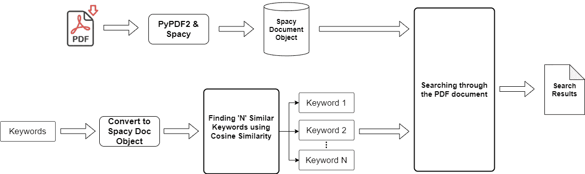
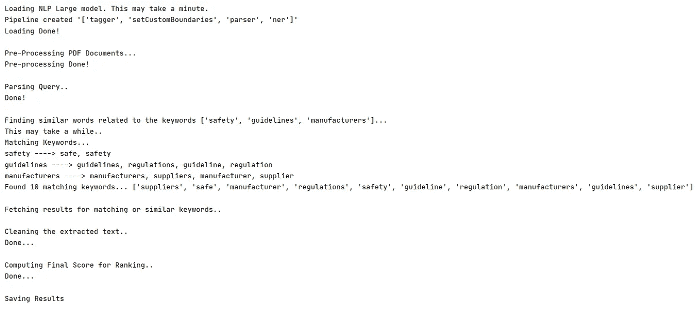

# 自然语言处理:使用 Spacy 和 Python 智能搜索文本

> 原文：<https://towardsdatascience.com/natural-language-processing-document-search-using-spacy-and-python-820acdf604af?source=collection_archive---------4----------------------->

## 使用 Python 和机器学习从文本中提取有用信息

在文本中搜索是自然语言领域中机器学习应用的关键焦点领域之一。

***但是如果我们必须从一个大文档(100+页)中搜索多个关键词呢？此外，如果我们在我们的文档中进行了上下文搜索(搜索相似含义的关键字),该怎么办！****——*传统的“CTRL + F”解决方案要么需要很长时间来完成这项任务(或者在上下文搜索的情况下，将无法找到任何有意义的文本)。

本文将帮助读者理解我们如何使用 Spacy(一个强大的开源 NLP 库)和 Python 来使用机器学习解决这个问题。

# 数据预处理

构建任何基于机器学习的解决方案的第一步是预处理数据。在我们的例子中，我们将使用 Python 中的 PyPDF2 包预处理 PDF 文档，然后将整个文本转换成 Spacy 文档对象。对于没有使用过 Spacy 的读者来说，这是一个高级的 Python 开源库，用于各种 NLP 任务。对于有兴趣了解 Spacy 更多信息的用户，请参考此链接阅读文档并了解 Spacy 更多信息—[https://spacy.io/](https://spacy.io/)

我们将首先加载 PDF 文档，清理文本，然后将其转换为 Spacy 文档对象。以下代码可用于执行此任务-

数据预处理

首先，我们必须加载 Spacy 的' **en_core_web_lg** '模型，这是 Spacy 中提供的一个预先训练好的英语语言模型。Spacy 还提供了对多种语言的支持(更多信息可以在文档链接中找到)。此外，Spacy 有多种型号(小型、中型和大型),对于我们的情况，我们将使用大型型号，因为我们必须使用仅大型型号支持的单词向量。

' **setCustomBoundaries()** '用作客户句子分割方法，与默认选项相反。同样的方法可以根据我们处理的单据进行修改。

一旦我们准备好了空间的文档对象，我们就可以进入下一步，处理需要在文档中搜索的输入查询(关键字)。

# 处理查询-查找相似的关键字

在进入编码部分之前，让我们看一下为了从我们正在搜索的文档中获得更准确的搜索结果而采用的更广泛的方法。

流程工作流

直到数据预处理阶段，我们已经将 PDF 文档文本转换为 Spacy 的文档对象。现在，我们还必须将我们的关键字转换为 Spacy 的文档对象，将它们转换为等价的向量形式((300，)维)，然后使用余弦相似度来查找相似的关键字。最后，我们将有一个类似的关键字以及原始关键字的详尽列表，我们现在可以通过搜索我们的文档来生成准确的结果。

请参考以下代码来执行此任务-

生成相似的关键字

既然我们已经找到了与原始关键字上下文相似的单词，让我们开始最后的搜索部分。

# **通过文本搜索关键词**

对于搜索，我们将使用 Spacy 的 Matcher 类的 PhraseMatcher 类。此时，重要的是要记住 Spacy 的文档对象不同于简单的 python 字符串，因此我们不能直接使用 if then else 来查找结果。

请参考以下代码来执行此任务-

在文本中搜索

上面的代码将搜索整个文本中的每个关键字，并在找到匹配的地方返回整个句子。

上述代码将生成以下输出-

搜索输出截图

您可以增加或减少想要为任何原始关键词查找的相似关键词的数量。此外，一旦在数据帧中获得结果，您可以简单地添加更多的逻辑来对结果进行排序(给精确的关键字匹配更多的权重，等等)。

> 注意:增加相似关键字的数量可能会增加整个程序的计算成本，因此应该明智地选择。

这就是你如何创建你自己的基于 ML 的 Python 程序来搜索任何文本。

在任何其他输入源(照片、网页等)的情况下。)你只需要定制数据预处理部分(OCR，网页抓取等。)和其余的逻辑应该执行得很好。