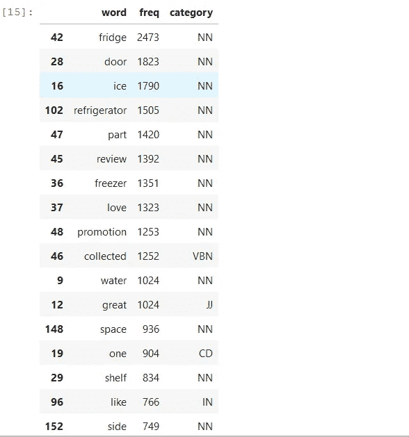

# Python 中面向消费者满意度的自然语言处理

> 原文：<https://towardsdatascience.com/natural-language-processing-for-consumer-satisfaction-in-python-e2b6d473efd1?source=collection_archive---------35----------------------->

## 消费者评论的数据挖掘和可视化

照片由[晨酿](https://unsplash.com/@morningbrew?utm_source=unsplash&utm_medium=referral&utm_content=creditCopyText)在 [Unsplash](https://unsplash.com/?utm_source=unsplash&utm_medium=referral&utm_content=creditCopyText) 拍摄

> 一家公司如何更好地了解消费者对其产品的看法，以便改进产品？

营销咨询公司或内部团队一直在分析消费者的感知，以了解如何改进其产品、品牌和营销活动。但是解决这个问题的传统方法是深度访谈或调查，这些方法通常不遵循统计抽样技术，并且需要资源来收集数据。

在社交网络时代，我们每天都会产生大量的数据。例如，该公司的脸书页面可以作为收集评论、收件箱信息和反应的宝贵资源。其他数据来源是亚马逊和 Lowe's 等电子商务平台上消费者的评论和评价。在这里，我将介绍如何使用 Python 和自然语言处理(NLP)来分析文本数据，并从这些评论中获得见解。

在下面，我们可以看到所使用的数据集，例如，它由来自不同零售商和产品(主要是冰箱)的 20473 条消费者评论组成。目标是(1)提取文本中编码产品功能、结构或购买过程的特征的单词；(2)确定销售渠道中的内容；(3)探索这些信息以产生洞察力，例如，哪些特征与正面评价最相关？最后，(4)生成数据可视化以传达结果。

作者图片

探索我们将使用哪些属性(列)，可以看到我们有有用的信息，如零售商、类别、品牌、评论用户评级和文本评论本身。因此，我们可以考虑实现目标所需的步骤:

A.预处理和探索性分析:(1)清洗和标记文本；(2)统计总字数以识别特征为最常见的名词；(3)创建产品的二元估价(好/坏)。

B .情感分析:(1)识别有价值的特征进行发掘；(2)特征附近最频繁出现的形容词的词云可视化；(3)对时间特征的情感。

## 预处理和探索性分析

首先，我们导入库和 NLTK 模型。如果你没有这些库，你可以在终端中使用 *pip 安装库*来安装。注意使用 *NLTK* 包进行自然语言处理，*熊猫*用于数据操作， *plotly* 和*袖扣*用于数据可视化。

第一步是根据 review_id 列识别重复的评论并删除它们。69%的数据是重复的，这是一个很高的数字，应该由从网站上收集这些数据的负责团队进行验证。

在导入和探索之后，我们可以对评论进行预处理，将单词放在小写字母中，删除数字，删除停用词(连接词)并应用词汇标准化算法。这个过程使我们的文本标准化，以便使特征提取更有效，所以我们使“令人愉快的”和“享受”去“享受”，例如。

现在我们可以统计评论中的单词并识别词类(名词、形容词、动词、副词等。).通过这一步，我们将能够识别用名词表达的相关特征。

作者图片

在这里我们可以看到相关的特征，如*冰箱、门、冰、冰箱、水、空间*等。下一步是探索哪些情感与这些特征相关联。

# 情感分析

为了执行情感分析，我列出了在之前的分析中观察到的相关特征。我们将使用这个列表在数据集中创建其他属性:(1)标识每个评论上是否有相关特征的属性；(2)具有形容词(情感)和的列；(3)告诉我们评论是正面(≥4 星)还是负面(< 4 星)的属性。

现在可以搜索特征附近的单词和形容词，以了解人们对每个方面的看法。我还要强调的是，这个过程可以通过实施一个简单的过滤器，将您的品牌与其他品牌进行比较，从而导向一个特定的品牌或产品，但出于教育目的，我们在这个分析中包括了所有品牌。

在这里，我编写了三种不同的分析策略来聚合我们正在寻找的特征附近的文本，因此在下一步中，将对提取的文本进行计数。我们可以识别特征评论中的所有词(ruleAll)，特征词右边的词(ruleNext)，或者离特征 3 个词距离的特征附近的词(ruleNear)。

最后，我们编写了 wordcloud 可视化代码，它对前面的搜索算法返回的文本字符串中的单词进行计数。

现在我们可以看到结果:

作者图片

第一个来源于探索特征*冰*旁边的文字，这导致了文字*制造者*、*机器*和*分配器*，表明许多评论都与冰箱的这一方面有关。

更深入的分析是识别与单词“冰”相关的消极和积极情绪，这样我们可以从消费者对制冰机的感知中获得洞察力。下面左边的词云是基于正面评论中接近特征 *ice* 的词，其中观察到相关形容词，如 *easy* 、 *big、spatial、large* 、**表示消费者对大型制冰机**的兴趣。

右边的词云捕捉了负面评论中接近于*冰*的词，这里我们可以看到形容词*小*和*小*的突出显示，即**增强了消费者对大型冰生产商的兴趣，但不太大，因为我们发现*大*是对冰的差评。**

同时，也有可能在差评中看到与 *ice* 相关的正面情绪，像 *good* 和 *great* ，这表明**即使在差评中人们仍然可以指出产品的一个好的特性。**

只要改变函数 *aspectSentimentWordcloud()中的“方面”,就可以为任何其他特性复制相同的模型。*

**(左)**作者在“ice”附近的正面评论中的单词| **(右)**作者在“ice”附近的负面评论中的单词

## 时间序列情感分析

正如我们在开始时看到的，数据集中有日期信息，可以用来让我们了解特定品牌、产品或功能的正面评论的分布情况。在这里，我展示了按日期计算正面评论的代码，并使用 plotly 交互图来可视化它。

在生成的图中，我们可以看到**没有明确的长期趋势，因为回归线(trace1)** 几乎没有变化。尽管如此，正面百分比线本身也存在表达上的变化，比如从 2019 年 9 月到 10 月，我们观察到的负面影响几乎只有 60%的正面评论，随后正面评论飙升至 90%。这个分析可以**告知消费者对某个在此期间推出的产品的感知。**

## 结论

在本文中，我想展示分析师或数据科学家如何使用 Python 工具处理、分析和可视化文本数据，以从消费者的感知中获得洞察力。

一旦来源是来自满意或不满意的消费者的大量评论和意见，而不是来自调查的封闭问题，使用这些工具不仅可以降低收集数据的成本，还可以获得自发的趋势和想法。

人们也可以用它来分析调查或深度访谈中的开放性问题。虽然数据量可能没有线上平台那么大。

我对[小鸟](https://www.birdie.ai/)的数据集表示感谢。如需获取数据和查看完整项目，您可以访问 https://github.com/claudioalvesmonteiro/nlp_birdie[的](https://github.com/claudioalvesmonteiro/nlp_birdie)