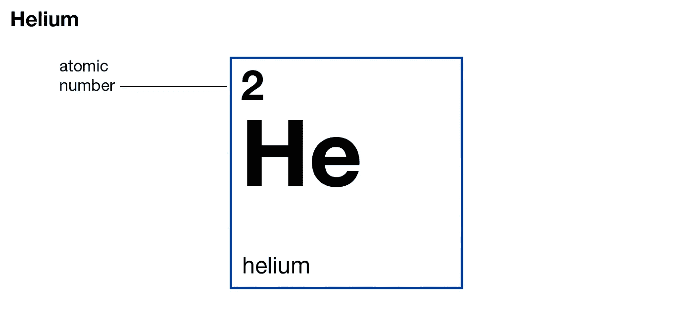
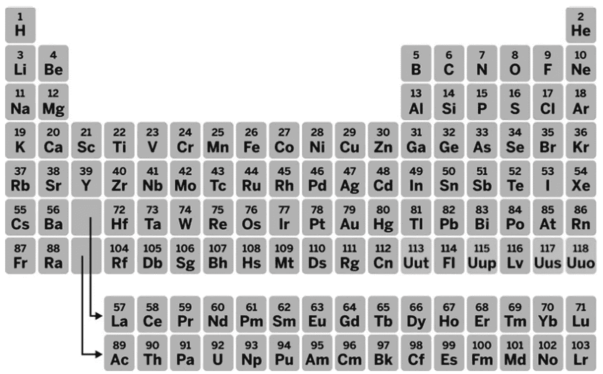
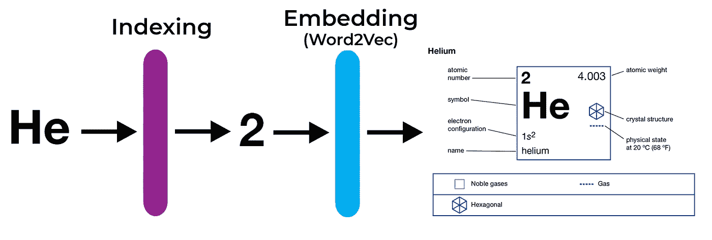
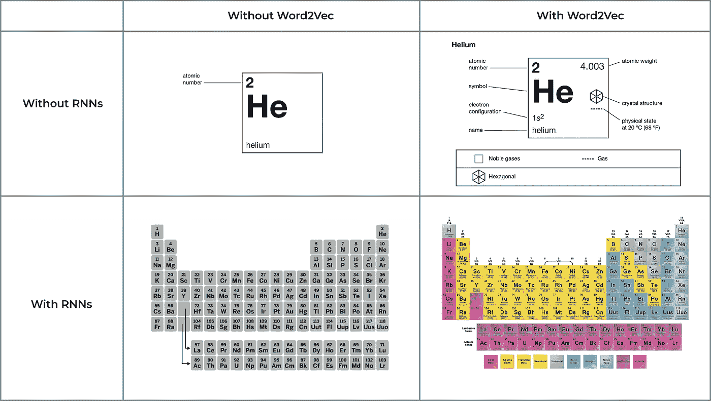
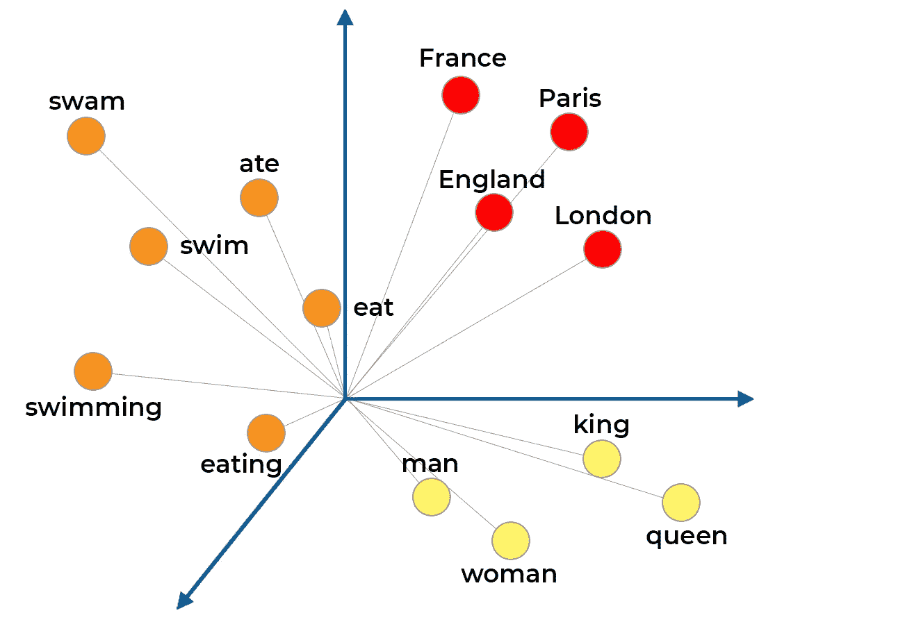
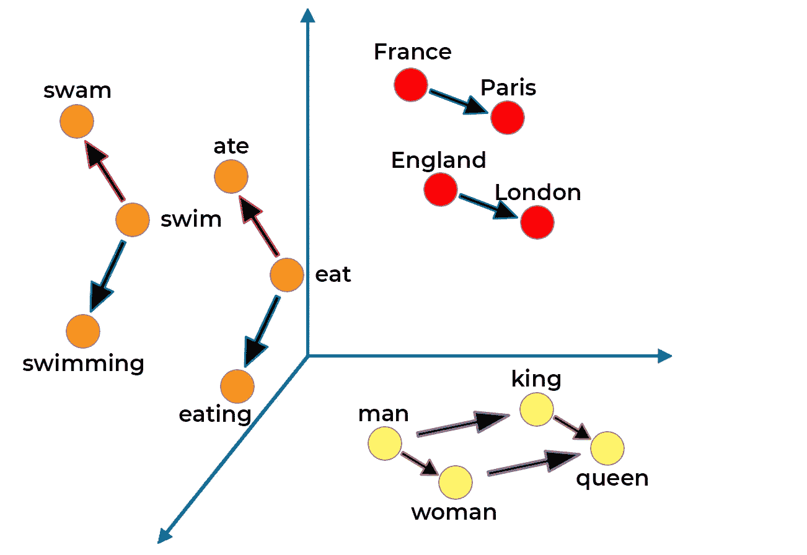
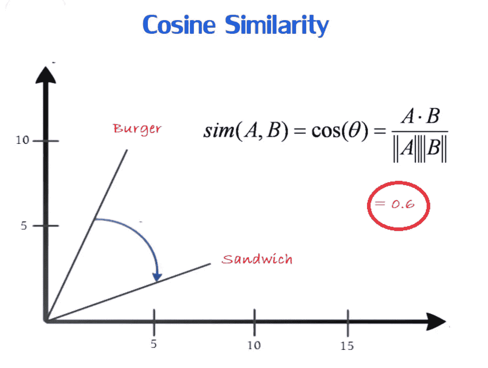
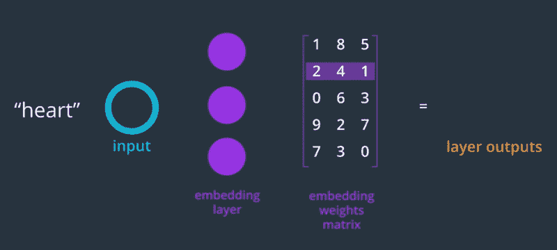

# 自然语言处理:从西瓜盒子到单词嵌入

> 原文：<https://towardsdatascience.com/natural-language-processing-from-watermelon-boxes-to-word-embeddings-4eb32e7dfd8a?source=collection_archive---------37----------------------->

## 使用单词嵌入的自然语言处理的强大发展

众所周知，人类不擅长随机应变。不管我们是否意识到这一点，我们做的每件事都有一定的模式。

我们用来交流的语言也不例外。所有的语言都遵循某种被称为句法的规则模式。

但是这有什么关系呢？

深度学习行业的很大一部分专注于一种名为**的自然语言处理(NLP) *的东西。*** NLP 是人工智能的一个子领域，专注于训练计算机处理人类语言。

信用:[猫王](https://medium.com/dair-ai/deep-learning-for-nlp-an-overview-of-recent-trends-d0d8f40a776d)

自然语言处理始于 20 世纪 50 年代，当时哈佛的一名研究人员创造了一种叫做“西瓜盒”的机器。

它做了一件简单的事情…当一个人说“西瓜”这个词时，它可以探测到。

创造它的人认为 NLP 的未来是创造数千个盒子，每个盒子检测一个单词…

这在现在听起来很可笑，但在当时却是一项非常重要的发明。

从那以后，我们走过了漫长的道路，西瓜盒子现在已经被遗忘了很久。事实上，如果没有数以千计的方形西瓜出现，很难在网上找到任何关于它们的信息:

信用:[melonmold.com](http://www.melonmold.com/product/square-watermelon-box)

现在，NLP 到处都在用。无论你使用的是谷歌翻译、Siri，还是语法——都有一个人工智能在后台使用 NLP 来理解你用什么语言交流。

所以最大的问题是:**神经网络是如何变得如此擅长理解人类语言的？**

信用:[igeeksblog.com](https://www.igeeksblog.com/how-to-activate-siri-on-iphone-x/)

让我们从经典的全连接神经网络如何处理这个问题开始。

> 如果你想了解神经网络是如何工作的，可以看看 [***这篇文章***](https://medium.com/datadriveninvestor/the-basics-of-neural-networks-304364b712dc) ***。***

首先，神经网络只能接受数字作为输入。所以你不能只给它一堆文本来处理。你得把它转换成一个数值。

最初解决这个问题的方法是通过索引。基本上每个单词都会用它自己唯一的数字来表示。这个数字然后被一键编码。

这相当于给一个对化学一无所知的人一个基本周期表的单个单元格。

就像桌子上的每个元素都有唯一的原子序数一样，神经网络看到的每个单词都有唯一的索引。

元素在周期表上的位置提供了很多信息。很明显，只有表格中的一个单元格，您会丢失那些有价值的信息。

同样，**简单的全连接神经网络的问题是，人工智能没有这个词的上下文。**

它不知道在它所查看的单词之前出现了什么单词，所以你不能指望它用那个单词做任何有价值的事情。

# 递归神经网络

NLP 的很多改进都是从递归神经网络(RNNs)开始的。它们非常擅长处理一系列数据(比如句子)，因为它们使用内存来使用上下文。

> 你可以在这里了解递归神经网络如何工作****。****

*用我们的化学类比，这和给你整个周期表是一样的。现在，您有更好的机会根据元素所在的行和列来理解趋势。*

**

*类似地，RNN 可以使用它正在分析的词周围的词来理解上下文并做出更好的预测。*

*RNNs 是一个重大的进步，可以更好地生成和分析文本。*

# *Word2Vec*

*从那以后，NLP 有了更多的进展，出现了各种关于新的训练优化器、网络架构等的研究论文。*

*但是在所有这些中，**NLP 最大的胜利之一是使用了像 Word2Vec 这样的嵌入层。***

*使用 RNNs，算法可以识别单词的上下文，但它不会真正理解每个单词。**它只是看到一个随机的索引号。***

**

*神经网络遗漏了关于每个单词的如此多的信息。*

*任何语言中的每个单词都有几个我们在理解该语言时下意识分析的属性。一个词可以是复数，可以是名词，可以有特定的动词时态，等等。*

*Word2Vec 确实如其名。**它获取一个单词，并将其转换为向量表示:***

**

*我将忠于我的周期表类比，展示使用 Word2Vec 这样的嵌入层处理 Word 的整个过程。*

**

*索引氦给出了它独特的数字表示:它的原子序数。*

*将这个数字传递给经过训练的 Word2Vec 层，我们就可以得到氦的矢量表示。这将是原子量，电子配置，物理状态等。*

*这里有一个我创建的可视化，用来总结 Word2Vec 和 RNNs 对自然语言处理的影响的周期表类比:*

**

*通过嵌入 Word2Vec 这样的层产生的矢量中最酷的部分之一是**你可以可视化和量化单词之间的关系。***

*嵌入向量的维数取决于嵌入的大小(由程序员决定)。*

*当任何单词被转换成向量时，它的维数等于嵌入的大小。*

*然后，您可以在图表上绘制这些向量，并可视化各种单词之间的关系。*

*让我们以嵌入大小为 3 为例。它将生成 3D 矢量，我们可以在笛卡尔平面上绘制这些矢量:*

**在实践中，嵌入层比这大得多，但是你不能可视化超过 3 维的空间。**

**

*你可以立即看到这些向量位置的一些趋势。**相似的词在向量空间中位置相近。**我对矢量头部进行了颜色编码，以阐明示例中的聚类:*

> ***红色→** 地方*
> 
> ***橙色→** 动词*
> 
> ***黄色→** 人*

*更有趣的是，**单词之间精确的矢量转换背后也有意义。***

**

**每个箭头颜色都是某种矢量变换，代表单词之间的关系。**

*以下是本例中矢量变换及其显示的关系的摘要:*

> ***绿色:**国家→首都*
> 
> ***粉色:**不定式→过去式*
> 
> *蓝色:不定式→现在式*
> 
> ***紫色:**男性→女性*
> 
> ***棕色:**人→皇室*

## *Word2Vec 向量是如何计算的*

*Word2Vec 通过学习从训练句子中预测单词来嵌入单词。*

*这个想法是，神经网络将学习为以类似方式使用的单词分配类似的权重。*

*拿下面这句话来说:*

> *The ____ 正在跳跃。*

*空白单词可以是任何名词，如青蛙、人、狗等。*

*因此，相似的单词将具有相似的权重值，将它们连接到嵌入层中的每个节点。*

*你可以用余弦距离来衡量单词之间的相似度。相关单词将具有小的余弦距离。*

**

*由于单词是一次性编码的，嵌入层的权重变成了一个查找表，我们可以在其中找到该单词的矢量表示。*

**

*信用: [Udacity](https://www.udacity.com/)*

*这就像一本字典，你提供你想要嵌入的单词的索引和它在权重矩阵中相应行的外观。*

# *Word2Vec 的类型*

*即使在 Word2Vec 中，也有多种类型:连续单词包(CBOW)和 Skip-gram。*

**

*信用:[machinelearningmastery.com](https://machinelearningmastery.com/what-are-word-embeddings/)*

*在 CBOW 中，你取一个句子中某个窗口的单词，试着填空。 **CBOW 获取上下文并生成单词。***

*Skip-gram 做的正好相反——它取一个单词，然后猜测它周围出现的单词。 **Skip-gram 获取一个单词并生成其上下文。***

*直觉上，你会认为 CBOW 比 Skip-gram 更容易实现，因为两者之间的比率给了你更多的信息，而你需要猜测的更少。*

*有趣的是 Skip-gram 是实现 Word2Vec 的首选方式。只是看起来效果更好。*

*除了 Word2Vec，在嵌入层方面还有一些更有趣的进步。*

*另一种称为 Doc2Vec 的嵌入类型创建整个段落的矢量表示，顾名思义就是文档。*

## *原帖:*

* [## Mayank Jain - NLP:从西瓜盒子到单词嵌入

### 众所周知，人类不擅长随机应变。不管我们是否意识到，我们所做的一切都倾向于…

mayankjain.ca](https://mayankjain.ca/blog-posts/17) 

# 如果你喜欢这篇文章:

*   在 [Medium](https://medium.com/@mayankj2112) 上关注我，在 [LinkedIn](https://www.linkedin.com/in/mayankj2112/) 上与我联系，了解我的最新工作进展！
*   订阅我的时事通讯，跟随我的旅程！：

 [## 注册我的每月更新！

### 注册以跟上我每月的进度，包括项目、会议、文章等等...

www.subscribepage.com](https://www.subscribepage.com/mayank)*