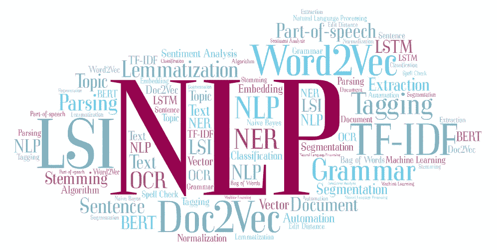
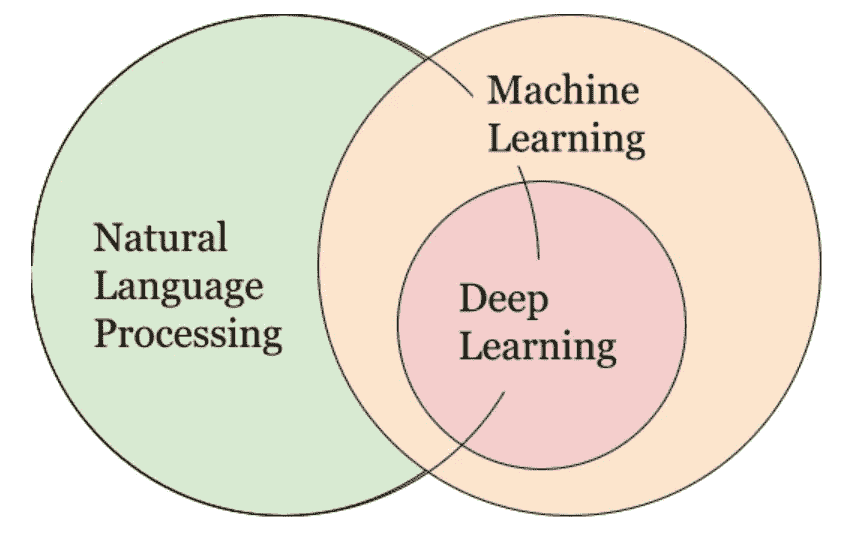
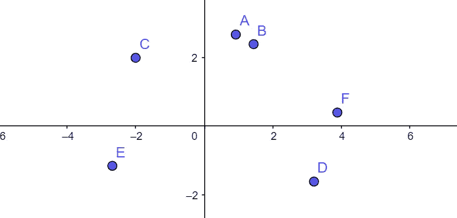

# 自然语言处理(NLP):不要重新发明轮子

> 原文：<https://towardsdatascience.com/natural-language-processing-nlp-dont-reinvent-the-wheel-8cf3204383dd?source=collection_archive---------22----------------------->

## 加速 Python NLP 项目的工具和技术

(图片由作者提供)

# 介绍

**自然语言处理(NLP)** 是一个令人生畏的领域的令人生畏的名字。从非结构化的文本中生成有用的见解是*的难题*，有无数的技术和算法，每一种都有自己的使用案例和复杂性。作为接触 NLP 最少的开发人员，可能很难知道使用哪些方法，以及如何实现它们。我是来帮忙的。

如果我用最少的努力提供完美的结果，你有理由怀疑。相反，使用 **80/20 原则**，我将向你展示如何快速(20%)交付解决方案，而不显著牺牲结果(80%)。

> 80/20 原则表明，少数原因、投入或努力通常会导致多数结果、产出或回报
> 
> **——理查德·科赫，80/20 原则的作者**

我们将如何实现这一目标？用一些奇妙的 Python 库！与其重新发明轮子，不如站在巨人的肩膀上，快速创新。通过预先测试的实现和预先训练的模型，我们将专注于应用这些方法并创造价值。

本文面向希望快速将自然语言处理集成到项目中的开发人员。强调易用性和快速结果会带来性能下降的负面影响。根据我的经验，80%的前沿技术对于项目来说已经足够了，但是在其他地方寻找 NLP 研究:)

事不宜迟，我们开始吧！

# 什么是 NLP？

自然语言处理是语言学、计算机科学和人工智能的一个分支，允许通过软件自动处理文本。NLP 赋予机器阅读、理解和响应杂乱无章的文本的能力。

人们通常将 NLP 视为机器学习的子集，但现实情况更加微妙。

(图片由作者提供)

有些 NLP 工具依赖于机器学习，有些甚至使用深度学习。然而，这些方法通常依赖于大型数据集，并且难以实现。相反，我们将关注更简单的、基于规则的方法来加速开发周期。

## 术语

从最小的数据单位开始，一个**字符**是一个字母、数字或标点符号。一个**字**是字符列表，一个**句**是单词列表。一个**文档**是句子列表，一个**语料库**是文档列表。

## 预处理

预处理可能是 NLP 项目中最重要的一步，它包括清理输入，以便模型可以忽略噪声，专注于最重要的部分。**强大的预处理管道将提高所有型号的性能，因此我再怎么强调它的价值也不为过。**

以下是一些常见的预处理步骤:

*   **分段**:给定一长串字符，我们可以用空格分隔文档，用句号分隔句子，用空格分隔单词。实施细节将因数据集而异。
*   **Make 小写**:大写一般不加值，让字符串比较更棘手。只需将所有内容小写。
*   删除标点符号:我们可能想要删除逗号、引号和其他不增加意思的标点符号。
*   **删除停用词**:停用词是指“她”、“the”和“of”这样的词，它们不会增加文本的含义，并且会分散对更相关的关键词的注意力。
*   **删除其他**:根据您的应用，您可能希望删除某些没有附加值的单词。例如，如果评估课程评论，像“教授”和“课程”这样的词可能没有用。
*   **词干化/词尾化**:词干化和词尾化都会生成词根形式的屈折词(例如:“running”到“run”)。词干提取更快，但不能保证词根是英语单词。词汇化使用一个语料库来确保词根是一个单词，代价是速度。
*   **词性标注**:词性标注根据定义和上下文用词性(名词、动词、介词)标注单词。比如我们可以把重点放在名词上进行关键词提取。

要更全面地了解这些概念，请查看这个令人惊叹的指南:

 [## 自然语言处理实践指南(第一部分)——处理和理解文本

### 经过验证和测试的解决 NLP 任务的实践策略

towardsdatascience.com](/a-practitioners-guide-to-natural-language-processing-part-i-processing-understanding-text-9f4abfd13e72) 

这些步骤是成功预处理管道的基础。根据您的数据集和任务，您可以跳过某些步骤或添加新步骤。通过预处理手动观察您的数据，并在出现问题时进行纠正。

# Python 库

来源:[python.org](http://python.org)

让我们来看看几个领先的 Python 库。这些工具将在预处理期间，尤其是预处理之后，处理大部分繁重的提升工作

## NLTK

自然语言工具包是 Python 中使用最广泛的 NLP 库。NLTK 是在 UPenn 为学术目的开发的，有大量的特性和语料库。NLTK 非常适合处理数据和运行预处理。

 [## 自然语言工具包- NLTK 3.5 文档

### NLTK 是构建 Python 程序来处理人类语言数据的领先平台。它提供了易于使用的…

www.nltk.org](https://www.nltk.org/) 

这里有一个来自 NLTK 网站的例子，展示了对句子进行标记和词性标注是多么简单。

## 空间

SpaCy 是一个现代和固执己见的包。虽然 NLTK 的每个特性都有多个实现，但是 SpaCy 只保留了性能最好的实现。Spacy 支持广泛的特性，请阅读文档了解更多详细信息:

 [## Python 中的 spaCy 工业级自然语言处理

### spaCy 旨在帮助您做真正的工作——构建真正的产品，或收集真正的见解。图书馆尊重你的…

空间. io](https://spacy.io/) 

只需几行代码，我们就可以用 SpaCy 执行命名实体识别。使用 SpaCy API 可以快速完成许多其他任务。

## 根西姆

与 NLTK 和 SpaCy 不同，GenSim 专门处理信息检索(IR)问题。GenSim 的开发重点是内存管理，它包含许多文档相似性模型，包括潜在语义索引、Word2Vec 和 FastText。

 [## 稀有技术/基因工程

### Gensim 是一个 Python 库，用于大型语料库的主题建模、文档索引和相似性检索。目标…

github.com](https://github.com/RaRe-Technologies/gensim) 

下面是一个预训练的 GenSim Word2Vec 模型的示例，该模型用于查找单词相似性。不用担心那些乱七八糟的细节，我们可以很快得到结果。

## 还有更多…

该列表并不全面，但涵盖了一系列特性和使用案例。我建议查看这个库以获得更多的工具和参考资料。

# 应用程序

现在我们已经讨论了预处理方法和 Python 库，让我们用几个例子把它们放在一起。对于每一个，我将介绍几个 NLP 算法，根据我们的快速开发目标选择一个，并使用其中一个库创建一个简单的实现。

## 应用#1:预处理

预处理是任何 NLP 解决方案的关键部分，所以让我们看看如何使用 Python 库来加速这个过程。根据我的经验，NLTK 拥有我们需要的所有工具，并针对独特的用例进行了定制。让我们加载一个样本语料库。

按照上面定义的管道，我们可以使用 NLTK 实现分段、删除标点符号和停用词、执行词汇化等等。看看移除停用字词有多容易:

整个预处理流水线花了我不到 40 行 Python。完整代码见[这里](https://github.com/avgupta456/medium_nlp/blob/master/Pre-Processing.ipynb)。请记住，这是一个一般化的例子，您应该根据您的具体用例的需要修改这个过程。

## 应用#2:文档聚类

文档聚类是自然语言处理中的一项常见任务，因此我们来讨论一些实现方法。这里的总体思路是给每个文档分配一个向量，代表所讨论的主题:

(图片由作者提供)

如果向量是二维的，我们可以像上面一样可视化文档。在这个例子中，我们看到文档 A 和 B 紧密相关，而 D 和 F 松散相关。使用距离度量，我们可以计算相似性，即使这些向量是三维、一百维或一千维的。

下一个问题是如何使用非结构化文本输入为每个文档构造这些向量。这里有几个选项，从最简单到最复杂:

*   **单词袋**:给每个唯一的单词分配一个维度。给定文档的向量是每个单词出现的频率。
*   **词频—逆文档频率(TF-IDF)** :根据一个单词在其他文档中的常见程度来缩放单词包表示。如果两个文档共享一个罕见的单词，那么它们比共享一个公共单词更相似。
*   **潜在语义索引(LSI)** :单词包和 TF-IDF 可以创建高维向量，这使得距离度量不太准确。LSI 将这些向量压缩到更易于管理的大小，同时最大限度地减少信息丢失。
*   **Word2Vec** :使用神经网络，从大型文本语料库中学习单词关联。然后将每个单词的向量相加，得到一个文档向量。
*   **Doc2Vec** :构建在 Word2Vec 的基础上，但是使用了一种更好的方法来逼近单词向量列表中的文档向量。

Word2Vec 和 Doc2Vec 相当复杂，需要大数据集来学习单词嵌入。我们可以使用预先训练的模型，但它们可能无法很好地适应特定领域的任务。相反，我们将使用单词包、TF-IDF 和 LSI。

现在来选择我们的图书馆。GenSim 是专门为此任务构建的，包含所有三种算法的简单实现，所以让我们使用 GenSim。

对于这个例子，让我们再次使用布朗语料库。它有 15 个文本类别的文档，如“冒险”、“社论”、“新闻”等。运行 NLTK 预处理程序后，我们可以开始应用 GenSim 模型。

首先，我们创建一个将标记映射到惟一索引的字典。

接下来，我们迭代地应用单词包、术语频率—逆文档频率和潜在语义索引:

在大约 10 行 Python 代码中，我们处理了三个独立的模型，并为我们的文档提取了向量表示。利用余弦相似度进行向量比较，可以找到最相似的文档。

就这样，我们有了结果！冒险文本最类似于小说和浪漫，而社论则类似于新闻和政府。已经核实了。查看完整代码[在这里](https://github.com/avgupta456/medium_nlp/blob/master/Similarity.ipynb)。

## 应用#3:情感分析

情感分析是将非结构化文本解释为正面、负面或中性的。情感分析是分析评论、衡量品牌、构建人工智能聊天机器人等的有用工具。

与应用预处理的文档聚类不同，我们**在情感分析**中不使用预处理。一篇文章的标点符号、流程和上下文可以揭示很多关于情感的东西，所以我们不想删除它们。相反，我们直接进入模型。

为了保持简单有效，我推荐使用基于模式的情感分析。通过搜索特定的关键词、句子结构和标点符号，这些模型可以测量文本的极性。这里有两个内置情感分析器的库:

**VADER 情绪分析**:

VADER 代表价感知词典和情感识别器，是用于情感分析的 NLTK 的扩展。它使用模式来计算情绪，尤其适用于表情符号和短信俚语。也超级容易实现。

**TextBlob 情感分析**:

一个类似的工具是 TextBlob，用于情感分析。TextBlob 实际上是一个类似于 NLTK 和 SpaCy 的多功能库。关于它的情感分析工具，它在报道的极性和主观性上都与 VADER 不同。从我个人的经历来说，我更喜欢 VADER，但是各有各的优缺点。TextBlob 也非常容易实现:

**注意:**基于模式的模型在上面例子中的小文本上表现不佳。**我推荐对平均四句话的文本进行情感分析。**如需快速演示，请参考[Jupyter 笔记本](https://github.com/avgupta456/medium_nlp/blob/master/Sentiment.ipynb)。

## 其他应用

这里有几个额外的主题和一些有用的算法和工具来加速您的开发。

*   **关键词提取:**使用 SpaCy 的命名实体识别(NER)，使用 ntlk-rake 的快速自动关键词提取(RAKE)
*   **文本摘要**:使用 PyTextRank SpaCy 扩展的 TextRank(类似于 PageRank)，使用 GenSim 的 TF-IDF
*   **拼写检查** : PyEnchant、SymSpell Python 端口

希望这些例子有助于展示 Python 中自然语言处理可用的大量资源。不管问题是什么，很可能有人已经开发了一个库来简化这个过程。使用这些库可以在短时间内产生很好的结果。

# 提示和技巧

通过对 NLP 的介绍、对 Python 库的概述和一些示例应用程序，您几乎已经准备好应对自己的挑战了。最后，我有一些技巧和诀窍来充分利用这些资源。

*   **Python 工具**:我推荐诗歌用于依赖管理，Jupyter Notebook 用于测试新模型，Black 和/或 Flake8 用于林挺，GitHub 用于版本管理。
*   **保持条理**:从一个库跳到另一个库很容易，复制代码来测试十几个想法。相反，我推荐一种更有分寸的方法。你不想在匆忙中错过一个很好的解决方案。
*   **预处理**:垃圾进，垃圾出。实现一个强大的预处理管道来清理你的输入是非常重要的。目视检查处理后的文本，以确保一切按预期运行。
*   展示结果:选择如何展示你的结果会有很大的不同。如果输出的文本看起来有点粗糙，可以考虑显示聚合统计数据或数字结果。

现在你应该已经准备好处理一些现实世界的 NLP 项目了。祝你好运，并快乐编码:)

如果你用这些信息做了什么酷的事情，请在评论中留下你的回复。如有任何反馈或见解，欢迎随时联系我[*LinkedIn*](https://www.linkedin.com/in/avgupta456/)*。感谢阅读！*