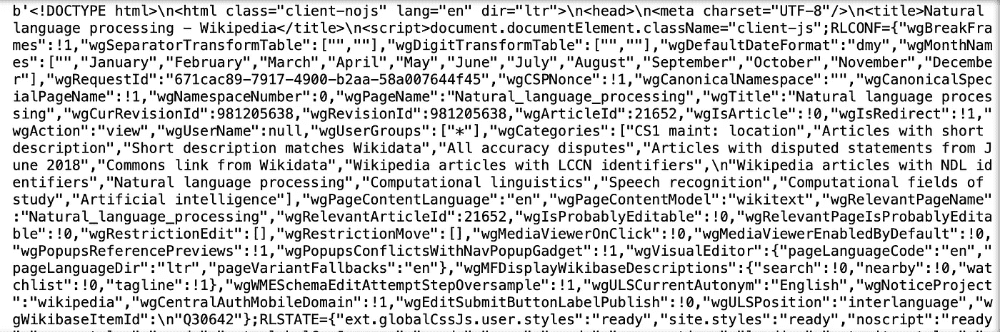
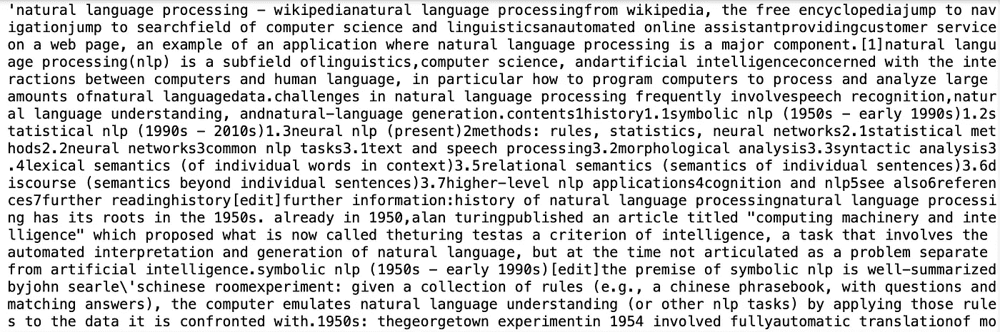
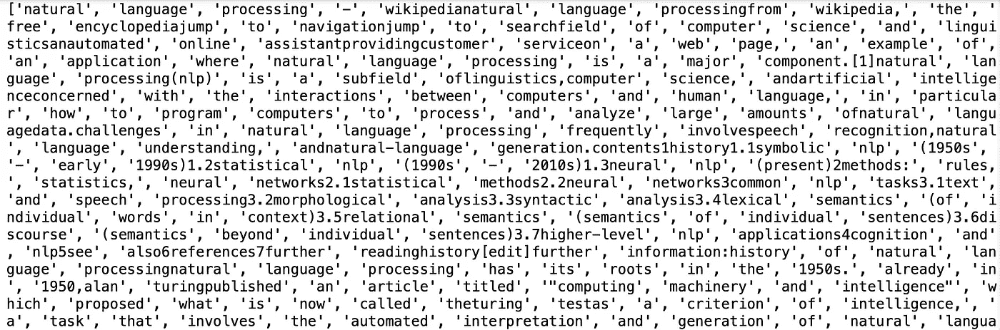
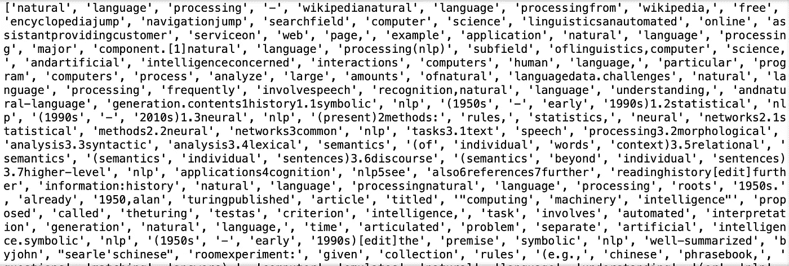
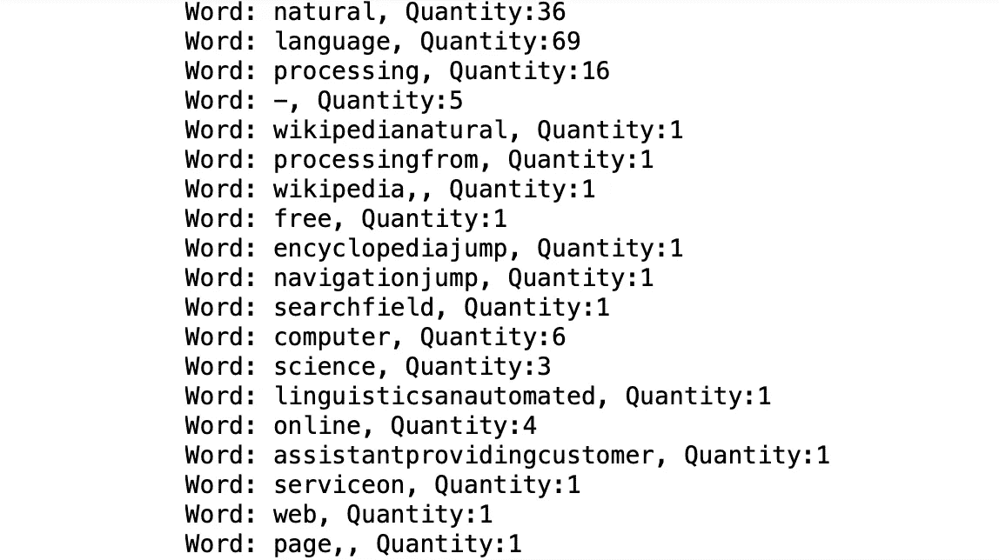
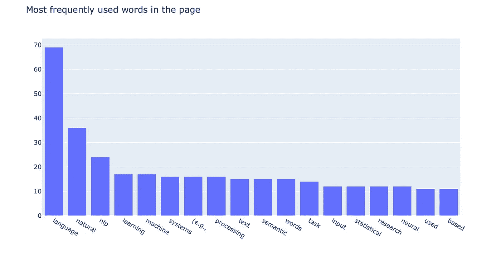

# 面向初学者的自然语言处理

> 原文：<https://towardsdatascience.com/natural-language-processing-nlp-for-beginners-6d19f3eedfea?source=collection_archive---------13----------------------->

## 使用 Python 的 NLP 循序渐进初学者指南


Bram Naus 在 [Unsplash](https://unsplash.com/?utm_source=unsplash&utm_medium=referral&utm_content=creditCopyText) 上拍摄的照片

在这篇文章中，我将向你介绍一个最著名的人工智能领域，叫做自然语言处理。介绍结束后，我将带您完成一个动手练习，我们将从一个特定的网站中提取一些有价值的信息。对于动手项目，我们将使用一个名为 NLTK(自然语言工具包)的特定 NLP 模块，这将在简介部分之后介绍。读完这篇文章后，您将对自然语言处理应用程序及其工作原理有更好的理解。抓紧时间，让我们开始吧！

## 目录

*   ***简介***
*   ***【自然语言工具包】***
*   ***BS4(美汤 4)***
*   ***第一步——导入库***
*   ***第二步—阅读页面***
*   ***第三步—数据清理***
*   ***第四步——标记化***
*   ***第五步—数据可视化***
*   ***视频演示***

# 介绍

自然语言是指我们在日常生活中使用的语言。这个领域已经存在很长时间了，但是随着计算机科学和编程的发展，关于这个领域的人工智能相关研究已经增加。互联网改变了我们的生活方式，以及我们相互交流的方式。例如，我们开始使用文本消息、电子邮件、语音消息等，而不是发送纸质邮件和信件。你可以通过在网上做一些研究来了解这个领域。

为了让你更好地了解*自然语言处理*如何被用于机器学习和人工智能领域，我想与你分享一些现实生活中的应用:

*   **Google** **翻译:**Google Translate 背后的机器智能理解单词，并逐字翻译成你想要的语言。它在翻译时不会丢失句子的意思。
*   语法上:这项服务背后的机器智能擅长语法和单词。这是语言处理在过去几年中如何发展的一个很好的例子。它检查句子的语法，甚至给出一些如何提高文章质量的建议。
*   **语音助手:**这个领域也是语言处理进步很大的大部分领域。语音识别技术主要用于文字处理。目前，最知名的是苹果 Siri、谷歌助手和亚马逊 Alexa。
*   聊天机器人:另一个语言处理的好例子是聊天机器人。他们非常像虚拟助理，但有更具体的目标。它们最常用于客户访问的网站。他们帮助你获得你需要的信息，而不需要和任何真实的人交谈。首先，他们试图理解你的需求，然后把结果呈现在你面前。
*   Web 抓取: Web 抓取是语言处理常用的另一个领域。它用于从网页中提取信息，甚至不需要花费时间一段一段地复制。网络抓取是收集有价值的数据和训练机器学习模型的一种很好的方式。网页抓取也是一个非常有用的工具，当工作与搜索引擎优化。

# 自然语言工具包

> NLTK 是构建 Python 程序来处理人类语言数据的领先平台。它提供了 50 多个语料库和词汇资源(如 WordNet)的易用接口，以及一套用于分类、标记化、词干化、标记、解析和语义推理的文本处理库，以及工业级 NLP 库的包装器。
> 
> 参考:[http://www.nltk.org](http://www.nltk.org)

我们必须安装 NLTK 模块，以便我们可以在我们的项目中使用它。在您的终端中运行以下代码将为您完成安装:

```
pip install nltk
```

# 美丽的汤 4

> Beautiful Soup 是一个 Python 库，用于从 HTML、XML 和其他标记语言中获取数据。Beautiful Soup 帮助您从网页中提取特定内容，删除 HTML 标记，并保存信息。它是一个网络抓取工具，可以帮助你清理和解析从网上下载的文档。
> 
> 参考:[https://programminghistorian . org/en/lessons/intro-to-beautiful-soup](https://programminghistorian.org/en/lessons/intro-to-beautiful-soup)

现在，让我们使用 pip 安装最新版本的漂亮汤库:

```
pip install beautifulsoup4
```

# 步骤 1-导入库

库安装完成后，我们就可以开始编程了。为了这个项目，我将使用 Jupyter 笔记本。好的，首先，让我们将库导入笔记本。

```
import nltk

from nltk.corpus import stopwordsfrom bs4 import BeautifulSoupimport urllib.requestimport plotly.io as pio
```

# 步骤 2 —阅读页面

在这一步中，我们将使用 urllib 请求方法打开网页。打开后，我们会读取网页的全部代码。如你所知，网页有一个代码在后台运行。你可以在任何网页上点击右键，然后点击“inspect element”来了解代码。

我选择了维基百科关于自然语言处理的页面。

```
page =  urllib.request.urlopen('[https://en.wikipedia.org/wiki/Natural_language_processing'](https://en.wikipedia.org/wiki/Natural_language_processing'))html_plain = page.read()print(html_plain)
```

这是我们打印普通 html 代码时的样子:



html 代码

# 步骤 3 —数据清理

从截图中可以看出，普通的 html 代码需要一些清理。BeautifulSoup 将在这个数据清理过程中帮助我们。我们必须去掉许多不必要的字符，比如双引号、斜线、大于号和小于号等等。别担心，它还会清理 HTML 语法单词😊

运行以下几行来看看 BS4(美人汤 4)的神奇力量:

```
soup = BeautifulSoup(html_plain,'html.parser')soup_text = soup.get_text(strip = True)
```

太好了！在我们拆分单词之前还有一件事:为了提高处理的质量，我建议所有的字符都小写。当我们开始计算单词的频率时，这将是有帮助的。否则，由于 Ascii 值不同，机器会将“自然”和“自然”视为不同的单词。

```
ready_text = soup_text.lower()print(ready_text)
```



看起来好多了！现在，让我们进入下一步，将每个单词拆分成一个列表项。这个过程被称为标记化。

# 步骤 4 —标记化

在处理自然语言处理项目时，这一步至关重要。首先，我们将通过将每个单词分成列表项来对它们进行标记。之后，我们会做一些单词清理。NLTK(自然语言工具包)将用来清除停用词。这将给我们留下关键词，让我们对网页有更好的了解。这样我们就不算停用词了，比如 *a，and，of，that，the，with 等*。

```
tokens = []
for t in ready_text.split():
    tokens.append(t)print(tokens)
```



```
#Run this line if you get an error message in the next code block
nltk.download()
```

现在，让我们清除令牌列表中的停用词。

```
stop_words = stopwords.words('english')
clean_tokens = tokens[:]for token in tokens:
    if token in stop_words:
        clean_tokens.remove(token)print(clean_tokens)
```



清理的令牌

# 步骤 5 —数据可视化

在这一步中，首先我们将统计标记的频率，然后我们将过滤高频标记。过滤后，就该可视化自然语言处理维基百科页面中最常用的词了。视觉化将帮助我们按照它们的频率顺序来看它们。

让我们用 NLTK 的 FreqDist 函数来计算单词的频率。

```
freq = nltk.FreqDist(clean_tokens)for key, val in freq.items():
    print('Word: ' + str(key) + ', Quantity:' + str(val))
```



代币数量

现在，我们将定义一个新的字典，并获取页面中使用次数超过 10 次的标记。这些关键词比其他关键词更有价值:

```
high_freq = dict()
for key, val in freq.items():
    if (val > 10):
        high_freq[key] = val
```

完美！现在我们有了一本叫做*高频*的新词典。让我们进入最后一步，创建一个条形图。我认为条形图用定量数据表示会更好。我还按照降序排列，所以出现频率最高的单词排在最前面。以下是可视化代码:

```
#Note: to pass keys and values of *high_freq* dictionary, I had to convert them to list when passing themfig = dict({
    "data": [{"type": "bar",
              "x": list(high_freq.keys()),
              "y": list(high_freq.values())}],
    "layout": {"title": {"text": "Most frequently used words in the page"}, "xaxis": {"categoryorder":"total descending"}}
})pio.show(fig)
```



plotly 条形图

# 视频演示

恭喜你。！您已经创建了一个程序来检测页面中的关键字。现在，不用阅读整个页面，你仍然可以使用自然语言处理对页面有所了解。希望你喜欢阅读这个实践指南。如果你今天学到了新东西，我会很高兴。从事像这样的动手编程项目是提高编码技能的最好方式。如果您在执行代码时有任何问题，请随时[联系我](https://sonsuzdesign.blog/)。

> 关注我的[博客](https://medium.com/@lifexplorer)和 [youtube](https://www.youtube.com/channel/UCmo4tnTcj92DlzES5hvlWwQ) 频道，保持灵感。谢谢你，

[](/building-a-face-recognizer-in-python-7fd6630c6340) [## 用 Python 构建人脸识别器

### 使用 OpenCv 库进行实时人脸识别的分步指南

towardsdatascience.com](/building-a-face-recognizer-in-python-7fd6630c6340) [](/extracting-speech-from-video-using-python-f0ec7e312d38) [## 使用 Python 从视频中提取语音

### 使用 Google 语音识别 API 的简单实用项目

towardsdatascience.com](/extracting-speech-from-video-using-python-f0ec7e312d38)