# 自然语言处理与空间——阿瑟·柯南·道尔和阿加莎·克里斯蒂的写作风格分析

> 原文：<https://towardsdatascience.com/natural-language-processing-nlp-with-nltk-and-spacy-sir-arthur-conan-doyle-and-agatha-christies-d3ba967bd666?source=collection_archive---------35----------------------->

## [内部 AI](https://towardsdatascience.com/data-science/home)

## 在本文中，我将对阿瑟·柯南·道尔的《巴斯克维尔的猎犬》和阿加莎·克里斯蒂的《林克斯谋杀案》进行对比分析。


由[马库斯·温克勒](https://unsplash.com/@markuswinkler?utm_source=medium&utm_medium=referral)在 [Unsplash](https://unsplash.com?utm_source=medium&utm_medium=referral) 上拍摄

我相信我们都喜欢读著名侦探夏洛克·福尔摩斯和赫丘里·波罗写的经久不衰的惊险侦探小说。作为一名数据科学家，我很好奇亚瑟·柯南道尔和阿加莎·克里斯蒂的写作风格有没有相似之处。如果我能在自然语言处理(NLP)的帮助下，从成功的侦探小说写作食谱中提取任何见解，那就太好了。

***目标***

在本文中，我将对阿瑟·柯南·道尔的《巴斯克维尔的猎犬》和阿加莎·克里斯蒂的《林克斯谋杀案》进行对比分析。

在我的完整分析中，我考虑了每个作者的十个故事来进行比较，但是为了简单起见，我在本文中用每个作者的一个故事来解释这个过程。下面提到的框架和代码很容易扩展，我强烈建议你们都来试试亚瑟·柯南·道尔爵士和阿加莎·克里斯蒂的全套故事。

主要目的是展示使用 NTLK 和 spaCY 之类的包来执行自然语言处理(NLP)是多么容易，并提供一个初始框架结构来自我探索和深入研究其他作者的作品。

***入门***

我已经下载了亚瑟·柯南·道尔爵士的《巴斯克维尔的猎犬》和阿加莎·克里斯蒂的《链接上的谋杀》的文本版本。

我使用了“ [en_core_web_lg](https://spacy.io/models/en#en_core_web_lg) ”通用预训练模型来预测命名实体、词性标签和句法依赖。

spaCY 提供三种尺寸的预训练模型，即小型、中型和大型，规模越来越大，预测越来越准确。

作为先决条件，我们需要用下面的命令下载大模型。

```
python -m spacy download en_core_web_lg
```

***步骤 1:*** 我们将使用 NLP 包 ***NLTK 和 spaCy*** 进行分析。首先，导入所有需要的包，并通过加载预先训练的模型“en_core_web_lg”来创建 NLP 对象。顾名思义，Matcher 包将有助于执行基于模式的搜索，并将在本文后面详细讨论。

```
import spacy
from spacy.matcher import Matcher
nlp = spacy.load("en_core_web_lg")
matcher = Matcher(nlp.vocab)
```

***第二步:*** 在下面的代码中，读取从[项目古腾堡](https://www.gutenberg.org/)下载的“巴斯克维尔的猎犬”“链接上的谋杀”的文本文件。

```
Sherlock= open("Sherlock.txt", "r")
Poirot= open("Poirot.txt", "r")
```

***第三步:*** 我们想知道两个故事中名词、动词和句子的数量。我们将编写一个小的自定义管道组件，它可以添加到标准的开箱即用管道中来获取这些信息。

在主程序中(后面会解释)，我们会把全文分成单个单词 token。在下面的代码中，我们检查 token 的词类是名词还是动词，并根据测试增加相应的计数器。

此外，我们正在使用 spaCY 中的标准 doc.sents 方法计算文本中的句子数量。

```
def length(doc):
    nou=0
    ver=0
    sentence=0
    for token in doc:
        if token.pos_=="NOUN":
            nou=nou+1 
        elif token.pos_=="VERB":
            ver=ver+1
    print("Number of Verbs in the text = ",ver)
    print("Number of Nouns in the text = ",nou)for sent in doc.sents:
       sentence=sentence+1
    print("Number of Sentences in the text = ",sentence)
    return doc
```

***第四步:*** 我们将使用 add_pipeline 方法将自定义管道组件“长度”添加到标准空间管道中。

```
nlp.add_pipe(length)
```

***第五步:*** 在下面的代码中，我们通过第二步读取的文本来创建 doc 对象，Arthur 和 Agatha。创建 doc 对象时，在后台按顺序执行一组操作，doc 对象是带有语言注释的单词序列。

```
Arthur=nlp(Sherlock.read())
Agatha=nlp(Poirot.read())
```

它从标记化开始，然后是标记、解析等。如下图。我们在最后加入了自定义管道来统计名词、动词和句子。

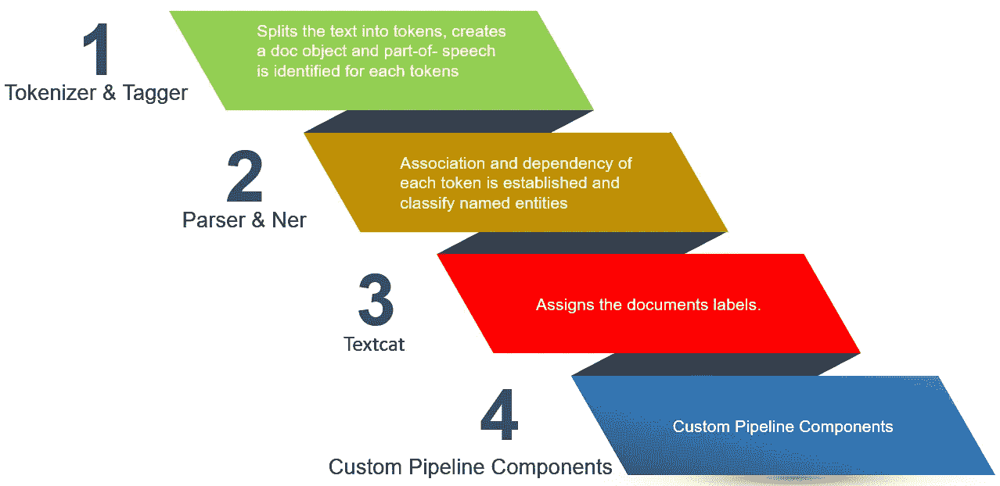

作者绘制的图像

对于本文的范围，我们感兴趣的是我们在步骤 3 中编写的最后一个定制管道操作的输出。

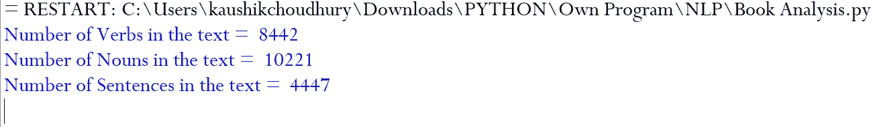

“巴斯克维尔的猎犬”中的动词、名词和句子数量的自定义管道输出

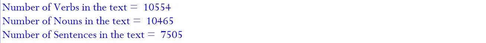

自定义管道输出与一些动词，名词和句子在“谋杀的联系”

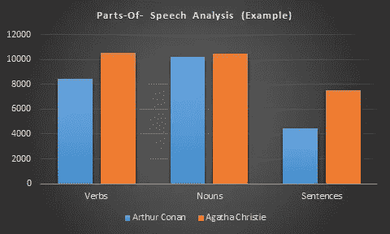

基于程序输出的词性分析

***第六步:*** 接下来，我们来分析一下主角侦探福尔摩斯和波洛采取任何行动的次数。作为一个近似的解决方案，我们需要寻找侦探的名字后面跟一个动词的模式。

在下面的代码中，我们定义了一个模式 holmes_pattern，用于查找紧跟动词的“holmes”的出现次数。

Add 方法用于将模式包含到匹配器中。最后，doc 对象即被传递给匹配器，以收集文本中与后跟动词的 holmes 模式匹配的所有实例。

```
matcher = Matcher(nlp.vocab)
holmes_pattern = [{"TEXT": "Holmes"}, {"POS": "VERB"}]matcher.add("Action", None, holmes_pattern )
matches = matcher(Arthur)
print("Sherlock Acted:", len(matches))
```

匹配的长度给出了在文本中找到模式匹配的次数。

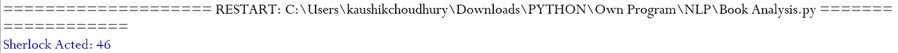

如果我们循环匹配对象，如下面的代码所示，那么我们可以打印单独的模式匹配文本

```
for match_id, start, end in matches:
    print("Sherlock Action Found:", Arthur[start:end].text)
```

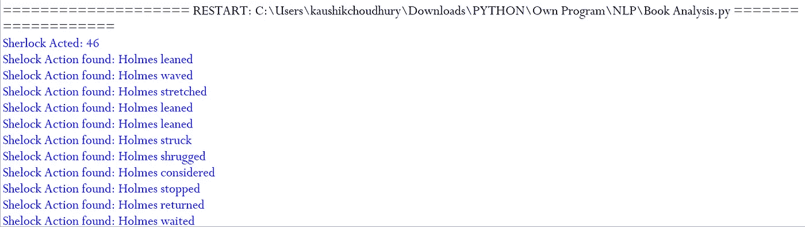

程序输出

阿加莎·克里斯蒂的小说《链接上的谋杀》中的侦探波洛也有类似的逻辑

```
poirot_pattern = [{"TEXT": "Poirot"}, {"POS": "VERB"}]
matcher.add("Action", None, poirot_pattern )
matches = matcher(Agatha)
print("Poirot Acted:", len(matches))for match_id, start, end in matches:
    print("Hercule Action found:", Agatha[start:end].text)
```

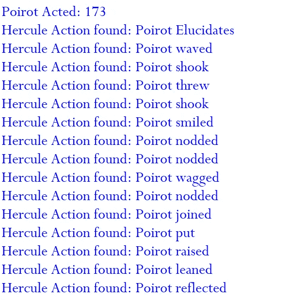

程序输出

看来波洛比夏洛克·福尔摩斯活跃多了:-)

***第七步:*** 接下来，我们会看到在各自的故事中，有多少次主角侦探和他的副手的名字被描述。

我们之前了解到，在标记化过程中，每个单词都被分离和分类。我们将比较每个令牌的文本，以计算夏洛克、华生、波洛和黑斯廷斯在各自故事中的实例。

```
sherlock_count=0
watson_count=0
for token in Arthur:
    if token.text == "Sherlock":
        sherlock_count=sherlock_count+1
    elif token.text == "Watson":
        watson_count=watson_count+1print(sherlock_count)
print(watson_count)
```

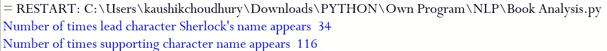

```
poirot_count=0
hasting_count=0
for token in Arthur:
    if token.text == "Poirot":
        poirot_count=sherlock_count+1
    elif token.text == "Hastings":
        hasting_count=watson_count+1print(poirot_count)
print(hasting_count)
```

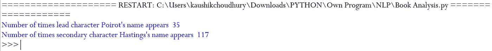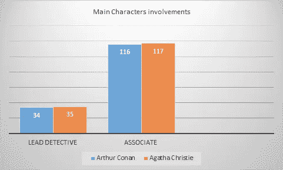

程序输出的图表

***第八步:*** 最后，我们会看到每个作者在故事中使用频率最高的 15 个词。我们将使用 NLTK 模型进行分析，并绘制一个累积图。

```
from nltk import *Arthur_plot = FreqDist(Sherlock)
Arthur_plot .plot(15, cumulative=True)
```

在上面的代码中，我们将文本传递给 NLTK 的 FreqDist 内置函数，然后使用 plot 方法绘制最常用单词的累积图表。我们可以看到《巴斯克维尔的猎犬》中 15 个最常用的单词加起来接近 1700 个单词。

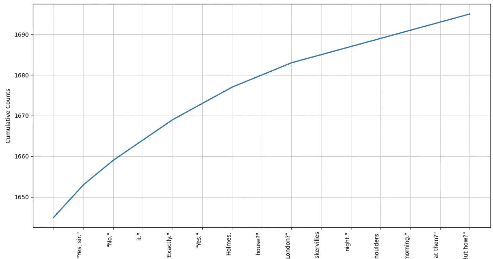

《巴斯克维尔的猎犬》中最常用词汇的累积图表

我们对阿加莎·克里斯蒂的小说《链接上的谋杀》做了同样的分析。

```
Agatha_plot = FreqDist(Poirot)
Agatha_plot .plot(15, cumulative=True)
```

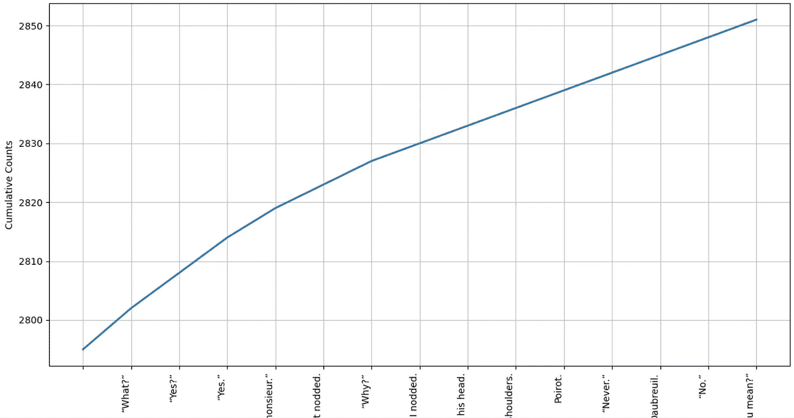

“链接上的谋杀”中最常用词的累积图表

我们已经讨论了很多领域，所以为了快速回顾一下，我们从分析每个故事中动词、名词和句子的数量开始。作为一个自我探索的练习，我建议你扩展形容词、介词等的词性分析。以获得更好的洞察力。

我们进一步学习了使用模式搜索，并发现了前导字符名称后面跟一个动词的次数。接下来，我们分析了探长和他的同事的名字在各自的故事中被提及的次数。我们用故事中最常用的 15 个词来结束我们的分析。

正如在开始时提到的，本文旨在展示使用 NTLK 和 spaCY 这样的包来执行自然语言处理(NLP)是多么容易，并提供一个初步的框架结构来自我探索和深入研究其他作者的作品。