# 自然语言处理流水线解码！

> 原文：<https://towardsdatascience.com/natural-language-processing-pipeline-decoded-f97a4da5dbb7?source=collection_archive---------34----------------------->

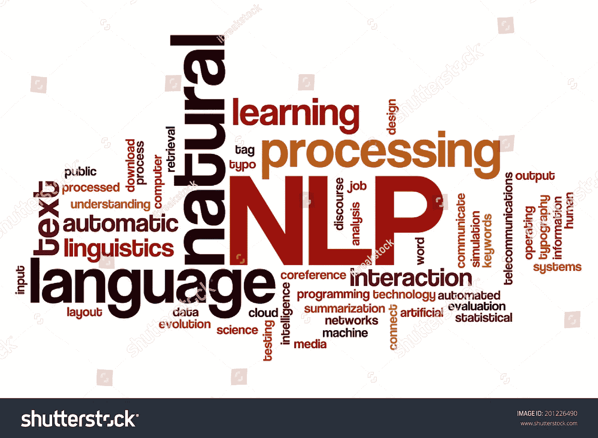

[来源](https://www.shutterstock.com/image-illustration/natural-language-processing-concept-word-cloud-201226490)

自然语言是我们书写、说话和理解的语言。世界上几乎所有已知的语言都属于自然语言的范畴。自然语言处理是处理语言的书面形式并使计算机理解它们的任务。

让我们来谈谈为了让自然语言**机器或深度学习模型做好准备所需的一些非常基本的任务。**

> **句子分割**
> 
> **转换成小写**
> 
> **词语的标记化**
> 
> **删除标点符号、特殊字符和停用词**
> 
> **词汇化/词干化**
> 
> **创建单词袋模型/ TF-IDF 模型**

下面就一个一个说吧。

***句子分割*** 是一个众所周知的文本分割子任务。文本分割基本上是将给定的文本分成逻辑上可理解的信息单元。一个这样的逻辑单元的例子是句子。因此，将给定文本划分成句子的任务被称为句子分割。这项任务是处理文本的第一步。将包含大量文本的文档分成句子有助于我们逐句处理文档，从而不会丢失它们可能包含的重要信息。

请注意，句子分割取决于文档的性质和文档遵循的句子边界的类型。例如，在一个文档中，文本可以根据“.”分成句子而在另一个文档中，文本可以根据换行符或“\n”来划分。因此，在进行句子分割之前，查看您的文档并在尝试句子分割之前找到合理的句子边界是非常重要的。

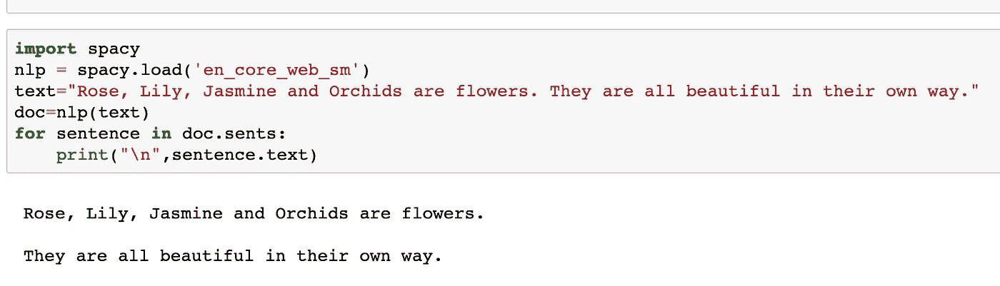

句子分割插图

上图展示了一个例子，说明了 [spacy](https://spacy.io/) 如何通过使用句号将给定文本分成两个句子来帮助执行句子分割。

下一个任务通常是 ***将所有句子转换成小写*** 。在你不想根据大小写来区分单词的问题中，这是很重要的。例如，如果您的任务是分类，那么*“Run”*和*“Run”*是相同的单词，不应该被您的模型视为两个不同的单词。

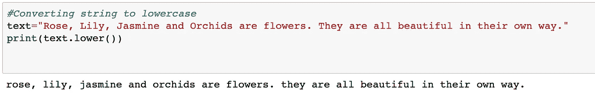

转换成小写插图

一个很好的反例是命名实体识别问题(NER)，在这种情况下，转换为小写可能会导致重要信息的丢失。如果一个句子中的所有单词都被转换成小写字母，那么对系统来说，识别命名实体就变得更加困难。如果所有单词都转换成小写，即使像 spacy 等库也无法识别准确的命名实体。因此，在尝试将文档中的所有单词小写之前，理解问题的细微差别是非常重要的。

下一个要理解的任务是 ***单词标记化*** 。标记化是把一个句子分成单词的过程。这样做是为了让我们能够理解(语料库的)每个句子中包含的句法和语义信息。因此，我们通过逐字分析来破译句子的相关性，从而确保没有信息丢失。可以基于不同的试探法或单词边界(如空格、制表符等)来执行句子的标记化。一个这样的例子如下所示。

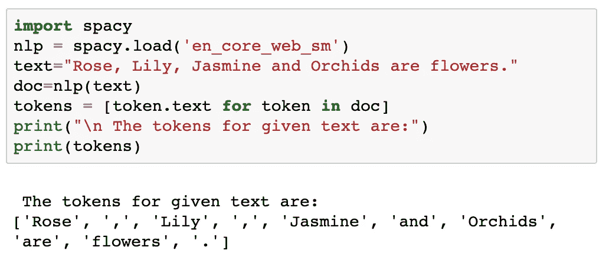

文字插图的符号化

如您所见，spacy 检测单词边界并帮助标记给定的文本。

接下来，我们 ***去掉标点符号*** 以确保我们没有“，”，”等等在我们的令牌列表中。这在几个问题类型中很重要，因为在使用机器或深度学习算法处理自然语言时，我们通常不关心标点符号。因此，移除它们似乎是明智之举。你可以通过遍历你的标记列表来删除标点符号，也可以从一开始就把它们从每个句子中删除。后者如下所示。

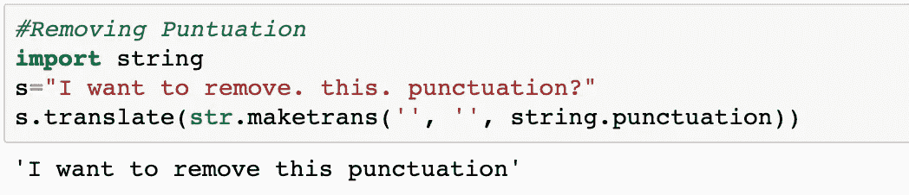

标点符号移除插图

下一步通常是 ***去掉特殊字符*** 比如*"！@#$%^&**来自令牌化后接收到的令牌列表。这是根据需要完成的，并且高度依赖于您试图解决的问题类型。例如，你可以尝试在给定的语料库中检测推文，删除像 *'@'* 这样的特殊字符可能对你的努力没有帮助，因为人们通常在推文中使用 *'@'* 。下面显示的是一个代码片段，如果您的问题需要，它可以帮助您从句子中删除任何特殊字符(使用 python: re 的 regex 库)。

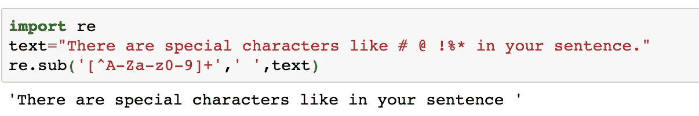

特殊字符删除说明

另一个重要步骤是 ***去除停用词*** 。*停用词*是任何语言中最常见的词。为了方便起见，让我们假设英语是我们的主要语言。一些最常见的停用词有*、【in】、【and】、【a】、*等。这是重要的一步，因为你不希望你的模型在没有任何意义的单词上浪费时间，停用词本身几乎不包含任何意义。它们可以很容易地从一个句子或一列标记中删除，而不会导致太多的信息损失，从而加快模型的训练过程。因此，在尝试训练模型之前删除它们几乎总是一个好主意。

给出的图像显示了如何使用 [nltk](https://www.nltk.org/) 来完成这一操作。

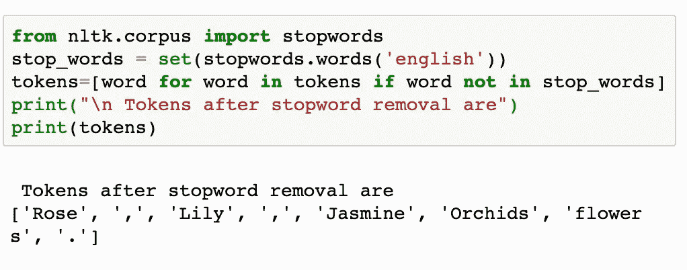

停用字词删除图示

下一个任务通常是 ***词汇化和/或词干化*** 。这两个过程都涉及到单词的规范化，因此只有单词的基本形式保留下来，从而保持了完整的意思，但删除了所有的屈折词尾。这是一个重要的步骤，因为你不希望你的模型把像*“running”*和*“run”*这样的单词当作单独的单词。

词汇化使用形态分析和词汇来识别基本单词形式(或词汇),而词干化通常砍掉词尾，如*、【ing】、【s】、*等，希望找到基本单词。下图显示了两者的区别。

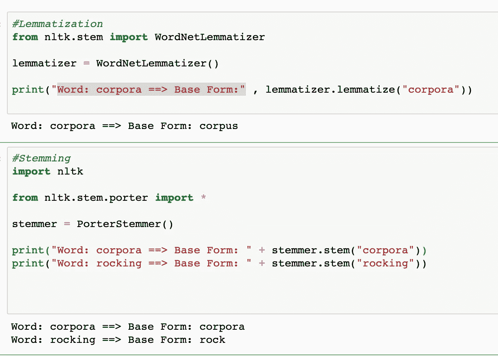

词汇化 v/s 词干插图

正如你所看到的，上图中的 lemmatizer 正确地识别出单词*【语料库】*有基础形式*【语料库】*，而斯特梅尔没有检测到这一点。但是，词干分析器正确地将*【rock】*识别为*【rocking】*的基本形式。因此，使用词汇化或词干化，或者两者都用，很大程度上取决于您的问题需求。

既然我们已经讨论了处理文本数据所必需的基本思想，那么让我们来谈谈如何将文本转换成机器可学习的形式。一种这样的技术是创建 ***单词袋模型*** 。单词包只是简单地计算文本中出现的所有单词的数量。

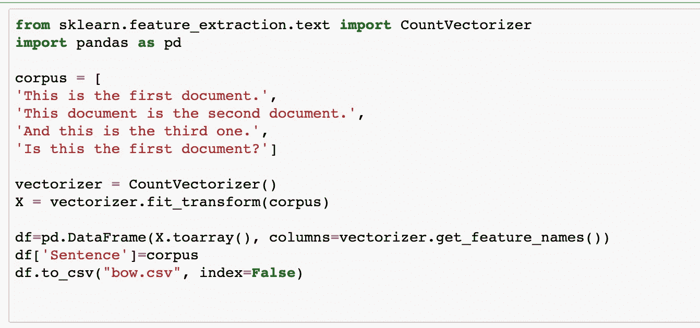

单词袋模型插图

上面给出的代码首先获取一个包含 4 个句子的语料库。然后它使用 [sklearn 的计数矢量器](https://scikit-learn.org/stable/modules/generated/sklearn.feature_extraction.text.CountVectorizer.html)创建一个单词包模型。换句话说，它创建了一个模型，其中包含关于语料库中每个唯一单词在每个句子中出现多少次的信息(我们使用*矢量器. get_feature_names()* )。为了方便起见，我增加了一列*【句子】*，帮助我们理解哪个计数值对应哪个句子。此外，代码中的最后一行创建了一个 *"bow.csv"* 文件，该文件包含与所有单词对应的所有上述计数，如下所示。

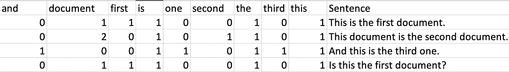

单词袋模型插图

另一个这样的模型叫做 ***词频逆文档频率(TF-IDF)模型。*** 该模型在词频(TF)和逆文档频率(IDF)之间找到一个折衷。词频是每个词在给定文本语料库或文档中出现的次数(如词袋模型图所示)。逆文档频率是单词在语料库中的文档中出现的次数的倒数。换句话说，术语频率发现一个单词有多常见，逆文档频率发现一个单词有多罕见。

现在，让我们看看如何在 python 中实现它。

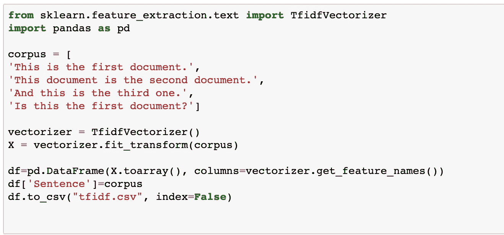

TF-IDF 插图

上面给出的代码首先获取一个包含 4 个句子的语料库。然后，它使用 [sklearn 的 TF IDF 矢量器](https://scikit-learn.org/stable/modules/generated/sklearn.feature_extraction.text.TfidfVectorizer.html)创建一个包含 TF-IDF 值的 TF-IDF 模型。代码还创建了一个文件*“tfi df . CSV”*，其中包含了语料库中的唯一单词，作为列，以及它们对应的 TF-IDF 值，作为行，以帮助理解模型创建背后的思想。它创建的文件类型的一个例子如下所示。

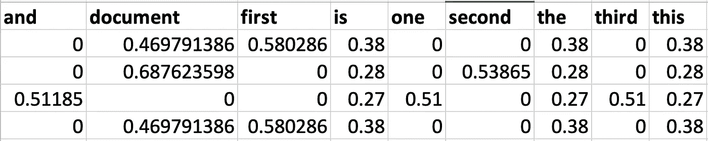

TF-IDF 模型图

现在，您可以使用这些模型中的任何一个作为文本分类、情感分析等问题的训练数据。现在您已经理解了处理文本数据的基础，您已经准备好开始您的第一个项目了！

这篇文章的全部代码可以在 [***这里*** 找到。](https://github.com/AnanyaBanerjee/Medium-Article-Code/blob/master/basics_of_nlp.ipynb)请注意，jupyter 笔记本中的每个单元格都可以独立运行(由于单元格特定的导入语句，为了方便起见),您可能希望将代码顶部的所有内容只导入一次，而不是多次导入！

我希望这篇文章能帮助你理解如何使用自然语言，并有朝一日开始你掌握自然语言处理的旅程！

*感谢您的阅读！*

附言:如果你有任何问题，或者你想让我写任何特定的话题，请在下面评论。

**参考文献:**

1.  语音和语言处理，第三版，作者[丹·茹拉夫斯基](http://web.stanford.edu/people/jurafsky/)和[詹姆斯·h·马丁](http://www.cs.colorado.edu/~martin/)
2.  *sk learn:*[https://scikit-learn.org/stable/](https://scikit-learn.org/stable/)
3.  *空间*:[https://spacy.io/](https://spacy.io/)
4.  *NLTK:*https://www.nltk.org/