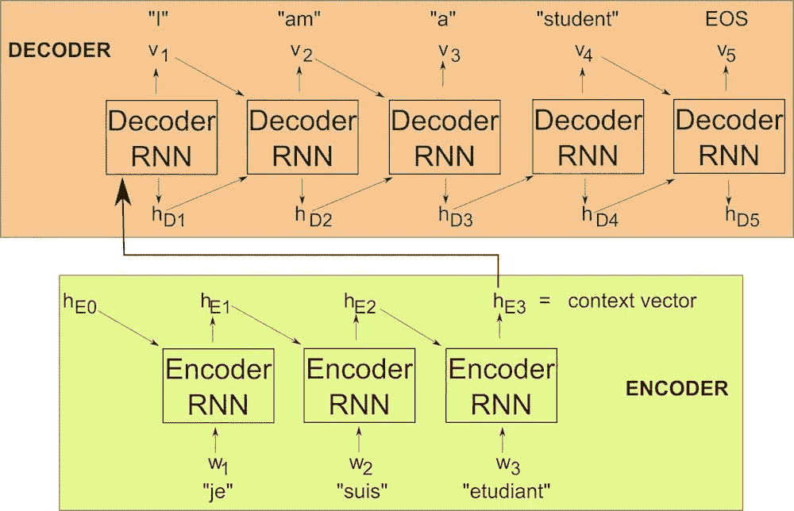
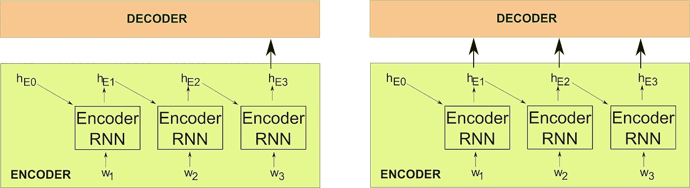
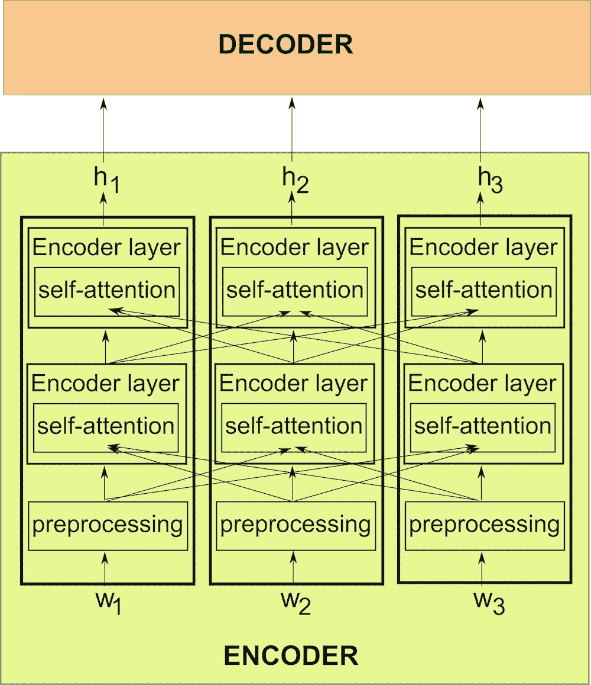
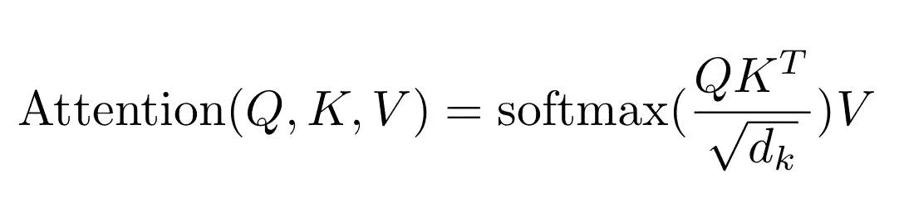
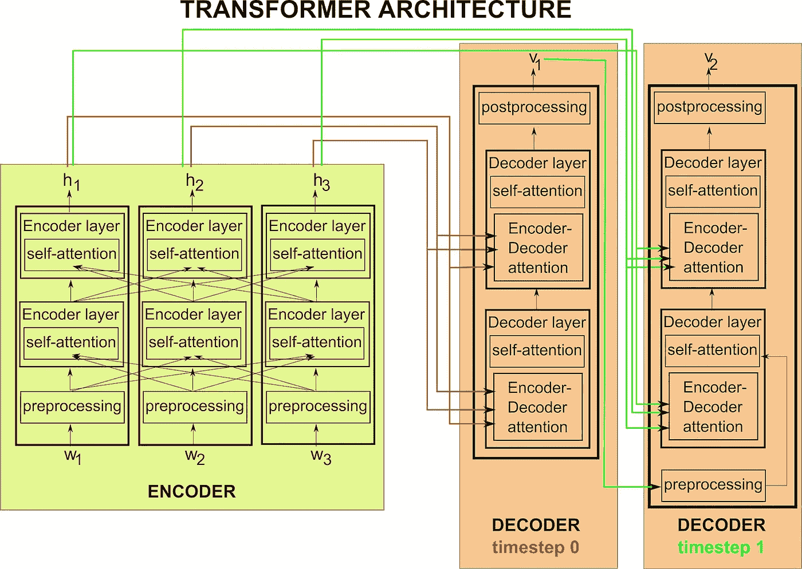

# 自然语言处理:变形金刚的时代

> 原文：<https://towardsdatascience.com/natural-language-processing-the-age-of-transformers-a36c0265937d?source=collection_archive---------39----------------------->

## 自然语言处理深度学习简史

在最近的过去，如果你专门研究自然语言处理(NLP)，可能会有一些时候你会有点嫉妒你在计算机视觉领域工作的同事。看起来他们似乎拥有所有的乐趣:一年一度的 [ImageNet 分类挑战赛](https://machinelearningmastery.com/introduction-to-the-imagenet-large-scale-visual-recognition-challenge-ilsvrc/)、[神经类型转移](https://www.cv-foundation.org/openaccess/content_cvpr_2016/html/Gatys_Image_Style_Transfer_CVPR_2016_paper.html)、[生殖对抗网络](https://papers.nips.cc/paper/5423-generative-adversarial-nets.pdf)，仅举几例。最后，干旱期结束了，NLP 革命正在进行中！公平地说，转折点是 2017 年，当时谷歌的 [*论文中引入了 Transformer network，注意力是你所需要的全部*](https://papers.nips.cc/paper/7181-attention-is-all-you-need.pdf) 。从那以后，多项进一步的进展接踵而至，其中最重要的一项是伯特。

为了给 Transformer 的讨论打下基础，让我们从一个常见的 NLP 任务类别开始:序列到序列(seq2seq) 问题。它们就像它们的名字所暗示的那样:seq2seq 任务的输入和输出都是序列。在 NLP 环境中，通常会有一些额外的限制:

*   序列的元素是对应于某个集合词汇的标记(通常包括一个用于词汇外单词的未知标记)
*   序列**中的**顺序**关系到**。

接下来，我们将花点时间来缅怀那些逝去的英雄，没有他们，我们就不会有今天的成就。当然，我指的是 RNNs——递归神经网络，这是一个在深度学习领域几乎成为 NLP 同义词的概念。

# 1.变形金刚的前身:RNN 编码器-解码器

这个故事将我们一路带回到 2014 年( [Ref](https://www.aclweb.org/anthology/D14-1179) ，另一个 [Ref](https://papers.nips.cc/paper/5346-sequence-to-sequence-learning-with-neural-networks.pdf) )，当时通过两个递归神经网络结合成一个编码器-解码器模型来处理 seq2seq 问题的想法诞生了。让我们用机器翻译任务中的一个简单例子来演示这个架构。举一个法英句子对，输入为*“我是学生”*，输出为*“我是学生”*。首先， *"je"* (或者，最有可能的是，一个嵌入了代表 *"je"* 的标记的[字)，通常伴随着一个常量向量 *h_E0* ，该向量可以是已学习的或固定的，被送入编码器 RNN。这产生了输出向量 *h_E1* (隐藏状态 1)，它与输入序列*“suis”*中的第二个元素一起作为编码器 RNN 的下一个输入。该操作的输出、 *h_E2* 和*“étudiant”*再次被馈入编码器，产生该训练样本的最后一个*编码的*隐藏状态、 *h_E3* 。h_E3 向量依赖于输入序列中的所有记号，所以它应该代表整个短语的意思。为此，它也被称为*上下文向量*。*上下文向量*是解码器 RNN 的第一个输入，然后它将生成输出序列*“I”*的第一个元素(实际上，解码器的最后一层通常是](http://hunterheidenreich.com/blog/intro-to-word-embeddings/) [softmax](/data-science-bootcamp/understand-the-softmax-function-in-minutes-f3a59641e86d) ，但为了简单起见，我们可以只保留每个解码器步骤末尾最可能的元素)。此外，解码器 RNN 产生隐藏状态 *h_D1* 。我们将 *h_D1* 和先前的输出*“I”*反馈回解码器，希望得到*“am”*作为我们的第二输出。这个生成输出并将输出反馈到解码器的过程一直持续到我们产生一个 *< EOS >* —句子标记的结尾，这表示我们的工作已经完成。

RNN 编码器-解码器模型在运行。为了避免混淆，我想请你注意一些事情。多个 RNN 块出现在图中，因为序列的多个元素被馈入网络/由网络生成，但是不要搞错，这里只有一个编码器 RNN 和一个解码器 RNN 在起作用。这可能有助于将重复的块视为不同时间步长的相同 RNN，或者视为具有共享权重的多个 rnn，它们一个接一个地被激活。资料来源:OP

这种架构可能看起来很简单(特别是在我们坐下来实际编写代码并加入了 [LSTMs](https://colah.github.io/posts/2015-08-Understanding-LSTMs/) 或 [GRUs](/understanding-gru-networks-2ef37df6c9be) 之前)，但事实证明它对许多 NLP 任务非常有效。事实上，自 2016 年以来，谷歌翻译一直在使用它。然而，RNN 编码器-解码器模型确实存在某些缺点:

## 1a。RNNs 的第一个问题:关注救援

如上所述的 RNN 方法对于较长的句子并不特别有效。想想看:整个输入序列的含义预计将由一个具有固定维度的单个*上下文向量*捕获。这对于 *"Je suis étudiant"* 来说已经足够好了，但是如果您的输入看起来更像这样呢:

“是一个错误的电话号码引起的，夜深人静的时候电话铃响了三次，电话那头的声音在问一个不是他的人。”

将**编码成**的*上下文向量*！然而，事实证明有一个解决方案，被称为**注意力机制**。

注意(左)传统 RNN 编码器-解码器和(右)RNN 编码器-解码器的示意图。资料来源:OP

注意力背后的基本思想很简单:我们不是只将最后一个隐藏状态(上下文向量*传递给解码器，而是将来自编码器的所有隐藏状态传递给解码器。在我们的例子中，这将意味着 *h_E1* 、 *h_E2* 和 *h_E3* 。解码器将通过 softmax 层确定他们中的哪一个得到关注(即，关注哪里)。除了增加这个额外的结构之外，基本的 RNN 编码器-解码器架构保持不变，然而当涉及到更长的输入序列时，所得到的模型表现得更好。*

## 1b。复发性 NNs 的第二个问题:他们是(惊喜！)经常性

困扰 RNNs 的另一个问题与名称中的 R 有关:根据定义，*递归*神经网络中的计算是顺序的。这种财产意味着什么？顺序计算不能并行化，因为我们必须等待上一步完成后才能进入下一步。这既延长了训练时间，也延长了运行推理的时间。

解决顺序困境的方法之一是使用卷积神经网络(CNN)而不是 RNNs。这种方法已经取得了成功，直到被<drumroll>超越</drumroll>

[阿瑟尼·托古列夫](https://unsplash.com/@tetrakiss?utm_source=unsplash&utm_medium=referral&utm_content=creditCopyText)在 [Unsplash](https://unsplash.com/s/photos/transformers?utm_source=unsplash&utm_medium=referral&utm_content=creditCopyText) 上的照片

# 2.关注是你所需要的一切谷歌，2017

论文中介绍了 **Transformer** 架构，其标题配得上一本自助书籍的标题: [*注意力是你所需要的全部*](https://papers.nips.cc/paper/7181-attention-is-all-you-need.pdf) 。再次，另一个自我描述的标题:作者字面上关注 RNN 编码器-解码器模型，并扔掉 RNN。你需要的只是关注！实际上，它要比这个复杂得多，但这是基本前提。

这是如何工作的？首先，输入序列 *w_i* 的每个预处理(稍后详述)元素作为输入馈入编码器网络——这是并行完成的，与 RNNs 不同。编码器有多层(例如在[原始变压器纸](https://papers.nips.cc/paper/7181-attention-is-all-you-need.pdf)中，它们的数量是六层)。让我们使用 *h_i* 来标记每个 *w_i* 的最后一个编码器层的最终隐藏状态。解码器也包含多个层，通常数量与编码器的数量相等。所有隐藏状态 *h_i* 现在将作为输入馈送到解码器的六层中的每一层*中。如果这看起来对你来说很熟悉，那是有原因的:这是变形金刚的**编码器-解码器注意力**，它在精神上与我们上面讨论的注意力机制非常相似。在我们继续讨论如何实现变压器的注意力之前，让我们讨论一下*预处理*层(在编码器和解码器中都存在，我们将在后面看到)。*

预处理有两个部分:首先，有我们熟悉的嵌入了的[单词，这是大多数现代 NLP 模型中的主要部分。这些单词嵌入可以在训练期间学习，或者可以使用现有的预训练嵌入之一。然而，还有一个特定于变压器架构的部分。到目前为止，我们还没有提供任何关于序列中元素的**顺序**的信息。在没有顺序 RNN 架构的情况下，如何做到这一点呢？好了，我们有了位置，让我们把它们编码到向量中，就像我们用单词嵌入来嵌入单词记号的意思一样。产生的经过后处理的向量携带了单词的含义及其在句子中的位置的信息，被传递到编码器和解码器层。](http://hunterheidenreich.com/blog/intro-to-word-embeddings/)

具有两层的编码器，并行处理三元素输入序列(w1、w2 和 w3)。每个输入元素的编码器还通过其**自我关注**子层接收关于其他元素的信息，允许捕捉句子中单词之间的关系。资料来源:OP

## 2a。注意，线性代数的前景

*我来自量子物理学背景，在这里向量是一个人最好的朋友(有时，真的是这样)，但是如果你更喜欢注意力机制的非线性代数解释，我强烈推荐看看 Jay Alammar 的插图变压器* *。*

让我们用 **X** 来标记注意力层输入的向量空间。我们在训练中想要学习的是三个嵌入矩阵， **Wᴷ** 、 **W** ⱽ和 **Wᴬ** ，它们将允许我们从 **X** 到三个新的空间: **K** (键)、 **V** (值)和 **Q** (查询)。恼人的是，“Q”没有下标([真人真事！](https://www.quora.com/Why-is-there-no-character-for-superscript-q-in-Unicode))，所以我求助于 **Wᴬ** ，其中“a”代表“问”。以下是我们目前掌握的情况:

**K = X Wᴷ**

ⱽ

**Q = X Wᴬ**

这些嵌入向量随后在编码器-解码器注意力中使用的方式如下。我们从解码器获取一个 **Q** 向量(一个*查询*，也就是说，我们指定我们想要关注的信息种类)。此外，我们将向量 **V** ( *值*)视为类似于来自编码器的向量 **X** 的线性组合(然而，不要从字面上理解“线性组合”，因为 **X** 和 **V** 的维数通常是不同的)。向量 **K** 也取自编码器:每个*键*kⁿ索引由值 **Vⁿ** 捕获的信息种类。

为了确定哪些值应该得到最多的关注，我们取解码器的查询 **Q** 与编码器的所有键 **K** 的点积。结果的 softmax 会给出各个值的权重 **V** (权重越大，关注度越大)。这种机制被称为**点积注意**，由以下公式给出:

其中可以任选地将 **Q** 和 **K** 的点积除以关键向量 *d_k* 的维度。为了给你一个在实践中使用的维度的概念，在 [*中介绍的变形金刚*](https://arxiv.org/pdf/1706.03762.pdf) 有 *d_q=d_k=d_v=64* 而我所说的 **X** 是 512 维的。

## 2b。新鲜事:自我关注

除了**编码器-解码器关注**，变压器架构还包括**编码器自关注**和**解码器自关注**。这些都是以与上面讨论的相同的点积方式计算的，有一个关键的区别:对于自我关注，所有三种类型的向量( **K** 、 **V** 和 **Q** )来自同一个网络。这也意味着所有三个都与相同序列的元素相关联(编码器的输入和解码器的输出)。引入自我注意的目的是学习句子中不同单词之间的关系(这个功能过去由顺序 RNN 来完成)。一种方法是将序列中的每个元素表示为序列中其他元素的加权和。何必呢？考虑以下两个短语:

*1。* **动物** *没有过马路是因为* **它** *太累了。*

*2。这只动物没有穿过* **马路** *是因为* **马路** *太宽了。*

显然， **it** 与第一个短语中的**动物**和第二个短语中的**道路**关系最为密切:如果我们使用单向正向 RNN，这些信息将会丢失！事实上，**编码器自我关注**，设计上是双向的，是 [BERT](https://arxiv.org/abs/1810.04805) 的关键部分，这是预先训练的上下文单词嵌入，我在这里讨论过。

在哪里进行**编码器自关注**的计算？事实证明，在每个编码器层中。这允许网络在不同的抽象级别关注输入序列的相关部分:较低编码器层的值 **V** 将最接近原始输入标记，而较深层的自我关注将涉及更抽象的构造。

## 2c。把所有的放在一起

到目前为止，我们已经确定，转换器放弃了 rnn 的顺序性质，而是并行处理序列元素。我们看到了**编码器自关注**如何允许输入序列的元素被单独处理，同时保留彼此的上下文，而**编码器-解码器关注**将它们全部传递到下一步:用解码器生成输出序列。这一阶段发生的事情可能还不太清楚。如您所知，RNN 编码器-解码器一次生成一个元素的输出序列。先前产生的输出在随后的时间步长馈入解码器。变形金刚真的能找到一种方法让我们从这个过程的顺序性中解放出来，并以某种方式一次生成整个输出序列吗？嗯——是也不是。更准确地说，在训练时答案是[大致]是，在推理时答案是“否”。

该变压器结构具有双层编码器/解码器的特征。编码器并行处理输入序列的所有三个元素(w1、w2 和 w3)，而解码器顺序生成每个元素(仅描述了生成输出序列元素 v1 和 v2 的时间步长 0 和 1)。输出标记生成继续，直到出现句子标记的结尾<eos>。资料来源:OP</eos>

解码器的输入有两种类型:作为编码器输出的隐藏状态(这些用于每个解码器层内的**编码器-解码器注意**)和输出序列的先前生成的令牌(用于**解码器自我注意**，也在每个解码器层计算)。因为在训练阶段，输出序列已经可用，所以可以通过屏蔽(用零替换)“先前生成的”输出序列的适当部分来并行执行解码过程的所有不同时间步长。这种屏蔽导致**解码器自关注**是单向的，与编码器相反。最后，在推理时，输出元素按顺序一个接一个地生成。

今天结束前的最后一句话:

在上图中，我称为*后处理*的解码器部分类似于人们通常在 NLP 任务的 RNN 解码器中找到的部分:完全连接(FC)层，它遵循从网络输入中提取某些特征的 RNN，以及 FC 层之上的 softmax 层，它将为模型词汇表中的每个令牌分配概率，作为输出序列中的下一个元素。此时，我们可以使用[波束搜索](https://machinelearningmastery.com/beam-search-decoder-natural-language-processing/)算法来保留每一步的前几个预测，并在最后选择最有可能的输出序列，或者每次只保留顶部的选择。

变压器架构是 NLP 领域许多最新突破背后的驱动力..由[阿瑟尼·托古列夫](https://unsplash.com/@tetrakiss?utm_source=unsplash&utm_medium=referral&utm_content=creditCopyText)在 [Unsplash](https://unsplash.com/s/photos/transformers?utm_source=unsplash&utm_medium=referral&utm_content=creditCopyText) 上拍摄的照片

*本文的一个版本于 2019 年 8 月 22 日首次发表于* [*Scaleway 的博客*](https://blog.scaleway.com/2019/building-a-machine-reading-comprehension-system-using-the-latest-advances-in-deep-learning-for-nlp/) *。*

Scaleway 智能标注是一个托管数据注释平台，可帮助您标注计算机视觉(2021)和 NLP (2022)项目所需的数据！借助我们路线图中的自动预标记和主动学习功能，您的数据集将很快准备就绪。[注册以便在智能标签可用时获得通知！](https://scaleway.typeform.com/to/V0JKT5lX#organization_id=xxxxx)