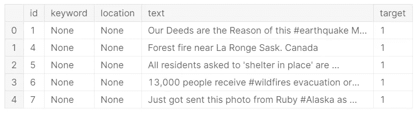
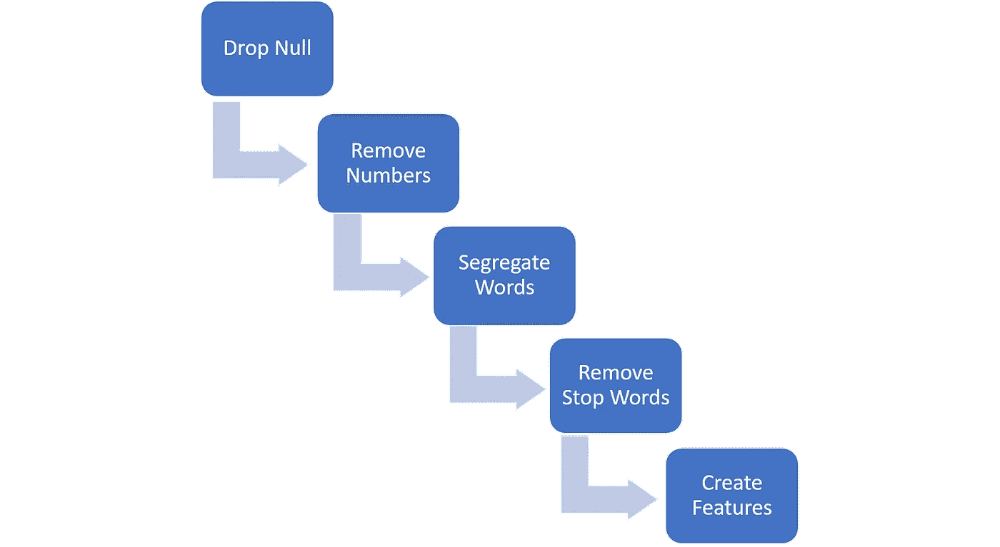
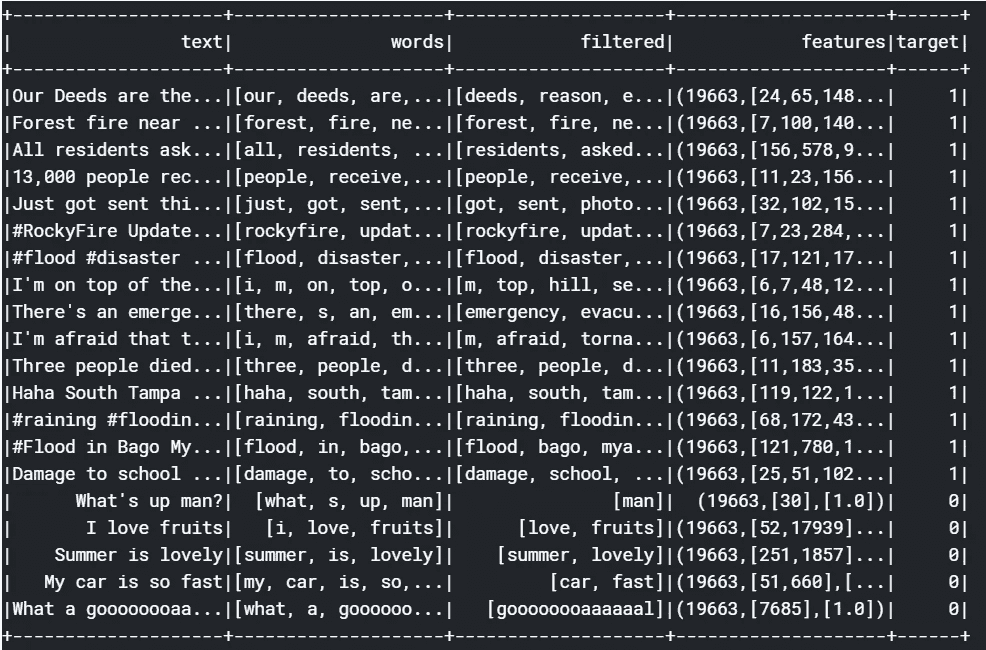
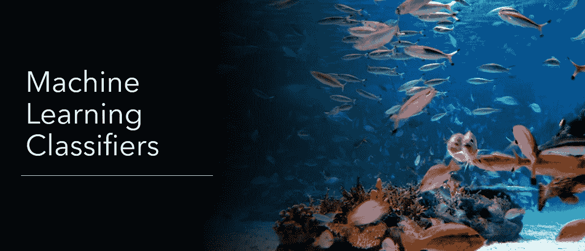

# Spark 自然语言处理

> 原文：<https://towardsdatascience.com/natural-language-processing-with-spark-9efef3564270?source=collection_archive---------23----------------------->

## 利用 PySpark MLlib 对灾难推文进行分类(文本分类)


西蒙·马辛格在 [Unsplash](https://unsplash.com?utm_source=medium&utm_medium=referral) 上拍摄的照片

这是一个关于使用 PySpark 开发预测机器学习模型的介绍性教程。我将展示自然语言处理(NLP)的基础，同时利用 Spark 的强大功能。我们会用 PySpark 这是一个用于 Spark 的 Python API。本教程的数据集来自于*[【NLP with Disaster Tweets】ka ggle 竞赛。](https://www.kaggle.com/c/nlp-getting-started)GitHub 上有完整的代码。*

*这些数据由推文组成，我们的任务是预测哪些推文与灾难有关。这可以改善几个相关方的响应时间，例如警察部队、消防队或新闻机构等。我们将通过建立预测机器学习模型来执行文本分类，这是 NLP 的一个类别。下面的算法可以帮助你在文本分析或自然语言处理中得到启发，并且有很多应用。*

> *文本分类是根据文本的内容给文本分配标签或类别的过程。它是自然语言处理的基本任务之一，具有广泛的应用，如情感分析、主题标注、垃圾邮件检测和意图检测。—来自 [Monkeylearn](https://monkeylearn.com/text-classification/)*

*让我们马上开始研究数据吧。为此，我们需要了解一下[火花数据帧](https://spark.apache.org/docs/latest/sql-programming-guide.html)。现在，我们需要在 Python 中启动一个 Spark 会话来使用 Spark。我们使用以下命令启动会话，appName 参数，即“nlp”在这种情况下可以由用户选择。*

```
*spark = SparkSession.builder.appName('nlp').getOrCreate()*
```

*一旦我们开始 Spark 会话，我们将使用' spark.read.csv '函数加载数据。将数据文件加载到工作空间后，我们需要对文本数据进行预处理。数据帧的头部如下图所示。我们将处理*‘文本’*字段，以预测*‘目标’*字段。*

**

*推文数据的最高记录*

## *数据预处理(提取特征)*

*以下工作流详细介绍了从数据中提取要素的过程。每个阶段的描述都跟在图像后面。*

**

*用于特征提取的数据处理工作流程*

***1)删除空值:**我们删除文本中所有具有 *null/na* 值的记录。为此，我们可以使用 dropna()函数。*

***2)从推文中删除数字:**我们使用[正则表达式(regex)](https://en.wikipedia.org/wiki/Regular_expression) 操作符来进一步清理文本数据。下面的代码删除文本中的所有数字。我们正在处理单词而不是数字来识别灾难推文。*

```
*regexp_replace(col(‘text’), ‘\d+’, ‘’)*
```

***3)分离单词:**然后我们将推文分解成单个单词进行分析。为此，我们使用 [RegexTokenizer()](https://spark.apache.org/docs/latest/ml-features#tokenizer) 。*

***4)删除停用词:**我们使用[py spark . ml 库中的【stopwodsmover()](https://spark.apache.org/docs/2.2.0/ml-features.html#stopwordsremover)函数从分离的词中删除停用词。一些停用词的例子有:I，the，a，has，等等。从这些例子中你可以注意到，这些单词没有携带太多的信息，因此我们从分析中去除了它们。*

***5)创建 features 列:**在从数据中删除不重要的单词后，我们使用 [CountVectorizer()](https://spark.apache.org/docs/2.2.0/ml-features.html#countvectorizer) 函数。该函数将单词转换为数字向量，以便能够将其输入到机器学习模型中。*

*现在，我们的数据可以输入预测模型了。完成上述过程后的数据是这样的。*

**

*清洗和特征提取后的最终数据帧*

*让我解释一下上面数据框架中的所有字段；我们从*‘文本’*字段开始。执行上述工作流程的前 3 个步骤后，*【单词】*会显示分离的单词。*‘filtered’*栏显示按照第 4 步所述移除停用词后的单词。完成步骤 5 后，*‘特征’*字段是数值向量字段，这是我们将用于训练机器学习模型的字段。*‘目标’*字段是我们的预测变量，它显示推文是否与灾难有关。*

# *机器学习模型*

**

*我们将从前面的过程中获得的数据分成*训练*和*验证。*我们使用*训练*数据帧来训练机器学习模型，使用*验证*数据帧来验证它们对未知数据的准确性。验证分类模型有几个标准，我们将使用 ROC 和准确性进行分析。验证后，我们将对*测试*数据进行预测。*

*我将举例说明一些常见的[分类机器学习算法。](https://en.wikipedia.org/wiki/Statistical_classification)我假设你熟悉这些算法，我会尽量不要用这些算法来烦你。*

## *朴素贝叶斯*

*朴素贝叶斯模型是最常用的文本分类算法之一。朴素贝叶斯算法假设所有的预测变量都是相互独立的。简而言之，它假设某个特定要素的存在与数据中的任何其他要素无关。这个假设在现实生活中并不总是正确的，然而，它在文本分类中是有意义的。以下代码用于使用 PySpark 对朴素贝叶斯模型进行定型和验证。*

```
*from pyspark.ml.classification import NaiveBayes
from pyspark.ml.evaluation import MulticlassClassificationEvaluator## Fitting the model
nb = NaiveBayes(modelType="multinomial",labelCol="label", featuresCol="features")
nbModel = nb.fit(train)
nb_predictions = nbModel.transform(validate)## Evaluating the model
evaluator = MulticlassClassificationEvaluator(labelCol="label", predictionCol="prediction", metricName="accuracy")
nb_accuracy = evaluator.evaluate(nb_predictions)
print("Accuracy of NaiveBayes is = %g"% (nb_accuracy))#Accuracy of NaiveBayes is = 0.803448*
```

## *逻辑回归*

*它是回归的一种变体，使用逻辑函数[为二元结果变量建模。下面的代码演示了如何定型和验证逻辑回归。](https://en.wikipedia.org/wiki/Logistic_function)*

```
*from pyspark.ml.classification import LogisticRegression## Fitting the model
lr = LogisticRegression(featuresCol = 'features', labelCol = 'target', maxIter=10)
lrModel = lr.fit(train)
lrPreds = lrModel.transform(validate)## Evaluating the model
evaluator = MulticlassClassificationEvaluator(labelCol="label", predictionCol="prediction", metricName="accuracy")
lr_accuracy = evaluator.evaluate(lrPreds)
print("Accuracy of Logistic Regression is = %g"% (lr_accuracy))#Accuracy of Logistic Regression is = 0.768276*
```

## *决策树*

*决策树本质上是基于试图学习其关于结果变量的行为的列来分割数据集，即，我们将预测器空间分割成简单的区域。Will Koehrsen 的这篇文章有助于详细理解决策树和随机森林。我们可以使用下面的代码来训练和验证决策树。*

```
*from pyspark.ml.classification import DecisionTreeClassifier## Fitting the model
dt = DecisionTreeClassifier(featuresCol = 'features', labelCol = 'target', maxDepth = 3)
dtModel = dt.fit(train)
dtPreds = dtModel.transform(validate)## Evaluating the model
evaluator = MulticlassClassificationEvaluator(labelCol="label", predictionCol="prediction", metricName="accuracy")
dt_accuracy = evaluator.evaluate(dtPreds)
print("Accuracy of Decision Trees is = %g"% (dt_accuracy))#Accuracy of Decision Trees is = 0.651034*
```

## *随机森林*

*随机森林是一种集合机器学习方法。它们使用自举技术，从根本上说是众多弱学习者的组合，特别是决策树。查看以下代码，了解如何在 spark 中实现随机森林。*

```
*from pyspark.ml.classification import RandomForestClassifier## Fitting the model
rf = RandomForestClassifier(featuresCol = 'features', labelCol = 'target')
rfModel = rf.fit(train)
rfPreds = rfModel.transform(validate)## Evaluating the model
evaluator = MulticlassClassificationEvaluator(labelCol="label", predictionCol="prediction", metricName="accuracy")
rf_accuracy = evaluator.evaluate(rfPreds)
print("Accuracy of Random Forests is = %g"% (rf_accuracy))#Accuracy of Random Forests is = 0.581379*
```

## *梯度推进树*

*梯度推进树是一种类似于随机森林的集成方法。构建树的方法不同于随机森林；由梯度推进树建立的每个新树试图纠正由前一个树产生的错误。我们使用来自*py spark . ml . class ification*库中的 GBTClassifier 来训练和验证数据。*

```
*from pyspark.ml.classification import GBTClassifier## Fitting the model
gbt = GBTClassifier(maxIter=10)
gbtModel = gbt.fit(train)
gbtPreds = gbtModel.transform(validate)## Evaluating the model
evaluator = MulticlassClassificationEvaluator(labelCol="label", predictionCol="prediction", metricName="accuracy")
gb_accuracy = evaluator.evaluate(gbtPreds)
print("Accuracy of GBT is = %g"% (gb_accuracy))#Accuracy of GBT is = 0.681379*
```

## *根据测试数据进行预测*

*既然我们已经训练并验证了几个模型，我们就可以对看不见的测试数据进行预测了。我们可以根据所有可用的训练数据重新训练模型，然后进行预测。下面的代码演示了如何使用梯度推进模型进行预测。但是，您可以对任何训练过的模型重复同样的操作，并且使用其他模型进行预测的完整代码可以在 [Github 上找到。](https://github.com/SurajMalpani/NLP-using-Spark)*

```
*## Fitting the model
gbt = GBTClassifier(maxIter=10)
gbtModel = gbt.fit(trainData)## Make predictions
gbtPreds = gbtModel.transform(testData)
gbtPreds.select('id','prediction').show(5)+---+----------+
| id|prediction|
+---+----------+
|  0|       0.0|
|  2|       0.0|
|  3|       1.0|
|  9|       0.0|
| 11|       0.0|
+---+----------+
only showing top 5 rows*
```

*一旦你做出了预测，你就可以将数据帧转换成 CSV 格式并提交给比赛。您现在已经准备好使用 Spark 来开发机器学习模型。文本分类有无数的应用，例如识别垃圾邮件、标记网站/产品内容等。并且上述算法适用于所有这样的任务。希望你觉得这很有用，并让我知道你的想法。快乐学习！*

*感谢您的阅读。我希望这对你有所帮助。如果你有任何建议，请在评论区添加。请随时通过我的[网站](https://surajmalpani.github.io/)或 [LinkedIn](https://www.linkedin.com/in/suraj-malpani/) 与我联系。*

## *参考资料:*

1.  *Spark 文档:[https://spark . Apache . org/docs/2 . 2 . 0/ml-classification-regression . html](https://spark.apache.org/docs/2.2.0/ml-classification-regression.html)*
2.  *[https://monkeylearn.com/text-classification/](https://monkeylearn.com/text-classification/)*
3.  *Kaggle 笔记本:[https://www . ka ggle . com/palmero/binary-class ification-with-py spark-and-ml lib](https://www.kaggle.com/palmer0/binary-classification-with-pyspark-and-mllib)*
4.  *Github 笔记本:[https://github . com/LP-data ninja/spark ml/blob/master/py spark-NLP-ka ggle . ipynb](https://github.com/lp-dataninja/SparkML/blob/master/pyspark-nlp-kaggle.ipynb)*