# SQL 的自然语言:在你自己的数据库中使用它

> 原文：<https://towardsdatascience.com/natural-language-to-sql-use-it-on-your-own-database-d4cd5784d081?source=collection_archive---------4----------------------->

## 使用 EditSQL 将自然语言问题转换为类似 SQL 的查询，用于自定义数据库模式


托拜厄斯·菲舍尔在 [Unsplash](https://unsplash.com/s/photos/database?utm_source=unsplash&utm_medium=referral&utm_content=creditCopyText) 上的照片

不是每个人都喜欢或知道如何编写 SQL 查询来在一个巨大的数据库中进行搜索。对于一个门外汉来说，用 SQL 函数和关键字构造复杂的查询——比如 JOIN 和 GROUP BY——将是一场噩梦。一个将简单的信息检索问题转换成相应的 SQL 查询的系统将会派上用场，特别是对于**的银行和医疗保健部门**。随着 NLP 的进步，这可能很快就会成为现实。

虽然已经有大量的研究来解决这个问题，但我们还没有得到完全准确的结果。尽管如此，通过对基准数据集如 [WikiSQL](https://arxiv.org/abs/1709.00103) 、Spider、SPaRC 和 [ATIS](https://catalog.ldc.upenn.edu/docs/LDC93S4B/corpus.html) 所做的工作，人们已经成功构建了文本到 SQL 系统，并取得了不错的结果。在这里，您将看到如何使用 [**EditSQL**](https://arxiv.org/abs/1909.00786) 模型实现这样一个系统，以及在您自己的模式上使用它的简单方法。

**本文结构如下:**

> 1.介绍
> 
> 2.在 SParC 上安装和运行 EditSQL
> 
> 3.对代码进行更改
> 
> 4.添加自定义数据库并构建 Vocab
> 
> 5.测试您的问题
> 
> 6.结论

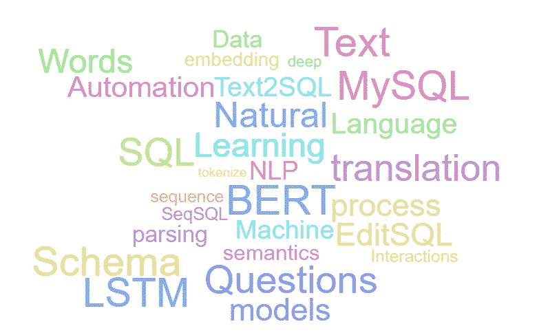

作者图片

# 1.介绍

从用户问题生成 SQL 查询涉及到解决任务，而不仅仅是问答和机器翻译。就像在问答中一样，随着用户交互的增加，他们通常会提出需要复杂处理的问题，比如引用前面提到的一些信息，或者需要几个不同模式的组合。作为一种工具，这样的系统帮助通常在数据库查询方面缺乏经验的最终用户从大量复杂的数据库中提取信息。

已经在不同的基准数据集上进行了一些尝试，以解决文本到 SQL 任务中的此类问题，尤其是在语义解析中。你可以看看这个有趣的[调查](https://arxiv.org/pdf/1906.08990.pdf)【4】，它很好地介绍了任务和问题。

> 你也可以看看这个由 AllenNLP 团队在 ATIS 数据集上构建的交互式[转换器](https://demo.allennlp.org/atis-parser/MTM3MTcyNg==)。就像其他几个性能更好的模型一样，它们使用语义解析和编码器-解码器架构来完成这项工作。

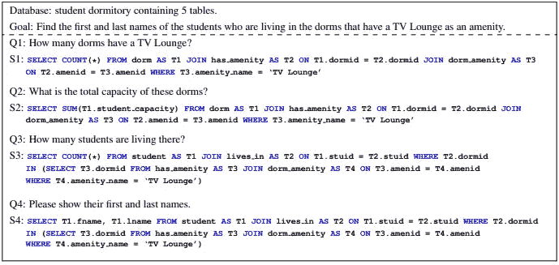

来自 SParC 数据集的示例。图片来自[1]

截至 2020 年 7 月，Spider 和 SParC 的排行榜将以下型号列为性能最佳的型号，并给出了开放源代码:

*   [RATSQL v3 + BERT](https://arxiv.org/abs/1911.04942) [5]
*   [伊尔内特+伯特](https://arxiv.org/abs/1905.08205)【6】
*   编辑 SQL + BERT

在这里，您可以找到 [Spider](https://yale-lily.github.io/spider) 和 [SParC](https://yale-lily.github.io/sparc) 的完整排行榜。出于实用性考虑，我们将本文的范围限制在探索 EditSQL，尤其是 SParC 上的 EditSQL。

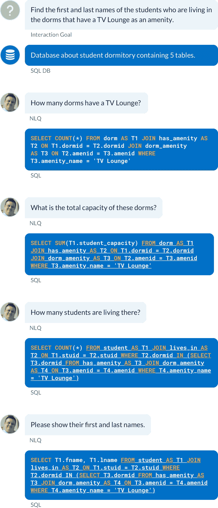

团队在[排行榜](https://yale-lily.github.io/sparc)上给出的另一个 SParC 示例

## 局限性:

虽然列出的模型在各自的数据集上表现良好，但给定的代码没有在自定义数据库上测试模型的选项(更不用说训练了)。事实上，即使对数据集的现有查询进行更改也是一个乏味且容易出错的过程。

然而，在上面给出的模型之外，我们可以对 EditSQL 进行一些修改，并设法在定制的 SQLite 数据库上运行 SParC 实验。这些变化很小，并且被证明是在您自己的数据库上测试性能的一种简单的变通方法。

## 关于 EditSQL:

EditSQL 试图解决依赖于上下文的文本到 SQL 查询生成任务，并结合了交互历史以及话语表编码器-解码器单元，以可靠地理解用户话语(或问题)的上下文。为此，他们使用了一种基于 BERT 的编码器，这种编码器有助于捕捉复杂的数据库结构，并将它们与话语相关联。因此，给定一个任意的问题，该模型将最确定地正确识别该问题所对应的数据库模式。

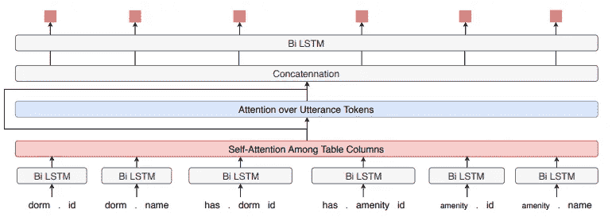

表编码器结构在[1]中给出

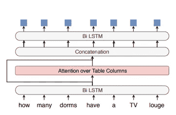

[1]中给出的发声编码器结构

此外，EditSQL 考虑了用户话语和表结构之间的关系以及最近的编码历史，以正确识别上下文。如上图所示，这里获得的信息然后被传递到一个表感知解码器，该解码器使用注意力增强 LSTM 来执行 SQL 生成。

然而，用户经常询问包含在先前交互中提供的信息的问题。在顺序生成机制中，这可能导致处理和查询生成中的冗余。EditSQL 之所以得名，是因为它采用了一种新颖的机制来“编辑”生成的查询标记，并使用另一个双 LSTM 和启用了注意力的上下文向量来解决这个问题。

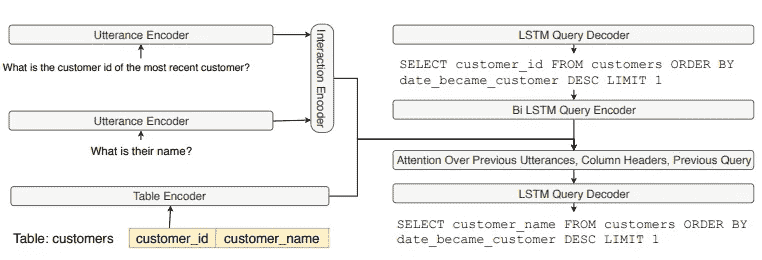

用于编辑查询的模型架构(在[1]中给出)

# 2.在 SParC 上安装和运行 EditSQL

*要运行该模型，请确保您有一个支持 GPU 的系统。或者，你可以在 Google Colab 上工作。*

首先，将这个存储库克隆到您的系统中(或者在 Colab 中):

```
git clone [https://github.com/ryanzhumich/editsql](https://github.com/ryanzhumich/editsql)
```

从他们的[官方页面](https://yale-lily.github.io/sparc)下载 SParC 数据集来运行实验，或者使用如下的`gdown` 命令:

```
pip install gdowngdown --id 13Abvu5SUMSP3SJM-ZIj66mOkeyAquR73
```

将解压后的文件夹放入 *editsql/data/sparc*

接下来，您可以遵循他们的[自述文件](https://github.com/ryanzhumich/editsql/blob/master/README.md)中的说明或遵循以下步骤:

```
pip install -r requirements.txt #install dependencies#Download pre-trained BERT modelgdown --id 1f_LEWVgrtZLRuoiExJa5fNzTS8-WcAX9# or download it directly from [https://drive.google.com/file/d/1f_LEWVgrtZLRuoiExJa5fNzTS8-WcAX9/view?usp=sharing](https://drive.google.com/file/d/1f_LEWVgrtZLRuoiExJa5fNzTS8-WcAX9/view?usp=sharing)
```

并将预训练的 BERT 模型放在文件树中，如下所示:

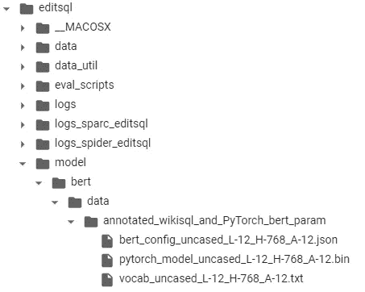

作者图片

如果上述步骤成功执行，您可以运行下面的 bash 脚本开始训练:

```
bash run_sparc_editsql.sh
```

作者将他们的实验日志保存在*logs/logs _ SPARC _ editsql*中的 *log.txt* 中，在这里可以找到每个时期的细节和性能。

在培训期间，您至少需要成功执行**初始预处理和 vocab 构建**步骤。这将创建名为

*   *logs_sparc_editsql*
*   *processed _ data _ SPARC _ remove from*
*   *已处理 _ 数据 _ sparc _ 移除 _ 测试*

一旦您的输出如下所示，您就可以中断执行(Ctrl+C)(**在实际训练开始之前**)。根据您的配置，示例数量和批量值可能会有所不同。

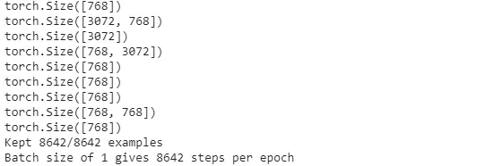

作者图片

这些步骤的成功执行将创建开发集测试所需的已处理数据文件和 vocab 文件。

由于我们没有真正执行任何“训练”，我们将需要下载作者的预训练模型，并将其放在*logs/logs _ SPARC _ editsql*下，名称为 *save_31_sparc_editsql* 。

```
gdown --id 1MRN3_mklw8biUphFxmD7OXJ57yS-FkJP#or download directly from #https://drive.google.com/file/d/1MRN3_mklw8biUphFxmD7OXJ57yS-FkJP/view?usp=sharing
```

现在，您已经准备好运行 bash 脚本来对 dev 集进行预测了。

```
bash test_sparc_editsql.sh
```

预测保存在一个结构化的 JSON 文件中，该文件位于*logs/logs _ SPARC _ editsql*中，名为**dev _ use _ predicted _ queries _ predictions . JSON**。

用相应的问题来验证每个预测的查询可能很麻烦。因此，您可以运行以下脚本来获得存储在文件中的可读输出。该脚本将创建包含输入问题、预测查询和预测文件中每个问题-查询对的预测置信度的 *output.txt* 。

创建可读输出文件的脚本

# 3.自定义数据库:对代码进行更改

*   确保你有一个**。包含您的 SQL 数据库的 sqlite** 数据库文件。假设您有一个名为“ *sales.sqlite* 的 db 文件。将该文件放在一个名为“ *sales* 的新文件夹中，如下所示。

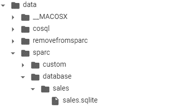

作者图片

*   接下来，打开在 *data/sparc* 中找到的 ***tables.json*** ，并在那里添加数据库模式和表的描述。在这里使用自述文件[的表格部分描述的结构](https://github.com/taoyds/spider#tables)。您可以使用 ***tables.json*** 中已经存在的条目作为参考，并为您的模式添加一个类似的条目。
*   打开 ***dev.json*** 和***dev _ no _ value . JSON***，在同一个目录下找到，观察输入的问题结构如蜘蛛的资源库所示:[就在这里](https://github.com/taoyds/spider#question-sql-and-parsed-sql)并带有示例文件[*parsed _ SQL _ examples . SQL*](https://github.com/taoyds/spider/blob/master/preprocess/parsed_sql_examples.sql)。您所要做的就是复制一个**完整的**条目(下一个" *database_id* "条目之前的" { "和" {*database _ id*"之间的所有内容)。
*   一旦你追加了这个复制条目，只需编辑你想要的问题的" ***话语*** "和" ***话语 _toks*** "和你的数据库名称的" ***数据库 _id*** "在我们的示例中，它将是 *"database_id" : "sales"*

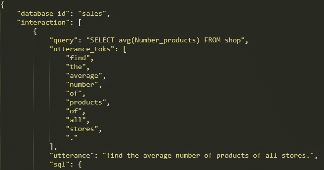

编辑话语、话语 _toks 和数据库 _id(图片由作者提供)

*   最后，将 *database_id* (您的数据库名称)添加到***dev _ db _ ids . txt***(位于同一目录)中的数据库名称列表中。

# 4.添加自定义数据库并构建 Vocab

*   在培训的预处理和 vocab 构建步骤中，我们将所谓的“交互”写入 pickle 文件并保存在 *data/sparc_data_removefrom 中。*
*   这些交互是 SParC 数据集中固有的，您可以在他们的论文[2]以及论文[1]第 3.2 节中的 EditSQL 上下文中读到。
*   类似地，基于 *tables.json* 中的表格描述和训练序列，模型为存储在*processed _ data _ SPARC _ remove from*的每个训练、有效和开发实验创建不同的词汇文件。

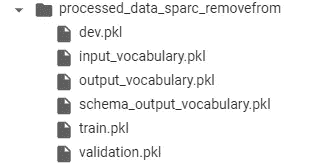

*processed _ data _ SPARC _ remove from 的内容(图片由作者提供)*

*   出于这个原因，当我们添加一个新的数据库或者编辑 *dev* 文件时(就像我们在步骤 2 中所做的那样),我们需要再次运行训练脚本。就像在**步骤 1** 中一样，一旦预处理步骤完成，我们就可以终止脚本。

***注意:请删除培训脚本创建的所有文件夹，然后再次运行。这也包括 logs _ SPARC _ editsql/args . log****。* ***这些文件不会更新，除非脚本从头开始创建它们。***

# 5.测试您的问题

*   运行`bash test_sparc_editsql.sh`以获得您的问题的预测查询。
*   按照**步骤 1** 中提到的测试步骤，生成 ***output.txt*** 以获得可读的结果视图。

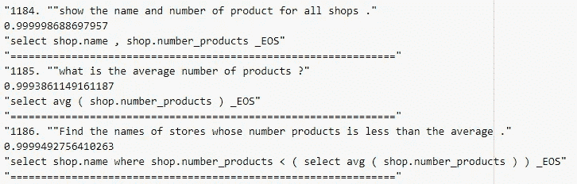

从 output.txt 清除结果

# 6.结论

现在，您可以轻松地将自然语言问题转换为自己模式上的 SQL 查询。

感谢阅读！

# 参考资料:

[1]张，芮，等，基于编辑的跨域上下文相关问题 SQL 查询生成(2019)， *arXiv 预印本 arXiv:1909.00786* 。

> **Github**:[https://github.com/ryanzhumich/editsql](https://github.com/ryanzhumich/editsql)

[2]于，陶等，Sparc:语境中的跨领域语义解析(2019)。 *arXiv 预印本 arXiv:1906.02285* 。

> **Github**:[https://github.com/taoyds/sparc](https://github.com/taoyds/sparc)

[3]于，陶等，Spider:面向复杂跨领域语义解析和文本转 sql 任务的大规模人类标注数据集(2018)， *arXiv 预印本 arXiv:1809.08887* 。

> **https://github.com/taoyds/spider[Github](https://github.com/taoyds/spider)**:

[4] Affolter，Katrin，Kurt Stockinger 和 Abraham Bernstein，对数据库的最近自然语言接口的比较调查(2019)，*《VLDB 日报》*28.5:793–819。

[5]王，白林等，Rat-sql:面向文本到 sql 解析器的关系感知模式编码与链接(2019)， *arXiv 预印本 arXiv:1911.04942* 。

[6]郭，，等，面向带中间表示的跨域数据库复杂文本转 SQL(2019)， *arXiv 预印本 arXiv:1905.08205* 。