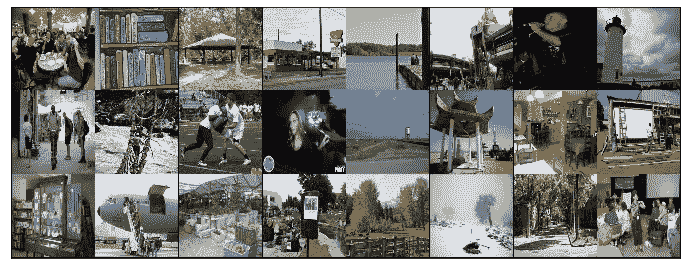
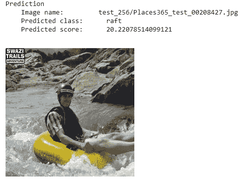
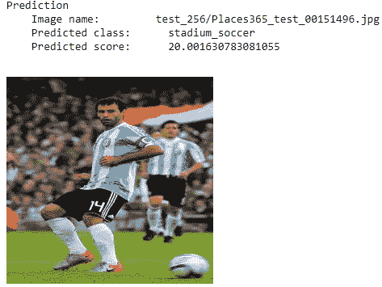
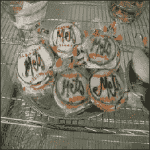
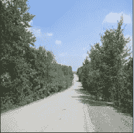

# 使用深度学习的自然场景识别

> 原文：<https://towardsdatascience.com/natural-scene-recognition-using-deep-learning-91b6ba86bad5?source=collection_archive---------35----------------------->

## 在计算机视觉中，场景识别是最具挑战性的研究领域之一。

一眼就认出环境是人类大脑最有成就的行为之一。虽然最近在对象识别任务中的巨大进步源于诸如 COCO 之类的大型数据集的可用性以及用于学习高级特征的卷积神经网络(CNN)的兴起，但是场景识别性能并没有获得同样程度的成功。

在这篇博文中，我们将看到分类模型如何对一个场景的图像进行分类。对于这项任务，我们采用了 *Places365-Standard* 数据集来训练模型。该数据集具有 1，803，460 个训练图像和 365 个类，每个类的图像数量从 3，068 到 5，000 不等，图像的大小为 256*256。



数据集的图像

# 安装和下载数据

让我们从设置 Monk 及其依赖项开始:

```
!git clone [https://github.com/Tessellate-Imaging/monk_v1.git](https://github.com/Tessellate-Imaging/monk_v1.git)
*! cd monk_v1/installation/Linux && pip install -r requirements_cu9.txt*
```

安装完依赖项后，我下载了*place 365-Standard*数据集，可以从[这里](http://places2.csail.mit.edu/download.html)下载。

# 创造一个实验

我已经创建了一个实验，对于这个任务，我使用了 **mxnet 胶子后端。**

```
import os
import sys
sys.path.append("monk_v1/monk/");
from gluon_prototype import prototype
gtf = prototype(verbose=1);
gtf.Prototype("Places_365", "Experiment");
```

# 模型选择和培训

我尝试了各种模型，如 resnet、densenet、inception、vgg16 等等，但是只有 vgg16 比其他任何模型都具有更高的验证准确性。

```
gtf.Default(dataset_path="train/",
            path_to_csv="labels.csv",
            model_name="vgg16",
            freeze_base_network=False,
            num_epochs=20);gtf.Train();
```

经过 20 个历元的训练，我得到了 65%的训练准确率和 53%的验证准确率。

# 预言；预测；预告

```
gtf = prototype(verbose=1);
gtf.Prototype("Places_365", "Experiment", eval_infer=**True**);img_name = "test_256/Places365_test_00208427.jpg" 
predictions = gtf.Infer(img_name=img_name);
**from** **IPython.display** **import** Image
Image(filename=img_name)
```



对测试图像的预测

```
img_name = "test_256/Places365_test_00151496.jpg" 
predictions = gtf.Infer(img_name=img_name);
**from** **IPython.display** **import** Image
Image(filename=img_name)
```



对测试图像的预测

在此之后，我试图找出为什么精度没有比我得到的提高更多。一些可能的原因是:

**标签不正确:-** 检查训练文件夹时，有些图像的标签不正确，如 baseball_field 的图像不正确。还有很多不正确的标签。



棒球场中的错误图像

```
img=mpimg.imread(“images/train/baseball_field2469.jpg”)
imgplot = plt.imshow(img)
```

**不清晰的场景:-** 由于各种类似的类共享类似的对象，如餐厅和食堂、森林道路和田野道路，因此存在非常难以分类的不清晰图像。


标签:field_road



标签:森林 _ 道路

正如我们所见，很难对这两幅图像进行分类。

**多个场景部分:-** 由多个场景部分组成的图像不能像海洋附近的建筑物一样归为一类。这些场景可能很难分类，需要更多的地面真实标签来描述环境。

总之，这篇博文展示了我们如何使用深度学习网络来执行自然场景分类，以及为什么场景识别性能没有达到与对象识别相同的成功水平。

# 参考

[](https://github.com/shubham7169/MonkAI/blob/master/Scene%20Recognition.ipynb) [## shubham7169/MonkAI

### permalink dissolve GitHub 是超过 5000 万开发人员的家园，他们一起工作来托管和审查代码，管理…

github.com](https://github.com/shubham7169/MonkAI/blob/master/Scene%20Recognition.ipynb) 

[http://places2.csail.mit.edu/PAMI_places.pdf](http://places2.csail.mit.edu/PAMI_places.pdf)