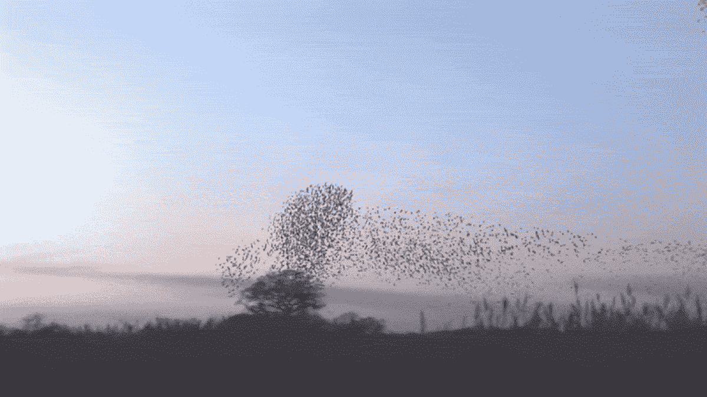
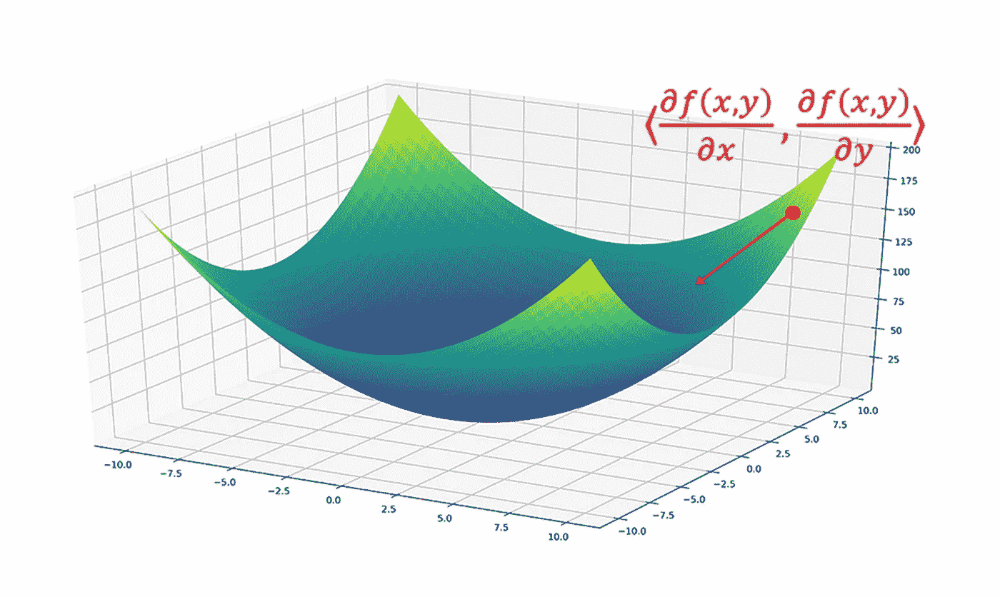
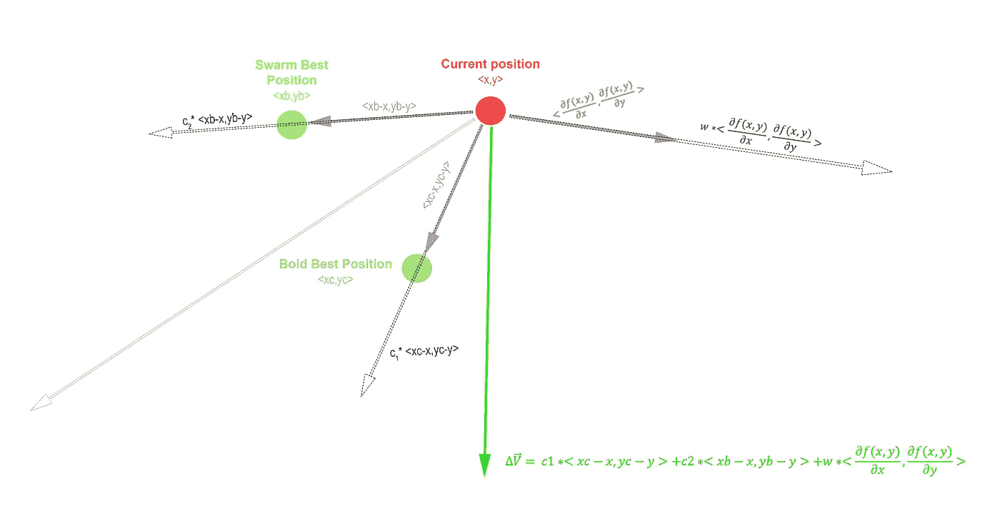
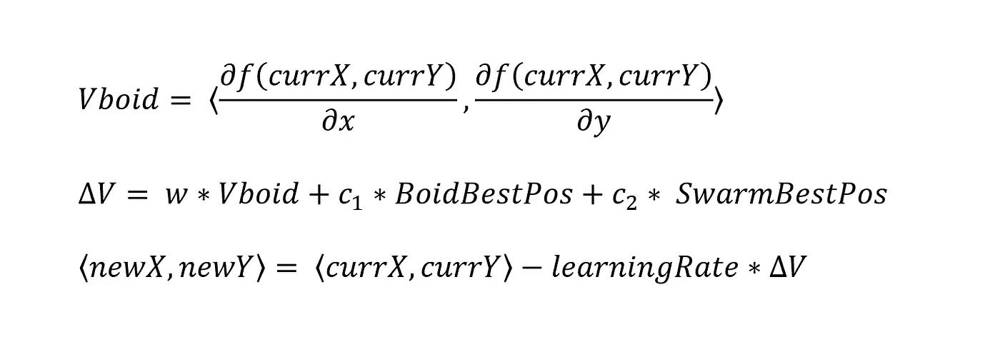
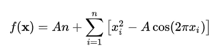
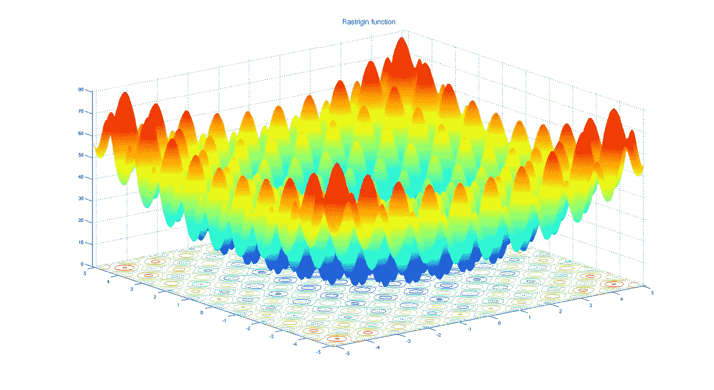
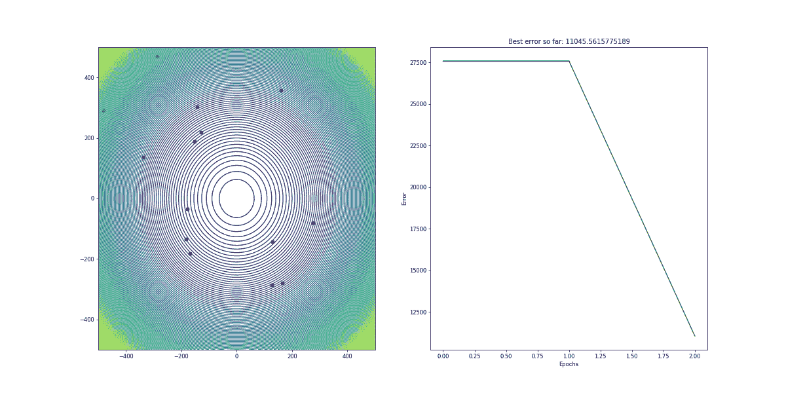

# 自然启发的优化算法:使用 Python 的粒子群优化

> 原文：<https://towardsdatascience.com/nature-inspired-optimization-algorithms-particle-swarm-optimization-2cd207d0d37e?source=collection_archive---------12----------------------->

鸣椋鸟

## 利用百万年自然选择过程解决数值优化问题

# 目录

*   **简介**
*   **什么是涌现复杂性？**
*   **建模鸟群智能**
*   **使用 Python 实现理论**
*   **结论**
*   **资源和参考资料**

# 介绍

粒子群优化(PSO)是一种基于随机优化的强大算法，其灵感来自于大群鸟中的规则。在本文中，将支持该方法的可行性，然后将推导出这些原则的精确模型。最后，将描述数值优化问题的这些原理的数学模型的实现，然后使用 Python 来实现，以找到 Rastrigin 函数的全局最小值[1]。如果你用 C++编程，你可以参考参考资料一节[2]中的链接来查看项目源代码。

# 什么是涌现复杂性？

涌现复杂性[3]是一种现象，它描述了大群体的各个组成部分如何以相同但更简单的规则一起工作来创建多样而复杂的系统。有一些自然的复杂行为可以作为涌现的例子。例如，蚂蚁本能地互相交流，以建立一个活的桥梁，在寻找食物源的时候最小化交流距离[4]。鸟类相互跟随，形成更大的群体，这增加了它们发现捕食者和食物来源的可能性。与不一定有用的通常的复杂性概念不同，自然复杂性是百万年自然选择过程的结果，其中能量使用是增加存活机会的最重要因素。因此，如果同一个问题有两种解决方案，由于自然选择，更简单和需要更少能量的方法将会存在。这就是为什么《自然》杂志提出的解决方案既简单又能有效地尽可能减少动物的能量消耗。因此，科学家们单独观察一群椋鸟中的每只鸟，发现它们中的每一只都采取简单的行动来形成复杂的结构。

1.  每只鸟都有自己的位置和速度
2.  每只鸟都有自己的视野范围，可以跟随周围的鸟。这只鸟完全不知道这个跨度之外的活动。
3.  如果任何一只鸟发现了食物，鸟群中所有的鸟都会朝那个方向飞去。

# **鸟群智能建模**

在自然界中，在一个数值问题中，任何 boid(类鸟物体)的可观测邻域都被限制在某个范围内。因此，它可以收敛到某个局部最小值或鞍点，其中梯度(在我们的情况下是速度)将为 0。然而，拥有一个以上的 boid 允许群体中的所有鸟意识到误差函数的更大表面，并且如果它们中的任何一个已经看到了误差方面的更好位置，则不会陷入局部最小值。为此，我们将对上述原则进行数学建模，以使群体找到误差函数的全局最小值

1.  每个 boid 都有自己的位置和速度。我们可以把速度看作误差函数的偏导数的向量。

f(x)= x +y 函数的曲面图

2.每个 boid 保持跟踪它曾经经历过的最佳位置，这在某种预定义的程度上有助于 boid 的当前速度。

3.这是整个鸟群所见过的最佳位置。因此，它将以预定的速率影响所有物体的速度。

通过使用上述规则，我们可以很容易地推导出驱动每个 boid 的数学方程。

计算 Delta V 的向量表示

在上面的等式中:

*   w——惯性决定了 boid 的当前速度对δV 的影响程度
*   c₂c₁——定义了 boid 和 swarm 的最佳记录位置将如何分别影响δv

w、c₁、c₂、学习率——是在优化过程中应该微调的超参数。

# **使用 Python 实现理论**

对群体智能背后的数学理论进行了讨论和建模，它可以使用任何现代编程语言来实现。然而，由于它的广泛使用，实现将使用 Python 来实现。不过，在本文的参考资料部分，也可以找到 C++项目代码。为了测试该算法，Rastrigin 函数将被用作误差函数，这是优化问题中最具挑战性的函数之一。在平面上有大量的余弦振荡会引入无数的局部最小值，在这些局部最小值中，物体会被卡住。

拉斯特里金函数

[Rastrigin 函数的 3D 曲面:](https://www.wikiwand.com/en/Rastrigin_function)【1】

如上所述，每个 boid 都有一个位置、速度、误差、最佳位置和已知误差。我们还应该编写一个 setter 函数，在需要时修改参数。

PSO 类将由误差函数表面上的移动粒子列表组成。为了初始化函数，需要函数的维数、boids 的数量以及历元的数量。

最后，我们编写代码来找到最佳优化误差函数的位置。首先，在每个时期，每个粒子被一个接一个地挑选并且优化它的位置。一旦粒子的位置被更新，“if”语句将检查它是否是蜂群的最佳位置。

现在，是时候运行 PSO 并观察算法的性能了。

粒子群输出

从下面的等值线图可以很容易地看出，swarm 只需要几个历元就可以收敛到 Rastrigin 函数的全局最小值。要获得创建轮廓可视化的代码以及流程的误差历元图，可以参考参考资料和参考资料一节中给出的链接。

# **结论**

总而言之，粒子群优化模拟了鸟(或鱼)群体的集体行为。它受益于自然形成的解决自身优化问题以最小化能量使用的方式。大自然的设计及其原理在计算机科学问题上的实际应用是了不起的。虽然有无数的资源可以帮助你获得更多关于涌现和 PSO 的见解，但我将列出一些有区别的资源，你可以用它们来更深入地挖掘群体智能的主题。

# 资源和参考资料

[1] [维基百科，拉斯特里金函数](https://www.wikiwand.com/en/Rastrigin_function)

[2] [T. Ahadli，粒子群优化 C++/Python 项目代码](https://bitbucket.org/tarlanahad/myneatcodes/src/master/PSO/)

[3] [对话，复杂中的非凡简单](https://theconversation.com/emergence-the-remarkable-simplicity-of-complexity-30973)

[4] [《国家地理》，蚂蚁如何只用身体在半空中搭建桥梁](https://www.youtube.com/watch?v=4BdjxYUdJS8)

[5] [詹姆斯·麦卡弗里，利用 Python 实现群体智能优化](http://youtube.com/watch?v=bVDX_UwthZI)