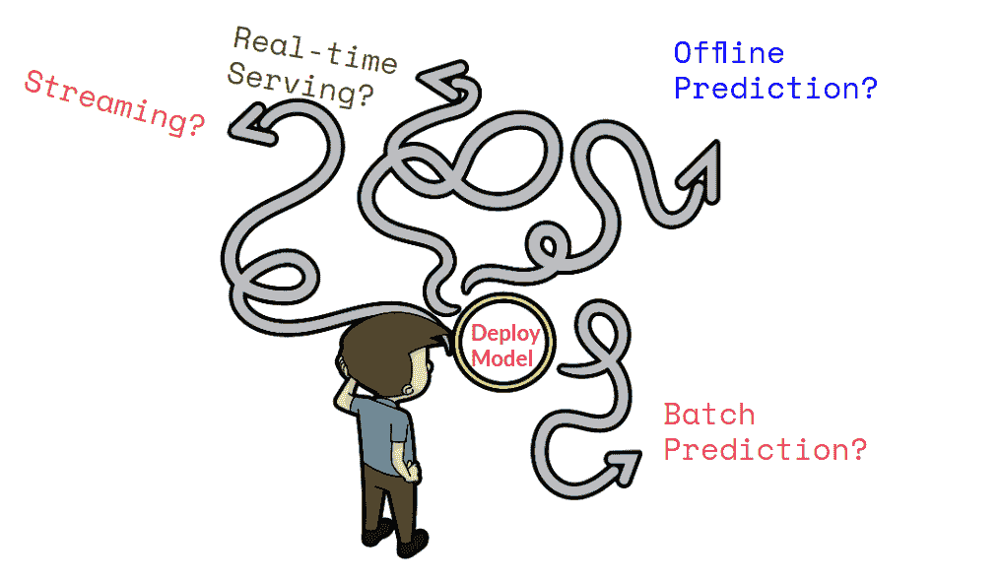
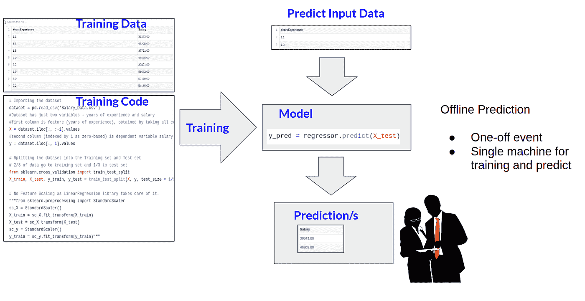
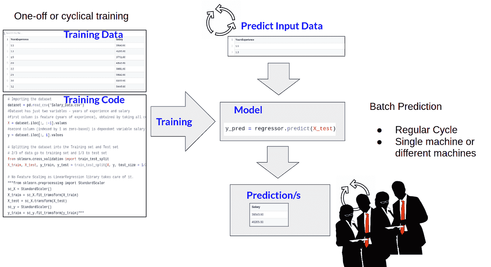
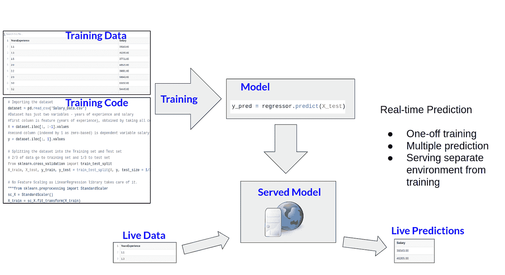
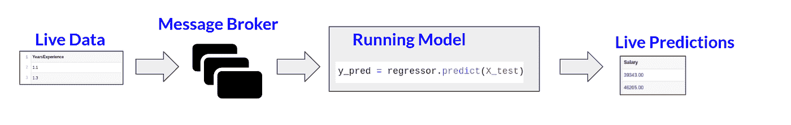
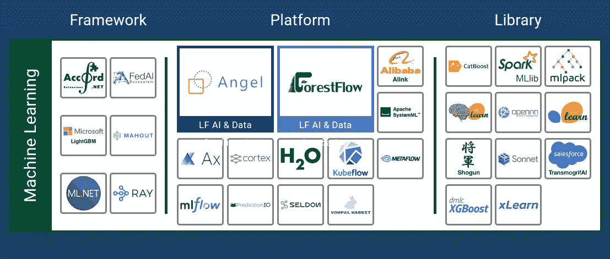

# 导航 ML 部署

> 原文：<https://towardsdatascience.com/navigating-ml-deployment-34e35a18d514?source=collection_archive---------19----------------------->

我们通常认为“部署”是将软件打包成一个工件，并将其移动到一个环境中运行。对于机器学习来说，将部署视为“将资源带入有效行动的行动”(牛津对“部署”的定义之一)可能更好。

使用 ML 模型进行商业决策有多种模式。部署机器学习模型可能意味着不同的事情，这取决于上下文。理解关键的预测模式有助于决定哪些工具适用于您的用例。

基于矢量卡通剪贴画的图片， [CC BY-SA 4.0](https://creativecommons.org/licenses/by-sa/4.0) ，通过维基共享

不同的情况适合不同的部署模式。但是有时同一个模型可能会以多种方式部署。模式的用例更多的是通过模型如何被消费来区分的，而不是预测的类型或意义。

许多项目目前认为他们必须构建自己的 ML 部署基础设施。有了部署模式的知识，我们将看到有工具可以提供帮助。

# 离线预测

离线预测是临时或一次性的预测。这可以在本地机器上完成，取决于预测的规模和所需的计算资源。

图片作者。来自 clipartdoc.com[的商业人士剪贴画](https://clipartdoc.com/category/business_clipart/)，按照他们[的术语](https://clipartdoc.com/terms/)使用。

离线预测可以直接从 python 代码(例如 jupyter 笔记本)生成，并提供给目标受众(例如以 CSV 格式通过电子邮件发送)。这最适用于单个事件的预测，以及新事件需要新模型的情况。例如预测选举或体育赛事的结果。

# 批量预测

批量预测是指需要从文件或存储中进行一组预测，通常以固定的时间周期(例如每周)进行。假设有一个模型用于预测下一季度的收入。或者预测下周作物需要多少水。

图片作者。商务人士剪贴画来自[clipartdoc.com](https://clipartdoc.com/category/business_clipart/)，按照他们的[条款](https://clipartdoc.com/terms/)使用。

对于批量用例，有一个规则的预测周期，每个周期可能使用相同的训练数据或相同的模型。或者可能每个周期都有新的训练数据可用，并且每次都需要生成新的模型。无论哪种方式，用例都适合触发器激活的处理作业，这些作业通过输入数据的存储进行预测。

# 实时服务

实时服务通常通过 HTTP 调用按需进行预测。这些在线用例包括(但不限于)用于推荐产品或广告等内容的电子商务应用程序。

图片作者。来自[freesvg.org](https://freesvg.org/world-wide-web-server-icon-vector-drawing)的网络服务器图标公共域

通常，一个模型在一个训练环境中被训练，并被打包用于实时服务。打包的模型经过一个提升过程到达实时服务环境。如果有新的培训数据可用，则“培训-薪资包-升级”流程将再次启动。

还有其他不太常见的服务用例，如在线学习。通过在线学习，训练持续发生，并且每个新的预测请求也是一个新的训练数据。大多数服务工具集中于单独的培训和服务，而不是在线学习。

实时服务可以与推广和监控紧密联系在一起。被服务的模型变成了微服务，需要安全地推出新版本的微服务，并监控其性能。

# 流动

流用例通过所需预测的吞吐量来标记，该吞吐量可能很高且可变。流式传输可以类似于批处理或实时传输，但增加了一个消息传递系统，以便按照处理速率而不是到达速率对预测进行排队。

流与其他实时情况的区别在于使用队列来平滑可变预测工作量的处理。

图片作者。来自 [pngwing](https://www.pngwing.com/en/free-png-pshyn) 的消息队列图标——非商业用途，DMCA。

实时预测在生成时可能会进入文件、数据库或 HTTP 服务。

流的一个例子可能是在线欺诈检测，其中可能允许交易通过，然后异步排队等待欺诈检测模型的交易后验证。

# 利用 ML 部署工具

如果我们将机器学习部署分成几个类别，它会变得更容易导航。这里我们提出了**离线预测、批量预测、实时服务**和**流**的空间。这些地方都有开源工具。已建立的工具从一开始就设计用于处理生产中的缩放和操作预测系统。

了解工具的一个很好的地方是 Linux 人工智能基金会(LFAI)的景观图(T1)。这是 LFAI 图表的一部分:

谢顿、皮质和射线是用来上菜的。Kubeflow 和 mlflow 是包含服务能力的端到端平台。Spark 在批量处理方面很受欢迎。 [LFAI 景观图](https://landscape.lfai.foundation/)片段，拍摄于 2020–11–14 23:28:19Z。在 [Apache License 2.0](https://github.com/lfai/lfai-landscape/blob/master/LICENSE) 下使用。

图表中间的特写是谢顿，我工作的地方。Seldon Core 是一个开源的实时服务解决方案，集成了[批处理](https://docs.seldon.io/projects/seldon-core/en/latest/examples/argo_workflows_batch.html)或[流](https://docs.seldon.io/projects/seldon-core/en/latest/examples/knative_eventing_streaming.html)用例。Seldon 集成了[渐进式展开](https://docs.seldon.io/projects/seldon-core/en/latest/examples/istio_canary.html)、[指标](https://docs.seldon.io/projects/seldon-core/en/latest/analytics/analytics.html)、[审计日志](https://docs.seldon.io/projects/seldon-core/en/latest/examples/payload_logging.html)、[解释](https://docs.seldon.io/projects/seldon-core/en/latest/examples/explainer_examples.html?highlight=explanations)和[数据漂移检测](https://docs.seldon.io/projects/seldon-core/en/latest/examples/drift_cifar10.html)。Seldon 支持一系列不同的框架，并允许不同类型的模型无缝交换或混合(例如，使用[多臂土匪路由器](https://docs.seldon.io/projects/seldon-core/en/latest/analytics/routers.html))。

我们在 Seldon 的理念是专注于关键用例，并与开源社区以及企业客户合作，以形成灵活和可扩展的解决方案。这导致了某些技术选择。目标平台的 Kubernetes。Knative，带有消息代理的可插拔选项(包括一个 [Kafka 选项](https://knative.dev/docs/eventing/broker/kafka-broker/)),用于流架构。用于 Argo 工作流或 kubeflow 管道的批处理选项。

要深入研究每个领域可用的工具范围，我建议使用“[令人敬畏的生产机器学习](https://github.com/EthicalML/awesome-production-machine-learning)”GitHub repo。它在编写时有 7k 个开始，并且具有关于[模型服务(实时)](https://github.com/EthicalML/awesome-production-machine-learning#model-serving-and-monitoring)、[数据管道(批处理)](https://github.com/EthicalML/awesome-production-machine-learning#data-pipeline-etl-frameworks)和[数据流处理(流)](https://github.com/EthicalML/awesome-production-machine-learning#data-stream-processing)的专用部分。

# 摘要:导航 ML 部署

决定如何最好地从 ML 模型中获得预测可能会令人困惑。如果我们牢记关键的部署模式— **离线、实时、批处理**和**流**，我们可以更清晰地做出决策。

许多项目目前认为他们必须构建自己的 ML 部署基础设施。但是对于四种部署模式中的每一种都有相应的技术。对这些模式的了解也让你确信你并不孤单。