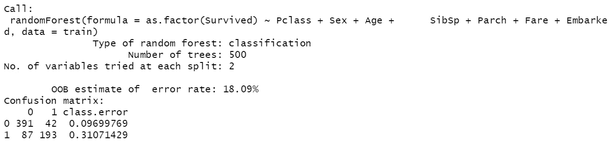
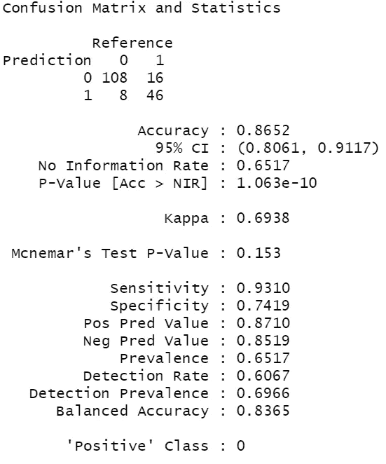

# 在 R 中导航随机森林算法

> 原文：<https://towardsdatascience.com/navigating-the-random-forest-algorithm-in-r-5ccbc0ef70e?source=collection_archive---------10----------------------->


图片来自 [Pixabay](https://pixabay.com/?utm_source=link-attribution&utm_medium=referral&utm_campaign=image&utm_content=4773016) 的 [501stCommanderMax](https://pixabay.com/users/501stCommanderMax-14065499/?utm_source=link-attribution&utm_medium=referral&utm_campaign=image&utm_content=4773016)

# 袋装树和随机森林有什么相似之处？

随机森林与袋装树的相似之处在于，随机森林或袋装树模型中的每棵树都根据数据的随机子集进行训练。事实上，这种对不同数据组进行采样以训练独立模型的过程是一种称为 bagging 的集成方法；因此得名袋装树。(见此处袋装树课:[https://datasciencelessons . com/2019/08/05/learn-bagged-trees-for-class ification-in-r/](https://datasciencelessons.com/2019/08/05/learn-bagged-trees-for-classification-in-r/))

# 它们有什么不同？

随机森林与袋装树的不同之处在于，袋装树可以访问任何给定树上的所有变量，因此袋装树的主要区别仅在于数据的采样。对于随机森林，用于训练模型的变量是在每棵树上随机选择的。这个过程被称为特性打包，因为它在概念上非常类似于引导聚合，只是针对变量。

许多人想知道为什么这个特征打包过程会导致更好的性能，原因是因为每个决策树有更大的不同可能性，因此每个树对因变量的变化给出不同的解释。

由于随机森林是对袋装树的改进，它们通常更有性能，在许多情况下也更容易调整。

现在使用我在打包文章中使用的相同数据集；我将在这里使用相同的数据集。

# 让我们开始吧

我们将使用`randomForest`包。需要记住的一点是，当调整`ntree`超参数时，更多的树几乎总是意味着更好的模型性能，您只需权衡计算时间和您可能获得的任何性能增益。(默认为 500 棵树)。

使用与决策树和袋装树教程中相同的数据集，我在每个模型中运行相同的公式。

正如我在其他教程中所说的，下面的`formula`部分是你告诉函数你想要理解什么的地方。`~`之前的变量是你的因变量或者你想了解的东西。`~`符号表示，*由*表示，或者*由*表示，接下来的一切就是你用来解释因变量的变化。

在这里，我们试图了解是否有人有可能在泰坦尼克号上幸存，给定他们的性别，年龄，兄弟姐妹数，票价，等等。

```
set.seed(14)
model <- randomForest(formula = as.factor(Survived) ~ Pclass + Sex + Age + SibSp + Parch + Fare + Embarked,
data = train)
print(model)
```



这里你可以看到打印出来的模型。包括了我们模型本身的一些解释，比如类型、树计数、变量计数等等。最有趣的是`OOB estimate of error rate`。`OOB`代表出袋错误；与袋装树相似，这意味着当你采集数据样本来训练模型的每个版本时，你会遗漏一些数据。对于遗漏的数据，或者我们称之为袋外数据，模型会对其进行预测，并将其与实际数据进行比较，从而得出您在上面看到的错误率。上面计算误差的方法是通过错误分类计数并确定它占总分类的比例。比如我们预测 87 + 193 为 1 或者有可能存活。31%的错误率是通过将我们得到的错误数 87 除以预测值 87 + 193 计算出来的。

够了！让我们开始预测吧！

这里，我们使用刚刚训练的模型来预测测试中每个记录的类别。

# 性能赋值

# 混淆矩阵

从那里，我们实际上必须声明它是一个因子。如果两个字段不是同一个类，则`Caret`的`confusionMatrix`功能将不起作用。

```
test$pred <- predict(model, test)
test$pred <- as.factor(test$pred)
confusionMatrix(test$pred, test$Survived)
```



正如您在上面看到的，这是`confusionMatrix`函数的输出。

该函数向您显示了预测值和实际值如何匹配的表格。所以预测值和参考值相同的对角线单元格代表我们得到的正确值。

我将给你上一堂课，教你如何解读下面的困惑矩阵:

True positive:象限中引用和预测都为 1 的单元格。这表明你预测了存活，而他们确实存活了下来。

假阳性:这里你预测为阳性，但你错了。

真阴性:当你预测为阴性，并且你是正确的。

假阴性:当你预测为阴性，而你是不正确的。

需要记住的几个关键指标是灵敏度和特异性。敏感度是您正确预测的真实记录的百分比。

另一方面，特异性是衡量实际错误记录中你正确预测的部分。

在不平衡数据集上进行预测时，要记住特异性。一个非常常见的例子就是对垃圾邮件进行分类。99%的情况下它不是垃圾邮件，所以如果你预测没有垃圾邮件，你有 99%的准确率，但你的特异性是 0，导致所有的垃圾邮件都被接受。

# ROC 曲线和 AUC

ROC 曲线或受试者工作特征曲线是一种可视化二元分类模型正确诊断或预测能力的方法。ROC 曲线绘出了不同阈值下的真阳性率与假阳性率的关系。

我们对于 ROC 曲线的目标是真阳性率 100%，假阳性率 0%。那条曲线会落在图的左上角。

AUC 旨在确定可分性的程度，或正确预测类别的能力。AUC 越高越好。1 是完美的，0.5 是随机的。

```
pred <- predict(object = model,
            newdata = test,
            type = "prob")library(Metrics)
auc(actual = test$Survived, 
    predicted = pred[,"yes"])
```

# 结论

那就是我对 R 中随机森林进行分类的介绍！希望对你有帮助！如果你愿意跟随我写关于数据科学、机器学习之类的东西，来 datasciencelessons.com 找我吧。

祝数据科学快乐！

如果你有兴趣了解这个主题的更多信息，请务必订阅！我目前正在写一本书，更详细地探讨这一原则和其他原则。