# NBA 深度跳水

> 原文：<https://towardsdatascience.com/nba-deep-dive-7f7558174672?source=collection_archive---------73----------------------->

## 斯蒂芬·库里的薪水太高了，而詹姆斯·哈登的薪水刚刚好

埃德加·恰帕罗在 [Unsplash](/s/photos/nba?utm_source=unsplash&utm_medium=referral&utm_content=creditCopyText) 上拍摄的照片

NBA 有大量的统计数据供统计学家和机器学习爱好者研究。有一堆网站拥有广泛的 NBA 数据，如 nba.com 的和 basketball-reference.com 的。

探索这些数据也是提高你的 [Tableau](https://www.tableau.com/) 和 [SQL](https://www.w3schools.com/sql/) 技能的好方法。我就是这么做的。下面的图都是用 Tableau 和 SQL(Python 中的 SQLite)做的表。

事不宜迟，我们来探究数据，建立模型吧！

# 探索数据

探索的许多变量(球队和球员统计)可以在这个[词汇表](https://www.basketball-reference.com/about/glossary.html)或这个[词汇表](https://stats.nba.com/teams/advanced/?sort=W&dir=-1)中找到。[此报告](https://github.com/maxbren/nba-deep-dive)包含数据、tableau 工作表、SQL 查询和模型。

## 你来自一个过度攻击性或防御性的国家吗？

在我们回答上面的问题之前，让我们看看每个州目前出生的 NBA 球员人数(截至 19-20 赛季仍在联盟中)。

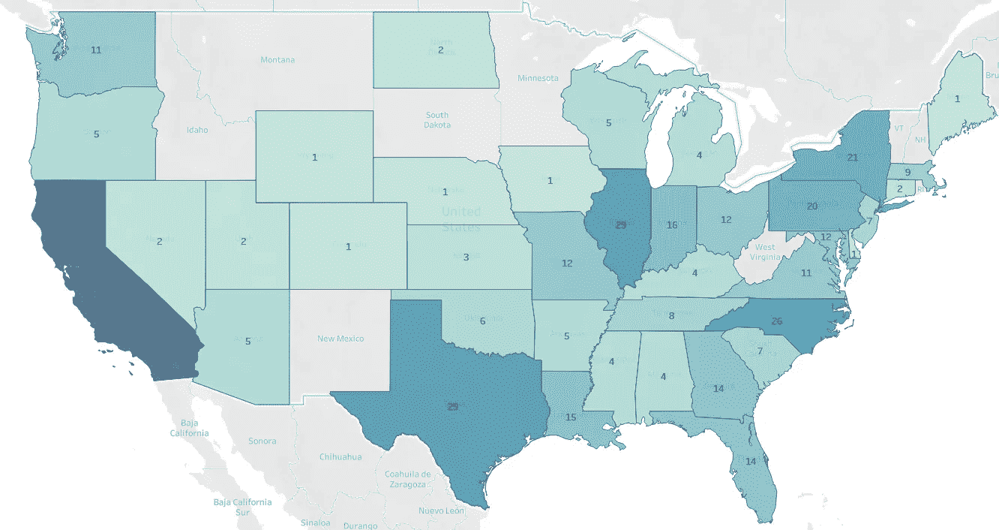

当前 NBA 球员的出生状态计数

毫无疑问，加州以 44 名玩家排名第一。许多中西部的州有一两次这样的机会。

更有趣的是每个州的平均 VORP。 [VORP 代表*价值超过替补球员*](https://en.wikipedia.org/wiki/Value_over_replacement_player) 这基本上就是团队中有一个单独的球员比一个普通替补球员好多少。这是衡量一个玩家成功的一个很好的标准。

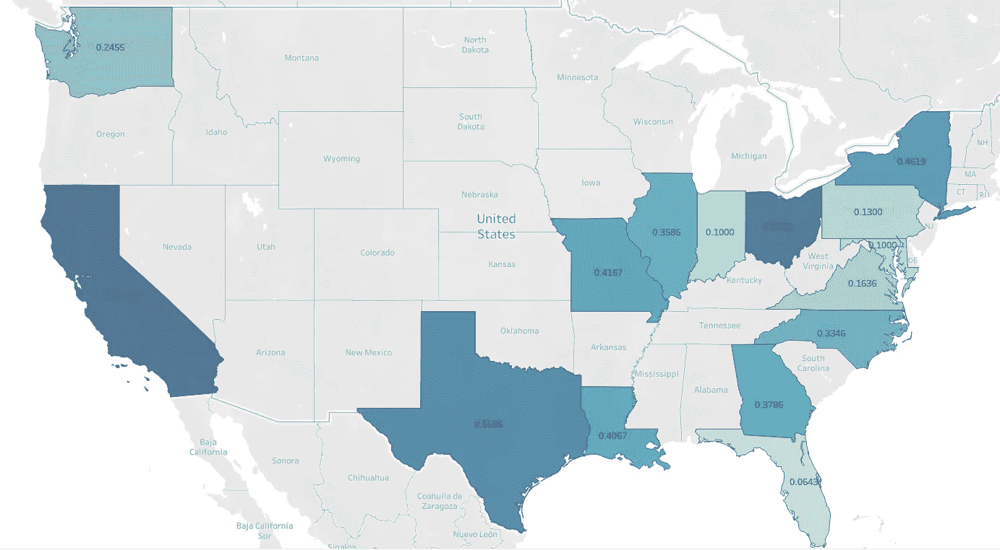

目前联盟中球员的平均 VORP(仅显示至少有 10 名 NBA 球员的州)

加州拥有最高的平均 VORP，拥有哈登、威斯布鲁克、利拉德、伦纳德、控卫等大牌球员。佛罗里达州目前最低。如果这是 2000 年代初，在文斯·卡特的领导下，FL 会更高。

接下来，我们来看看哪些状态更倾向于产生进攻型或防守型的球员。下面是[进攻获胜份额(OWS)和防守获胜份额(DWS)](https://www.sports-reference.com/cbb/about/ws.html) 之间的平均差异，这是分别衡量球员进攻和防守贡献的良好指标。更红的颜色意味着更多关注 OWS，更蓝的颜色意味着更多关注 DWS。

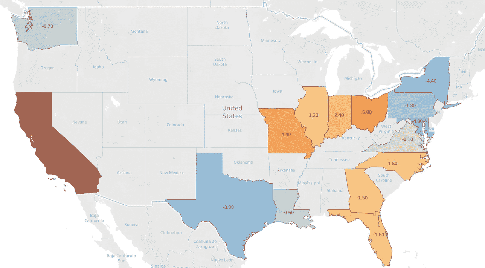

OWS 和 DWS 之间的差异(仅显示至少有 10 名 NBA 球员的州)

来自加州的 NBA 球员更注重进攻，鉴于上面列出的一些名字，这是有道理的，因为 VORP 倾向于进攻。纽约最注重防守，有安德烈·德拉蒙德和丹尼·格伦这样的球员。

## 大学对 NBA 的贡献

我们来看看目前 NBA 各学院的球员数量。

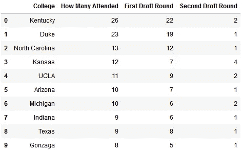

目前 NBA 球员最多的大学

肯塔基州和杜克大学遥遥领先，北卡罗莱纳州位居第三。

举例来说，虽然杜克大学在 NBA 有许多球员，但在普通 VORP，这些球员并不公平。(我不得不指出这一点，因为我是北卡罗来纳州的校友)

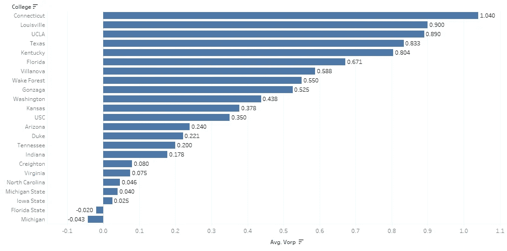

目前 NBA 球员的平均 VORP

肯巴·沃克和安德烈·德拉蒙德贡献了康尼提库的大部分 VORP。虽然肯塔基有顶级球员，如 AD，Bam Adebayo 和 Karl-Anthony Towns，但也有许多低于标准的球员拉低了平均水平。

比较球员的防守和进攻能力总是很有趣的，让我们为大学目前的 NBA 球员做这件事。

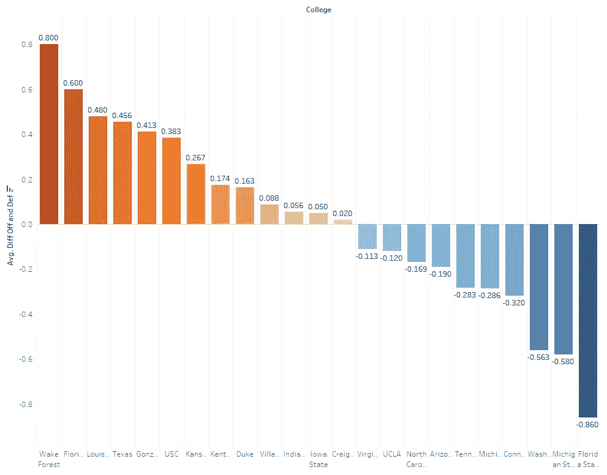

目前在联盟中的 NBA 球员 OWS 和 DWS 的区别

维克森林大学的差异最大，这意味着这所大学的 NBA 球员更倾向于进攻而不是防守。克里斯·保罗是这里最大的贡献者。德雷蒙德·格林对密执安州的贡献最大，比 DWS 高。德雷蒙德·格林是一个很难分析的[球员，但他无疑是防守方面的大师之一。](https://fivethirtyeight.com/features/draymond-green-is-a-star-but-only-in-the-right-system/)

## 哈登 vs …？

詹姆斯·哈登被认为是有史以来最好的 NBA 球员之一。然而，他也被认为缺乏一些防守能力。在过去的一个赛季中，还有一名 NBA 球员比哈登更擅长投篮而不是盖帽。

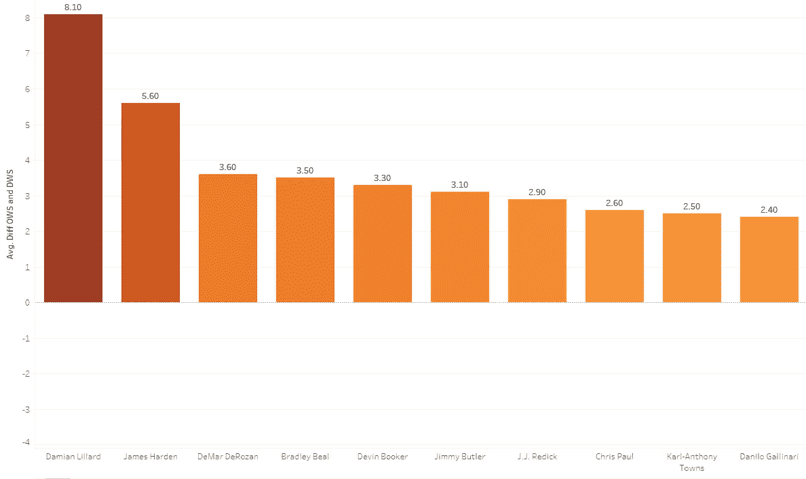

OWS 和 DWS 差距最大的球员(高等 OWS)

达米恩·利拉德在 OWS 和 DWS 的得分高达 8.1 分。而哈登得到了 5.6 分。下降继续与德马尔·德罗赞，然后平滑。数据不会说谎，利拉德的 DWS 比哈登低得多，OWS 也只比他好一点点。

## 主场优势；有多重要？

现在来看一个有趣的统计数据。主场优势是否存在。让我们看看过去这个赛季排名前 5 和排名后 5 的球队的客队和主场胜率。

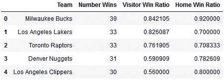

前 5 名球队客队主场胜率

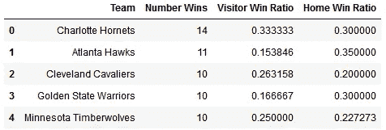

垫底的 5 支球队客队主场胜率

前五名中的两个队和后五名中的两个队实际上在客场比在主场表现得更好。总的来说，10 / 30 球队在客场比赛时表现更好。因此，大多数球队的大部分胜利确实发生在主场，但差距不是很大。主场优势确实存在，但没有一些人想象的那么重要。

## 谁的工资太高了？而且太少？

首先，看看哪些职位的平均工资更高。你可能会猜大前锋有詹尼斯，勒布朗詹姆斯和阿德这样的伟大球员。或者和斯蒂芬库里、威斯布鲁克、利拉德一起做控卫。但实际上是…中心！

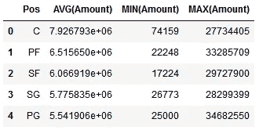

每个职位的工资

在 17-18 赛季，中锋的平均工资接近 800 万美元。而控卫的平均年薪是 550 万美元。怎么回事？

1.  打中锋的低薪球员比其他所有位置都少，尤其是控球后卫
2.  “中间”中锋比所有其他位置的中场球员工资高

接下来，我测量了高级玩家数据和薪水之间的[皮尔森相关性](https://en.wikipedia.org/wiki/Pearson_correlation_coefficient)，发现胜率(WS)和 VORP 与玩家薪水的相关性更强。

又发现了一个重要的东西…而且是令人不安的。在 17-18 赛季，斯蒂芬·库里(红圈)不仅收入最高，而且远远高于他的 WS 和 VORP 的平均水平。下面的趋势线显示了他与预测的差距。

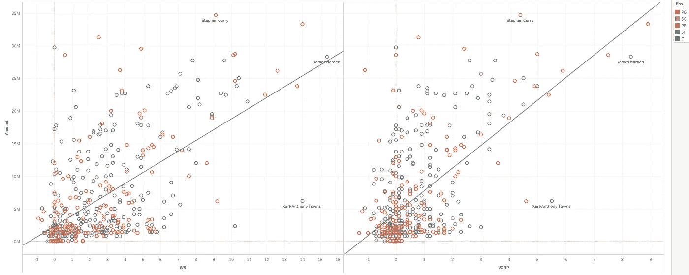

WS 和 VORP 的趋势线

詹姆斯·哈登(紫圈)的报酬刚刚好。卡尔-安东尼·唐斯(蓝圈)因其对球队的贡献而被非法低薪(不幸的是，是森林狼)。他拥有比库里更高的 WS 和 VORP，但得到的报酬却少得多。

这只是显示了更多的球队重视进攻而不是防守球员。

# 模型

现在让我们看看是否可以建立一个模型来预测哪支球队将在比赛中获胜。我收集了过去 5 个赛季所有的常规赛。这种型号不会是[猛禽](https://projects.fivethirtyeight.com/2020-nba-predictions/)，但这是一个开始。

首先，让我们建立一个简单的基线模型，预测获胜者是在给定的赛季中赢得更多胜利的球队。换句话说，这个模型从不预测“冷门”。有了这个简单的衡量标准，70%的情况下可以找到赢家。

现在来看看这个模型。每行包含

*   每支球队在那场比赛之前的胜败次数
*   客队必须走多远(距离和高度)
*   如果那场比赛的先发球员(过去 5 场比赛的连续先发球员)已经被更换
*   每个团队的高级团队统计数据，如[速度](https://www.nbastuffer.com/analytics101/pace/)
*   各队先发球员的高级球员统计，如[、WS](https://www.quora.com/What-does-WS-stand-for-in-basketball) 和 [BPM](https://www.basketball-reference.com/about/bpm2.html)

这些数据有点不真实，因为球队和球员的高级统计数据实际上是那个赛季结束时的总统计数据。不幸的是，这是我能很容易找到的，然而，另一种选择是实际计算每个统计的总数，直到当前游戏与[nba.com](https://www.nba.com/scores#/)

我使用 XGBoost 并对多个超参数进行网格搜索。我能得到的最好的性能是大约**70%**5 重交叉验证。这和基线一样好。这意味着即使有了所有这些先进的统计数据，也无法制造出更好的模型。这可能有两个原因。要么是这些数据中缺少了某些更细微的变量，而这些变量可以更好地预测赢家，要么是方差太高了。让我们探索更多:

最重要的特性如下所示，按增益计算。

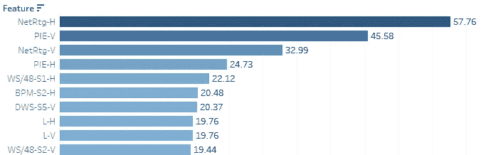

基于模型使用的增益的前 10 名

最好的特点是球队的净评分。被[支点分析](https://www.pivotanalysis.com/post/net-rating)定义为**“一个特定球员在场上时，球队的好坏程度有多大】**。其他先进的统计数据对首发球员和整个球队都很重要。*值得注意的是，特殊变量，如客队必须走多远，以及球队是否有首发变化，根本没有被模型使用，因为它们没有收益。*

## *模型和无扰动基线之间的预测有多相似？*

有些相似；这个模型和他们预测的 82% 上的基线相符。因此，在大多数情况下，该模型也预测不发生镦粗，但有 18%的情况下它会预测镦粗。然而，它仍然没有表现得更好。此外，无论预测结果是否正确，该模型都是最不自信的。试着训练一个只针对不正常情况的模型，并将其与基线相结合，以获得更好的结果。

## 如果我们去掉低信心预测会怎么样？

如果我们尝试去除置信区间低于 0.1 的预测，准确率会从 **70%** 到 **72%** 。因此，该模型对其不正确的预测相当自信。

这只是对这些数据的初步尝试。鉴于 NBA 已经提供的所有数据，还有很多要探索的！还有更多的模型要制作。查看[回购](https://github.com/maxbren/nba-deep-dive)并为自己做一些探索。