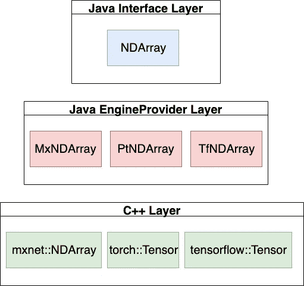

# NDArray — —一个基于 Java 的 N 维数组工具包

> 原文：<https://towardsdatascience.com/ndarray-a-java-based-n-dim-array-toolkit-60b4035b10b8?source=collection_archive---------15----------------------->

## DJL，一个引擎无关的深度学习库


[来源](https://pixabay.com/illustrations/analytics-information-innovation-3088958/)

# 介绍

在许多开发语言中，有一个使用 N 维数组的流行范例。它们允许您编写数字代码，否则只需几个简单的操作就可以完成许多层次的嵌套循环。由于并行化的能力，它的运行速度甚至比标准循环还要快。这现在是数据科学、图形和深度学习等许多领域的标准实践，但可以用于远远超出这一范围的应用。

在 Python 中，NDArrays 的标准库叫做 NumPy。然而，在 Java 中没有等价的标准库。AWS 的[深度 Java 库(DJL)](http://djl.ai) 为有兴趣使用 NDArrays 的 Java 开发者提供了一个产品。虽然它也包含深度学习，但核心是一个强大的 [NDArray](https://javadoc.io/doc/ai.djl/api/latest/ai/djl/ndarray/NDArray.html) 系统，它可以单独使用，将这种范式引入 Java。借助对多个深度学习框架(PyTorch、TensorFlow、MXNet)的支持，DJL 可以允许 NDArray 操作大规模跨多个平台运行。不管你运行的是 CPU 还是 GPU，PC 还是 Android，都简单好用。

在本教程中，我们将介绍如何利用 DJL 的 [NDArray](https://javadoc.io/doc/ai.djl/api/latest/ai/djl/ndarray/NDArray.html) 用 Java 编写 NumPy 代码，并将 NDArray 应用到现实世界的应用程序中。

# 设置

您可以在 gradle 项目中使用以下配置。或者，您可以跳过设置，直接在我们的 [](https://aws-samples.github.io/djl-demo/web-demo/interactive-console/src/main/webapps/) [交互式在线控制台](https://djl.ai/website/demo.html#jshell)中尝试。

```
plugins {
    id 'java'
}
repositories {                           
    jcenter()
}
dependencies {
    implementation "ai.djl:api:0.6.0"
    // PyTorch
    runtimeOnly "ai.djl.pytorch:pytorch-engine:0.6.0"
    runtimeOnly "ai.djl.pytorch:pytorch-native-auto:1.5.0"
}
```

就这样，现在我们可以开始实现了。

# 基本操作

让我们首先创建一个 try 块来为我们的代码创建一个作用域(如果您使用的是交互式控制台，可以跳过这一步):

```
try(NDManager manager = NDManager.newBaseManager()) {
}
```

[NDManager](https://javadoc.io/doc/ai.djl/api/latest/ai/djl/ndarray/NDManager.html) 帮助管理[n arrays](https://javadoc.io/doc/ai.djl/api/latest/ai/djl/ndarray/NDArray.html)的内存使用。它创造了它们，也有助于清除它们。使用完 NDManager 后，它还会清除在其作用域内创建的所有 NDArrays。NDManager 通过跟踪 NDArray 的使用情况，帮助整个系统高效地利用内存。

为了比较，让我们看看 Python 的 NumPy 中的代码是什么样子。我们将从导入带有标准别名的 NumPy 库开始。

```
import NumPy as np
```

在下面的部分中，我们将比较 NumPy 和 DJL 的 NDArray 的实现和结果。

# n 阵列创建

`ones`是生成用 1 填充的 N 维数组的操作。
数字

```
nd = np.ones((2, 3))
```
[[1\. 1\. 1.]
 [1\. 1\. 1.]]
```
```

恩达雷

```
NDArray nd = manager.ones(new Shape(2, 3));
/*
ND: (2, 3) cpu() float32
[[1., 1., 1.],
 [1., 1., 1.],
]
*/
```

你也可以尝试随机生成。例如，我们将生成从 0 到 1 的随机均匀数据。

NumPy

```
nd = np.random.uniform(0, 1, (1, 1, 4))
# [[[0.7034806  0.85115891 0.63903668 0.39386125]]]
```

恩达雷

```
NDArray nd = manager.randomUniform(0, 1, new Shape(1, 1, 4));
/*
ND: (1, 1, 4) cpu() float32
[[[0.932 , 0.7686, 0.2031, 0.7468],
 ],
]
*/
```

这只是一些常用函数的快速演示。NDManager 现在提供了超过 20 种数组创建方法，涵盖了 NumPy 中大多数可用的方法。

# 数学运算

我们还可以使用 NDArrays 尝试一些数学运算。假设我们试图做一个[转置](https://en.wikipedia.org/wiki/Transpose)并给 NDArray 的每个元素加一个数。我们可以通过执行以下操作来实现这一点:

NumPy

```
nd = np.arange(1, 10).reshape(3, 3)
nd = nd.transpose()
nd = nd + 10
```
[[11 14 17]
 [12 15 18]
 [13 16 19]]
```
```

恩达雷

```
NDArray nd = manager.arange(1, 10).reshape(3, 3);
nd = nd.transpose();
nd = nd.add(10);
/*
ND: (3, 3) cpu() int32
[[11, 14, 17],
 [12, 15, 18],
 [13, 16, 19],
]
*/
```

DJL 现在支持超过 60 种不同的 NumPy 数学方法，涵盖了大多数基本和高级数学函数。

# 获取和设置

NDArray 最强大的特性之一是其灵活的数据索引，这是受 NumPy 中类似特性的启发。

假设我们要过滤矩阵中所有小于 10 的值。

NumPy

```
nd = np.arange(5, 14)
nd = nd[nd >= 10]
# [10 11 12 13]
```

NDArray:

```
NDArray nd = manager.arange(5, 14);
nd = nd.get(nd.gte(10));
/*
ND: (4) cpu() int32
[10, 11, 12, 13]
*/
```

现在让我们尝试做一些更复杂的事情。假设我们有一个 3x3 的矩阵，我们想把第二列乘以 2。

NumPy

```
nd = np.arange(1, 10).reshape(3, 3)
nd[:, 1] *= 2
```
[[ 1  4  3]
 [ 4 10  6]
 [ 7 16  9]]
```
```

恩达雷

```
NDArray nd = manager.arange(1, 10).reshape(3, 3);
nd.set(new NDIndex(":, 1"), array -> array.mul(2));
/*
ND: (3, 3) cpu() int32
[[ 1,  4,  3],
 [ 4, 10,  6],
 [ 7, 16,  9],
]
*/
```

在上面的例子中，我们在 Java 中引入了一个叫做 [NDIndex](https://javadoc.io/doc/ai.djl/api/latest/ai/djl/ndarray/index/NDIndex.html) 的概念。它反映了 NumPy 支持的大多数 NDArray get/set 功能。通过简单地传递一个字符串表示，开发人员可以在 Java 中无缝地进行各种数组操作。

# 真实世界应用

当我们需要操作一个巨大的数据集时，这些操作非常有用。让我们看一个具体的用例:令牌分类。在这种情况下，开发人员试图通过对其应用深度学习算法，对他们从用户那里收集的文本信息进行情感分析。在预处理和后处理中应用 n 阵列运算来编码和解码信息。

# 标记化

在将数据输入到 NDArray 之前，我们将输入文本标记为数字。下面代码块中的`tokenizer`是一个`Map<String, Integer>`，它作为一个词汇表将文本转换成相应的向量。

```
String text = "The rabbit cross the street and kick the fox";
String[] tokens = text.toLowerCase().split(" ");
int[] vector = new int[tokens.length];
/*
String[9] { "the", "rabbit", "cross", "the", "street",
"and", "kick", "the", "fox" }
*/
for (int i = 0; i < tokens.length; i++) {
    vector[i] = tokenizer.get(tokens[i]);
}
vector
/*
int[9] { 1, 6, 5, 1, 3, 2, 8, 1, 12 }
*/
```

# 处理

之后，我们创建一个`NDArray`。为了进一步进行，我们需要创建一批令牌，并对它们应用一些转换。

```
NDArray array = manager.create(vector);
array = array.reshape(new Shape(vector.length, 1)); // form a batch
array = array.div(10.0);
/*
ND: (9, 1) cpu() float64
[[0.1],
 [0.6],
 [0.5],
 [0.1],
 [0.3],
 [0.2],
 [0.8],
 [0.1],
 [1.2],
]
*/
```

然后，我们可以将这些数据发送给深度学习模型。用纯 Java 实现同样的事情需要更多的工作。如果我们试图实现上面的整形函数，我们需要在 Java 中创建一个 N 维数组，看起来像:`List<List<List<...List<Float>...>>>`来覆盖所有不同的维度。然后，我们必须动态地插入一个新的包含元素的`List<Float>`来构建结果数据结构。

# 为什么要用 NDArray？

通过前面的演练，您应该有了在 Java 中使用 NDArray 的基本经验。总而言之，使用它有三个主要优势:

*   简单:通过简单的输入和相同的输出访问 60 多个 Java 操作符。
*   快速:完全支持最常用的深度学习框架，包括 TensorFlow、PyTorch 和 MXNet。现在，你可以让你的计算在 CPU 上被 MKLDNN 加速，在 GPU 上被 CUDA 加速等等。
*   深度学习就绪:支持高维数组和稀疏 n 数组输入*。您可以在所有平台上应用这个工具包，包括 Apache Spark 和 Apache Beam，用于大规模数据处理。它是数据预处理和后处理的完美工具。

*Sparse 目前仅涵盖 PyTorch 中的首席运营官和 MXNet 中的 CSR/Row_Sparse。

# 关于恩达里和 DJL

在尝试了 NDArray 的创建和操作之后，你可能想知道 DJL 是如何实现 NDArray 来实现这些行为的。在本节中，我们将简要介绍 NDArray 的体系结构。

# NDArray 建筑



如上所示，NDArray 有三个关键层。接口层包含 NDArray，它是一个 Java 接口，定义了 NDArray 应该是什么样子。我们仔细评估了它，并使所有函数的签名足够通用和易于使用。

在 EngineProvider 层，有不同引擎对 NDArray 的实现。这一层充当解释层，将引擎特定的行为映射到 NumPy 行为。因此，所有引擎实现的行为方式都与 NumPy 相同。

在 C++层，我们构建了 JNI 和 JNA 这两个公开 C++方法供 Java 调用。这将确保我们有足够的方法来构建整个 NDArray 堆栈。此外，由于所有引擎都是在 C/C++中实现的，因此它通过直接从 Java 调用 C++来确保最佳性能。

# 关于 DJL


[深度 Java 库(DJL)](https://djl.ai) 是一个用 Java 编写的深度学习框架，同时支持训练和推理。DJL 建立在现代深度学习框架(TenserFlow、PyTorch、MXNet 等)之上。您可以轻松地使用 DJL 来训练您的模型或部署您喜爱的模型从各种引擎，没有任何额外的转换。它包含一个强大的 ModelZoo 设计，允许您管理训练好的模型并在一行中加载它们。内置的 ModelZoo 目前支持来自 GluonCV、HuggingFace、TorchHub 和 Keras 的 70 多个预训练和随时可用的模型。NDArray 的加入使 DJL 成为 Java 中运行深度学习应用程序的最佳工具包。它可以自动识别您运行的平台，并判断是否利用 GPU 来运行您的应用程序。

从最新发布的版本来看，DJL 0.6.0 正式支持 MXNet 1.7.0、PyTorch 1.5.0 和 TensorFlow 2.2.0。我们在 Android 上也有 PyTorch 的实验支持。

关注我们的 [GitHub](https://github.com/awslabs/djl/tree/master/docs) 、[演示库](https://github.com/aws-samples/djl-demo)、 [Slack channel](https://join.slack.com/t/deepjavalibrary/shared_invite/zt-ar91gjkz-qbXhr1l~LFGEIEeGBibT7w) 和 [twitter](https://twitter.com/deepjavalibrary) 获取更多文档和 DJL 的例子！