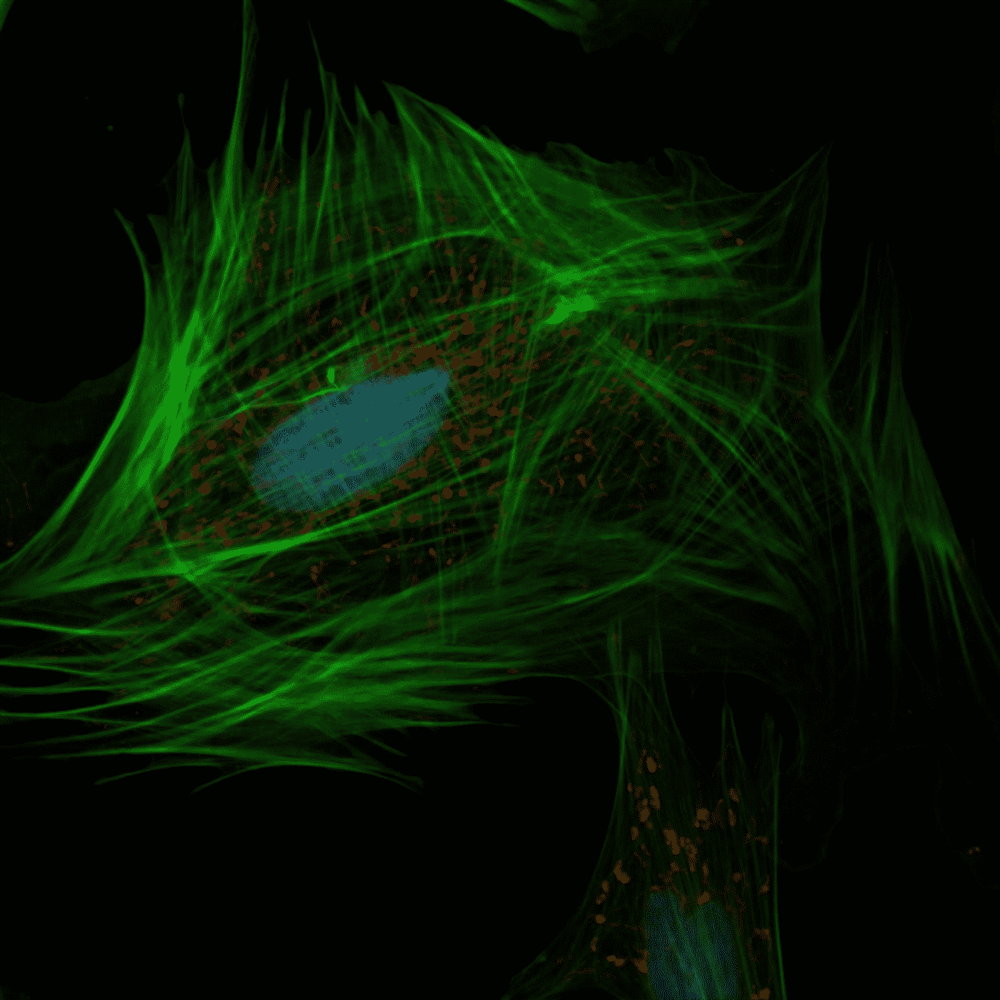

# 用遗传算法提高你的成功的巧妙技巧

> 原文：<https://towardsdatascience.com/neat-tricks-to-boost-your-genetic-algorithms-86eb6d5f13dd?source=collection_archive---------36----------------------->

## 如何与时俱进，用您的 GA 魔力给其他数据科学家留下深刻印象

[国家癌症研究所](https://unsplash.com/@nci?utm_source=medium&utm_medium=referral)在 [Unsplash](https://unsplash.com?utm_source=medium&utm_medium=referral) 上拍摄的照片

遗传算法(或称进化算法)——一种简单但非常强大的优化技术，最近又重新流行起来。从[进化强化学习模型](/reinforcement-learning-without-gradients-evolving-agents-using-genetic-algorithms-8685817d84f)、[神经架构搜索](https://arxiv.org/pdf/1808.03818.pdf)，或者简单的特征选择，遗传算法(以下简称为 g a)甚至为最复杂的深度学习提供了一个强有力的竞争者——甚至大牌，如[优步](http://eng.uber.com/wp-content/uploads/2017/12/improving-es-arxiv.pdf)和[谷歌](https://ai.googleblog.com/2018/03/using-evolutionary-automl-to-discover.html)，都在尝试 GA。

如果您是 GA 新手，您可能会发现这篇文章很有用。

 [## 遗传算法简介—包括示例代码

### 遗传算法是一种受查尔斯·达尔文的自然进化理论启发的搜索启发式算法。这个…

towardsdatascience.com](/introduction-to-genetic-algorithms-including-example-code-e396e98d8bf3) 

不管 GA 有多强大，它也不是没有缺点。事实是，GA 实现起来非常简单，但掌握起来却非常困难。尝试 GA 的新数据科学家经常会发现他们因陷入局部极小值、多样性问题和过度拟合而感到沮丧。这通常会导致完全放弃 GA，这是非常不幸的。

因此，我将分享一些我学到的小技巧(学到的？)并成功实施到我的工作流程中。

# 1.随机环境

你知道该怎么做。你设置奖励函数(或适应函数或 KPI 或其他)。你倾尽所有的数据，开始遗传算法。喝了几杯咖啡后，你回到电脑前，却发现遗传算法的解决方案过于简单，基本上没有用。

接下来你要做的是将数据分成训练集和测试集。您将改进您的解决方案，并每 X 次迭代检查一次测试集。然后，您会注意到在测试集上找到的最佳解决方案。

你以为你已经搞定了。你去喝了更多的咖啡。几个小时后，你回来看到测试集上的分数基本上是一条下降线。遗传算法学习适应训练集中的噪声，测试集上的最佳解决方案来自早期迭代，得分平平。

现在你陷入了进退两难的境地。

嗯，我估计 90%都是因为这个问题而放弃使用 GA 的。

GA 实现对于无噪声数据或高 SNR 数据工作良好。但是当你的数据非常嘈杂时，坦白地说，这几乎是所有有趣的数据，遗传算法只是锁定噪声，就像你的宠物的皮毛锁定你的衣服一样。

让我头疼了几个星期后，我找到了解决办法。我给 GA 一个随机子集，而不是让 GA 针对所有数据评估解(染色体)。所以，环境现在是动态的。GA 将在第一轮中用 10%的数据评估其群体。然后，经过选择和交叉，我将通过随机选择不同的 10%的数据来创建一个新的环境。GA 现在必须根据这个新的子集来评估群体。由于环境的变化，在第一轮中表现良好的染色体可能在第二轮中被丢弃。

我还记录了每条染色体的年龄。我的适应度函数会根据每个染色体存活的时间给出一个小奖励。使用这种方法，我鼓励 GA 找到一个通用的解决方案。

# 2.压力测试

这个基本上是上面解决方案的扩展。在金融领域，压力测试意味着模拟一个金融实体，比如银行，在经济低迷时期的表现。因此，我采用了类似的 GA 方法。我会准备一个压力测试数据集。这个数据集将与主数据集非常不同。压力测试数据可能大多是异常值，或者是在现实生活中发生几率非常低的模拟数据。

这个想法是为了看看哪条染色体可以在非常紧张的情况下坚持下来——这是你通常不会想到的情况。每隔一段时间，我就会把压力测试数据扔给 GA。然后我会丢弃大部分染色体。这类似于小行星消灭恐龙。它为新的生命形式提供了一个滋生的土壤，并清洗了那些“太习惯旧方式”的人

# 3.新颖性搜索

我相信进化出解决方案，然后发现所有的染色体在后来的迭代中几乎都是一样的，这并不罕见。这样做的问题是双重的——这导致基因库缺乏多样性，GA 很容易陷入局部极小值。为了补救这一点，有一个巧妙的技巧叫做新奇搜索。

简而言之，你应该考虑每条染色体的独特性，而不是只选择表现最好的染色体。有几种方法可以实现这一点——给含有稀有基因的染色体加分，给含有未知基因的染色体分配额外的配额，选择更多含有不同基因的染色体，等等。

关键的想法是，具有独特基因(参数值)的染色体应该得到更多的考虑，因为它们将为基因库带来更多的多样性，并使你摆脱那个局部最小值。

# 4.精心打造你的健身功能

我想很多人可能都知道这一点，但是让我强调一下——小心你要的东西。许多新手对适应度函数采取了一种简单化的方法，这可能会失败得很惨。

想象一下，开发一辆自动驾驶汽车，你的奖励(健身)功能是最大限度地减少旅行时间。你可以肯定这辆车会像《速度与激情》中的演员一样驾驶——因为你忘记了包括其他方面，如违反交通法，乘客舒适和安全，等等。

休息一下。睡一觉。好吧，睡上几个晚上吧。良好的健身功能会让你免去很多头疼的事情。

也许，你应该惩罚解决方案中的复杂性？给一致性加分怎么样？有很多事情需要深思。

我希望这个指南能帮助你在 GA 土地上的冒险。

快乐进化！

## 参考

[1] Paras Chopra，[无梯度强化学习:使用遗传算法进化智能体](/reinforcement-learning-without-gradients-evolving-agents-using-genetic-algorithms-8685817d84f) (2019)

[2]亚楠等，[用遗传算法自动设计 CNN 结构用于图像分类](https://arxiv.org/pdf/1808.03818.pdf) (2020)，IEEE 控制论汇刊

[3] Edoardo 等人，[通过一群寻求新奇的代理人改进深度强化学习进化策略的探索](http://eng.uber.com/wp-content/uploads/2017/12/improving-es-arxiv.pdf) (2017)，优步人工智能实验室

[4] Esteban Real，[使用进化 AutoML 发现神经网络架构](http://ai.googleblog.com/2018/03/using-evolutionary-automl-to-discover.html) (2018，谷歌大脑团队