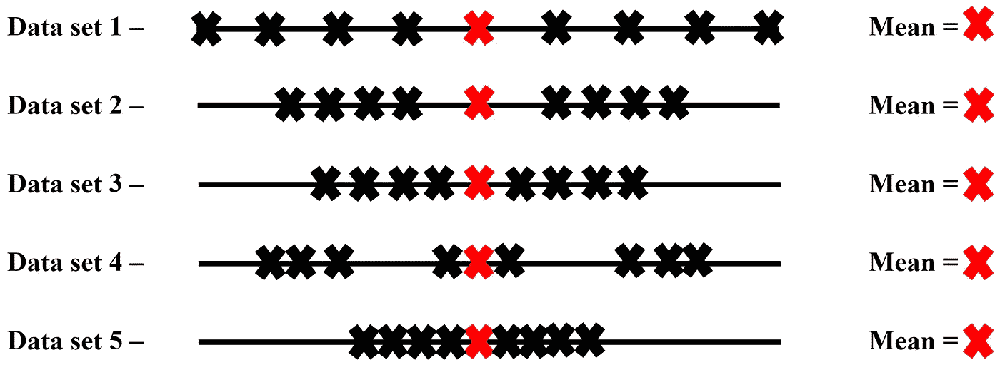
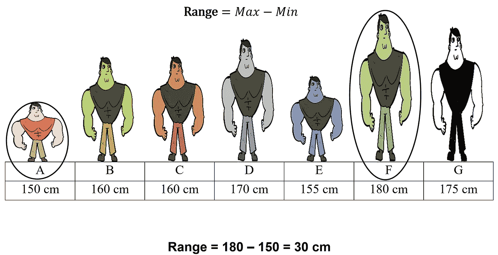
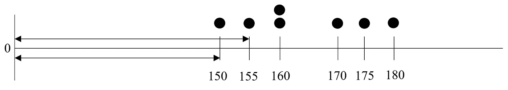
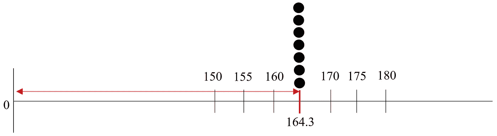
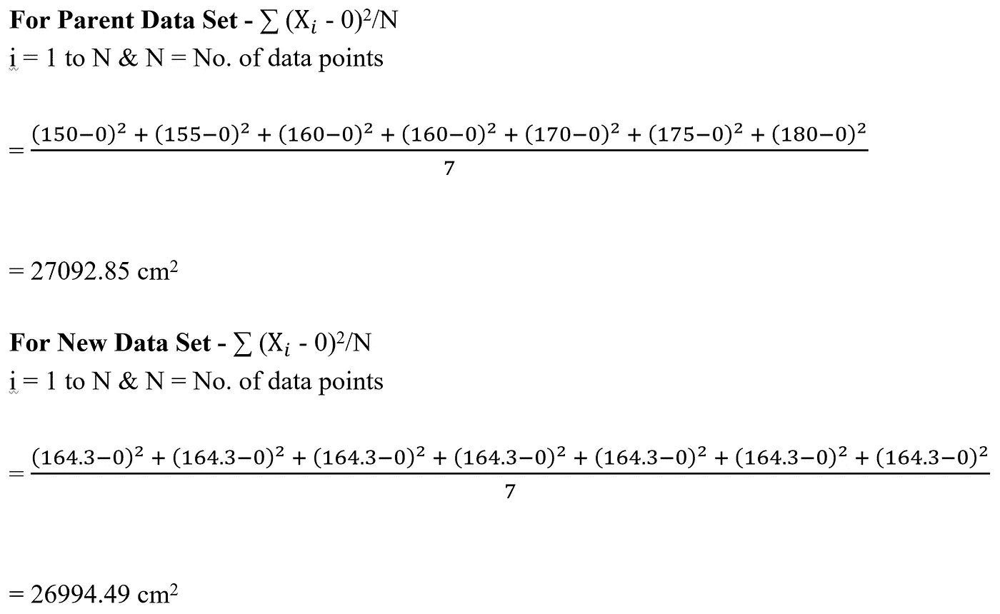
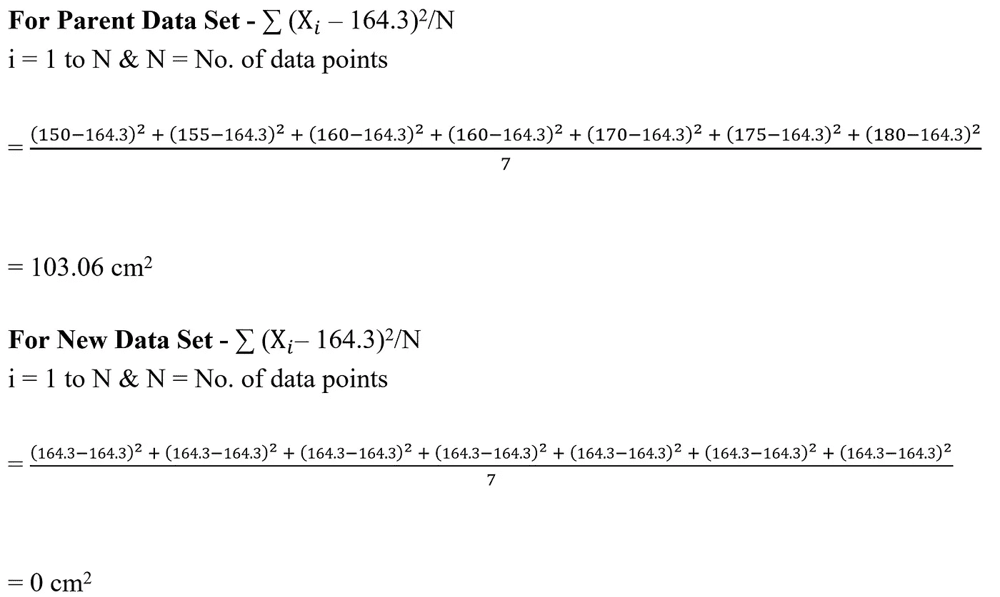
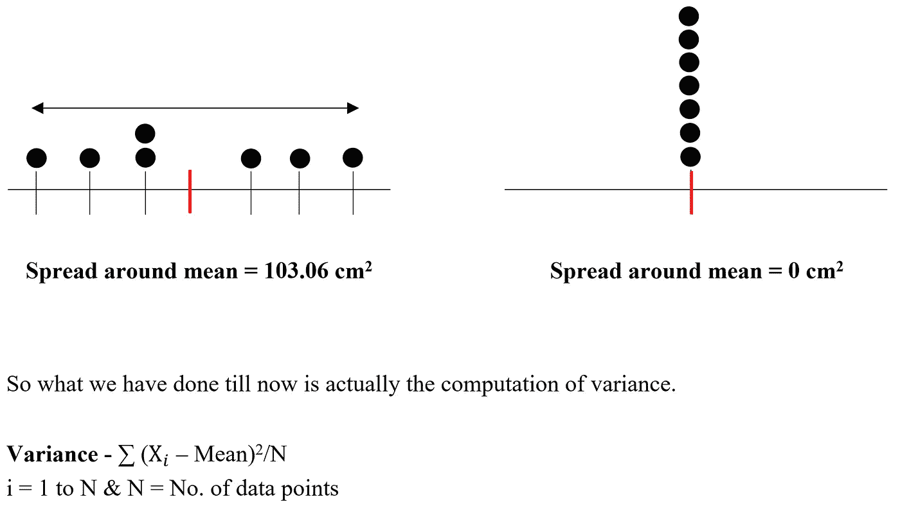
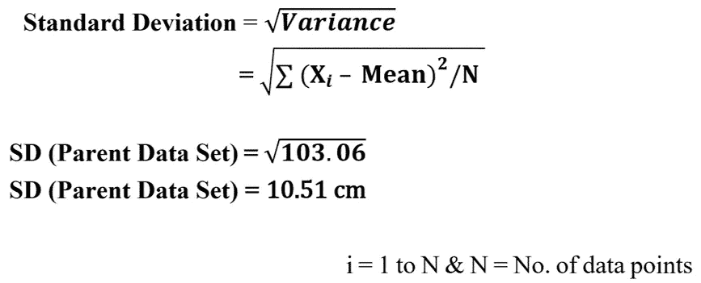

# 需要测量分布——范围、方差、标准差

> 原文：<https://towardsdatascience.com/need-for-measures-of-spread-range-variance-standard-deviation-28bc21e6f0ac?source=collection_archive---------49----------------------->

## 当集中趋势不足以区分数据集时

菲德尔·费尔南多在 [Unsplash](https://unsplash.com?utm_source=medium&utm_medium=referral) 上的照片

如果有人给你下图所示的五个数据集的 1 位数摘要(集中趋势)，在你看来，你会认为它们都是相同的，因为它们的平均值是相同的，但当你绘制每个数据集的每个数据点并对它们进行视觉比较时，你会意识到应该有一种方法来检测这种不同的模式。

(图片由作者提供)

> **向价差测量值——范围/方差/标准差打招呼**

参考之前博客中使用的相同数据:

 [## 均值、中值和众数——何时使用哪个集中趋势指标？

### 为了将数据表示为 1 个数字的摘要，我们使用集中趋势度量来这样做。存在三个主要趋势…

towardsdatascience.com](/mean-median-mode-which-central-tendency-measure-to-use-when-9fb3ebbe3006) 

## 范围

数据集的最快传播度量是范围。我们从数据集中取出最大值和最小值，然后相减得到范围。

(图片由作者提供)

*(*本博客假设数据为人口数据)*

## 差异

对于这项措施，我们将不得不回去参考，让我们回忆一下以前提到的一些想法。如前所述，当绘制在数轴上时，这些数字只不过是距离原点的距离。

(图片由作者提供)

让我们再取一个数据集，其中有 7 个数据点具有相同的值(即我们的父数据集的平均值)。

(图片由作者提供)

父数据集= 150，155，160，160，170，175，180(单位均为厘米)

新数据集= 164.3、164.3、164.3、164.3、164.3、164.3、164.3(均以厘米为单位)

现在，我们将计算两个数据集到原点的平均平方距离:

差值= 27092.85–26994.49 = 98.36 平方厘米

两个数据集的这两个测量值之间有明显的差异，但如果我们将参考值从原点改为均值，我们会发现:

你现在也会同意，事情在参考和输出价值方面变得更好了，再次可视化它们将导致进一步的清晰:

(图片由作者提供)

## 标准偏差

您可能已经注意到，方差输出的单位是 cm2 &如果我们想要一个具有相似均值参考但使用原始单位(cm)的分布度量，那么我们需要做的就是求方差的平方根。这就是标准差。

*   *注意—以上完成的所有计算都假设数据集为群体集。讨论最多的&辩论主题与此类测量的分母相关，即为什么样本为 N-1，为什么总体为 N，将在以后的博客中解释。*

有了 2 个数字的汇总(集中趋势和扩散)，我们可以更好地区分数据集，并记住每个统计测量都有其服务的目的。这些度量标准是为了捕捉现有度量标准没有捕捉到的细节。在接下来的博客中，你会注意到需要使用更多的统计方法来捕捉更多可提取的细节。就这样，我在这里结束这个咀嚼，期待在未来分享更多的博客。

谢谢！！！