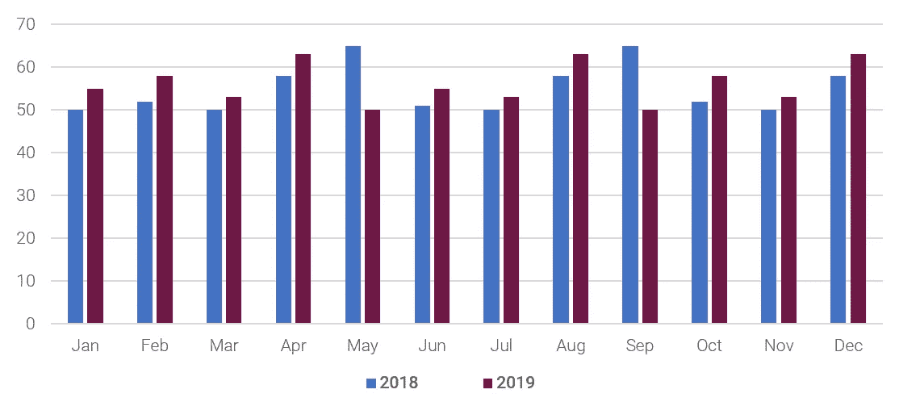
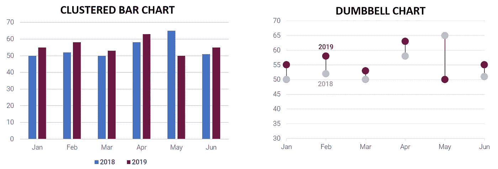
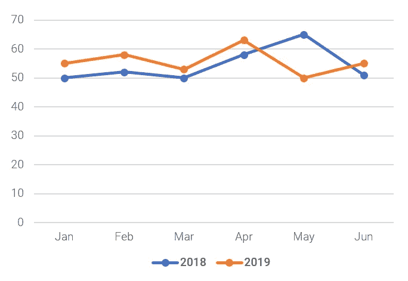
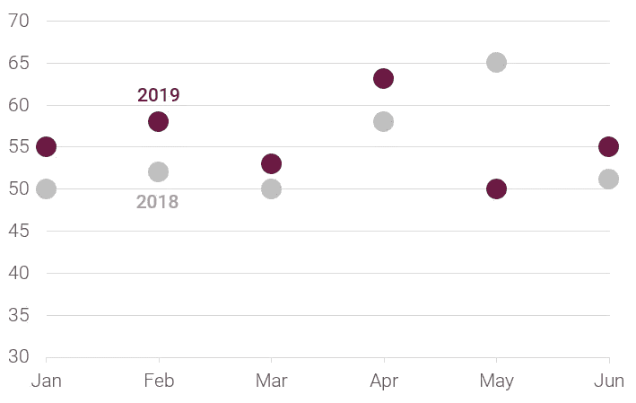
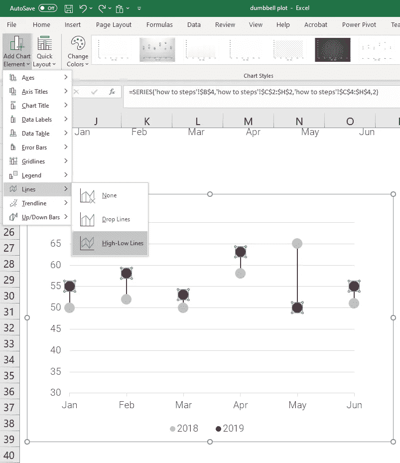
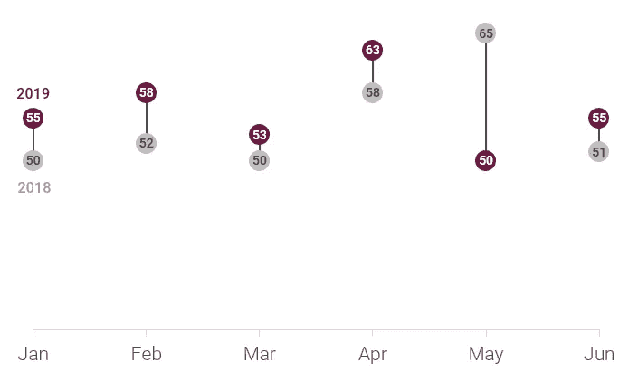
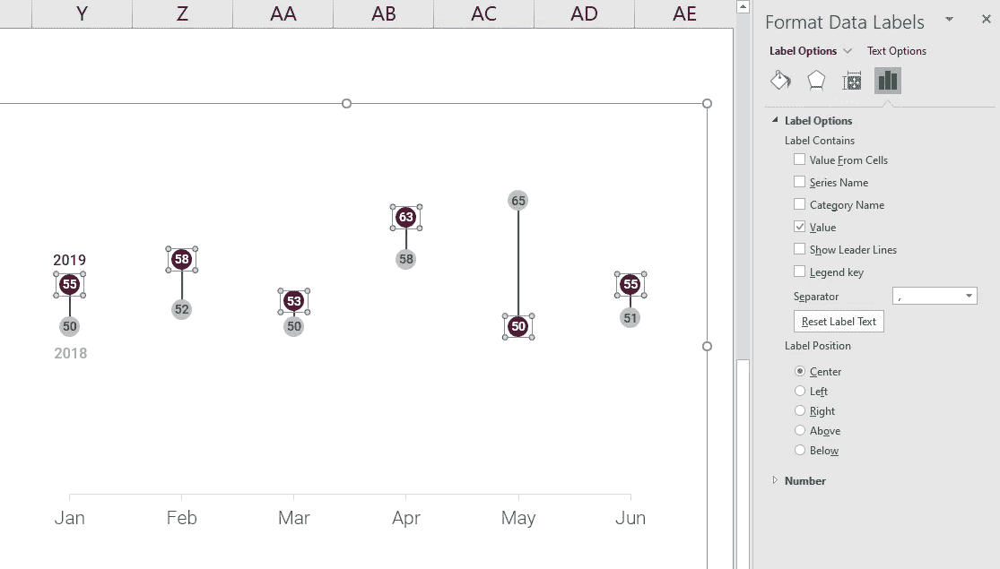

# 需要在仪表板上强调变化吗？忘记条形图，用哑铃图代替！

> 原文：<https://towardsdatascience.com/need-to-emphasize-change-in-your-dashboard-forget-bar-charts-use-dumbbell-charts-instead-84b97c591f12?source=collection_archive---------28----------------------->

## 哑铃图易于构建和理解，对于商业受众来说是一种很好的替代图表类型。

尼科埃尔尼诺在 [iStockphoto](https://www.istockphoto.com/au/photo/investor-analyzing-financial-reports-and-key-performance-indicators-computer-screen-gm639106078-115006617) 拍摄的图像

在设计仪表板和其他数据可视化时，图表类型的选择是一个关键的工具，你可以用它来让你的观众关注最重要的信息。尤其是仪表盘，信息丰富。减少你的听众提取关键信息所需的工作量会使他们更加有效和强大。

条形图是数据可视化的主要工具。它们是所有图表类型中最容易理解的，并且能够准确无误地描述变化(假设坐标轴总是从零开始——你只会犯一次新手的错误！反馈是一种天赋，对吗？！).

在仪表板中，任务通常是比较数值——今年与去年，实际值与目标值，等等。大多数软件工具引导我们使用的默认图表类型是簇状柱形图。这是一个不错的选择，但是随着类别数量的增加，它会很快失控…

簇状条形图虽然继承了条形图的许多优点，但并不是比较数值的最有效的图表。为什么？考虑上面的图表，为了了解今年与去年相比的情况，我需要根据每个条形的长度读取条形的值，将其与条形对进行比较，并保留该信息，同时对下一个条形对、下一个条形对等等进行同样的操作。很快我就要记住 24 个数字和 12 个不同点。我不知道你怎么想，但我努力在脑子里记住这么多信息。更不用说处理它来理解是否有某种模式。

我需要的是一个图表类型，重点是在价值的差异。我可以画出这两个值之间的差异，但是如果绝对值对观众很重要，而我们又不想失去这些信息，该怎么办呢？在这里，哑铃图表成为一个伟大的选择。

对商业和非技术受众使用替代图表类型总会有一些风险，但幸运的是哑铃图表不会对大脑造成太大的压力。哑铃图表的伟大之处在于，它允许你:

*   保留关于绝对值的信息
*   垂直轴从非零值开始(意味着您可以突出显示微小的变化)，并且
*   通过连接这些点，观众本能地关注它们之间的距离(这是你的图表的要点！).

有什么不喜欢的？但是如果您坚持使用不提供这种图表类型的 Excel 呢？没问题，它们构造起来超级简单。

# 循序渐进

1.  首先用标记构建一个折线图。

2.增加标记大小，删除连接线，并根据您的意愿设置样式。我喜欢直接标记系列，而不是使用图例，因为这样更有效。

3.现在插入高低点线，方法是选择一个系列，然后在功能区的图表工具>设计部分单击“添加图表元素”。悬停在“线”上将显示“高低线”选项。点击就大功告成了！

4.晒晒你的老板和同事的赞赏吧！

# 想更刺激一点吗？

通过直接标记标记而不是使用轴来获得极简的外观。看啊…

这里没有文本框…使用数据标签对你有利。添加数据标签，使用“中心”标签位置，并根据需要设置它们的样式。

你从来不知道你可以像那样使用数据标签，是吗？！