# 需要为您的 Python 分析准备一个演示站点吗？想想 Heroku+Flask/Dash

> 原文：<https://towardsdatascience.com/need-to-prepare-a-demo-site-for-your-analysis-on-python-think-of-heroku-flask-dash-f8680a859105?source=collection_archive---------45----------------------->

## 从 Hello World 开始的初学者演练

有一天，当我为一个概念验证项目制作一个数据科学 web 应用程序时，我意识到如何部署该应用程序并不一定是显而易见的。我希望该应用程序能够:

*   全天候运行并提供演示，
*   呈现在任何可通过互联网访问的设备上，以及
*   不像生产应用程序部署那样需要太多的成本和精力。

我最终发现使用“Heroku”以及 python 的 web 框架库(如“Flask”或“Dash ”)最符合我的预期。

在这篇文章中，我将总结一下我当时学到的东西:我们如何配置 Heroku+Flask/Dash app，从 Hello World 到一个专业的例子。

## 目录:

1.  你如何为你的 Web 应用建立演示环境？
2.  烧瓶和 Dash 是什么？
3.  应用程序部署练习 1:仅限烧瓶——向自己问好
4.  App 部署练习 2:Heroku+Flask——向世界“你好世界”
5.  应用部署练习 3: Heroku + Dash —显示带有动态过滤的 Iris 数据表
6.  应用部署练习 4: Heroku + Dash —专业示例
7.  结尾注释


[本杰明·蔡尔德](https://unsplash.com/@bchild311?utm_source=medium&utm_medium=referral)在 [Unsplash](https://unsplash.com?utm_source=medium&utm_medium=referral) 上的照片

# 1.你如何为你的 Web 应用建立演示环境？

假设您刚刚在 Python 上构建了一个 web 应用程序作为 PoC 工作(因此，作为一名数据科学家，我在这里设想了一个数据科学应用程序(例如，data dashboard)，但可能同样适用于任何应用程序)，并希望在许多演示机会中演示它，例如讲台演示、投资者推介或网络聚会。


作者用免费插图网站“IRA suto-ya”(【https://www.irasutoya.com/】T4)的材料制作的插图

您所期望的是:

*   你想在任何设备上看到它，以便你的同事或客户访问该应用程序并四处游玩，
*   您希望它全天候运行，并且
*   尽管如此，因为它不是一个生产应用程序，而是一个概念验证阶段，所以您希望在部署它时尽量减少开发本身的额外工作。

现在，让我们看看 web 应用程序部署中的三个可能的例子。

## **1.1。将应用程序保存在您的电脑上**

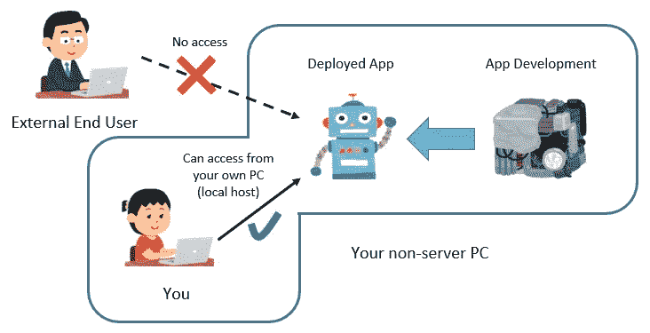

作者使用免费插图网站“IRA suto-ya”([https://www.irasutoya.com/](https://www.irasutoya.com/))的材料制作的插图

在这里，您在 PC 上开发应用程序，并在同一台 PC 上进行部署(类似的案例研究在下面的“*应用程序部署练习 1:仅 Flask—“Hello World”to Yourself*”中)。

*优点:*

*   应用程序开发后没有额外的操作。

*缺点:*

*   除了你没有其他人可以进入。

在这种情况下，你的客户体验应用程序的唯一方式就是你从你的电脑上展示它。

## **1.2。准备一台服务器 PC 并在其上部署应用程序**

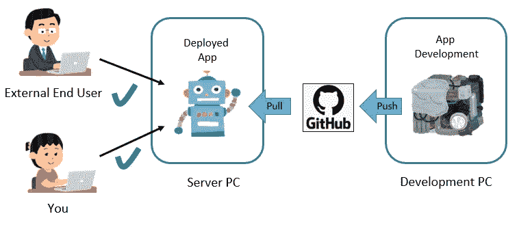

作者使用免费插图网站“IRA suto-ya”(【https://www.irasutoya.com/】[)的材料和 GitHub 的官方徽标制作的图形](https://www.irasutoya.com/)

在这种情况下，您需要准备自己的服务器(本地或云实例)并在其上部署应用程序。

*优点:*

*   高灵活性和对部署环境的控制。

*缺点:*

*   必须自己管理两个机器环境。一个部署将需要，从您的开发环境推送到存储库，从存储库拉到服务器，在服务器上配置和运行它。
*   维护服务器的额外成本。

**在这种类型中，您花费更多的时间和金钱，但对部署环境有更高的控制力。**您可以授予外部用户访问权限，也可以阻止其中一些用户。

但是，由于这种类型是针对生产架构的，**如果您只想在较短的时间内演示您的 PoC 工作，而不是针对永久运行的生产线，这就太多了。**

## 1.3.使用 heroku 进行部署

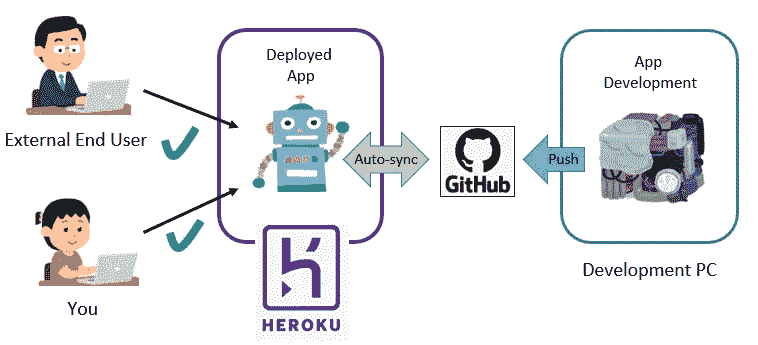

作者使用免费插图网站“IRA suto-ya”([https://www.irasutoya.com/](https://www.irasutoya.com/))的材料以及 GitHub 和 Heroku 的官方标志制作的图形

这里我要介绍一下**[**Heroku**](https://www.heroku.com/)**。****

****Heroku 是一个基于网络的服务，用来取代以前架构的服务器部分。一旦它通过您的应用程序连接到您的 GitHub 存储库，**它会自动从 GitHub 中提取您的模型，并将其部署到互联网上**添加唯一的 URL，而您只需进行最少的配置(我们将在下面的*应用程序开发练习 4–6*中看到这一点！)应用程序的更新以同样的方式发生:一旦你将新代码推送到 GitHub 存储库，heroku 会检测到变化并自动更新部署。****

****还有，对于非制作级别的 app，不用花钱！****

*****优点:*****

*   ****比服务器选项更少的配置和维护负担。****

*****缺点:*****

*   ****对配置的控制不如服务器选项。因此，不适用于生产应用程序。****

# ****2.烧瓶和 Dash 是什么？****

****我还要提一下[**【Flask】**](https://flask.palletsprojects.com/en/1.1.x/)[**【Dash】**](https://plotly.com/dash/)，这些在 Python web app 构建中非常有用，我在下面的 *App 部署练习*中使用过。****

********

****Flask 和 Dash 的官方标志****

******“Flask”**是一个 python 库，提供微 web 框架，通过 python 编码支持 web 应用的开发。Flask 可以提供你用 python 代码编写的动态应用程序的 web 内容。由于 python 相对于其他语言的优势是易于机器学习建模，所以大量使用 Flask 来创建 web API 以返回 ML 模型预测。****

****Flask 很好地提供了动态 web 组件，但它本身在视觉上并不漂亮。为了使它更漂亮，我们需要 html 模板和 CSS 文件都编码良好。****

****" **Dash** "是另一个让美化视觉更容易的 web 框架。它在 python/R/Julia 中可用，构建在 Flask、plotly 或其他库之上。与 Flask 相比，它更专注于数据科学仪表板 UI，并提供了许多内置道具，使应用程序更漂亮。****

****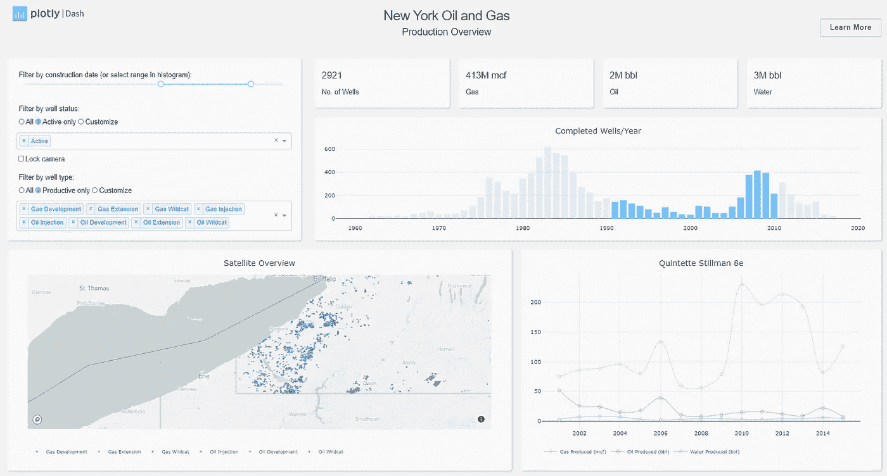****

****仪表板上的数据仪表板示例([https://dash-gallery.plotly.host/dash-oil-and-gas/](https://dash-gallery.plotly.host/dash-oil-and-gas/))****

# ****3.应用程序部署练习 1:仅限烧瓶——向自己问好****

> *****3.1。安装烧瓶。*****
> 
> *****3.2。准备 app_helloworld.py 代码。*****
> 
> *****3.3。运行 app*_ hello world*. py .*****
> 
> *****3.4。去网络浏览器找到“你好世界！”。*****

****在这里，我们现在尝试在您的本地机器上运行一个简单的 Flask 应用程序。如果你的应用不能在本地运行，它将永远不能在 heroku 上运行！该应用程序将显示“Hello World！”在你的浏览器上。****

## ****3.1.****

****首先，通过在终端上运行以下命令，在本地计算机上安装 Flask:****

```
**$ pip install Flask**
```

## ****3.2.****

****接下来，准备一个名为 *app_helloworld.py* 的. py 文件，如下所示:****

****“app”是 Flask 类的一个实例，它在代码中充当 [WSGI](https://en.wikipedia.org/wiki/Web_Server_Gateway_Interface#:~:text=The%20Web%20Server%20Gateway%20Interface,Enhancement%20Proposal%20(PEP)%203333.) 。`@app.route('/')`是另一个告诉 Flask 哪个 URL 将触发函数`index`的神奇代码。函数`index`将打印“你好，世界！”。最后两行定义了当我们通过终端运行这个文件时的行为。****

****进一步的解释可以参考[烧瓶快速启动页面](https://flask.palletsprojects.com/en/1.1.x/quickstart/#a-minimal-application)。****

## ****3.3.****

****最后，在您的终端上运行以下程序:****

```
**$ cd <path where you placed app_helloworld.py>
$ python app_helloworld.py**
```

****您将在终端上看到这一行。****

****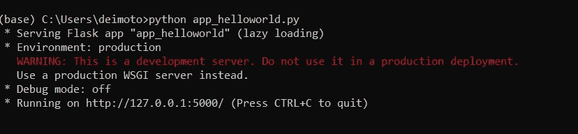****

## ****3.4.****

****转到您的 web 浏览器，在 URL 单元格中键入`127.0.0.1:5000`(显示的 IP 地址)或`localhost:5000`。然后，你会看到这个:****

****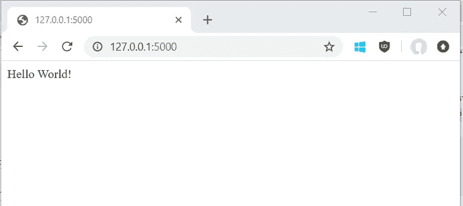****

****成功！****

****但是，你必须记住一些缺点:****

*   ****`127.0.0.1`是私人 IP 和《Hello World 仅在您的电脑上可见。你永远不会在你的智能手机或客户的机器上看到同样的东西。****
*   ****将你的电脑关机或甚至进入睡眠模式将会或可能会停止应用程序。你必须重新运行代码来保持“Hello World！”活着的东西。****

****这就是为什么我们需要后端服务器功能来在任何机器上全天候供应应用程序。“heroku”将帮助我们做到这一点。****

# ****4.App 部署练习 2:heroku+Flask——向世界“你好世界”****

> ****4.1.确保你能运行“Hello World！”否则，请回到上一节。****
> 
> ****4.2.准备另外两个关键文件:“requirements.txt”和“Procfile”。****
> 
> ****4.3.做一个 GitHub 库，推送准备好的文件。****
> 
> ****4.4.配置 heroku 在上面运行和部署应用程序。****
> 
> ****4.5.去(任何)网络浏览器找到“你好世界！”。****
> 
> ****4.6.(可选)查看当您将代码推送到 GitHub 时，app deploy 是如何更新的。****

****我们现在想要做的是将应用程序移动到 heroku 服务器，并保持它全天候(而不是本地)运行(不仅仅是在您的 PC 打开时。)****

## ****4.1.****

****作为先决条件，确保你的 hello world 可以在你的本地电脑上运行。如果没有，请回到上一节。****

## ****4.2.****

****接下来准备两个关键文件:“requirements.txt”和“Procfile”。****

****“requirements.txt”在您为虚拟环境准备它时具有相同的用途。在“你好世界！”例如，我们需要一个烧瓶，但要添加另一个名为“gunicorn”的烧瓶。****

****你还记得当你在本地运行 Flask 时得到一个错误信息吗？****

```
**WARNING: Do not use the development server in a production environment.
Use a production WSGI server instead.**
```

****使用 gunicorn 是一种解决方案。它将作为 WSGI 服务器工作。****

****那么，现在 requirements.txt 应该是这样的:****

```
**Flask==1.1.1
gunicorn==19.9.0**
```

****你还需要一个名为‘Procfile’(没有扩展名)的文件来告诉 gunicorn 哪个文件作为应用程序运行。我不解释太多如何写这个文件和[你可以参考他们的文件](https://gunicorn.org/#docs)的细节。在我们的 hello world 示例中，以下是“Procfile”中的行:****

```
**web: gunicorn app_helloworld:app**
```

****app_helloworld 是的名称。py 文件在这里。如果您使用不同的名称，请调整它。****

## ****4.3.****

****现在，您准备一个新的 GitHub 存储库，并推送上面准备的三个文件。这是我的例子。****

****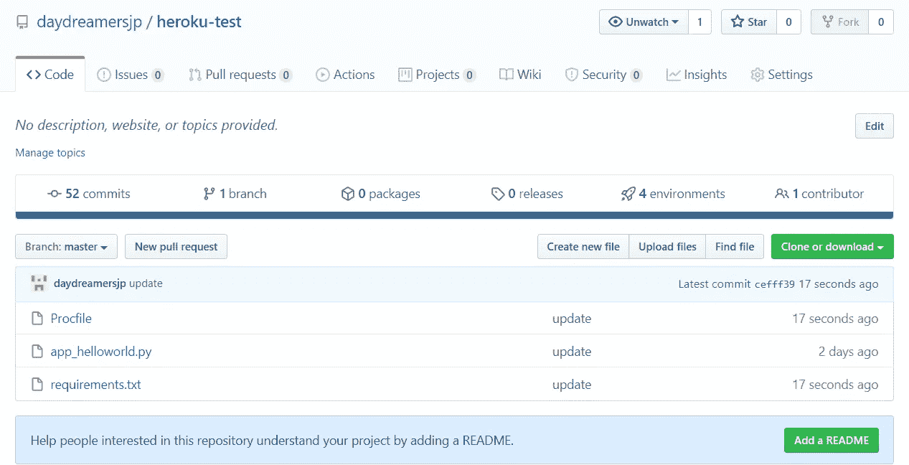****

## ****4.4.****

****现在我们将配置 heroku 环境。****

****首先创建 heroku 账号。我将跳过如何到这里。****

****接下来，点击“创建新应用程序”按钮。****

****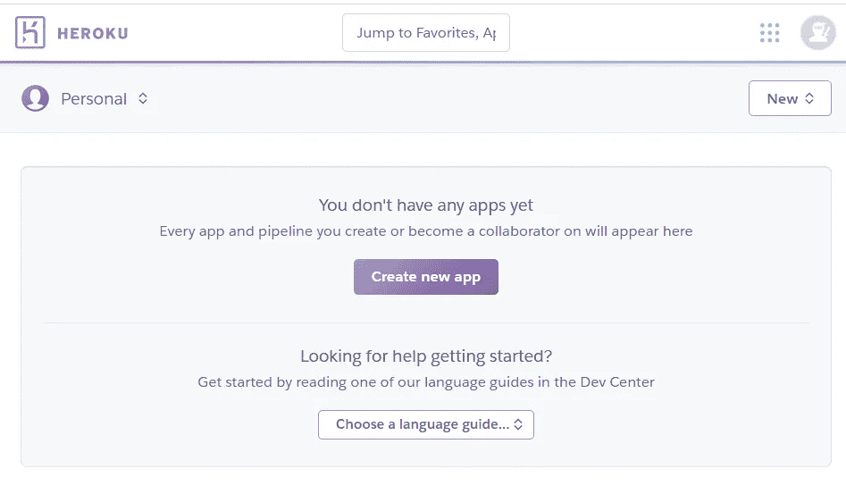****

****决定你的应用程序名称，无论你喜欢什么，但它必须是全球唯一的。然后点击“创建应用”并继续。****

****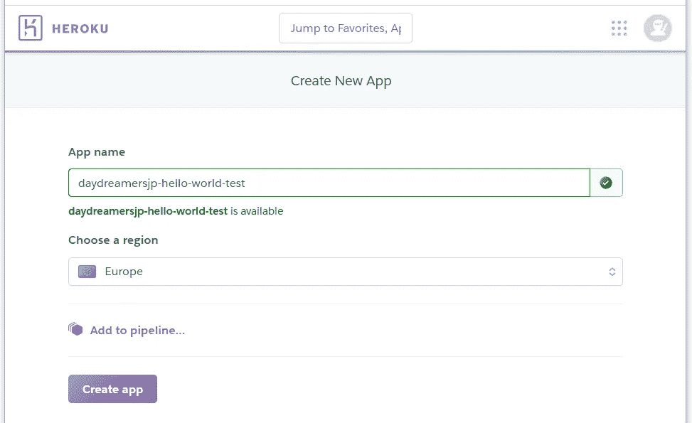****

****选择 Deployment method=GitHub，用你的 app 连接到你的 GitHub 库。****

****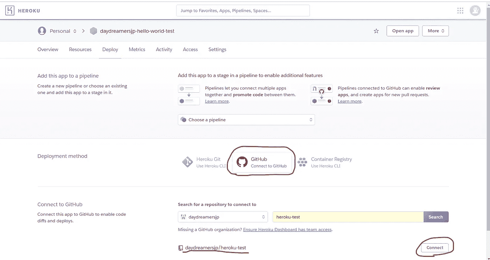****

****查看您的应用程序是否成功连接到 GitHub 存储库。接下来单击“启用自动部署”，然后单击“部署分支”。****

****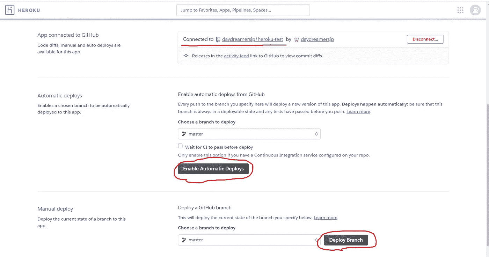****

****当 heroku 尝试部署时，您会看到一些日志消息。你可以找到烧瓶和 gunicorn 是否安装在 heroku 容器中。****

****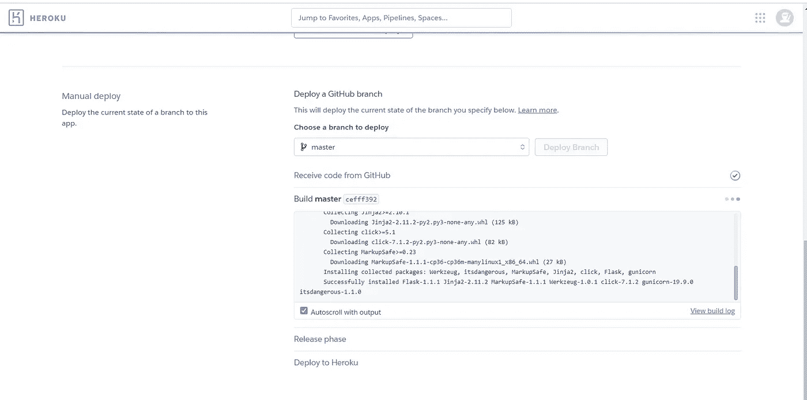****

## ****4.5.****

****当部署成功时，您将看到一个按钮“查看”。当你点击它，一个网页将开始，你可以发现该网页是在唯一的网址。****

****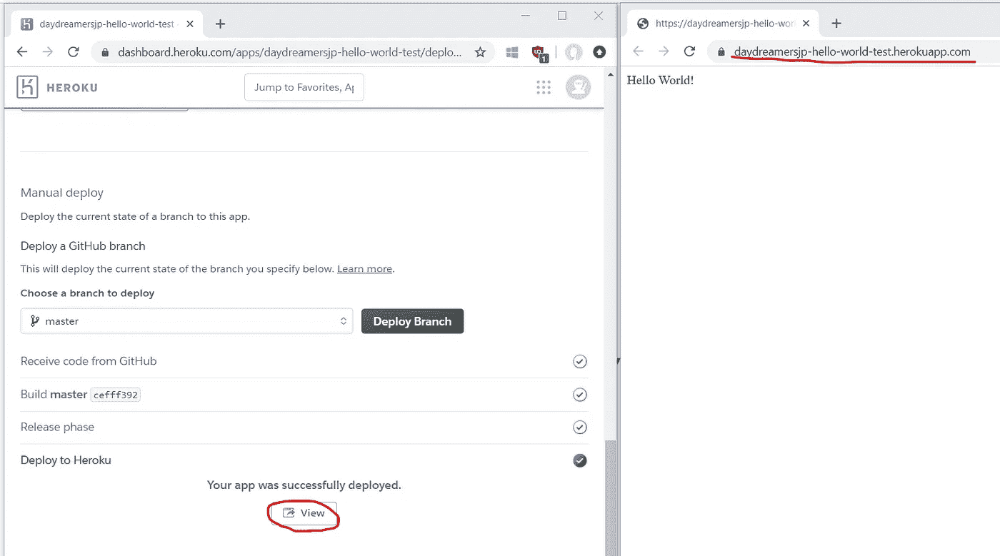****

****此 URL 已经全球可用。我可以在手机上看到。****

****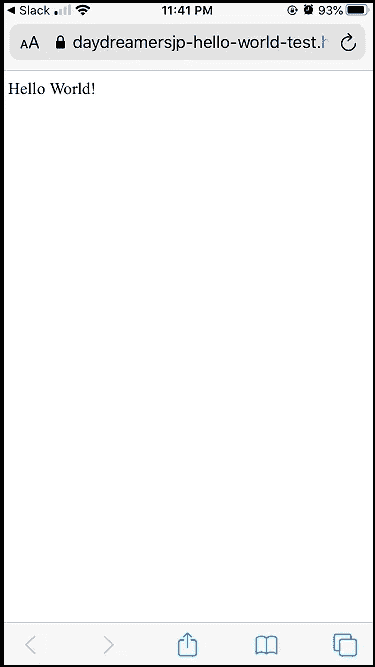****

****而且只要 heroku app 还活着就可以用。****

## ****4.6.****

****或者，你可以检查当你把你的编辑推送到 GitHub 时，应用程序自动更新的程度。****

****让我们制作“你好，世界！”到“你好世界！已更新”在您的 app_helloworld.py 中。****

****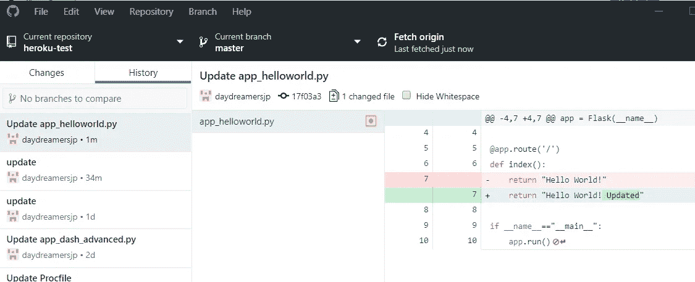****

****一旦你被推送到你的库，heroku 上的自动应用构建就会开始。****

********

****构建完成后，您可以刷新页面并立即看到更新后的部署(或在浏览器上经过 TTL 时间后)。****

****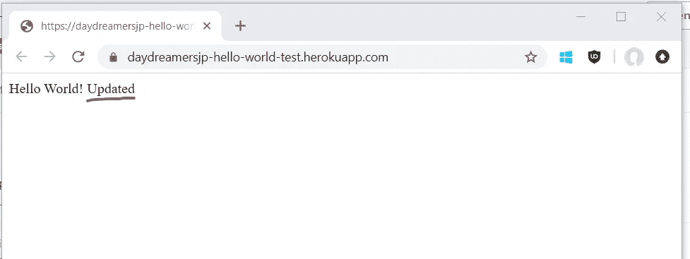****

****为了更新应用程序，我只将新代码推送到 GitHub。现在，你可以认识到这是多么容易！！****

# ****5.应用部署练习 3: heroku + Dash —显示带有动态过滤的 Iris 数据表****

> ****5.1.确保您成功运行了之前的“Hello World！”heroku 上的 app。****
> 
> ****5.2.准备一个新的。使用破折号的 py 文件。****
> 
> ****5.3.编辑配置文件。****
> 
> ****5.4.推到 GitHub，等待 heroku 建造。****
> 
> ****5.5.在浏览器上打开 app，开心就好。****

****这个练习不仅仅是 hello world！我们将在 web 应用程序上显示[著名的“虹膜数据表”](https://archive.ics.uci.edu/ml/datasets/iris)，并允许它根据虹膜类名进行过滤。****

## ****5.1.****

****像往常一样，确保我们都擅长前面的练习。否则，返回并成功运行前面的内容。****

## ****5.2.****

****接下来，准备一个新的。使用破折号的 py 文件。我的例子是一个显示著名的虹膜数据的前 10 行的应用程序，它还允许根据 web 查看者在 web 浏览器上选择的类型来过滤特定的虹膜类型。我的新文件“app_dash_basic.py”在这里:****

****带破折号的代码在新生眼里看起来很复杂，但是逐行查看，就不一定了。特别是，当你有一些关于 html 的知识时，你会发现它使用了很多 HTML 元素。****

## ****5.3.****

****配置文件需要一些编辑。****

****就因为我的代码用了破折号和熊猫，requirements.txt 如下:****

```
**Flask==1.1.1
gunicorn==19.9.0
dash==1.12.0
pandas==0.25.1**
```

****Procfile 为:****

```
**web: gunicorn app_dash_basic:server**
```

****注意它使用的是`:server`而不是`:app`。****

****不要忘记下载 iris.csv 文件并将其放在本地存储库中。****

## ****5.4.****

****接下来和以前一样，把他们推到 GitHub，等待 heroku 的部署。****

****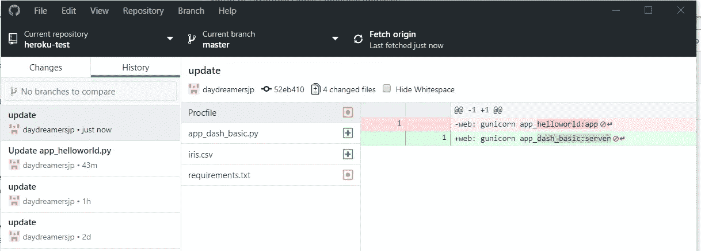********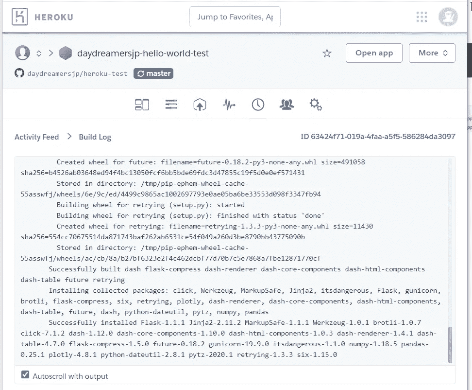****

## ****5.5.****

****瞧啊。我们现在得到了我们想要的！该应用程序显示 iris.csv 中的前十条记录，还允许动态更改过滤器。****

********

****我们可以用相同的网址在你的手机上播放完全相同的歌曲。****

# ****6.应用部署练习 4: heroku + Dash —专业示例****

> ****6.1.在远程存储库上克隆目标存储库。****
> 
> ****6.2.进行相同的部署练习。****
> 
> ****6.3.享受 pro 应用程序！****

****上一节中的 Iris 示例有些廉价，没有展示 Dash 的全部功能。****

****在这一部分，让我们来看一看你可以在官方 [Dash 应用程序库](https://dash-gallery.plotly.host/Portal/)中找到的一个专业示例。****

****我选择了[药物发现](https://dash-gallery.plotly.host/dash-drug-discovery/)的例子。****

## ****6.1.****

****只需找到包含您的目标代码的存储库，将其克隆到您的远程存储库中。只要你只是使用现有的代码，这是一个显而易见的。****

****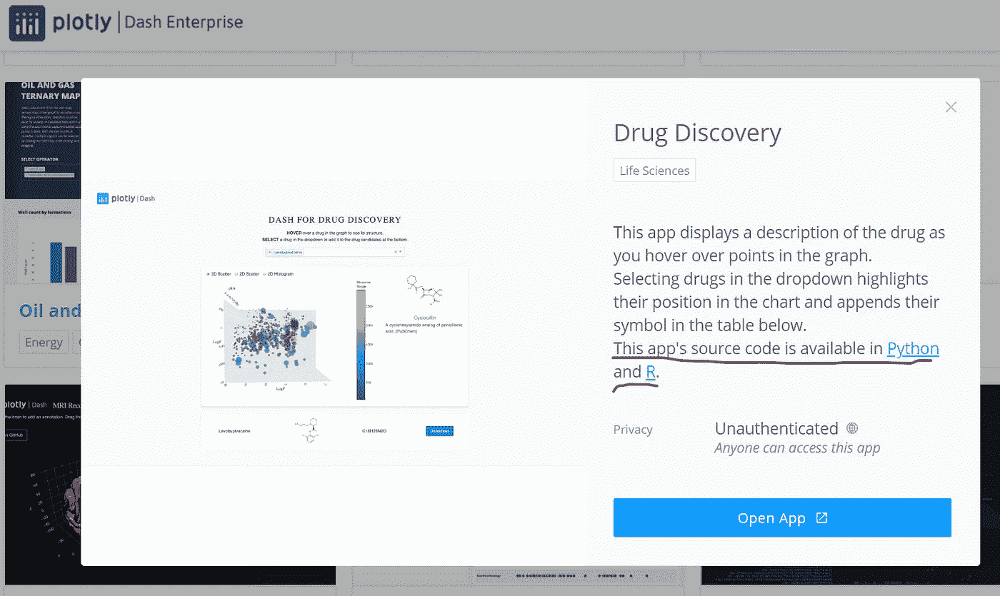********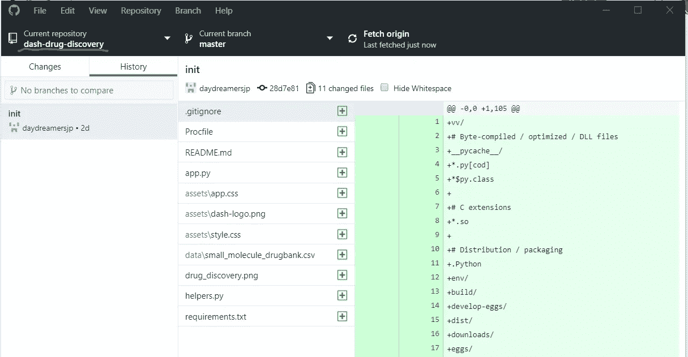****

## ****6.2.****

****这取决于你在 heroku 中使用的最大应用数量的支付选项，但最有可能的是你删除旧的应用并创建一个新的应用，因为一次只能有一个应用处于活动状态。****

****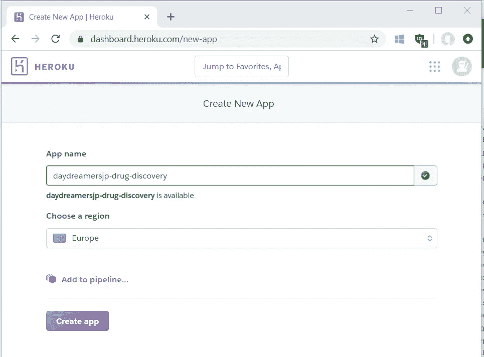****

****接下来，你只需做同样的练习:将 app 连接到你刚刚克隆的 GitHub 库，按下两个按钮，然后等待。****

## ****6.3.****

****给你！****

****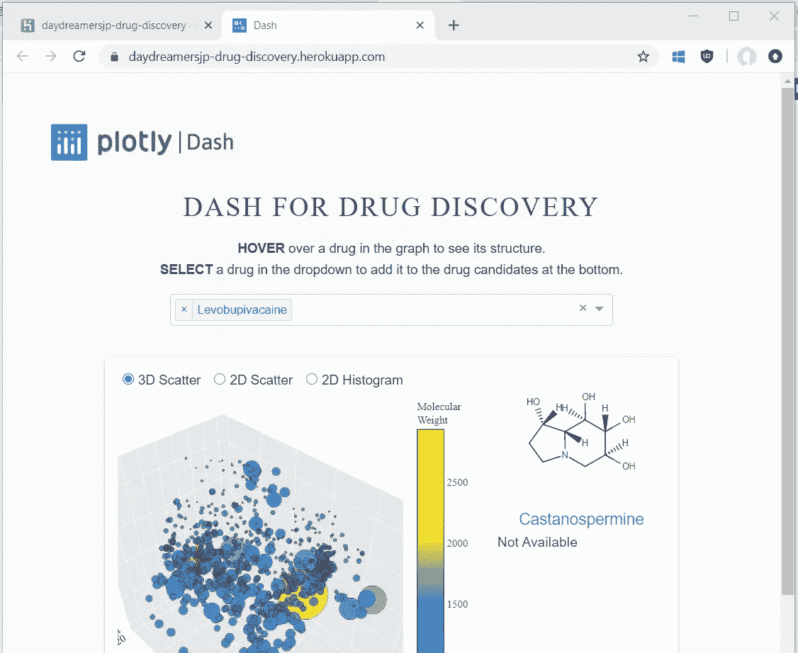****

****当然，你也可以在手机上享受同样的乐趣。****

****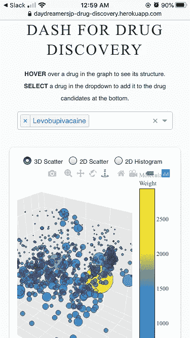****

# ****7.结尾注释****

****当您想在 PoC 阶段制作一个演示 web 应用程序时，您可能希望它可以通过互联网 URL 获得，但是准备服务器或云实例太多了。“Heroku”是一个强大的选择，可以最大限度地减少这种型号开发的额外成本和负担。****

****一旦你把你的模型推送到 GitHub，Heroku 会自动检测其中的更新，并更新部署。同样，从金钱的角度来看，小规模部署在 Heroku 是完全免费的。****

****通过减少部署阶段的成本和工作，您可以将更多精力放在模型/应用程序开发上。****