# 伦敦国际学生的邻里搜索

> 原文：<https://towardsdatascience.com/neighborhood-search-for-international-students-in-london-c5bca67a1e38?source=collection_archive---------51----------------------->

## 使用 K-Means 聚类算法的数据科学项目

[布鲁内尔大学](https://www.flickr.com/photos/bruneluniversity/)，威盛， [flickr](https://www.flickr.com/photos/bruneluniversity/3720191474) (CC BY-NC-ND 2.0)

凭借其世界公认的大学、多元文化的环境和高技能的学术人员，英国在国际学生中的受欢迎程度持续上升。根据高等教育统计局 2018/2019 年的统计数据，485，645 名国际学生在英国攻读学位，其中 125，035 人在首都伦敦学习。

搬到伦敦继续他们的学业，这些国际学生有关于住宿的疑问-一个重要的是“我应该考虑哪个社区的住宿？”在英国找到合适的住房并不容易。尤其是在最受欢迎的大学所在的城市，这使得学生住宿有些繁琐，而且费用昂贵。学生们更喜欢住在离他们的大学近的地方，住在公共交通方便的地方。当我来到伦敦帝国理工学院商学院攻读硕士学位时，我也有同样的问题:哪些街区离大学很近？邻里关系好吗？

在这个项目中，我将通过探索特定大学附近的社区来解决这个问题。该解决方案是为前往伦敦求学的国际学生设计的。该代码可在 [GitHub](https://github.com/SomalikaSaha/Coursera_Capstone/blob/master/Neighborhood%20Search%20for%20International%20students%20in%20London-Capstone%20Project.ipynb) 中获得。

这个项目是从技术背景过渡到数据科学领域的踏脚石，它利用了通过 IBM 数据科学认证课程获得的知识。

# 数据要求

对于这个项目，我将使用以下数据:

*   **伦敦大学/机构的地理位置数据:** [英国学习提供商](http://learning-provider.data.ac.uk/)提供英国所有大学的数据及其地理位置。从这里，我将只提取伦敦大学的这个项目。

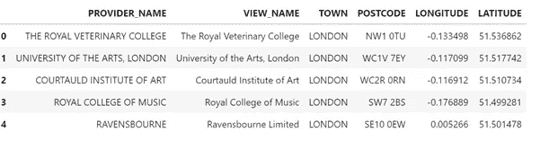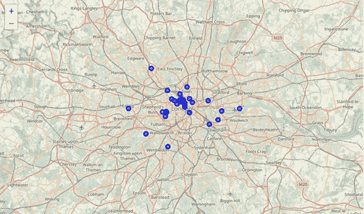

显示伦敦学院分布的伦敦地图

*   **伦敦邮政编码:**所有伦敦邮政编码及其区和地理数据的列表可在 Doogal.co.uk[获得](https://www.doogal.co.uk/london_postcodes.php)我需要获得邮政编码的前缀，并将它们分组。

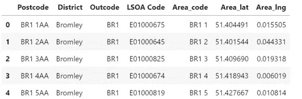

*   **公共交通无障碍水平数据:**伦敦交通局(TFL-伦敦交通局)开发了一种工具，用于评估伦敦各地公共交通的无障碍水平。公共交通可达性水平(PTAL)评估了到交通站点和车站的步行距离水平，包括测量交通服务水平和更广泛的连通性。这个地区的数据可以在伦敦数据库中找到。每个区域的得分在 0 到 6b 之间，0 分表示公共交通非常差，6b 表示公共交通非常好。

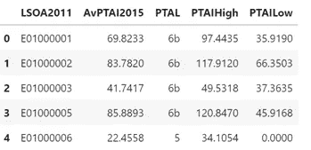

将 PTAL 分数添加到邮政编码数据集中:

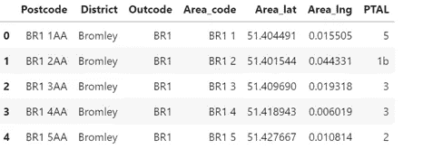

*   **距离研究所 5 公里以内的街区:** [Postcodes.io](https://postcodes.io/) 提供免费 API，调用该 API 时，会生成一个 JSON，其中包含给定邮政编码 5 公里以内的 outcodes(邮政编码区)数据。我将使用 API 来获取邻域的输出代码。

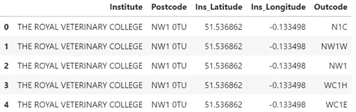

我已经从我们之前的数据集中选择了第一个学院“**皇家兽医学院**”，以探索其附近更多的场馆。这所大学方圆 5 公里有 38 个不同的区号。将邮政编码数据添加到机构数据中:

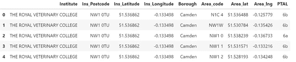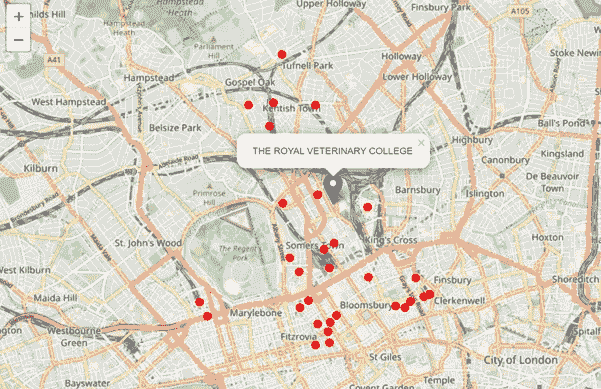

皇家兽医学院周围的 38 个街区

*   **附近的场馆:**这个数据是使用 **Foursquare API** 获得的。利用一个地区的地理位置，我们探索每个社区的顶级场馆。确定了学院周边 38 个区号的 2344 个场馆。对应区域代码的 PTAL 分数得出以下数据集:

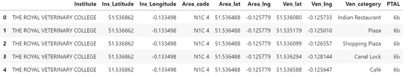

# **方法论**

**场馆类别和 PTAL 的一键编码:**使用一键编码技术为分类变量-场馆类别和 PTAL 分配数值；

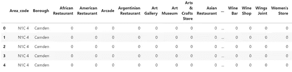

然后**将编码后的数据集按“区号”分组**，得到 38 个区号中每一个的场馆类别和 PTAL 的含义；

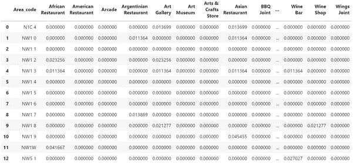

获取每个区域代码中排名前 10 的场馆，这将有助于学生了解该区域代码中排名靠前的场馆类别。

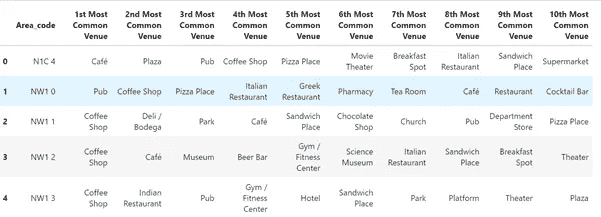

# **K-均值聚类**

我想根据场地类别和 PTAL 将我们的区号分组，因此我们使用 K-means 建模技术来得到我们的聚类。

**寻找用于训练数据的最佳 k 值:**我正在使用肘方法来获得最佳值。下面的第一个图告诉我们，肘点是 3(左)，然而，为了证实它，我们创建了另一个图，直到值 6(右)。

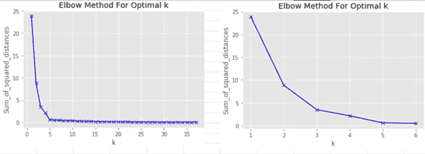

使用 k-means =3，将模型拟合到以下数据:

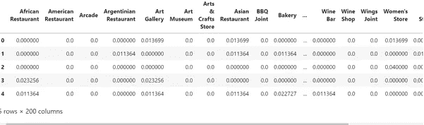

# 结果

皇家兽医学院周围的 38 个区号分为三组，如下图所示:

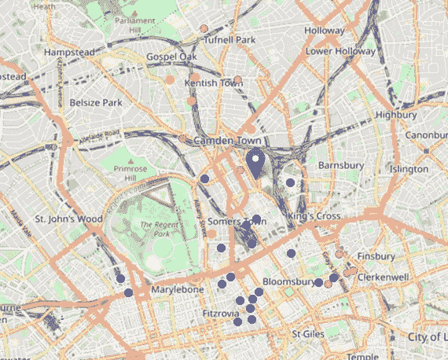

*   蓝色-最高连接性(6b)
*   洋红色-良好的连接性(6a)
*   橙色-中等连通性(其他)

**第一聚类**具有最高 PTAL 分数(6b)的邻居

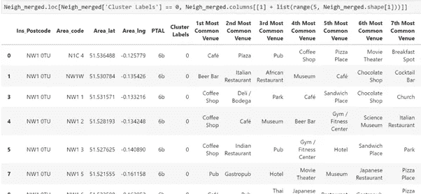

第二个聚类具有良好的连通性得分(6a)

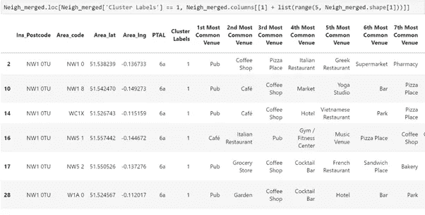

**最终集群**具有中等连通性(3，4，5)

聚类技术主要根据 PTAL 评分将社区分为 3 类，该评分评估了到交通站和车站的步行距离水平，包括测量交通服务水平和更广泛的连通性。

基于邻域的连通性对其进行聚类，聚类 0 和 1 比聚类 2 具有最高(6b)和良好(6a)的连通性，聚类 2 具有中等连通性。

一个代表皇家兽医学院周围的邻域分布的条形图清楚地显示了大多数邻域具有最佳的网络连通性，并且将是最可取的位置。

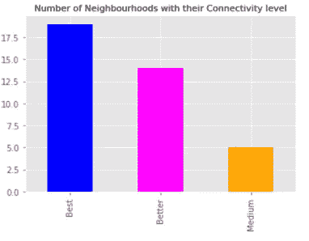

进一步看附近列出的场馆；我们看到大部分街区在饮食点方面分布得很好。基于这些分组，学生可以选择他们喜欢的社区。一个健身爱好者的学生，想住在一个连通性更广的街区，可以在 0 群的 neighborhoods -NW1 3，W1T 7 搜索住宿。

# 结论

虽然这个项目是为了帮助皇家兽医学院的学生/学生，但也可以扩展到其他学院。该方法不限于机构，也可用于任何探索某个位置(如办公室附近)附近社区的人获得相同的结果。

通过考虑更多因素以获得更精细的输出，可以进一步完善该项目，例如取决于房屋类型的平均租金、每个街区的犯罪率、与大学的平均距离。将这些因素考虑在内将有助于学生确定准确的邻域。大多数学生更喜欢住在离学校近、连通性好、安全的社区。