# 使用 Foursquare API 进行邻域分割和聚类

> 原文：<https://towardsdatascience.com/neighbourhood-segmentation-and-clustering-using-foursquare-api-c43c113e89fb?source=collection_archive---------23----------------------->

## 在印度海得拉巴建立购物中心

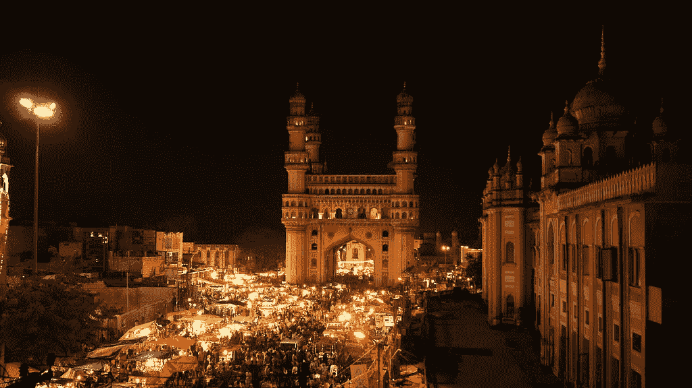

> 谁说金钱买不到幸福，谁就不知道去哪里购物。

# 介绍

对于许多购物者来说，在周末和假期逛商场是放松和享受的好方法。房地产开发商也在利用这一趋势建造更多的购物中心来迎合需求。因此，海得拉巴市有许多购物中心，还有更多正在建设中。开设购物中心可以让房地产开发商获得稳定的租金收入。与任何商业决策一样，开一家新的购物中心需要认真考虑，而且比看起来复杂得多。特别是，购物中心的选址是决定购物中心成败的最重要的决策之一。

# 商业问题

这个项目的目标是分析和选择在印度海得拉巴市开设新购物中心的最佳地点。该项目主要关注海得拉巴市的地理空间分析，以了解哪个地方是开设新商场的最佳地点。该项目使用数据科学方法和聚类等机器学习技术，旨在提供解决方案来回答这个商业问题:在海德拉巴市，如果一家房地产开发商打算开设一家新的购物中心，你会建议他们在哪里开设？

# 数据

为了解决这个问题，我们需要以下数据:
·海得拉巴的街区列表。这确定了本项目的范围，该范围限于泰伦加纳的首都海德拉巴市，该市位于印度南部
这些街区的经纬度坐标。这是绘制地图和获取场馆数据
所必需的，场馆数据，尤其是与购物中心相关的数据。我们将使用这些数据对邻近区域进行聚类。

# 数据来源和提取数据的方法

这个 [**维基百科页面**](https://en.wikipedia.org/wiki/Category:Neighbourhoods_in_Hyderabad,_India) 是海得拉巴的街区列表，有 200 个街区。在 Python 请求和 beautifulsoup 包的帮助下，我使用 web 抓取技术从维基百科页面中提取数据。然后，我们可以使用 Python 地理编码器包来获取街区的经纬度坐标。之后，我使用 Foursquare API 来获取这些街区的场地数据。

Foursquare API 将提供许多类别的场馆数据，为了帮助我们解决业务问题，我们对购物中心类别特别感兴趣。这是一个将利用许多数据科学技能的项目，从网络抓取(维基百科)，使用 API (Foursquare)，数据清洗，数据争论，到机器学习(K-means 聚类)和地图可视化(foylus)。

# 方法学

Foursquare API 允许应用程序开发人员与 Foursquare 平台进行交互。API 本身是一个 RESTful 地址集，您可以向其发送请求，所以实际上没有什么需要下载到您的服务器上。

**搜索海得拉巴的咖啡馆**

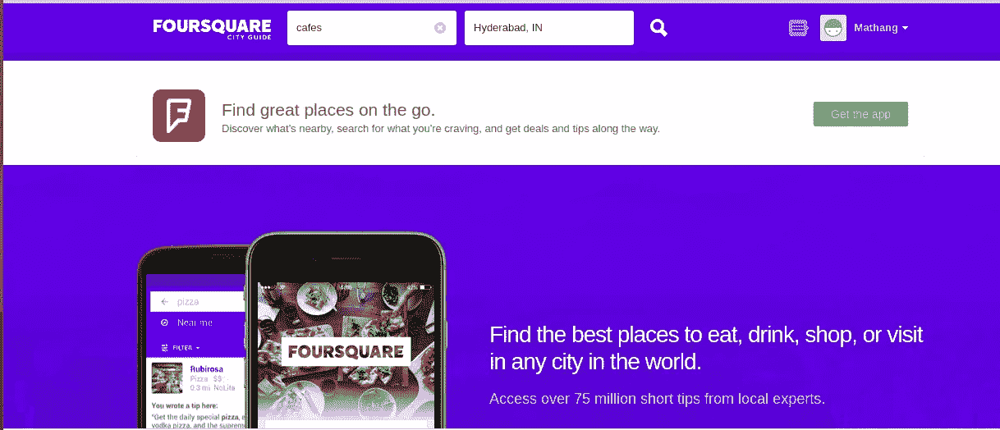

**四方返回的咖啡馆**

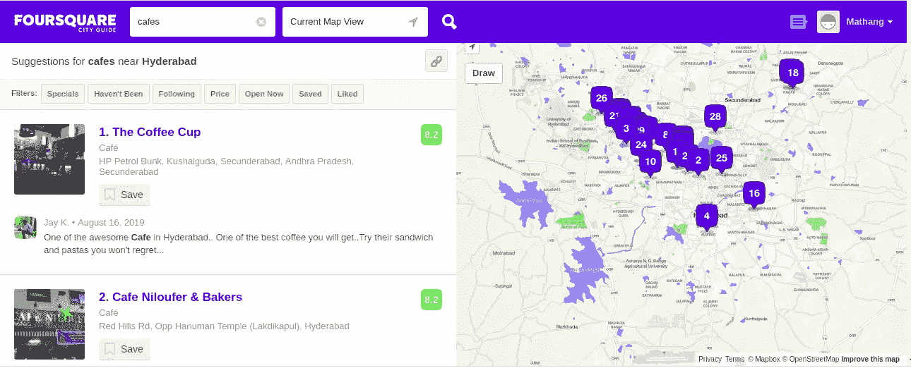

在左边，你可以看到所有的咖啡馆和它们的名字，类别，海得拉巴每个地点的地址。在右边，你可以看到左边的场馆地图。

**探索咖啡馆**

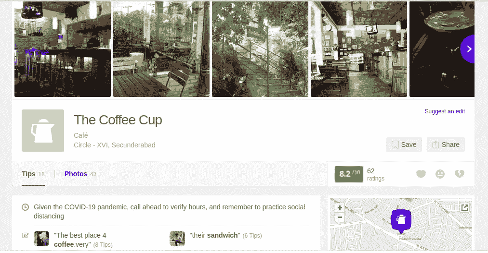

如果你点击第一个是咖啡杯，那么你会被重定向到这个页面，在这里你会看到 Foursquare 数据集中关于咖啡杯的所有信息。这包括它的名字，完整的地址，工作时间，提示和用户发布的关于咖啡馆的图片。同样，你也可以探索海得拉巴市的购物中心。

要探索 Foursquare，点击 [**此处**](https://foursquare.com/download)

**网页抓取**

使用 Python 请求和 beautifulsoup 包执行抓取，以提取邻居数据列表。

```
# Send the GET requestdata = requests.get("[https://en.wikipedia.org/wiki/Category:Neighbourhoods_in_Hyderabad,_India](https://en.wikipedia.org/wiki/Category:Neighbourhoods_in_Hyderabad,_India)").text# Parse data from the html into a beautifulsoup objectsoup = BeautifulSoup(data, 'html.parser')# Create a list to store neighbourhood dataneighborhoodList = []# Append the data into the listfor row in soup.find_all("div", class_="mw-category")[0].findAll("li"):
  neighborhoodList.append(row.text)# Create a new DataFrame from the listkl_df = pd.DataFrame({"Neighborhood": neighborhoodList})
kl_df.head()
```

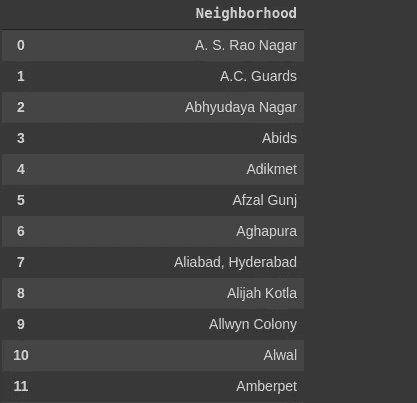

这是抓取数据后创建的数据框。为了能够使用 Foursquare API，我们需要获得经纬度形式的地理坐标。为此，我们将使用 Geocoder 包，它允许我们将地址转换为经度和纬度形式的地理坐标。

```
# Defining a function to get coordinatesdef get_latlng(neighborhood):
    # initialize your variable to None
    lat_lng_coords = None
    # loop until you get the coordinates
    while(lat_lng_coords is None):
        g = geocoder.arcgis('{}, Hyderabad, India'.format(neighborhood))
        lat_lng_coords = g.latlng
    return lat_lng_coords# Call the function to get the coordinates, store in a new list using list comprehensioncoords = [ get_latlng(neighborhood) for neighborhood in kl_df["Neighborhood"].tolist()]
```

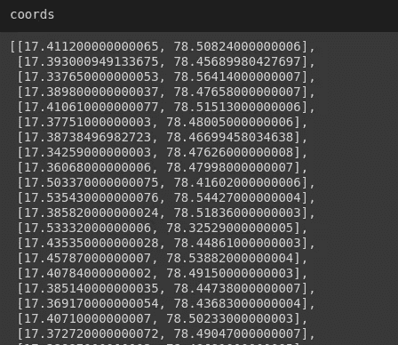

我们已经获得了所有地点的经纬度坐标，因此需要将坐标合并到原始数据框中。

```
# Create temporary dataframe to populate the coordinates into Latitude and Longitudedf_coords = pd.DataFrame(coords, columns=['Latitude', 'Longitude'])# Merge the coordinates into the original dataframekl_df['Latitude'] = df_coords['Latitude']
kl_df['Longitude'] = df_coords['Longitude']print(kl_df.shape)
kl_df(200,3)
```

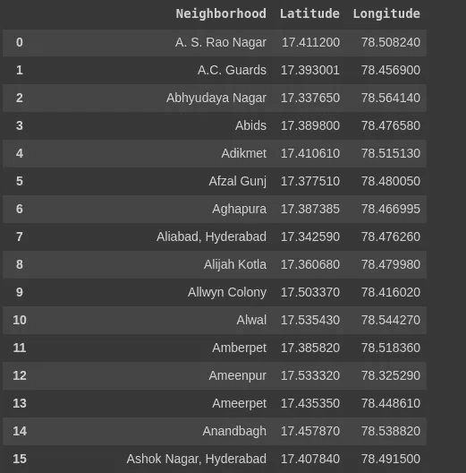

这是包含所有街区和地理坐标的组合数据框。

```
# Getting the coordinates of Hyderabadaddress = 'Hyderabad, India'
geolocator = Nominatim(user_agent="my-application")
location = geolocator.geocode(address)
latitude = location.latitude
longitude = location.longitude
print('The geograpical coordinate of Hyderabad, India {}, {}.'.format(latitude, longitude))
```

收集数据后，我们必须将数据填充到 pandas 数据框架中，然后使用 follow 包在地图上可视化邻近区域。

```
map_kl = folium.Map(location=[latitude, longitude], zoom_start=11)# Adding markers to mapfor lat, lng, neighborhood in zip(kl_df['Latitude'],  kl_df['Longitude'], kl_df['Neighborhood']):
 label = '{}'.format(neighborhood)
 label = folium.Popup(label, parse_html=True)
 folium.CircleMarker([lat, lng],radius=5,popup=label,color='blue',fill=True,fill_color='#3186cc',fill_opacity=0.7).add_to(map_kl)
map_kl
```

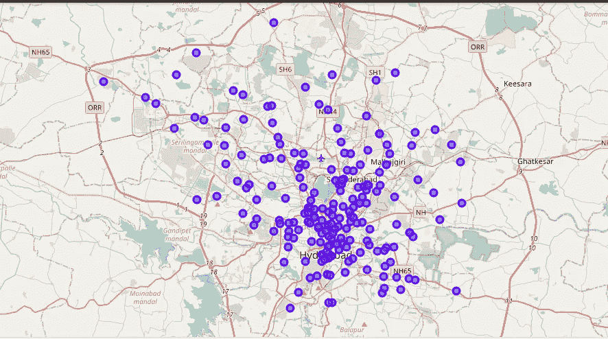

包含所有街区的海德拉巴地图

**使用 foursquare API 探索社区**

```
CLIENT_ID = '' # your Foursquare ID
CLIENT_SECRET = '' # your Foursquare Secret
VERSION = '20180604'radius = 2000
LIMIT = 100
venues = []
for lat, long, neighborhood in zip(kl_df['Latitude'], kl_df['Longitude'], kl_df['Neighborhood']):# Create the API request URLurl = "https://api.foursquare.com/v2/venues/explore?client_id={}&client_secret={}&v={}&ll={},{}&radius={}&limit={}".format(CLIENT_ID,CLIENT_SECRET,VERSION,lat,long,radius,LIMIT)# Make the GET requestresults = requests.get(url).json()["response"]['groups'][0]['items']# Return only relevant information for each nearby venuefor venue in results:
    venues.append((neighborhood,lat,long,venue['venue']['name'],
    venue['venue']['location']['lat'],venue['venue']['location']    ['lng'],venue['venue']['categories'][0]['name']))
```

在提取了所有的场馆之后，我们必须将场馆列表转换成一个新的数据帧。

要了解更多关于 Foursquare 文档，请点击 [**此处**](https://developer.foursquare.com/docs/)

```
venues_df = pd.DataFrame(venues)
# Defining the column namesvenues_df.columns = ['Neighborhood', 'Latitude', 'Longitude', 'VenueName', 'VenueLatitude', 'VenueLongitude', 'VenueCategory']
print(venues_df.shape)
venues_df.head()
```

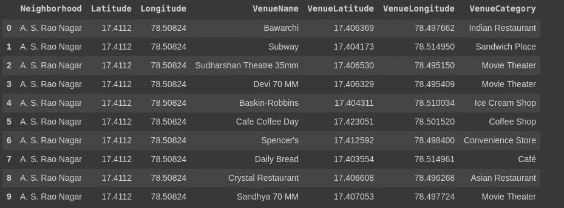

```
# Lets check how many venues were returned for each neighbourhoodvenues_df.groupby(["Neighborhood"]).count()# Lets check out how many unique categories can be curated from all the returned valuesprint('There are {} unique categories.'.format(len(venues_df['VenueCategory'].unique())))There are 174 unique categories# Displaying the first 50 Venue Category namesvenues_df['VenueCategory'].unique()[:50]
```

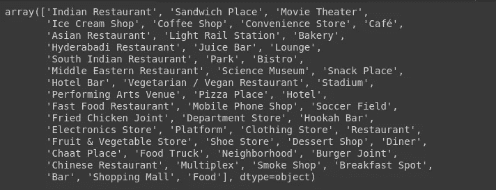

**分析每个邻域**

在这里，我们将一个热编码应用于所有的场馆。所以现在列数变成了 175

```
# One hot encodingkl_onehot = pd.get_dummies(venues_df[['VenueCategory']], prefix="", prefix_sep="")# Adding neighborhood column back to dataframekl_onehot['Neighborhoods'] = venues_df['Neighborhood']# Moving neighbourhood column to the first columnfixed_columns = [kl_onehot.columns[-1]] + list(kl_onehot.columns[:-1])
kl_onehot = kl_onehot[fixed_columns]print(kl_onehot.shape)(6684, 175)
```

接下来，让我们通过对每个类别的出现频率求和来对邻域行进行分组。

```
kl_grouped=kl_onehot.groupby(["Neighborhoods"]).sum().reset_index()
print(kl_grouped.shape)
kl_grouped(198, 175)
```

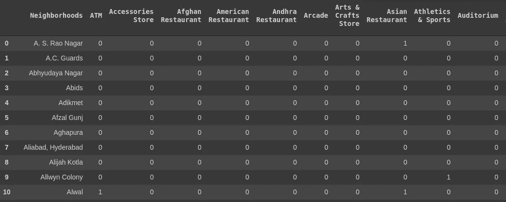

```
len((kl_grouped[kl_grouped["Shopping Mall"] > 0]))
```

海得拉巴有 66 个购物中心，非常高。所以现在我们必须选择一个购物中心较少的合适地点，这样我们在那个地点建立购物中心的机会应该很大。

```
# Creating a dataframe for Shopping Mall data only
kl_mall = kl_grouped[["Neighborhoods","Shopping Mall"]]
```

**聚集邻居**

现在，我们需要将所有的邻居分成不同的组。结果将使我们能够确定哪些街区的购物中心更集中，而哪些街区的购物中心数量较少。根据购物中心在不同街区的出现情况，这将有助于我们回答这样一个问题:哪些街区最适合开设新的购物中心。

```
# Setting the number of clusters
kclusters = 3
kl_clustering = kl_mall.drop(["Neighborhoods"], 1)# Run k-means clustering algorithm
kmeans = KMeans(n_clusters=kclusters,random_state=0).fit(kl_clustering)# Checking cluster labels generated for each row in the dataframe
kmeans.labels_[0:10]array([0, 0, 0, 1, 0, 1, 1, 0, 0, 0], dtype=int32)
```

我们将聚类数设置为 3，并运行该算法。在应用 K-Means 聚类算法之后，所有的邻域被分离并形成不同的聚类。

```
# Creating a new dataframe that includes the cluster as well as the top 10 venues for each neighborhood.kl_merged = kl_mall.copy()# Add the clustering labelskl_merged["Cluster Labels"] = kmeans.labels_
kl_merged.rename(columns={"Neighborhoods": "Neighborhood"}, inplace=True)
kl_merged.head(10)
```

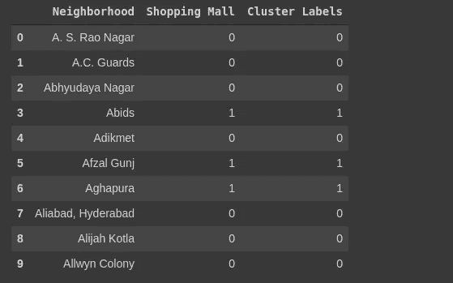

这里，购物中心列表示特定区域中购物中心的数量，分类标签表示分类编号(0 或 1 或 2)

```
 # Adding latitude and longitude values to the existing dataframekl_merged['Latitude'] = kl_df['Latitude']
kl_merged['Longitude'] = kl_df['Longitude']# Sorting the results by Cluster Labelskl_merged.sort_values(["Cluster Labels"], inplace=True)
kl_merged
```

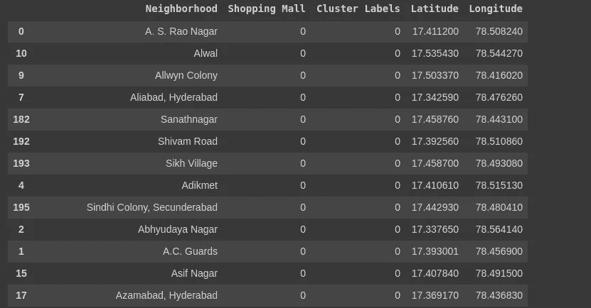

现在，我们可以清楚地看到属于第一个群集(群集编号 0)的所有位置。类似地，我们看到所有的分类编号都是按照 0，1，2 的顺序排列的。

**可视化产生的集群**

```
# Creating the mapmap_clusters = folium.Map(location=[latitude, longitude], zoom_start=11)# Setting color scheme for the clustersx = np.arange(kclusters)
ys = [i+x+(i*x)**2 for i in range(kclusters)]
colors_array = cm.rainbow(np.linspace(0, 1, len(ys)))
rainbow = [colors.rgb2hex(i) for i in colors_array]# Add markers to the mapmarkers_colors = []for lat, lon, poi, cluster in zip(kl_merged['Latitude'], kl_merged['Longitude'], kl_merged['Neighborhood'], kl_merged['Cluster Labels']):label = folium.Popup(str(poi) + ' - Cluster ' + str(cluster), parse_html=True)
  folium.CircleMarker([lat,lon],radius=5,popup=label,color=rainbow[cluster-1],fill=True,fill_color=rainbow[cluster-1],fill_opacity=0.7).add_to(map_clusters)map_clusters
```

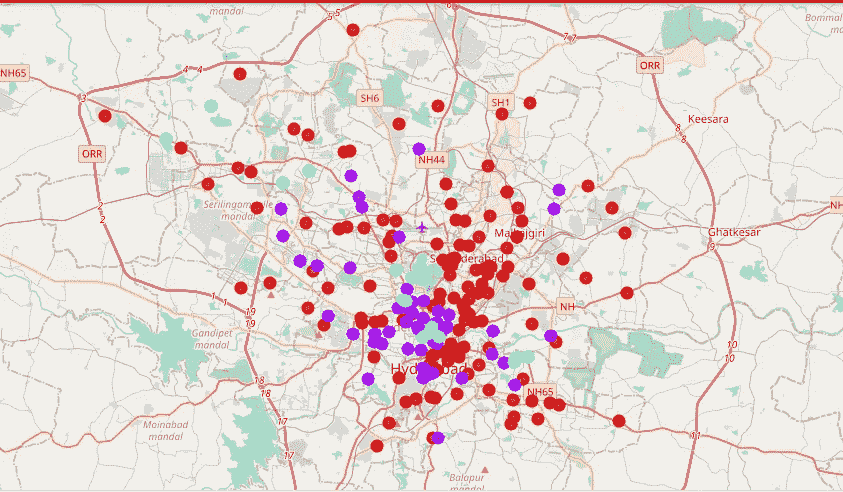

**检查星团**

```
len(kl_merged.loc[kl_merged['Cluster Labels'] == 0])
len(kl_merged.loc[kl_merged['Cluster Labels'] == 1])
len(kl_merged.loc[kl_merged['Cluster Labels'] == 2])
```

# **结果**

在 3 个聚类中最高的聚类 0 中有 132 个地点，并且聚类 0 包含没有购物中心的所有地点。聚类 1 包含 51 个地点，并且它们都恰好包含 1 个购物中心，而聚类 2 包含 15 个地点，其中所有地点都包含 2 个或更多个购物中心。

K-means 聚类的结果表明，我们可以根据“购物中心”的出现频率将街区分为 3 个聚类:
聚类 0:购物中心数量非常少的街区
聚类 1:购物中心中度集中的街区
聚类 2:购物中心高度集中的街区
我们在地图中可视化聚类结果，聚类 0 为红色，聚类 1 为紫色，聚类 2 为薄荷绿。

# **结论**

许多购物中心都集中在海得拉巴市的中心区域。集群 0 的商场数量非常少。这代表着开设新购物中心的巨大机会和高潜力领域，因为现有购物中心几乎没有竞争。同时，由于供过于求和购物中心高度集中，集群 2 中的购物中心可能会面临激烈的竞争。因此，该项目建议房地产开发商利用这些发现，在集群 0 的社区开设新的购物中心，几乎没有竞争。拥有独特销售主张以从竞争中脱颖而出的房地产开发商，也可以在竞争适度的第 1 类社区开设新的购物中心。最后，建议房地产开发商避开第二组中已经有大量购物中心和激烈竞争的街区。

因此，我们可以对大型数据集应用相同的方法，并可以根据类别轻松区分场馆。假设在一个城市里有 400 家餐馆，那么我们可以很容易地把它们分成不同的群。我们不仅可以将这种方法应用于购物中心，还可以应用于餐馆、咖啡店等等。在本项目中，我们只考虑一个因素，即购物中心出现的频率，还有其他因素，如人口和居民收入，可能会影响新购物中心的选址决策。

但是对于建立一个购物中心，我们需要考虑其他因素，如租金成本、购物中心周围的环境、当地的人们——如果这是一个许多人喜欢外出的豪华区域，他们的生活方式将与其他人不同，因此会花费很多。如果我们决定一个竞争较少的地方，那么我们也需要考虑住在那个地方的人们。如果那个地区的人们花费很多并且喜欢外出，那么这将是一个成功。如果住在购物中心附近的人不喜欢外出，那么最好考虑一些竞争较少、人群较好的其他地方。

整个项目可以随时参考我的 [**GitHub 库**](https://github.com/mathangpeddi/Neighbourhood-Segmentation-Using-Foursquare/tree/master/Week5) 。

> “我们曾经建造文明。现在我们建商场。”比利·布莱森

在 [**LinkedIn**](https://www.linkedin.com/in/mathang-peddi-23763317b/) 上与我联系

我希望你觉得这篇文章很有见地。我很乐意听到反馈，以便即兴创作，并带来更好的内容。

非常感谢您的阅读！