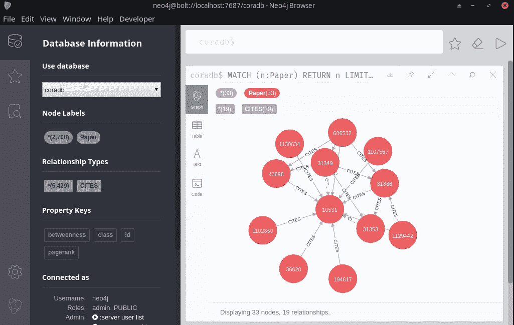
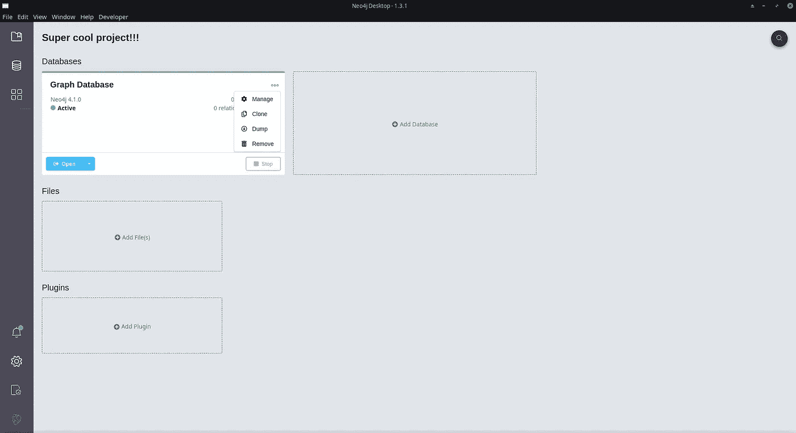
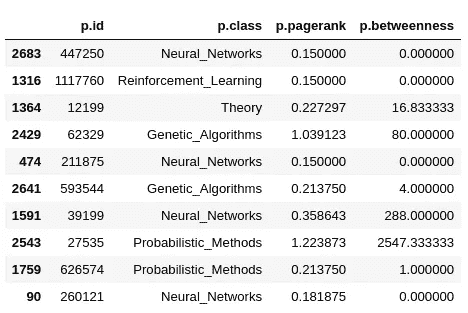

# 如何从 Python 查询 Neo4j

> 原文：<https://towardsdatascience.com/neo4j-cypher-python-7a919a372be7?source=collection_archive---------3----------------------->

## 在 Python 中使用 Neo4j:Neo4j Python 驱动程序和 Cypher 查询语言的快速入门。

[**Neo4j**](https://neo4j.com/) 是一个[图形数据库](https://en.wikipedia.org/wiki/Graph_database)管理系统。



图片作者。Neo4j 浏览器窗口。

根据其网站:

> Neo4j 是一个本地图形数据库，从头开始构建，不仅利用数据，还利用数据关系。 Neo4j *连接存储的*数据，以前所未有的速度实现前所未有的查询。

在本文中，我们将提供一个关于使用 Python 中的 Neo4j 的简短教程。

## 安装 Neo4j Desktop 并配置数据库

如果已经安装并配置了图形 DBMS 的实例，则可以跳过本节。为了安装 Neo4j 桌面，请遵循[官网](https://neo4j.com/download/)上的分步指南。:)正确安装后，您应该会有一个如下图所示的浏览器窗口。


图片作者。Neo4j 浏览器。

您可能已经创建了一些预定义的示例项目。在本教程中，我们将创建并使用一个全新的项目。只需点击**新建**按钮，并为我们的项目选择一个名称！


图片作者。新项目创建。

最初，项目是空的。我们可以从添加新数据库开始。


图片作者。在 Neo4j 浏览器上的项目中添加数据库。

一旦创建了数据库，启动并打开它。您应该会看到一个如下图所示的窗口，其中有用于从客户端连接到数据库的信息。在我们的例子中，URI 是

```
bolt://localhost:7687
```


图片作者。Neo4j 浏览器在一个数据库上打开。

从左侧的垂直栏中，您可以进入用户管理菜单来创建新用户。


图片作者。在 Neo4j 中创建新用户。

在本例中，我们将创建一个管理员用户。

```
Username: superman
Password: pizza
Role: admin
```

我们可以通过从左侧垂直栏中选择用户列表来检查新用户的创建。


图片作者。Neo4j 中的用户列表。

现在，我们从服务器端准备好了！让我们转向 Python 吧！

## 安装 Neo4j Python 驱动程序

在我们的 Python 环境中安装包 **neo4j** :

```
pip install neo4j
```

这是官方支持的驱动程序，所以我们在本教程中坚持使用它。然而，你可以为未来的项目考虑其他设计良好的[社区驱动因素](https://neo4j.com/developer/python/#community-drivers)。一旦安装了 neo4j 包，可以尝试用 Python 导入。

```
from neo4j import __version__ as neo4j_version
print(neo4j_version)
```

如果一切正常，您应该会收到 neo4j 包的版本(在本例中是 4.0.1)作为输出。

现在，我们准备好查询图形数据库了！

## 用 Python 进行查询

首先，我们需要定义一个连接类来连接图形数据库。

```
from neo4j import GraphDatabaseclass Neo4jConnection:

    def __init__(self, uri, user, pwd):
        self.__uri = uri
        self.__user = user
        self.__pwd = pwd
        self.__driver = None
        try:
            self.__driver = GraphDatabase.driver(self.__uri, auth=(self.__user, self.__pwd))
        except Exception as e:
            print("Failed to create the driver:", e)

    def close(self):
        if self.__driver is not None:
            self.__driver.close()

    def query(self, query, db=None):
        assert self.__driver is not None, "Driver not initialized!"
        session = None
        response = None
        try: 
            session = self.__driver.session(database=db) if db is not None else self.__driver.session() 
            response = list(session.run(query))
        except Exception as e:
            print("Query failed:", e)
        finally: 
            if session is not None:
                session.close()
        return response
```

上面的类在初始化时需要 url、用户名和密码。在查询方法中，查询字符串要用 Neo4j 的图查询语言来写: [**Cypher**](https://neo4j.com/developer/cypher-basics-i/) 。更多详情，请查看[密码参考卡](https://neo4j.com/docs/cypher-refcard/current/)。

让我们用之前定义的参数创建一个连接实例。

```
conn = Neo4jConnection(uri="bolt://localhost:7687", user="superman", pwd="pizza")
```

然后，我们可以进行第一次查询！让我们创建一个名为 **coradb** 的数据库。

```
conn.query("CREATE OR REPLACE DATABASE coradb")
```

我们可以用来自 CORA 数据集[的数据填充我们的数据库。](https://relational.fit.cvut.cz/dataset/CORA)

> Cora 数据集包括 2708 份科学出版物，分为七类。引文网络由 5429 个链接组成。数据集中的每个出版物由 0/1 值的词向量来描述，该词向量指示字典中相应词的存在与否。这部词典由 1433 个独特的单词组成。

让我们从 CSV 文件创建引用图。我们逐行读取包含节点信息的 CSV 文件，并将每个节点添加到带有标签**纸张**和属性 **id** 和**类**(纸张)的图中。

```
query_string = '''
USING PERIODIC COMMIT 500
LOAD CSV WITH HEADERS FROM
'[https://raw.githubusercontent.com/ngshya/datasets/master/cora/cora_content.csv'](https://raw.githubusercontent.com/ngshya/datasets/master/cora/cora_content.csv')
AS line FIELDTERMINATOR ','
CREATE (:Paper {id: line.paper_id, class: line.label})
'''conn.query(query_string, db='coradb')
```

我们对边信息做同样的处理(注意定义边中的“箭头”语法)。

```
query_string = '''
USING PERIODIC COMMIT 500
LOAD CSV WITH HEADERS FROM
'[https://raw.githubusercontent.com/ngshya/datasets/master/cora/cora_cites.csv'](https://raw.githubusercontent.com/ngshya/datasets/master/cora/cora_cites.csv')
AS line FIELDTERMINATOR ','
MATCH (citing_paper:Paper {id: line.citing_paper_id}),(cited_paper:Paper {id: line.cited_paper_id})
CREATE (citing_paper)-[:CITES]->(cited_paper)
'''conn.query(query_string, db='coradb')
```

最后，我们准备在我们的引用网络上进行查询！例如，我们可以问网络中有哪些类别的论文:

```
query_string = '''
MATCH (p:Paper)
RETURN DISTINCT p.class
ORDER BY p.class
'''conn.query(query_string, db='coradb')
```

或被引用最多的论文列表:

```
query_string = '''
MATCH ()-->(p:Paper) 
RETURN id(p), count(*) as indegree 
ORDER BY indegree DESC LIMIT 10
'''conn.query(query_string, db='coradb')
```

您可以在 [Cypher Refcard](https://neo4j.com/docs/cypher-refcard/current/) 上使用任何语法，唯一的限制是您的幻想！

## 运行图表数据科学算法

除了 Cypher 查询之外，您还可以在 Neo4j 中运行图形算法，例如:路径查找、中心性计算、社区检测等。为此，我们需要激活 **Neo4j 图形数据科学库**。我们需要返回 Neo4j 浏览器，进入图形数据库的配置菜单(3 点)。



图片作者。图形数据库的配置菜单。

在**插件**标签下，安装**图形数据科学库**并重启。在计算任何度量之前，我们需要创建一个图。

```
query_string = '''
CALL gds.graph.create(
  'coraGraph',
  'Paper',
  'CITES'
)
'''conn.query(query_string, db='coradb')
```

现在，我们可以计算图中每个节点的 **PageRank** 和**介数**并保存在 properties 中。

```
query_string = '''
CALL gds.pageRank.write('coraGraph', {
  writeProperty: 'pagerank'
})
YIELD nodePropertiesWritten, ranIterations
'''conn.query(query_string, db='coradb') query_string = '''
CALL gds.betweenness.write('coraGraph', { 
  writeProperty: 'betweenness' })
YIELD minimumScore, maximumScore, scoreSum, nodePropertiesWritten
'''conn.query(query_string, db='coradb')
```

实现算法及其语法的完整列表可以在[这里](https://neo4j.com/graph-data-science-library/)找到。

如果我们现在查询该图，我们可以发现每个节点还有两个属性(pagerank 和介数)。我们可以将输出转换成数据帧，并从那里继续我们的分析。

```
from pandas import DataFramequery_string = '''
MATCH (p:Paper)
RETURN DISTINCT p.id, p.class, p.pagerank, p.betweenness
'''dtf_data = DataFrame([dict(_) for _ in conn.query(query_string, db='coradb')])dtf_data.sample(10)
```

上面的代码产生以下输出:



图片作者。从密码输出到熊猫数据框架。

如果我们已经完成了查询，我们可以关闭连接。

```
conn.close()
```

联系人: [LinkedIn](https://www.linkedin.com/in/shuyiyang/) | [Twitter](https://twitter.com/deltarule)